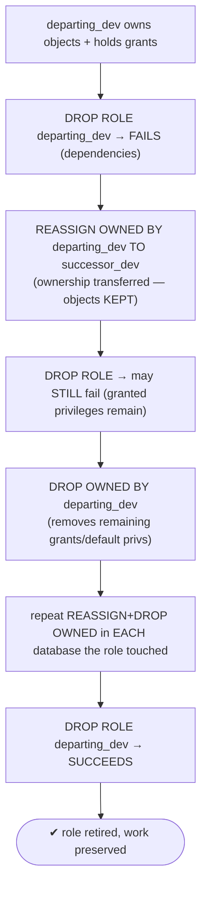

# Lab 49 — `REASSIGN OWNED` + `DROP OWNED` to Safely Retire a Role That Owns Objects

> **Track A · DBA · A6 Security & Access Control · Lab 9 of 9 (Lab 49/222 · A6 complete)**
> Teaching package: concept → diagram → steps → verify → quick-ref → self-test → video script.
> **Depends on:** Lab 41 (role hierarchy). Completes the role lifecycle — create (41) → retire (49).

---

## 0. Lab Card (at a glance)

| Field | Value |
|---|---|
| **Objective** | Retire a role that owns objects and holds grants: transfer its objects to a successor with `REASSIGN OWNED`, clean up remaining privileges with `DROP OWNED`, then `DROP ROLE`. |
| **Success criterion** | `DROP ROLE` initially fails; after `REASSIGN OWNED` + `DROP OWNED` (in each relevant database) it succeeds, with the objects preserved under the successor. |
| **Scope boundary** | Role retirement. Access review/audit is Lab 203. |
| **Prereqs** | Lab 41 (secdb, roles) |
| **Time** | 20–30 min |
| **Difficulty** | ★★☆☆☆ |
| **Risk** | **Medium** — `DROP OWNED` *deletes* objects; `REASSIGN` first to keep them. |

---

## 1. Learning Objectives

1. **Why `DROP ROLE` fails** — ownership and grants create dependencies.
2. **`REASSIGN OWNED`** — transfer ownership, keep the objects.
3. **`DROP OWNED`** — delete objects and remove the role's grants.
4. **The safe sequence** — REASSIGN → DROP OWNED → DROP ROLE.
5. **The per-database gotcha** — run both in every database the role touched.

---

## 2. Concept Primer — the "why"

**You can't just drop a role that owns things.** `DROP ROLE departing_dev` fails:
```
ERROR: role "departing_dev" cannot be dropped because some objects depend on it
DETAIL: owner of schema dev; owner of table dev.work1; privileges for table app.customers
```
A role can't be removed while it **owns** objects (tables, schemas, functions, sequences, databases, tablespaces) or **holds granted privileges** on other roles' objects. You must clear those dependencies first.

**Two commands, two intents:**
- **`REASSIGN OWNED BY old_role TO new_role`** — transfers **ownership** of everything `old_role` owns (in the current database) to `new_role`. The objects **stay**; only the owner changes. Use it when an employee leaves and their work should survive under a successor or team role.
- **`DROP OWNED BY old_role`** — **drops** every object `old_role` owns **and** removes privileges **granted to** it on others' objects (and default privileges it set). Use it to delete a role's footprint entirely.

**The safe retirement sequence (keep the work):**
```
REASSIGN OWNED BY departing_dev TO successor_dev;   -- move ownership (objects kept)
DROP OWNED  BY departing_dev;                       -- remove remaining GRANTS to the role
DROP ROLE   departing_dev;                          -- now succeeds
```
**Why `DROP OWNED` is still needed after `REASSIGN`:** `REASSIGN` only moves **ownership**. Privileges **granted to** the role (e.g. `GRANT SELECT ON app.customers TO departing_dev`) are *not* ownership — they remain and still block `DROP ROLE`. `DROP OWNED` (after `REASSIGN`, so there are no owned objects left to delete) strips those remaining grants.

> If you *don't* want to keep the objects, `DROP OWNED BY departing_dev` **alone** deletes them and removes grants — then `DROP ROLE`. But that **destroys data**; `REASSIGN` first whenever you might want the objects.

**The per-database gotcha.** `REASSIGN OWNED` and `DROP OWNED` operate only on the **current database** (plus cluster-shared objects the role owns, like databases/tablespaces). If the role owns objects in **several databases**, you must run both commands **in each** of those databases. Miss one and `DROP ROLE` (which is cluster-wide) still fails.

**Permissions.** `REASSIGN OWNED` requires membership in **both** the old and new roles (or superuser); `DROP OWNED` requires membership in the old role (or superuser). Typically done as a superuser or role administrator.

---

## 3. Diagrams

### 3.1 Safe retirement flow



### 3.2 REASSIGN vs DROP OWNED

```mermaid
flowchart LR
    subgraph R [REASSIGN OWNED]
      R1["transfer ownership → successor"]
      R2["objects KEPT"]
    end
    subgraph D [DROP OWNED]
      D1["DELETE owned objects"]
      D2["remove grants TO the role"]
    end
    BLOCK["blocks DROP ROLE: ownership + granted privileges"]
    R -->|clears ownership| BLOCK
    D -->|clears grants (and objects)| BLOCK
    note["keep work: REASSIGN then DROP OWNED · per-DATABASE — run in each db · then DROP ROLE (cluster-wide)"]
```

---

## 4. Prerequisites

```bash
sudo -u postgres psql -d secdb -c "CREATE ROLE departing_dev LOGIN PASSWORD 'DepPass!1';" 2>/dev/null || true
sudo -u postgres psql -d secdb -c "CREATE ROLE successor_dev NOLOGIN;" 2>/dev/null || true
```

---

## 5. Step-by-Step

### Step 1 — Give the departing role some owned objects + a grant

```bash
sudo -u postgres psql -d secdb <<'SQL'
GRANT successor_dev TO postgres;   -- so we (as postgres) can reassign to it
CREATE SCHEMA dev AUTHORIZATION departing_dev;
SET ROLE departing_dev;
CREATE TABLE dev.work1 (id int, note text);
INSERT INTO dev.work1 VALUES (1,'important work');
RESET ROLE;
GRANT SELECT ON app.customers TO departing_dev;    -- a privilege granted TO the role (not ownership)
SQL
```

### Step 2 — Confirm `DROP ROLE` fails

```bash
sudo -u postgres psql -d secdb -c "DROP ROLE departing_dev;" 2>&1 | tail -3
#   → ERROR: role "departing_dev" cannot be dropped because some objects depend on it
#     DETAIL: owner of schema dev; owner of table dev.work1; privileges for table customers
```

### Step 3 — See what the role owns

```bash
sudo -u postgres psql -d secdb -c "SELECT n.nspname AS schema, c.relname AS object, pg_get_userbyid(c.relowner) AS owner
  FROM pg_class c JOIN pg_namespace n ON n.oid=c.relnamespace
  WHERE pg_get_userbyid(c.relowner)='departing_dev';"
```

### Step 4 — REASSIGN OWNED (transfer, keep the objects)

```bash
sudo -u postgres psql -d secdb -c "REASSIGN OWNED BY departing_dev TO successor_dev;"
# objects now owned by successor_dev, data intact:
sudo -u postgres psql -d secdb -c "SELECT pg_get_userbyid(relowner) AS owner FROM pg_class WHERE relname='work1';"   # successor_dev
sudo -u postgres psql -d secdb -c "SELECT * FROM dev.work1;"                                                        # data preserved
```

### Step 5 — DROP ROLE still fails? Clean up remaining grants with DROP OWNED

```bash
sudo -u postgres psql -d secdb -c "DROP ROLE departing_dev;" 2>&1 | tail -2   # may still fail: privileges for table customers
sudo -u postgres psql -d secdb -c "DROP OWNED BY departing_dev;"              # removes the remaining GRANTs
```

### Step 6 — (Multi-DB) repeat per database, then DROP ROLE

```bash
# if departing_dev owned objects in OTHER databases, connect to each and repeat REASSIGN+DROP OWNED:
# for db in db1 db2; do sudo -u postgres psql -d $db -c "REASSIGN OWNED BY departing_dev TO successor_dev; DROP OWNED BY departing_dev;"; done
sudo -u postgres psql -c "DROP ROLE departing_dev;"        # cluster-wide — now succeeds
sudo -u postgres psql -c "SELECT 1 FROM pg_roles WHERE rolname='departing_dev';" | grep -q 1 && echo "still exists" || echo "role retired"
```

---

## 6. Verification Checklist

- [ ] `DROP ROLE` initially fails with a dependency error
- [ ] `REASSIGN OWNED` transferred ownership to `successor_dev`
- [ ] Objects and their data are **preserved** under the successor
- [ ] `DROP OWNED` removed the remaining granted privileges
- [ ] `DROP ROLE` succeeds after cleanup
- [ ] (If multi-db) both commands were run in **each** database the role touched
- [ ] You can explain why `DROP OWNED` is needed after `REASSIGN`

---

## 7. Troubleshooting

| Symptom | Cause | Fix |
|---|---|---|
| `DROP ROLE` fails after `REASSIGN` | Role still holds **granted privileges** (not ownership) | `DROP OWNED BY <role>` to remove them |
| `DROP ROLE` fails even after cleanup | Role owns objects in **another database** | Run `REASSIGN`/`DROP OWNED` in each db, then `DROP ROLE` |
| `DROP OWNED` deleted objects you wanted | Didn't `REASSIGN` first | `REASSIGN` before `DROP OWNED`; restore from backup if lost |
| `REASSIGN OWNED` permission denied | Not a member of both roles | Use superuser or grant membership in both |
| Shared objects (db/tablespace) still block | Role owns a database/tablespace | `REASSIGN`/`ALTER … OWNER` those too |
| Default privileges linger | Role set default privileges | `DROP OWNED` removes them (or `ALTER DEFAULT PRIVILEGES … REVOKE`) |

---

## 8. Quick Reference Card (paste-ready)

```sql
-- SAFE retirement (keep the work):
REASSIGN OWNED BY departing_dev TO successor_dev;   -- transfer ownership (objects kept)
DROP OWNED  BY departing_dev;                       -- remove remaining grants/default privs
DROP ROLE   departing_dev;                          -- succeeds

-- DELETE the role's footprint entirely (destroys data):
--   DROP OWNED BY departing_dev;  DROP ROLE departing_dev;

-- MULTI-DATABASE: both OWNED commands are per-database — run in EACH db the role touched:
--   \c db1  REASSIGN OWNED BY departing_dev TO successor_dev;  DROP OWNED BY departing_dev;
--   \c db2  (repeat) ...   then  DROP ROLE departing_dev;  (cluster-wide)

-- REASSIGN = transfer ownership (keep) · DROP OWNED = delete objects + strip grants
-- REASSIGN only moves OWNERSHIP; granted privileges still block DROP ROLE → DROP OWNED clears them
-- perms: REASSIGN needs membership in BOTH roles (or superuser); DROP OWNED needs the old role (or superuser)
```

---

## 9. Self-Check

1. Why can't you `DROP ROLE` a role that owns objects?
2. What's the difference between `REASSIGN OWNED` and `DROP OWNED`?
3. What's the safe sequence to retire a role while keeping its objects?
4. Why is `DROP OWNED` still needed after `REASSIGN OWNED`?
5. What's the per-database gotcha?
6. What permission does `REASSIGN OWNED` require?

<details>
<summary>Answers</summary>

1. The role owns objects and/or holds granted privileges — those dependencies must be cleared first.
2. `REASSIGN OWNED` transfers **ownership** to another role (objects kept); `DROP OWNED` **deletes** owned objects and removes the role's grants.
3. `REASSIGN OWNED BY x TO successor;` → `DROP OWNED BY x;` → `DROP ROLE x;`.
4. `REASSIGN` only moves ownership; privileges **granted to** the role remain and still block `DROP ROLE`, so `DROP OWNED` removes them.
5. Both `OWNED` commands act only on the **current database** — run them in **every** database the role has objects in before `DROP ROLE`.
6. Membership in **both** the old and new roles (or superuser).
</details>

---

## 10. Video / Teaching Script

| # | On screen | Say (narration) |
|---|---|---|
| 1 | Title: "Retiring a role — without losing its work" | "An engineer leaves. You try to drop their role — and PostgreSQL refuses. It owns things. Here's how to retire it cleanly." |
| 2 | `DROP ROLE` fails | "There it is: cannot be dropped, owns a schema, a table, has privileges. You can't just delete it." |
| 3 | `REASSIGN OWNED TO successor` | "First, hand the work to a successor. REASSIGN OWNED transfers every object — and the data stays put." |
| 4 | still fails | "Try to drop again… still blocked. Ownership moved, but the *grants* to the role are still there." |
| 5 | `DROP OWNED` | "DROP OWNED clears those remaining privileges. Now the role owns nothing and holds nothing." |
| 6 | multi-db warning | "One trap: these commands are per-database. If the role worked in three databases, run them in all three — or the drop keeps failing." |
| 7 | `DROP ROLE` succeeds | "And now — gone. Role retired, work preserved." |
| 8 | Outro | "That completes Security and Access Control — from building a role hierarchy to safely tearing one down." |

---

## 11. Glossary

- **`REASSIGN OWNED BY … TO …`** — transfer ownership of a role's objects.
- **`DROP OWNED BY …`** — delete a role's objects and remove its grants.
- **`DROP ROLE`** — remove the role (cluster-wide) once dependencies are cleared.
- **Ownership vs granted privileges** — both block `DROP ROLE`; cleared by different commands.
- **Per-database scope** — `OWNED` commands act on the current database only.
- **Successor role** — the role receiving reassigned objects.

---
*NETAPORT lab series · PostgreSQL 17 on AlmaLinux 9 · Lab 49/222 · **A6 Security & Access Control complete***
