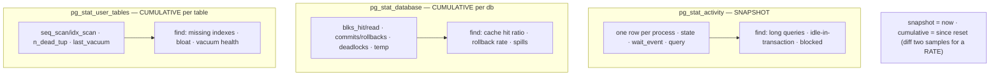
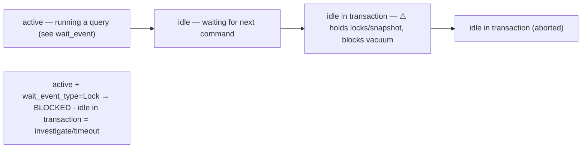

# Lab 50 — Read the Cumulative Statistics Views: `pg_stat_activity`, `pg_stat_database`, `pg_stat_user_tables`

> **Track A · DBA · A7 Monitoring & Observability · Lab 1 of 8 (Lab 50/222)**
> Teaching package: concept → diagram → steps → verify → quick-ref → self-test → video script.
> **Depends on:** Labs 09, 14 (a workload + logging). Opens the observability track.

---

## 0. Lab Card (at a glance)

| Field | Value |
|---|---|
| **Objective** | Read the three core statistics views to answer "what's happening now" and "what's happened so far": live sessions, per-database counters, per-table access. |
| **Success criterion** | You can find active/idle-in-transaction/blocked sessions, compute cache hit ratio, and spot tables needing indexes or vacuum. |
| **Scope boundary** | Reading the core views. `pg_stat_statements` is Lab 51; lock diagnosis Lab 52; bloat Lab 53. |
| **Prereqs** | Labs 09/14; a database with some activity |
| **Time** | 25–35 min |
| **Difficulty** | ★★☆☆☆ |
| **Risk** | Low — read-only inspection. |

---

## 1. Learning Objectives

1. **Snapshot vs cumulative** — which views are "now" vs "since reset".
2. **`pg_stat_activity`** — live sessions, states, waits, long/idle-in-transaction/blocked.
3. **`pg_stat_database`** — cache hit ratio, commits/rollbacks, deadlocks, temp files.
4. **`pg_stat_user_tables`** — seq vs index scans, dead tuples, vacuum health.
5. **Measure rates** — sample cumulative counters twice and diff.

---

## 2. Concept Primer — the "why"

PostgreSQL's **cumulative statistics system** is your built-in observability. Three views cover most day-to-day diagnosis:

**`pg_stat_activity` — a SNAPSHOT (what's happening *now*).** One row per server process. It's not cumulative — it reflects the current instant. Key columns: `state` (`active` / `idle` / **`idle in transaction`** / `idle in transaction (aborted)`), `wait_event_type`/`wait_event` (what an active backend waits on: `Lock`, `LWLock`, `IO`, `Client`…), `query`, `query_start`/`xact_start` (compute age with `now() - …`), `backend_type` (client backend, autovacuum, walsender…), and `pid` for `pg_terminate_backend()`/`pg_cancel_backend()`. Use it to find **long-running queries**, **blocked queries** (`wait_event_type='Lock'`), and **idle-in-transaction** sessions — the dangerous ones that hold locks and snapshots and **block vacuum**.

**`pg_stat_database` — CUMULATIVE (per database, since reset).** Counters totaling activity since `stats_reset`. Key: `blks_hit`/`blks_read` → **cache hit ratio** = `blks_hit / (blks_hit + blks_read)` (want >99% for OLTP); `xact_commit`/`xact_rollback`; `deadlocks`; `temp_files`/`temp_bytes` (work_mem spills, Lab 9); `checksum_failures` (Lab 5); `numbackends` (a current count, the exception). `blk_read_time`/`blk_write_time` appear when `track_io_timing` is on.

**`pg_stat_user_tables` — CUMULATIVE (per table).** Key: `seq_scan`/`idx_scan` (a big table with lots of **seq_scan** and little idx_scan wants an **index**); `n_live_tup`/`n_dead_tup` (**dead tuples** → bloat/vacuum need, Lab 58); `n_tup_upd`/`n_tup_hot_upd` (HOT-update ratio → fillfactor, Lab 205); `last_(auto)vacuum`/`last_(auto)analyze` and their counts (autovacuum health).

**Snapshot vs cumulative — the practical rule.** `pg_stat_activity` is "now". The other two are running totals — a single read tells you the *total*, not a *rate*. To get a rate (e.g. commits/sec), **sample the counter twice** and divide the delta by the interval, or let a monitoring tool (Lab 55) do it. `pg_stat_reset()` zeroes the cumulative counters; `stats_reset` shows when.

*(PG15+ keeps these stats in shared memory rather than a collector process/file — faster and always current; not otherwise user-visible.)*

---

## 3. Diagrams

### 3.1 Which view answers what



### 3.2 pg_stat_activity states



---

## 4. Prerequisites

```bash
sudo -u postgres psql -c "SHOW track_io_timing;"     # on gives blk_read/write_time; enable if off
sudo -u postgres psql -d benchdb -c "SELECT 1 FROM pgbench_accounts LIMIT 1;" >/dev/null 2>&1 || sudo -u postgres pgbench -i -s 20 benchdb
```

---

## 5. Step-by-Step

### Step 1 — pg_stat_activity: live sessions

```bash
# generate a long query in the background to observe:
sudo -u postgres psql -d benchdb -c "SELECT pg_sleep(60), count(*) FROM pgbench_accounts;" &
sleep 2
# what's running, how long, waiting on what:
sudo -u postgres psql -x -c "SELECT pid, usename, state, wait_event_type, wait_event,
  now()-query_start AS runtime, left(query,60) AS query
  FROM pg_stat_activity WHERE state='active' AND backend_type='client backend';"
```

### Step 2 — Find idle-in-transaction and long-running sessions

```bash
# idle-in-transaction (dangerous — holds locks/snapshot):
sudo -u postgres psql -c "SELECT pid, usename, state, now()-state_change AS idle_for, left(query,50)
  FROM pg_stat_activity WHERE state='idle in transaction';"
# long-running queries (> 30s):
sudo -u postgres psql -c "SELECT pid, now()-query_start AS runtime, left(query,50)
  FROM pg_stat_activity WHERE state='active' AND now()-query_start > interval '30 seconds';"
# terminate one if needed: SELECT pg_terminate_backend(<pid>);
```

### Step 3 — pg_stat_database: cache hit ratio + health

```bash
sudo -u postgres psql -x -c "SELECT datname,
  round(100.0*blks_hit/nullif(blks_hit+blks_read,0),2) AS cache_hit_pct,
  xact_commit, xact_rollback, deadlocks, temp_files, temp_bytes, numbackends
  FROM pg_stat_database WHERE datname='benchdb';"
#   cache_hit_pct should be >99% for a warm OLTP DB
```

### Step 4 — pg_stat_user_tables: scans, dead tuples, vacuum

```bash
# generate some table churn:
sudo -u postgres psql -d benchdb -c "UPDATE pgbench_accounts SET abalance=abalance+1 WHERE aid<=5000;"
sudo -u postgres psql -d benchdb -x -c "SELECT relname, seq_scan, idx_scan, n_live_tup, n_dead_tup,
  n_tup_upd, n_tup_hot_upd, last_autovacuum
  FROM pg_stat_user_tables ORDER BY n_dead_tup DESC LIMIT 5;"
# tables that lean on sequential scans (index candidates):
sudo -u postgres psql -d benchdb -c "SELECT relname, seq_scan, idx_scan FROM pg_stat_user_tables
  WHERE seq_scan > idx_scan AND seq_scan > 0 ORDER BY seq_scan DESC LIMIT 5;"
```

### Step 5 — Measure a RATE from cumulative counters

```bash
# sample commits, wait, sample again → commits/sec
A=$(sudo -u postgres psql -tAc "SELECT xact_commit FROM pg_stat_database WHERE datname='benchdb';")
sudo -u postgres pgbench -c 4 -T 5 benchdb >/dev/null 2>&1
B=$(sudo -u postgres psql -tAc "SELECT xact_commit FROM pg_stat_database WHERE datname='benchdb';")
echo "commits in ~5s: $((B - A))  → ~$(( (B-A)/5 )) commits/sec"
```

### Step 6 — (Optional) reset counters to start clean

```bash
sudo -u postgres psql -d benchdb -c "SELECT pg_stat_reset();"
sudo -u postgres psql -c "SELECT datname, stats_reset FROM pg_stat_database WHERE datname='benchdb';"
```

---

## 6. Verification Checklist

- [ ] Identified an active query and its runtime in `pg_stat_activity`
- [ ] Queried for idle-in-transaction and long-running sessions
- [ ] Computed cache hit ratio from `pg_stat_database`
- [ ] Read `deadlocks`/`temp_files` counters
- [ ] Found seq-vs-index scan patterns and dead tuples in `pg_stat_user_tables`
- [ ] Measured a rate by diffing a cumulative counter across two samples
- [ ] Can state which views are snapshot vs cumulative

---

## 7. Troubleshooting

| Symptom | Cause | Fix |
|---|---|---|
| Counters don't change | They're cumulative — need activity; or stats disabled | Generate load; ensure `track_activities`/stats on |
| `query` empty/`<insufficient privilege>` | Non-superuser sees only own queries | Use superuser or grant `pg_read_all_stats` |
| Query text truncated | `track_activity_query_size` limit | Raise it (restart) |
| No `blk_read_time`/`blk_write_time` | `track_io_timing` off | `SET track_io_timing=on` (measure overhead first) |
| Cache hit ratio low | Small `shared_buffers` / cold cache / big scans | Tune memory (Lab 9); warm cache |
| Can't tell rate from a single read | Cumulative counter | Sample twice and diff, or use a monitor (Lab 55) |

---

## 8. Quick Reference Card (paste-ready)

```sql
-- WHO'S DOING WHAT NOW (snapshot):
SELECT pid,usename,state,wait_event_type,wait_event,now()-query_start AS runtime,left(query,60)
FROM pg_stat_activity WHERE state='active' AND backend_type='client backend';

-- idle-in-transaction (dangerous):  state='idle in transaction'
-- long queries:  now()-query_start > interval '30 seconds'
-- terminate:  SELECT pg_terminate_backend(<pid>);  cancel:  pg_cancel_backend(<pid>)

-- PER-DATABASE (cumulative): cache hit ratio + health
SELECT datname, round(100.0*blks_hit/nullif(blks_hit+blks_read,0),2) AS cache_hit_pct,
       xact_commit, xact_rollback, deadlocks, temp_files
FROM pg_stat_database;

-- PER-TABLE (cumulative): index need + bloat + vacuum
SELECT relname,seq_scan,idx_scan,n_live_tup,n_dead_tup,n_tup_hot_upd,last_autovacuum
FROM pg_stat_user_tables ORDER BY n_dead_tup DESC;

-- RATE = sample twice, diff / interval · reset: SELECT pg_stat_reset();
-- snapshot: pg_stat_activity | cumulative: pg_stat_database, pg_stat_user_tables
```

---

## 9. Self-Check

1. Which of the three views is a snapshot, and which are cumulative?
2. How do you find idle-in-transaction sessions, and why do they matter?
3. What's the cache hit ratio formula and its source view?
4. What does a big table with high `seq_scan` and low `idx_scan` suggest?
5. Which column signals a table needs vacuuming?
6. How do you turn a cumulative counter into a rate?

<details>
<summary>Answers</summary>

1. `pg_stat_activity` is a **snapshot**; `pg_stat_database` and `pg_stat_user_tables` are **cumulative** (since `stats_reset`).
2. `state='idle in transaction'` in `pg_stat_activity`; they hold locks and a snapshot, blocking vacuum and other work.
3. `blks_hit / (blks_hit + blks_read)` from `pg_stat_database`.
4. A **missing index** — it's a candidate for indexing.
5. `n_dead_tup` in `pg_stat_user_tables`.
6. Sample the counter twice and divide the delta by the elapsed interval (or use a monitoring tool).
</details>

---

## 10. Video / Teaching Script

| # | On screen | Say (narration) |
|---|---|---|
| 1 | Title: "PostgreSQL's built-in dashboard" | "Before any external tool, PostgreSQL tells you what it's doing — through three views. Learn these and you can diagnose almost anything." |
| 2 | pg_stat_activity | "This one is *now*: every session, what it's running, how long, what it's waiting on." |
| 3 | idle-in-transaction | "The session to fear: idle *in transaction*. It's holding locks and blocking vacuum while doing nothing. Hunt these down." |
| 4 | pg_stat_database | "This one is *cumulative* — totals for the whole database. The headline number: cache hit ratio. Below 99%, start asking why." |
| 5 | pg_stat_user_tables | "And per table: sequential scans versus index scans tells you what needs an index; dead tuples tell you what needs a vacuum." |
| 6 | rate by diffing | "One habit: these are totals, not rates. Read twice, subtract, divide by time. That's your commits-per-second." |
| 7 | Outro | "Your built-in observability. Next: pg_stat_statements — ranking queries by cost." |

---

## 11. Glossary

- **Cumulative statistics** — running counters since the last reset.
- **`pg_stat_activity`** — snapshot of current processes.
- **`pg_stat_database` / `pg_stat_user_tables`** — cumulative per-db / per-table stats.
- **`state` / `idle in transaction`** — a backend's status / the dangerous idle-holding-txn state.
- **`wait_event(_type)`** — what an active backend is waiting on.
- **Cache hit ratio** — `blks_hit/(blks_hit+blks_read)`.
- **`n_dead_tup` / `seq_scan` vs `idx_scan`** — vacuum need / index need signals.
- **`pg_stat_reset()`** — zero the cumulative counters.

---
*NETAPORT lab series · PostgreSQL 17 on AlmaLinux 9 · Lab 50/222 · A7 Monitoring & Observability*
