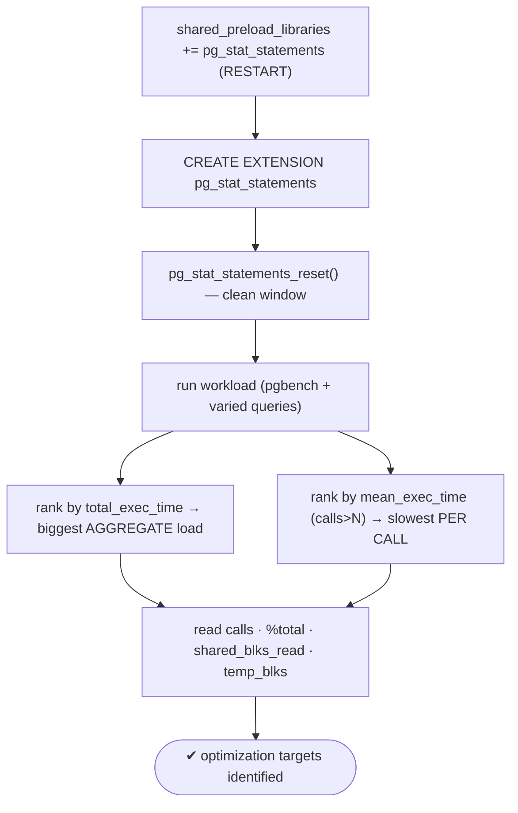
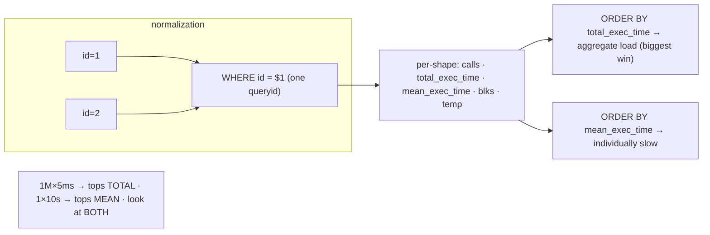

# Lab 51 — Install `pg_stat_statements`; Find the Top Queries by Total and Mean Time

> **Track A · DBA · A7 Monitoring & Observability · Lab 2 of 8 (Lab 51/222)**
> Teaching package: concept → diagram → steps → verify → quick-ref → self-test → video script.
> **Depends on:** Lab 50 (stat views). **Feeds:** Labs 95–102 (query performance), Lab 189 (plan stability).

---

## 0. Lab Card (at a glance)

| Field | Value |
|---|---|
| **Objective** | Install `pg_stat_statements`, generate a workload, and rank queries two ways — by total time (aggregate load) and by mean time (individually slow) — to find optimization targets. |
| **Success criterion** | The view is populated; you can list top queries by `total_exec_time` and by `mean_exec_time` and explain what each ranking reveals. |
| **Scope boundary** | Ranking queries. `EXPLAIN`/indexing is Labs 95–102; wait-event analysis Lab 187. |
| **Prereqs** | Lab 50; a workload (pgbench) |
| **Time** | 25–35 min |
| **Difficulty** | ★★★☆☆ |
| **Risk** | Low — additive; a restart for the preload. |

---

## 1. Learning Objectives

1. **What pg_stat_statements does** — per-query cumulative stats, normalized.
2. **Install it** — `shared_preload_libraries` + `CREATE EXTENSION`.
3. **Rank by `total_exec_time`** — biggest aggregate load.
4. **Rank by `mean_exec_time`** — slowest per call.
5. **Read the extras** — calls, % of total, disk I/O, temp spills.

---

## 2. Concept Primer — the "why"

**It answers "which queries are slow?" — precisely.** `pg_stat_statements` records execution statistics for **every** statement. Its superpower is **normalization**: it replaces literal constants with placeholders (`WHERE id = 1` and `id = 2` become `WHERE id = $1`), so the same *query shape* is aggregated under one `queryid`. You see per-shape totals — calls, timing, rows, buffers, temp, WAL — instead of millions of near-identical texts.

**Two rankings, two questions (the heart of the lab):**
- **`ORDER BY total_exec_time DESC` — where the database spends its time.** This surfaces the biggest **aggregate** consumers. A query running 1,000,000 times at 5 ms each (5,000 s total) dominates one running once at 10 s. Optimizing high-total queries yields the **largest overall win** — this is usually where you start.
- **`ORDER BY mean_exec_time DESC` — the individually slow queries.** A query averaging 30 s per call is painful even if rare. These are the "why did that page take forever" queries.

They can point at completely different statements. Look at **both**: total for aggregate impact, mean for per-call pain (filter mean by `calls > N` so one-off outliers don't dominate).

**Other columns worth reading:**
- `calls` (frequency), `rows` (total returned/affected), `rows/calls` (result size),
- `shared_blks_read` (disk reads — cache misses; high = candidate for indexing or more `shared_buffers`),
- `temp_blks_read/written` (**spills to disk** — `work_mem` too small for this query, Lab 9),
- `wal_bytes` (WAL generated),
- `100 * total_exec_time / sum(total_exec_time) OVER ()` → **% of total time**.
- (PG13+) planning vs execution split (`total_plan_time`/`total_exec_time`) when `pg_stat_statements.track_planning` is on.

**Install & config.** It's a shared library → `shared_preload_libraries` (restart), then `CREATE EXTENSION pg_stat_statements`. Config: `pg_stat_statements.max` (statements tracked, default 5000), `.track` (`top`/`all`/`none`), `.track_utility`, `.track_planning`. **`pg_stat_statements_reset()`** clears the stats — use it to start a clean measurement window.

---

## 3. Diagrams

### 3.1 Install + rank flow



### 3.2 Normalization + the two rankings



---

## 4. Prerequisites

```bash
sudo -u postgres psql -d benchdb -c "SELECT 1 FROM pgbench_accounts LIMIT 1;" >/dev/null 2>&1 || sudo -u postgres pgbench -i -s 20 benchdb
# current preload (may already include pgaudit from Lab 48):
sudo -u postgres psql -tAc "SHOW shared_preload_libraries;"
```

---

## 5. Step-by-Step

### Step 1 — Load the library (append if pgaudit is already there)

```bash
CUR=$(sudo -u postgres psql -tAc "SHOW shared_preload_libraries;")
NEW=$(echo "$CUR" | grep -q pg_stat_statements && echo "$CUR" || echo "${CUR:+$CUR, }pg_stat_statements")
sudo -u postgres psql -c "ALTER SYSTEM SET shared_preload_libraries = '$NEW';"
sudo -u postgres psql -c "ALTER SYSTEM SET pg_stat_statements.track = 'top';"
sudo -u postgres psql -c "ALTER SYSTEM SET pg_stat_statements.track_planning = 'on';"   # optional
sudo systemctl restart postgresql-17
sudo -u postgres psql -c "SHOW shared_preload_libraries;"
```

### Step 2 — Create the extension and reset for a clean window

```bash
sudo -u postgres psql -d benchdb -c "CREATE EXTENSION IF NOT EXISTS pg_stat_statements;"
sudo -u postgres psql -d benchdb -c "SELECT pg_stat_statements_reset();"
```

### Step 3 — Generate a varied workload

```bash
# a mix: frequent light queries (pgbench) + a few heavy ones
sudo -u postgres pgbench -c 8 -j 4 -T 15 benchdb >/dev/null 2>&1
sudo -u postgres psql -d benchdb -c "SELECT count(*) FROM pgbench_accounts a JOIN pgbench_branches b ON a.bid=b.bid;"   # heavier
sudo -u postgres psql -d benchdb -c "SELECT * FROM pgbench_accounts ORDER BY abalance DESC LIMIT 100;"                  # sort
```

### Step 4 — Rank by TOTAL time (biggest aggregate load)

```bash
sudo -u postgres psql -d benchdb -x -c "
SELECT calls,
       round(total_exec_time::numeric,1)  AS total_ms,
       round(mean_exec_time::numeric,3)   AS mean_ms,
       round(100*total_exec_time/sum(total_exec_time) OVER (),1) AS pct_total,
       left(query,70) AS query
FROM pg_stat_statements
ORDER BY total_exec_time DESC LIMIT 5;"
#   → the queries consuming the most TOTAL time — optimize these for the biggest overall win
```

### Step 5 — Rank by MEAN time (slowest per call)

```bash
sudo -u postgres psql -d benchdb -x -c "
SELECT calls,
       round(mean_exec_time::numeric,2) AS mean_ms,
       round(total_exec_time::numeric,1) AS total_ms,
       left(query,70) AS query
FROM pg_stat_statements
WHERE calls > 3                              -- ignore one-off outliers
ORDER BY mean_exec_time DESC LIMIT 5;"
#   → the individually slowest queries (may differ entirely from the total-time list)
```

### Step 6 — Spot disk I/O and temp spills

```bash
sudo -u postgres psql -d benchdb -x -c "
SELECT calls, shared_blks_read AS disk_reads, temp_blks_written AS temp_spill, left(query,60) AS query
FROM pg_stat_statements
WHERE shared_blks_read > 0 OR temp_blks_written > 0
ORDER BY shared_blks_read + temp_blks_written DESC LIMIT 5;"
#   high disk_reads → indexing / more shared_buffers · temp_spill → work_mem too small (Lab 9)
```

---

## 6. Verification Checklist

- [ ] `pg_stat_statements` in `shared_preload_libraries`; extension created
- [ ] Stats reset before the workload (clean window)
- [ ] Top-by-`total_exec_time` list produced (with % of total)
- [ ] Top-by-`mean_exec_time` list produced (filtered by `calls`)
- [ ] Queries appear **normalized** (literals as `$1`, aggregated by shape)
- [ ] Identified a query with high disk reads and/or temp spills
- [ ] You can explain when to use total vs mean ranking

---

## 7. Troubleshooting

| Symptom | Cause | Fix |
|---|---|---|
| `CREATE EXTENSION` fails | Not preloaded / not restarted | Add to `shared_preload_libraries`; restart |
| View empty | Just reset / `track='none'` / no workload | Run queries; check `pg_stat_statements.track` |
| Each literal is a separate row | Utility statement or normalization off | Normal SQL auto-normalizes; check `track_utility` |
| No plan times | `track_planning` off | Enable it (adds overhead) |
| Preload conflict with pgaudit | Both in one list | `shared_preload_libraries = 'pgaudit, pg_stat_statements'` |
| Query text cut off | `track_activity_query_size` | Raise it (restart) |
| Stats capped/evicted | `pg_stat_statements.max` reached | Raise `max` or reset periodically |

---

## 8. Quick Reference Card (paste-ready)

```bash
# install (append to any existing preload like pgaudit)
sudo -u postgres psql -c "ALTER SYSTEM SET shared_preload_libraries='pg_stat_statements';" && sudo systemctl restart postgresql-17
sudo -u postgres psql -d benchdb -c "CREATE EXTENSION IF NOT EXISTS pg_stat_statements;"
sudo -u postgres psql -d benchdb -c "SELECT pg_stat_statements_reset();"   # clean window
```
```sql
-- TOP BY TOTAL time (biggest aggregate load — start here):
SELECT calls, round(total_exec_time::numeric,1) total_ms, round(mean_exec_time::numeric,3) mean_ms,
       round(100*total_exec_time/sum(total_exec_time) OVER (),1) pct, left(query,70) query
FROM pg_stat_statements ORDER BY total_exec_time DESC LIMIT 10;

-- TOP BY MEAN time (individually slow, ignore outliers):
SELECT calls, round(mean_exec_time::numeric,2) mean_ms, left(query,70) query
FROM pg_stat_statements WHERE calls > 3 ORDER BY mean_exec_time DESC LIMIT 10;

-- disk reads + temp spills:  shared_blks_read (I/O) · temp_blks_written (work_mem too small)
-- normalized by queryid · total = aggregate load · mean = per-call pain · reset: pg_stat_statements_reset()
```

---

## 9. Self-Check

1. What does normalization do, and why is it useful?
2. What does ranking by `total_exec_time` reveal vs `mean_exec_time`?
3. A query run 1M times at 5 ms vs one run once at 10 s — which tops each ranking?
4. How is `pg_stat_statements` installed?
5. Which column signals a query is spilling to disk?
6. How do you start a clean measurement window?

<details>
<summary>Answers</summary>

1. It replaces literals with placeholders so the same query *shape* aggregates under one `queryid` — you see per-shape totals instead of countless near-identical texts.
2. `total_exec_time` reveals the biggest **aggregate** load (best optimization ROI); `mean_exec_time` reveals the **individually slowest** queries.
3. The 1M×5ms query tops **total**; the 10 s query tops **mean**.
4. Add it to `shared_preload_libraries` (restart), then `CREATE EXTENSION pg_stat_statements`.
5. `temp_blks_read`/`temp_blks_written` (work_mem too small for that query).
6. `SELECT pg_stat_statements_reset();`.
</details>

---

## 10. Video / Teaching Script

| # | On screen | Say (narration) |
|---|---|---|
| 1 | Title: "Which queries are actually slow?" | "'The database is slow' isn't actionable. pg_stat_statements turns it into 'these five queries are slow.'" |
| 2 | install + extension | "It's a shared library — one restart, then create the extension." |
| 3 | reset + workload | "Reset for a clean window, then run a realistic mix of queries." |
| 4 | top by total time | "First ranking: total time. This is where the database spends its life — the biggest wins hide here, even in fast queries run a million times." |
| 5 | top by mean time | "Second ranking: mean time. The individually painful queries — often a totally different list." |
| 6 | normalization | "Notice the literals became dollar-signs. That's normalization — a million variations, one line." |
| 7 | disk/temp | "And the tells: heavy disk reads want an index; temp spills mean work_mem is too small." |
| 8 | Outro | "Now you know *what* to fix. Next: diagnosing lock waits — the queries stuck waiting on each other." |

---

## 11. Glossary

- **pg_stat_statements** — per-query cumulative execution stats.
- **Normalization / `queryid`** — literals → placeholders; one id per query shape.
- **`total_exec_time` / `mean_exec_time`** — aggregate / per-call execution time.
- **`calls`** — number of executions.
- **`shared_blks_read` / `temp_blks_written`** — disk reads / temp spills.
- **`track_planning`** — also record planning time.
- **`pg_stat_statements_reset()`** — clear the stats.

---
*NETAPORT lab series · PostgreSQL 17 on AlmaLinux 9 · Lab 51/222 · A7 Monitoring & Observability*
