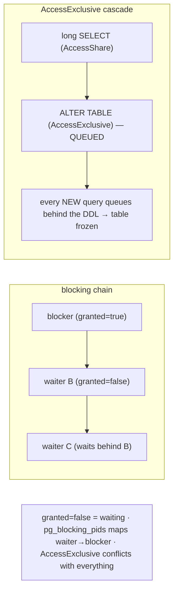

# Lab 52 — Detect and Diagnose Lock Waits (`pg_locks` + `pg_stat_activity`); Build a Blocking-Tree Query

> **Track A · DBA · A7 Monitoring & Observability · Lab 3 of 8 (Lab 52/222)**
> Teaching package: concept → diagram → steps → verify → quick-ref → self-test → video script.
> **Depends on:** Lab 50 (stat views). **Related:** Lab 104 (deadlocks), Lab 182 (lock-safe DDL).

---

## 0. Lab Card (at a glance)

| Field | Value |
|---|---|
| **Objective** | Reproduce a lock wait, detect it via `pg_locks` + `pg_stat_activity`, identify blocker↔blocked with `pg_blocking_pids()` and a blocking-tree query, and resolve it. |
| **Success criterion** | You can see which session blocks which, read both queries, and clear the wait. |
| **Scope boundary** | Lock-wait diagnosis. Deadlocks are Lab 104; lock-safe DDL is Lab 182. |
| **Prereqs** | Lab 50; two sessions to create the wait |
| **Time** | 25–35 min |
| **Difficulty** | ★★★☆☆ |
| **Risk** | Low — controlled locks; terminate to clear. |

---

## 1. Learning Objectives

1. **How lock waits form** — incompatible modes on the same object.
2. **Detect** — `pg_locks.granted=false` + `wait_event_type='Lock'`.
3. **`pg_blocking_pids()`** — the fast blocker lookup.
4. **Build a blocking tree** — waiter→blocker, with queries and durations.
5. **The AccessExclusive cascade** — why one stuck DDL blocks everyone.

---

## 2. Concept Primer — the "why"

**Locks serialize conflicting access.** When two transactions want **incompatible** locks on the same object (or row), one must **wait** for the other. That's normal — until the holder doesn't release: a long transaction, or (classically) an **idle-in-transaction** session (Lab 50) that grabbed a lock and went quiet. Then waiters pile up and the app stalls. The core skill: find *who blocks whom*.

**`pg_locks` — every lock held or awaited.** Key columns: `pid` (the backend), `locktype` (relation/tuple/transactionid/…), `relation`, `mode` (the lock mode), and **`granted`** — `true` = **held**, `false` = **waiting**. A `granted=false` row is a backend *stuck*; a `granted=true` row on the same object is (a) **holder(s)**.

**Join to `pg_stat_activity`** on `pid` to get each backend's `query`, `state`, `usename`, and `wait_event` — turning lock rows into human-readable "session X is blocked running *this*, by session Y running *that*."

**Two ways to find the blocker:**
1. **`pg_blocking_pids(pid)`** (PG9.6+) — returns the array of PIDs blocking the given PID. The **fast** way:
   ```
   SELECT pid, pg_blocking_pids(pid) FROM pg_stat_activity WHERE cardinality(pg_blocking_pids(pid)) > 0;
   ```
2. **`pg_locks` self-join** — join a waiting row (`granted=false`) to a granted row on the *same lockable object* (same relation/page/tuple/xid). More detailed (shows the exact object and both modes), but verbose. `pg_blocking_pids` is preferred for everyday use; the self-join when you need the object/mode detail.

**Lock modes matter.** The 8 table modes have a conflict matrix. The extremes:
- **`AccessShareLock`** (SELECT) conflicts only with `AccessExclusiveLock`.
- **`AccessExclusiveLock`** (`ALTER TABLE`, `DROP`, `TRUNCATE`, `LOCK TABLE`) conflicts with **everything, including SELECT**.

**The AccessExclusive cascade — the nastiest pattern.** A DDL needs `AccessExclusiveLock`. If a long-running SELECT holds `AccessShareLock`, the DDL **queues** behind it — and now **every new query** queues behind the DDL, because new lock requests line up in order. One stuck `ALTER TABLE` behind one long query can freeze the whole table for everyone. This is why lock-safe DDL uses `lock_timeout` (Lab 182).

**Resolve** by ending the blocker: `COMMIT`/`ROLLBACK` it, or `pg_terminate_backend(blocker_pid)`. And prevent the classic cause with `idle_in_transaction_session_timeout`.

---

## 3. Diagrams

### 3.1 Detect + diagnose flow

```mermaid
flowchart TD
    A["blocker: BEGIN; UPDATE row; (stays open)"] --> B["waiter: UPDATE same row → BLOCKS"]
    B --> C{detect}
    C -->|pg_stat_activity| D["waiter: wait_event_type='Lock'"]
    C -->|pg_locks| E["waiter row: granted=false"]
    C -->|pg_blocking_pids(waiter)| F["→ [blocker_pid]"]
    D & E & F --> G["blocking-tree query: blocker → blocked, with both queries + durations"]
    G --> H["resolve: COMMIT/ROLLBACK blocker OR pg_terminate_backend(blocker)"]
    H --> I([✔ waiter proceeds])
```

### 3.2 Blocking chain + the AccessExclusive cascade



---

## 4. Prerequisites

```bash
sudo -u postgres psql -d benchdb -c "SELECT 1 FROM pgbench_accounts LIMIT 1;" >/dev/null 2>&1 || sudo -u postgres pgbench -i -s 20 benchdb
```

---

## 5. Step-by-Step

### Step 1 — Create a lock wait (blocker holds, waiter blocks)

```bash
# BLOCKER: open a transaction, lock a row, keep it open 60s:
sudo -u postgres psql -d benchdb -c "BEGIN; UPDATE pgbench_accounts SET abalance=abalance+1 WHERE aid=1; SELECT pg_sleep(60);" &
sleep 2
# WAITER: update the SAME row → it blocks:
sudo -u postgres psql -d benchdb -c "UPDATE pgbench_accounts SET abalance=abalance+1 WHERE aid=1;" &
sleep 2
```

### Step 2 — Detect the wait

```bash
# waiter shows wait_event_type='Lock':
sudo -u postgres psql -c "SELECT pid, state, wait_event_type, wait_event, left(query,50)
  FROM pg_stat_activity WHERE wait_event_type='Lock';"
# pg_locks: a granted=false row (the waiter):
sudo -u postgres psql -c "SELECT pid, locktype, relation::regclass, mode, granted
  FROM pg_locks WHERE NOT granted;"
```

### Step 3 — Find the blocker with `pg_blocking_pids`

```bash
sudo -u postgres psql -c "SELECT pid AS blocked_pid, pg_blocking_pids(pid) AS blocking_pids, left(query,50) AS blocked_query
  FROM pg_stat_activity WHERE cardinality(pg_blocking_pids(pid)) > 0;"
```

### Step 4 — The blocking-tree query (waiter → blocker, with details)

```bash
sudo -u postgres psql -x -c "
SELECT blocked.pid                         AS blocked_pid,
       blocked.usename                     AS blocked_user,
       now()-blocked.query_start           AS blocked_for,
       left(blocked.query,50)              AS blocked_query,
       blocker.pid                         AS blocking_pid,
       blocker.usename                     AS blocking_user,
       blocker.state                       AS blocking_state,
       left(blocker.query,50)              AS blocking_query
FROM pg_stat_activity blocked
JOIN LATERAL unnest(pg_blocking_pids(blocked.pid)) AS bp(pid) ON true
JOIN pg_stat_activity blocker ON blocker.pid = bp.pid
WHERE cardinality(pg_blocking_pids(blocked.pid)) > 0;"
```

### Step 5 — (Detailed alternative) the pg_locks self-join

```bash
sudo -u postgres psql -x -c "
SELECT w.pid AS waiter, w.mode AS waiter_mode, h.pid AS holder, h.mode AS holder_mode,
       w.relation::regclass AS rel
FROM pg_locks w
JOIN pg_locks h ON w.locktype=h.locktype
  AND w.database IS NOT DISTINCT FROM h.database
  AND w.relation IS NOT DISTINCT FROM h.relation
  AND w.transactionid IS NOT DISTINCT FROM h.transactionid
  AND w.pid <> h.pid
WHERE NOT w.granted AND h.granted;"
```

### Step 6 — Resolve and confirm

```bash
BLOCKER=$(sudo -u postgres psql -tAc "SELECT unnest(pg_blocking_pids(pid)) FROM pg_stat_activity WHERE cardinality(pg_blocking_pids(pid))>0 LIMIT 1;")
echo "blocker pid: $BLOCKER"
sudo -u postgres psql -c "SELECT pg_terminate_backend($BLOCKER);"    # or wait for it to commit
sleep 2
sudo -u postgres psql -c "SELECT count(*) FROM pg_stat_activity WHERE wait_event_type='Lock';"   # 0 — cleared
wait 2>/dev/null
```

---

## 6. Verification Checklist

- [ ] Created a real lock wait (blocker + waiter)
- [ ] Waiter shows `wait_event_type='Lock'`; a `granted=false` row exists in `pg_locks`
- [ ] `pg_blocking_pids()` returns the blocker
- [ ] Blocking-tree query shows blocker→blocked with both queries
- [ ] (Optional) self-join shows the object and both lock modes
- [ ] Terminating the blocker clears the wait
- [ ] You can explain the AccessExclusive cascade

---

## 7. Troubleshooting

| Symptom | Cause | Fix |
|---|---|---|
| No blocks detected | Blocker committed / nothing waiting | Recreate the wait; check `wait_event_type` |
| Query hangs but `pg_blocking_pids` empty | Waiting on non-lock (IO/Client) | Check `wait_event_type` — not a lock wait |
| Can't terminate the blocker | Lacks privilege | Superuser, or grant `pg_signal_backend` |
| Blocking-tree returns nothing | No current lock waits | Only shows active waits |
| A pile of AccessExclusive waiters | DDL stuck behind a long query | Cancel the DDL; use `lock_timeout` (Lab 182) |
| Blocker is idle-in-transaction | App left a txn open | Set `idle_in_transaction_session_timeout` |
| It was a deadlock, not a wait | PostgreSQL auto-resolves deadlocks | Different case — see Lab 104 |

---

## 8. Quick Reference Card (paste-ready)

```sql
-- FAST: who is blocked, by whom
SELECT pid AS blocked, pg_blocking_pids(pid) AS blockers, left(query,60)
FROM pg_stat_activity WHERE cardinality(pg_blocking_pids(pid)) > 0;

-- BLOCKING TREE (waiter → blocker, with both queries + duration)
SELECT blocked.pid AS blocked_pid, now()-blocked.query_start AS blocked_for, left(blocked.query,50) AS blocked_query,
       blocker.pid AS blocking_pid, blocker.state, left(blocker.query,50) AS blocking_query
FROM pg_stat_activity blocked
JOIN LATERAL unnest(pg_blocking_pids(blocked.pid)) AS bp(pid) ON true
JOIN pg_stat_activity blocker ON blocker.pid = bp.pid
WHERE cardinality(pg_blocking_pids(blocked.pid)) > 0;

-- detail: waiting rows + holders (pg_locks self-join) · granted=false = waiting
-- resolve: SELECT pg_terminate_backend(<blocker_pid>);  (or let it commit)
-- prevent: idle_in_transaction_session_timeout · lock_timeout for DDL (Lab 182)
-- AccessExclusiveLock (DDL) conflicts with everything → one stuck DDL queues all new queries
```

---

## 9. Self-Check

1. What does `granted=false` in `pg_locks` indicate?
2. What's the fastest way to find the PIDs blocking a given PID?
3. How do you get the query text of the blocker and the blocked session?
4. Which lock mode conflicts with everything, including SELECT?
5. Why does a DDL waiting behind a long query also block *new* queries?
6. How do you resolve a lock wait, and how do you prevent the classic cause?

<details>
<summary>Answers</summary>

1. That backend is **waiting** for the lock (not yet granted).
2. `pg_blocking_pids(pid)`.
3. Join `pg_stat_activity` on `pid` for each session.
4. `AccessExclusiveLock` (ALTER/DROP/TRUNCATE/LOCK TABLE).
5. The DDL's `AccessExclusiveLock` request is queued; new lock requests line up **behind** it in order, so they wait too.
6. End the blocker (`COMMIT`/`ROLLBACK` or `pg_terminate_backend`); prevent it with `idle_in_transaction_session_timeout` (and `lock_timeout` for DDL).
</details>

---

## 10. Video / Teaching Script

| # | On screen | Say (narration) |
|---|---|---|
| 1 | Title: "Who's blocking whom?" | "Everything's frozen. Somewhere, one session is holding a lock everyone else needs. Let's find it." |
| 2 | create the wait | "I'll open a transaction, lock a row, and walk away. Now another update on that row — stuck." |
| 3 | detect | "Two tells: the waiter's wait-event is 'Lock', and pg_locks shows a row that isn't granted." |
| 4 | pg_blocking_pids | "The fast answer — this function names the blocker directly. No guessing." |
| 5 | blocking tree | "And the full picture: blocked session, blocking session, both queries, how long it's been stuck. That's your incident report." |
| 6 | AccessExclusive cascade | "The scary case: a DDL stuck behind a long query. Because locks queue in order, *everything* piles up behind it. One ALTER can freeze a whole table." |
| 7 | resolve | "Fix it by ending the blocker. And prevent it — time out idle transactions before they cause this." |
| 8 | Outro | "Lock waits, diagnosed and cleared. Next: table bloat — the silent space-and-speed killer." |

---

## 11. Glossary

- **Lock wait** — a backend waiting for an incompatible lock to release.
- **`pg_locks` / `granted`** — held/awaited locks; `false` = waiting.
- **`pg_blocking_pids(pid)`** — PIDs blocking a given backend.
- **Lock mode** — `AccessShare` … `AccessExclusive`; a conflict matrix.
- **AccessExclusiveLock** — conflicts with everything (DDL/TRUNCATE).
- **Blocking tree** — waiter→blocker mapping with queries.
- **`pg_terminate_backend()` / `idle_in_transaction_session_timeout`** — clear / prevent.

---
*NETAPORT lab series · PostgreSQL 17 on AlmaLinux 9 · Lab 52/222 · A7 Monitoring & Observability*
