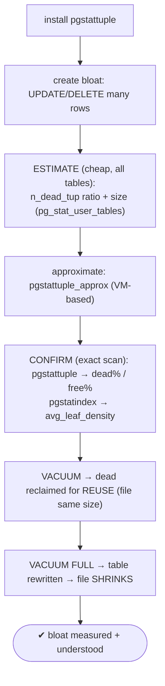
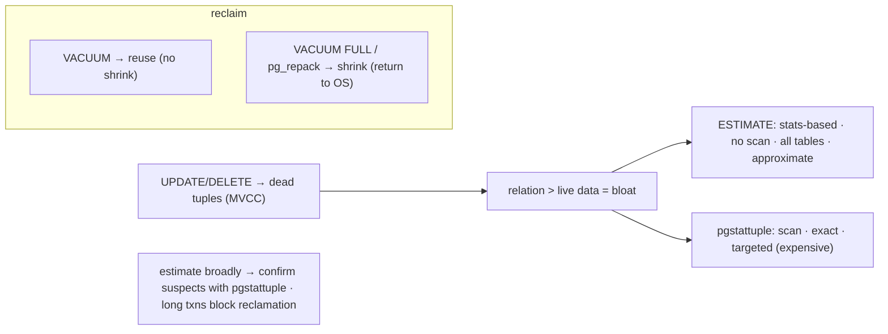

# Lab 53 — Track Table/Index Bloat with a Bloat-Estimate Query; Confirm Against `pgstattuple`

> **Track A · DBA · A7 Monitoring & Observability · Lab 4 of 8 (Lab 53/222)**
> Teaching package: concept → diagram → steps → verify → quick-ref → self-test → video script.
> **Depends on:** Lab 50 (dead tuples). **Feeds:** Labs 58–62 (vacuum, pg_repack), Lab 205 (fillfactor/HOT).

---

## 0. Lab Card (at a glance)

| Field | Value |
|---|---|
| **Objective** | Create bloat, screen it cheaply with an estimate, and confirm the exact figures with `pgstattuple`/`pgstatindex`; observe how VACUUM vs VACUUM FULL affect it. |
| **Success criterion** | An estimate flags bloated relations; `pgstattuple` confirms the dead/free percentages; VACUUM reclaims for reuse while VACUUM FULL shrinks the file. |
| **Scope boundary** | Measuring bloat. Vacuum tuning is Lab 59; pg_repack Lab 62; REINDEX Lab 61. |
| **Prereqs** | Lab 50; a table to churn |
| **Time** | 25–35 min |
| **Difficulty** | ★★★☆☆ |
| **Risk** | Low — VACUUM FULL takes an exclusive lock (fine on a scratch table). |

---

## 1. Learning Objectives

1. **What bloat is** — MVCC dead tuples and unreclaimed space.
2. **Estimate cheaply** — stats-based screening across all tables (no scan).
3. **Confirm exactly** — `pgstattuple` / `pgstattuple_approx` / `pgstatindex`.
4. **The workflow** — estimate broadly, confirm suspects precisely.
5. **VACUUM vs VACUUM FULL** — reclaim-for-reuse vs shrink the file.

---

## 2. Concept Primer — the "why"

**Bloat comes from MVCC.** An `UPDATE` or `DELETE` doesn't remove the old row version — it marks it **dead**. `VACUUM` later reclaims that dead space **for reuse** (but doesn't return it to the OS). If vacuum can't keep up — heavy churn, or a **long transaction holding back the xmin horizon** so dead tuples can't be removed — dead tuples pile up and the relation grows **larger than the live data needs**. That's **bloat**: wasted disk, more pages to read for the same data (worse cache efficiency), slower scans. **Indexes bloat too** — B-tree pages go sparse after many updates/deletes.

**Two ways to measure — the estimate/confirm split:**

- **Bloat *estimate* (cheap, no scan, all tables).** Screen broadly using statistics: the quick `n_dead_tup` ratio and size from `pg_stat_user_tables` (Lab 50), or the well-known statistical bloat queries (check_postgres / ioguix) that compare actual pages (`relpages`) to the *expected* pages from live rows × average row width. **No table scan** → cheap enough to run over the whole database regularly. The catch: it's **approximate** and depends on **up-to-date statistics** (`ANALYZE`) — it can mislead on variable-width columns, TOAST, or stale stats.

- **`pgstattuple` (exact, full scan, targeted).** The `pgstattuple` extension *scans* the relation and reports the truth:
  - `pgstattuple(rel)` → `table_len`, `tuple_percent` (live), `dead_tuple_percent`, `free_percent`, and the byte counts. **Exact, but a full scan** — expensive on big tables.
  - `pgstattuple_approx(rel)` → **faster approximate** — uses the visibility map to skip all-visible pages. A good middle ground for large tables.
  - `pgstatindex(idx)` → index-specific: `avg_leaf_density` (low = bloated), `leaf_fragmentation`.

**The practical workflow:** run the **cheap estimate** across everything to find suspects, then **confirm the top offenders with `pgstattuple`** before spending effort fixing them. Never scan every table with `pgstattuple` on a busy system.

**Fixing (context, later labs):** `VACUUM` reclaims dead space **for reuse** — the file **doesn't shrink**. `VACUUM FULL` (or `pg_repack`, Lab 62) **rewrites** the table and **returns space to the OS** (VACUUM FULL takes an `ACCESS EXCLUSIVE` lock; pg_repack is online). Prevent bloat with autovacuum tuning (Lab 59), fillfactor/HOT updates (Lab 205), and avoiding long transactions.

---

## 3. Diagrams

### 3.1 Estimate → confirm → fix flow



### 3.2 Bloat + measurement trade-off



---

## 4. Prerequisites

```bash
sudo -u postgres psql -d benchdb -c "CREATE EXTENSION IF NOT EXISTS pgstattuple;"
```

---

## 5. Step-by-Step

### Step 1 — Create a table and generate bloat

```bash
sudo -u postgres psql -d benchdb <<'SQL'
CREATE TABLE bloat_demo AS SELECT g AS id, md5(g::text) AS v FROM generate_series(1,200000) g;
CREATE INDEX bloat_demo_id_idx ON bloat_demo(id);
-- churn: update every row a few times, delete a chunk → lots of dead tuples
UPDATE bloat_demo SET v = md5(random()::text);
UPDATE bloat_demo SET v = md5(random()::text);
DELETE FROM bloat_demo WHERE id % 3 = 0;
ANALYZE bloat_demo;                     -- keep stats fresh so the ESTIMATE is meaningful
SQL
```

### Step 2 — ESTIMATE (cheap, no scan) via stats

```bash
sudo -u postgres psql -d benchdb -x -c "
SELECT relname,
       pg_size_pretty(pg_relation_size(relid)) AS size,
       n_live_tup, n_dead_tup,
       round(100.0*n_dead_tup/nullif(n_live_tup+n_dead_tup,0),1) AS dead_pct
FROM pg_stat_user_tables WHERE relname='bloat_demo';"
#   high dead_pct + size larger than live data suggests → CONFIRM this one
```

### Step 3 — Approximate scan (VM-based, faster than exact)

```bash
sudo -u postgres psql -d benchdb -x -c "SELECT * FROM pgstattuple_approx('bloat_demo');"
#   approx_free_percent / dead_tuple_percent — quick, skips all-visible pages
```

### Step 4 — CONFIRM exactly with pgstattuple

```bash
sudo -u postgres psql -d benchdb -x -c "
SELECT table_len, tuple_percent, dead_tuple_count, dead_tuple_percent, free_percent
FROM pgstattuple('bloat_demo');"
#   the truth: dead_tuple_percent + free_percent = the bloat
```

### Step 5 — Index bloat with pgstatindex

```bash
sudo -u postgres psql -d benchdb -x -c "
SELECT index_size, leaf_pages, avg_leaf_density, leaf_fragmentation
FROM pgstatindex('bloat_demo_id_idx');"
#   low avg_leaf_density / high leaf_fragmentation = bloated index (REINDEX candidate, Lab 61)
```

### Step 6 — VACUUM vs VACUUM FULL (reuse vs shrink)

```bash
SIZE_BEFORE=$(sudo -u postgres psql -d benchdb -tAc "SELECT pg_relation_size('bloat_demo');")
sudo -u postgres psql -d benchdb -c "VACUUM bloat_demo;"          # reclaims dead → free (reusable)
sudo -u postgres psql -d benchdb -x -c "SELECT dead_tuple_percent, free_percent FROM pgstattuple('bloat_demo');"   # dead↓, free↑
SIZE_AFTER_VAC=$(sudo -u postgres psql -d benchdb -tAc "SELECT pg_relation_size('bloat_demo');")

sudo -u postgres psql -d benchdb -c "VACUUM FULL bloat_demo;"     # rewrites → returns space to OS
SIZE_AFTER_FULL=$(sudo -u postgres psql -d benchdb -tAc "SELECT pg_relation_size('bloat_demo');")
echo "size: before=$SIZE_BEFORE  after VACUUM=$SIZE_AFTER_VAC (≈same)  after VACUUM FULL=$SIZE_AFTER_FULL (smaller)"
```

---

## 6. Verification Checklist

- [ ] Bloat created (updates + deletes → dead tuples)
- [ ] Estimate flags the table (high `dead_pct`)
- [ ] `pgstattuple_approx` gives a fast approximate
- [ ] `pgstattuple` confirms exact `dead_tuple_percent` / `free_percent`
- [ ] `pgstatindex` shows index density/fragmentation
- [ ] After VACUUM: dead↓, free↑, **file size ~unchanged**
- [ ] After VACUUM FULL: **file size shrinks**

---

## 7. Troubleshooting

| Symptom | Cause | Fix |
|---|---|---|
| Estimate inaccurate | Stale statistics | `ANALYZE` first; estimates rely on `pg_stats` |
| `pgstattuple` very slow | Full scan on a big table | Use `pgstattuple_approx`; target only suspects |
| File didn't shrink after VACUUM | VACUUM reclaims for reuse, not the OS | `VACUUM FULL` or `pg_repack` (Lab 62) to shrink |
| High `n_dead_tup`, vacuum won't clear it | Long transaction holds the xmin horizon | End the long transaction; then vacuum |
| Index still bloated after table VACUUM | Index bloat is separate | `REINDEX [CONCURRENTLY]` (Lab 61) |
| `pgstattuple` permission error | Insufficient privilege on the relation | Grant access / run as owner/superuser |
| TOAST bloat hidden | TOAST is a separate table | Check the relation's TOAST table too |

---

## 8. Quick Reference Card (paste-ready)

```bash
sudo -u postgres psql -d benchdb -c "CREATE EXTENSION IF NOT EXISTS pgstattuple;"
```
```sql
-- ESTIMATE (cheap, screen all tables) — dead ratio + size
SELECT relname, pg_size_pretty(pg_relation_size(relid)) size, n_live_tup, n_dead_tup,
       round(100.0*n_dead_tup/nullif(n_live_tup+n_dead_tup,0),1) dead_pct
FROM pg_stat_user_tables ORDER BY n_dead_tup DESC;

-- CONFIRM (exact scan) — targeted
SELECT * FROM pgstattuple('bloat_demo');            -- dead_tuple_percent, free_percent
SELECT * FROM pgstattuple_approx('bloat_demo');     -- faster approximate (VM-based)
SELECT * FROM pgstatindex('bloat_demo_id_idx');     -- avg_leaf_density (low = bloat)

-- FIX: VACUUM = reclaim for reuse (no shrink) · VACUUM FULL / pg_repack = shrink (return to OS)
-- workflow: estimate broadly → confirm suspects with pgstattuple · keep ANALYZE fresh
```

---

## 9. Self-Check

1. What causes bloat?
2. What's the trade-off between an estimate query and `pgstattuple`?
3. How does `pgstattuple_approx` differ from `pgstattuple`?
4. Does `VACUUM` shrink the table file?
5. Which `pgstatindex` metric indicates index bloat?
6. What's the practical estimate→confirm workflow?

<details>
<summary>Answers</summary>

1. MVCC leaves dead tuples on UPDATE/DELETE; if vacuum can't reclaim them fast enough (heavy churn or a long transaction holding the xmin horizon), the relation grows past the live data.
2. The estimate is **cheap (no scan), broad, approximate**; `pgstattuple` is **exact but a full scan** (expensive, targeted).
3. `pgstattuple_approx` uses the visibility map to skip all-visible pages — faster, approximate; `pgstattuple` scans everything for exact numbers.
4. **No** — it reclaims dead space for reuse; `VACUUM FULL`/`pg_repack` shrink the file.
5. Low `avg_leaf_density` (and high `leaf_fragmentation`).
6. Run the cheap estimate across all tables to find suspects, then confirm the worst with `pgstattuple`.
</details>

---

## 10. Video / Teaching Script

| # | On screen | Say (narration) |
|---|---|---|
| 1 | Title: "The silent space killer: bloat" | "Every update leaves a dead row behind. Let those pile up and your table is twice the size of its data — wasting disk and slowing everything." |
| 2 | create churn | "Update every row twice, delete a third — instant bloat." |
| 3 | estimate | "First, the cheap screen: dead-tuple ratio and size, straight from the stats. No scan — run it over your whole database." |
| 4 | pgstattuple | "Then confirm the suspects exactly. pgstattuple scans and tells the truth: this percent is dead, this percent is wasted space." |
| 5 | pgstatindex | "Indexes bloat too — low leaf density means it's time to reindex." |
| 6 | VACUUM vs FULL | "Now the fix, and a crucial nuance: plain VACUUM reclaims space *for reuse* — the file stays the same size. Only VACUUM FULL, or pg_repack, actually shrinks it." |
| 7 | Outro | "Estimate broadly, confirm precisely, fix deliberately. Next: monitoring replication lag." |

---

## 11. Glossary

- **Bloat** — a relation larger than its live data (dead tuples + unreclaimed space).
- **Dead tuple** — an old MVCC row version awaiting reclamation.
- **Bloat estimate** — stats-based, no-scan approximation.
- **`pgstattuple` / `pgstattuple_approx`** — exact scan / VM-based approximate.
- **`pgstatindex` / `avg_leaf_density`** — index bloat metrics.
- **VACUUM vs VACUUM FULL** — reclaim-for-reuse vs shrink-and-return-to-OS.
- **xmin horizon** — a long transaction can block dead-tuple removal.

---
*NETAPORT lab series · PostgreSQL 17 on AlmaLinux 9 · Lab 53/222 · A7 Monitoring & Observability*
