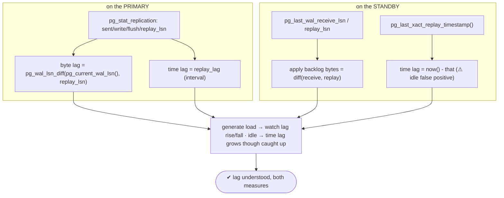
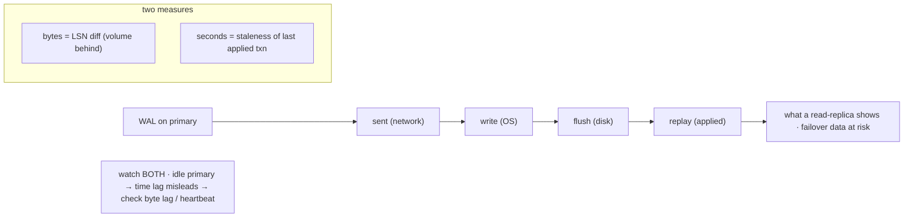

# Lab 54 — Monitor Replication Lag (Bytes + Seconds) from Both Primary and Standby

> **Track A · DBA · A7 Monitoring & Observability · Lab 5 of 8 (Lab 54/222)**
> Teaching package: concept → diagram → steps → verify → quick-ref → self-test → video script.
> **Depends on:** Lab 26 (streaming replication). **Feeds:** Lab 55 (Grafana), Lab 211 (standby conflicts).

---

## 0. Lab Card (at a glance)

| Field | Value |
|---|---|
| **Objective** | Measure replication lag in both bytes and seconds, from the primary (`pg_stat_replication`) and the standby (`pg_last_*` functions), and understand the idle-primary false positive. |
| **Success criterion** | You can report byte lag and time lag from each side, identify which WAL stage lags, and explain why time lag can mislead on an idle primary. |
| **Scope boundary** | Measuring lag. Reducing it (feedback/conflicts) is Lab 211; dashboards are Lab 55. |
| **Prereqs** | Lab 26 (a running primary + streaming standby) |
| **Time** | 25–35 min |
| **Difficulty** | ★★★☆☆ |
| **Risk** | Low — read-only monitoring. |

---

## 1. Learning Objectives

1. **Bytes vs seconds** — the two lag measures and what each means.
2. **From the primary** — `pg_stat_replication` LSNs and lag intervals per stage.
3. **From the standby** — `pg_last_wal_*_lsn()` and `pg_last_xact_replay_timestamp()`.
4. **The idle false positive** — why time lag grows on an idle primary.
5. **Which stage** — sent / write / flush / replay.

---

## 2. Concept Primer — the "why"

**Lag = how far behind the standby is.** Two independent measures:
- **Bytes lag** — the **LSN difference** between primary and standby: how many bytes of WAL the standby hasn't yet received/written/flushed/applied. Measures *volume* behind.
- **Time lag** — how many **seconds** behind the standby's applied data is: the wall-clock age of the last applied transaction. Measures *staleness*.

They can diverge: a high-write primary may show large **byte** lag but small **time** lag (WAL streams and applies fast); a low-write primary may show large **time** lag with tiny byte lag (the last transaction was a while ago, but there's little WAL). **Watch both.**

**WAL flows through four stages** — lag can be at any of them:
`sent` (over the network) → `write` (to the standby's OS) → `flush` (fsync'd to disk) → `replay` (applied/visible). **Replay lag** is usually what matters — it's the staleness a read replica shows and the data at risk on failover.

**From the PRIMARY — `pg_stat_replication`** (one row per standby):
- LSN columns: `sent_lsn`, `write_lsn`, `flush_lsn`, `replay_lsn`.
- Byte lag: `pg_wal_lsn_diff(pg_current_wal_lsn(), replay_lsn)` (and per stage).
- Interval columns (PG10+): `write_lag`, `flush_lag`, `replay_lag` — the **time** each stage is behind.

**From the STANDBY:**
- `pg_last_wal_receive_lsn()` (received) and `pg_last_wal_replay_lsn()` (applied).
- Apply backlog on the standby: `pg_wal_lsn_diff(pg_last_wal_receive_lsn(), pg_last_wal_replay_lsn())`.
- **Time lag:** `now() - pg_last_xact_replay_timestamp()` — the age of the last applied transaction.

**The idle-primary false positive (the key gotcha).** `pg_last_xact_replay_timestamp()` only advances when a new transaction is replayed. On an **idle** primary (no writes), it stops advancing — so `now() - pg_last_xact_replay_timestamp()` **keeps growing** even though the standby is *perfectly caught up*. Naive time-lag alerts fire constantly on quiet systems. **Defenses:** also check **byte lag** (0 = caught up regardless of time), or run a periodic **heartbeat** write on the primary so the timestamp keeps moving. Never alert on time lag alone.

**Alerting:** thresholds on **replay_lag** (e.g. > 30 s) *and* **replay bytes** (e.g. > 100 MB), combined to avoid the idle false positive. Prometheus's `postgres_exporter` exposes all of this (Lab 55).

---

## 3. Diagrams

### 3.1 Measure from both sides



### 3.2 WAL stages + the two measures



---

## 4. Prerequisites

```bash
# primary + standby from Lab 26 (adjust ports to your setup: primary 5432, standby 5433)
sudo -u postgres psql -p 5432 -c "SELECT count(*) FROM pg_stat_replication;"   # >=1
sudo -u postgres psql -p 5433 -c "SELECT pg_is_in_recovery();"                 # t
```

---

## 5. Step-by-Step

### Step 1 — From the PRIMARY: byte lag per stage + time lag

```bash
sudo -u postgres psql -p 5432 -x -c "
SELECT application_name, client_addr, state, sync_state,
       pg_size_pretty(pg_wal_lsn_diff(pg_current_wal_lsn(), sent_lsn))   AS sent_behind,
       pg_size_pretty(pg_wal_lsn_diff(pg_current_wal_lsn(), flush_lsn))  AS flush_behind,
       pg_size_pretty(pg_wal_lsn_diff(pg_current_wal_lsn(), replay_lsn)) AS replay_behind,
       write_lag, flush_lag, replay_lag
FROM pg_stat_replication;"
#   replay_behind (bytes) + replay_lag (time) are the headline apply-lag numbers
```

### Step 2 — From the STANDBY: apply backlog (bytes) + time lag

```bash
sudo -u postgres psql -p 5433 -x -c "
SELECT pg_last_wal_receive_lsn()  AS received,
       pg_last_wal_replay_lsn()   AS replayed,
       pg_size_pretty(pg_wal_lsn_diff(pg_last_wal_receive_lsn(), pg_last_wal_replay_lsn())) AS apply_backlog_bytes,
       now() - pg_last_xact_replay_timestamp() AS time_lag;"
```

### Step 3 — Generate load; watch lag rise then fall

```bash
sudo -u postgres pgbench -p 5432 -c 8 -j 4 -T 15 benchdb >/dev/null 2>&1 &
# sample during load:
for i in 1 2 3; do
  sudo -u postgres psql -p 5432 -tAc "SELECT pg_size_pretty(pg_wal_lsn_diff(pg_current_wal_lsn(), replay_lsn)), replay_lag FROM pg_stat_replication;"
  sleep 3
done
wait
# after load stops, lag should shrink back toward 0
sudo -u postgres psql -p 5432 -tAc "SELECT pg_size_pretty(pg_wal_lsn_diff(pg_current_wal_lsn(), replay_lsn)) FROM pg_stat_replication;"
```

### Step 4 — Demonstrate the IDLE false positive

```bash
# stop all writes for a bit, then check standby time lag vs byte lag:
sleep 30
echo "byte apply backlog (should be ~0 = caught up):"
sudo -u postgres psql -p 5433 -tAc "SELECT pg_wal_lsn_diff(pg_last_wal_receive_lsn(), pg_last_wal_replay_lsn());"
echo "time lag (GROWS on idle primary — FALSE positive):"
sudo -u postgres psql -p 5433 -tAc "SELECT now() - pg_last_xact_replay_timestamp();"
#   byte lag ~0 but time lag large → the standby is caught up; time lag misleads on idle
```

### Step 5 — A heartbeat fixes the idle false positive

```bash
# a periodic write keeps pg_last_xact_replay_timestamp advancing:
sudo -u postgres psql -p 5432 -c "CREATE TABLE IF NOT EXISTS repl_heartbeat(ts timestamptz); INSERT INTO repl_heartbeat VALUES (now());"
sleep 2
sudo -u postgres psql -p 5433 -tAc "SELECT now() - pg_last_xact_replay_timestamp();"   # now small again
```

---

## 6. Verification Checklist

- [ ] Primary: byte lag per stage (sent/flush/replay) + `write/flush/replay_lag`
- [ ] Standby: apply backlog bytes + `now() - pg_last_xact_replay_timestamp()`
- [ ] Load raises lag; it shrinks after load stops
- [ ] Idle primary: byte lag ~0 but time lag grows (false positive observed)
- [ ] A heartbeat write restores a sensible time lag
- [ ] You can name the four WAL stages and which lag matters most

---

## 7. Troubleshooting

| Symptom | Cause | Fix |
|---|---|---|
| Time lag high, byte lag 0 | Idle primary (no new txns) | Check byte lag; add a heartbeat; don't alert on time alone |
| `pg_stat_replication` empty | Standby disconnected | Fix streaming (Lab 26) |
| `replay_lag` NULL | Just connected / no flow yet | Wait for activity |
| Byte lag steadily growing | Standby can't keep up / network | Check standby I/O; `hot_standby_feedback` (Lab 211) |
| `pg_last_xact_replay_timestamp()` NULL on a node | Not a standby | Run standby functions on the standby |
| Which stage lags? | Compare sent vs write vs flush vs replay | `replay ≫ flush` = apply bottleneck |
| Alerts flap on quiet systems | Time-only threshold + idle | Combine byte + time thresholds |

---

## 8. Quick Reference Card (paste-ready)

```sql
-- PRIMARY: bytes per stage + time lag
SELECT application_name,
  pg_size_pretty(pg_wal_lsn_diff(pg_current_wal_lsn(), replay_lsn)) AS replay_behind_bytes,
  write_lag, flush_lag, replay_lag
FROM pg_stat_replication;

-- STANDBY: apply backlog bytes + time lag
SELECT pg_size_pretty(pg_wal_lsn_diff(pg_last_wal_receive_lsn(), pg_last_wal_replay_lsn())) AS apply_backlog,
       now() - pg_last_xact_replay_timestamp() AS time_lag;

-- stages: sent (net) → write (OS) → flush (disk) → replay (applied) · replay is what matters
-- bytes = volume behind (LSN diff) · seconds = staleness · WATCH BOTH
-- IDLE PRIMARY: time lag grows though caught up → verify with byte lag / heartbeat write
-- alert on replay_lag AND replay bytes (combined)
```

---

## 9. Self-Check

1. What are the two ways to measure replication lag, and what does each mean?
2. On the primary, which view and column give the time lag?
3. On the standby, how do you compute time lag?
4. What is the idle-primary false positive, and how do you avoid it?
5. Name the four WAL stages where lag can occur.
6. Which lag matters most for read-replica staleness and failover data loss?

<details>
<summary>Answers</summary>

1. **Bytes** (LSN difference — volume of WAL behind) and **seconds** (staleness of the last applied transaction).
2. `pg_stat_replication`; `replay_lag` (and `write_lag`/`flush_lag` per stage).
3. `now() - pg_last_xact_replay_timestamp()`.
4. On an idle primary, `pg_last_xact_replay_timestamp()` stops advancing, so time lag grows though the standby is caught up; check **byte lag** (0 = caught up) or add a **heartbeat** write.
5. `sent` (network), `write` (OS), `flush` (disk), `replay` (applied).
6. **Replay/apply lag** — it's what a read replica shows and the data at risk on failover.
</details>

---

## 10. Video / Teaching Script

| # | On screen | Say (narration) |
|---|---|---|
| 1 | Title: "How far behind is your replica?" | "Lag has two faces — bytes and seconds. Miss either and you'll misread your replica's health." |
| 2 | primary view | "From the primary, one view tells all: how many bytes behind each stage, and how many seconds behind the apply is." |
| 3 | standby view | "From the standby, the same story from the other side — plus the age of the last transaction it applied." |
| 4 | load rises/falls | "Push some writes and lag climbs; stop, and it drains back. That's healthy replication." |
| 5 | idle false positive | "Now the trap: go idle, and the *time* lag keeps growing — but the byte lag is zero. The replica is caught up; the clock is lying. Never alert on time alone." |
| 6 | heartbeat | "A tiny heartbeat write keeps that clock honest." |
| 7 | Outro | "Bytes and seconds, both sides, no false alarms. Next: putting these metrics on a Grafana dashboard." |

---

## 11. Glossary

- **Replication lag** — how far a standby trails the primary.
- **Bytes lag** — LSN difference (`pg_wal_lsn_diff`).
- **Time lag** — `now() - pg_last_xact_replay_timestamp()`.
- **WAL stages** — sent / write / flush / replay.
- **`replay_lag`** — apply-stage time lag (primary view).
- **Idle false positive** — time lag grows on an idle primary though caught up.
- **Heartbeat** — periodic write to keep the replay timestamp advancing.

---
*NETAPORT lab series · PostgreSQL 17 on AlmaLinux 9 · Lab 54/222 · A7 Monitoring & Observability*
