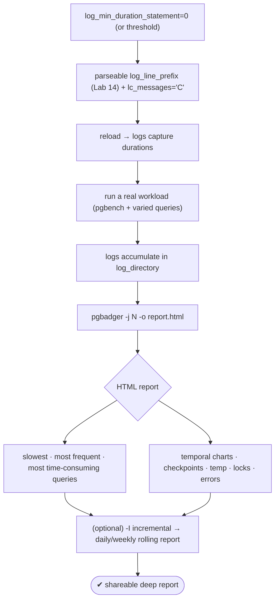
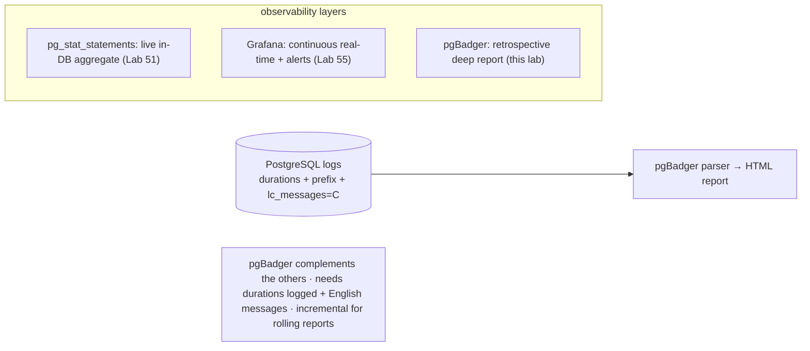

# Lab 56 — Configure `log_min_duration_statement` + pgBadger; Generate an HTML Report from Real Logs

> **Track A · DBA · A7 Monitoring & Observability · Lab 7 of 8 (Lab 56/222)**
> Teaching package: concept → diagram → steps → verify → quick-ref → self-test → video script.
> **Depends on:** Lab 14 (logging + pgBadger-friendly prefix), Lab 51 (query ranking). Retrospective counterpart to Lab 55 (live Grafana).

---

## 0. Lab Card (at a glance)

| Field | Value |
|---|---|
| **Objective** | Configure query-duration logging, run a workload, and generate a full pgBadger HTML report from the real logs. |
| **Success criterion** | pgBadger produces an HTML report with slow/frequent/time-consuming queries, temporal charts, and event summaries from the actual log files. |
| **Scope boundary** | Log-based analysis. Live metrics were Lab 55; in-DB query stats Lab 51. |
| **Prereqs** | Lab 14 (logging + prefix); a workload; the `pgbadger` package |
| **Time** | 30–40 min |
| **Difficulty** | ★★★☆☆ |
| **Risk** | Low — `log_min_duration_statement=0` is verbose; use a threshold in prod. |

---

## 1. Learning Objectives

1. **Where pgBadger fits** — retrospective, deep, log-based; vs live tools.
2. **Log for it** — `log_min_duration_statement` + a parseable prefix.
3. **The `lc_messages` gotcha** — English messages required.
4. **Generate a report** — parse real logs into HTML.
5. **Incremental mode** — cumulative daily/weekly reports.

---

## 2. Concept Primer — the "why"

**Three complementary observability layers.** You now have: **`pg_stat_statements`** (Lab 51 — live, in-DB, normalized aggregate stats), **Prometheus/Grafana** (Lab 55 — continuous, real-time, alerting), and now **pgBadger** — a **retrospective log analyzer** that parses the server logs into a rich, shareable **HTML report**. pgBadger's strength is *depth from logs*: temporal distribution (queries by hour), actual query examples with parameters, connection/session patterns, and event analysis (checkpoints, temp files, locks, vacuums, errors) — the kind of report you generate for a weekly review or an incident post-mortem.

**What it needs in the logs:**
- **`log_min_duration_statement`** — logs statements with their duration. `0` logs **everything** (verbose — good for a complete analysis window); a **threshold** (e.g. `250ms`, Lab 14) logs only slow queries (production). Without durations logged, pgBadger has little to analyze.
- **A parseable `log_line_prefix`** — pgBadger reads the prefix to extract timestamp, PID, user, database, app. It auto-detects common formats, but a mismatch means it parses nothing — then you pass `--prefix '<your prefix>'` explicitly. The Lab 14 prefix (`%m [%p] %q%u@%d/%a %h `) works.
- **`lc_messages = 'C'` — the classic gotcha.** pgBadger parses **English** log text. If the server locale produces localized messages (non-English `LOG:`/`ERROR:` wording), pgBadger **can't parse them** and your report is empty or partial. Set `lc_messages='C'`.
- The Lab 14 baseline (`log_checkpoints`, `log_connections`, `log_lock_waits`, `log_temp_files=0`, `log_autovacuum_min_duration=0`) feeds pgBadger's event sections too.

**Generating it.** `pgbadger` is a Perl script. Point it at the log file(s): `pgbadger <logs> -o report.html`. Useful flags: `-j N` (parallel parsing across cores), `-f stderr|csvlog|jsonlog` (format), `-b/-e` (time range), and **`-I` (incremental mode)** — parse each day's new lines and **append** to a cumulative report, run from a daily timer (Lab 130 pattern) for rolling weekly reports.

**The report** covers: overview (queries, duration, unique), **slowest / most frequent / most time-consuming** queries (normalized, with examples), query type distribution, temporal charts, sessions/connections, and events (checkpoints, temp files, locks, vacuum, errors).

---

## 3. Diagrams

### 3.1 Configure → workload → report flow



### 3.2 Where pgBadger sits



---

## 4. Prerequisites

```bash
sudo dnf install -y pgbadger    # EPEL
sudo -u postgres psql -c "SHOW logging_collector; SHOW log_line_prefix;"   # on + a parseable prefix (Lab 14)
```

---

## 5. Step-by-Step

### Step 1 — Configure logging for pgBadger

```bash
sudo -u postgres psql <<'SQL'
ALTER SYSTEM SET log_min_duration_statement = 0;      -- full analysis window (use a threshold in prod, e.g. '250ms')
ALTER SYSTEM SET lc_messages = 'C';                    -- ENGLISH messages — pgBadger needs this
-- Lab 14 baseline (helps event sections): log_checkpoints, log_connections, log_lock_waits, log_temp_files=0
SQL
sudo systemctl reload postgresql-17
sudo -u postgres psql -c "SHOW log_min_duration_statement; SHOW lc_messages;"
```

### Step 2 — Generate a real workload

```bash
sudo -u postgres pgbench -c 8 -j 4 -T 20 benchdb >/dev/null 2>&1
# a few heavier/varied queries so the report has interesting content:
sudo -u postgres psql -d benchdb -c "SELECT count(*) FROM pgbench_accounts a JOIN pgbench_branches b ON a.bid=b.bid;"
sudo -u postgres psql -d benchdb -c "SELECT * FROM pgbench_accounts ORDER BY abalance DESC LIMIT 100;"
sudo -u postgres psql -d benchdb -c "UPDATE pgbench_accounts SET abalance=abalance+1 WHERE aid<=1000;"
```

### Step 3 — Generate the HTML report

```bash
PGDATA=/var/lib/pgsql/17/data
sudo pgbadger -j "$(nproc)" "$PGDATA"/log/postgresql-*.log -o /tmp/pgbadger_report.html
#   if it parses nothing, pass the prefix explicitly:
#   sudo pgbadger --prefix '%m [%p] %q%u@%d/%a %h ' "$PGDATA"/log/postgresql-*.log -o /tmp/pgbadger_report.html
ls -lh /tmp/pgbadger_report.html
```

### Step 4 — Review the report

```bash
# open /tmp/pgbadger_report.html in a browser (or serve it). Key sections:
#   • Overview: total queries, duration, unique normalized queries
#   • Top → Slowest / Most frequent / Time-consuming queries (with examples)
#   • Queries by type + temporal distribution (per hour)
#   • Events: checkpoints, temp files, locks, vacuum, errors
grep -o "Slowest\|Most frequent\|Time consuming\|Checkpoints\|Temporary files" /tmp/pgbadger_report.html | sort -u | head
```

### Step 5 — (Optional) Incremental mode for rolling reports

```bash
sudo mkdir -p /var/www/pgbadger
sudo pgbadger -I -O /var/www/pgbadger "$PGDATA"/log/postgresql-*.log
#   -I appends new log data to a cumulative report; run daily via a systemd timer (Lab 130):
#   generates index.html + per-day/-week reports under /var/www/pgbadger
```

### Step 6 — (Production note) switch to a threshold

```bash
# 0 logs EVERYTHING — great for a bounded analysis, too noisy long-term. For prod:
sudo -u postgres psql -c "ALTER SYSTEM SET log_min_duration_statement = '250ms'; SELECT pg_reload_conf();"
```

---

## 6. Verification Checklist

- [ ] `log_min_duration_statement` captures durations (`0` or a threshold)
- [ ] `lc_messages='C'` (English messages)
- [ ] `log_line_prefix` parseable (auto-detected or `--prefix`)
- [ ] Workload produced real log content
- [ ] pgBadger generated an HTML report
- [ ] Report shows slowest / frequent / time-consuming queries
- [ ] Report shows events (checkpoints, temp, locks, errors)

---

## 7. Troubleshooting

| Symptom | Cause | Fix |
|---|---|---|
| Report empty / "no query" | `log_min_duration_statement=-1` | Set `0` or a threshold; reload |
| pgBadger parses nothing | Prefix mismatch | Pass `--prefix '<log_line_prefix>'` explicitly |
| Garbled / partial parse | Non-English messages | `lc_messages='C'` |
| Wrong/empty time range | Wrong log files or `-b/-e` | Point at the right files; check the window |
| Very slow on huge logs | Single-threaded | Add `-j $(nproc)` |
| Format not detected | csvlog/jsonlog | `-f csvlog` / `-f jsonlog` |
| Incremental not updating | Inconsistent `-O` dir | Use the same output dir with `-I` |

---

## 8. Quick Reference Card (paste-ready)

```bash
sudo dnf install -y pgbadger
# log config (reload)
sudo -u postgres psql -c "ALTER SYSTEM SET log_min_duration_statement=0; ALTER SYSTEM SET lc_messages='C'; SELECT pg_reload_conf();"
# (prod: log_min_duration_statement='250ms')

# generate a report (parallel), explicit prefix if auto-detect fails:
sudo pgbadger -j $(nproc) /var/lib/pgsql/17/data/log/postgresql-*.log -o /tmp/report.html
# sudo pgbadger --prefix '%m [%p] %q%u@%d/%a %h ' <logs> -o report.html

# incremental (rolling) reports → run daily via a systemd timer:
sudo pgbadger -I -O /var/www/pgbadger /var/lib/pgsql/17/data/log/postgresql-*.log

# needs: durations logged + parseable prefix + lc_messages='C' (English)
# layers: pg_stat_statements (live) · Grafana (continuous) · pgBadger (retrospective HTML)
```

---

## 9. Self-Check

1. What is pgBadger, and how does it complement `pg_stat_statements` and Grafana?
2. What `log_min_duration_statement` value captures all queries for a full analysis?
3. Why does `log_line_prefix` matter for pgBadger, and the fix if it fails?
4. What's the `lc_messages` gotcha?
5. What does incremental mode (`-I`) enable?
6. Name three sections a pgBadger report includes.

<details>
<summary>Answers</summary>

1. A retrospective **log analyzer** producing a shareable HTML report (deep temporal/event detail); it complements live in-DB stats (`pg_stat_statements`) and continuous real-time dashboards (Grafana).
2. `0` (logs everything with durations); a threshold logs only slow queries.
3. pgBadger parses the prefix fields; a mismatch means it parses nothing — pass `--prefix '<your prefix>'`.
4. It must be **`'C'`** (English) — non-English log messages break parsing.
5. Cumulative daily/weekly reports appended over time (run from a timer).
6. Any of: slowest/most-frequent/time-consuming queries, temporal charts, checkpoints, temp files, locks, vacuum, errors, sessions.
</details>

---

## 10. Video / Teaching Script

| # | On screen | Say (narration) |
|---|---|---|
| 1 | Title: "Your logs, as a report" | "Grafana shows you *now*. pgBadger digs into what already happened — and turns your logs into a shareable HTML report." |
| 2 | log config | "Two settings make it work: log query durations, and — this one trips everyone — set messages to English. pgBadger only reads English." |
| 3 | workload | "Run a real workload so there's something to analyze." |
| 4 | run pgbadger | "One command parses the logs — in parallel — and writes the report." |
| 5 | the report | "And here it is: slowest queries, most frequent, most time-consuming — with real examples. Checkpoints, temp files, locks, errors, all charted by hour." |
| 6 | incremental | "For ongoing use, incremental mode appends each day into a rolling report — perfect for a weekly review from a timer." |
| 7 | Outro | "Deep, retrospective analysis from logs you already have. Last monitoring lab: watching and tuning checkpoints." |

---

## 11. Glossary

- **pgBadger** — Perl log analyzer producing HTML reports.
- **`log_min_duration_statement`** — logs statements with durations (`0`=all).
- **`log_line_prefix`** — per-line fields pgBadger parses.
- **`lc_messages='C'`** — English log messages (required).
- **Incremental mode (`-I`)** — cumulative rolling reports.
- **Retrospective analysis** — from logs, after the fact.
- **Observability layers** — in-DB stats / live dashboards / log reports.

---
*NETAPORT lab series · PostgreSQL 17 on AlmaLinux 9 · Lab 56/222 · A7 Monitoring & Observability*
