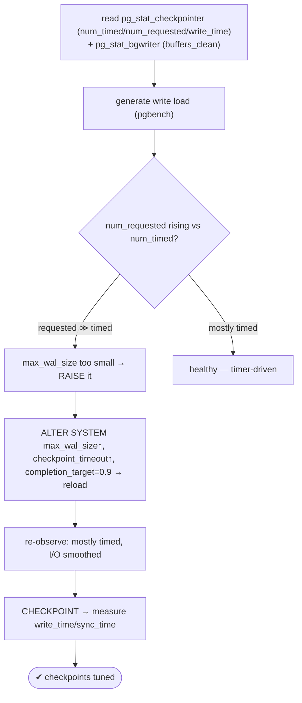
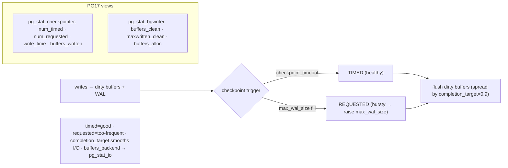

# Lab 57 — Watch Checkpoint Behavior (`pg_stat_bgwriter` / `pg_stat_checkpointer` in PG17); Tune `checkpoint_*`

> **Track A · DBA · A7 Monitoring & Observability · Lab 8 of 8 (Lab 57/222 · A7 complete)**
> Teaching package: concept → diagram → steps → verify → quick-ref → self-test → video script.
> **Depends on:** Lab 50 (stat views), Lab 15 (WAL sync). Closes the monitoring track.

---

## 0. Lab Card (at a glance)

| Field | Value |
|---|---|
| **Objective** | Read checkpoint/background-writer stats (PG17's `pg_stat_checkpointer` + `pg_stat_bgwriter`), diagnose timed-vs-requested checkpoints, and tune `checkpoint_*`/`max_wal_size` to smooth I/O. |
| **Success criterion** | You can read both views, identify a high requested-checkpoint ratio, and reduce it by raising `max_wal_size`; checkpoint I/O is spread (`completion_target`). |
| **Scope boundary** | Checkpoint behavior + tuning. Storage sync was Lab 15; WAL tuning deep is Lab 206. |
| **Prereqs** | Lab 50; a write workload |
| **Time** | 30–40 min |
| **Difficulty** | ★★★☆☆ |
| **Risk** | Low — reloadable settings; a manual CHECKPOINT causes a brief I/O burst. |

---

## 1. Learning Objectives

1. **What a checkpoint does** — flush dirty buffers, bound recovery, cost I/O.
2. **PG17 views** — checkpoint stats moved to `pg_stat_checkpointer`.
3. **Timed vs requested** — the primary diagnostic.
4. **Tune it** — `max_wal_size`, `checkpoint_timeout`, `completion_target`.
5. **The recovery trade-off** — fewer checkpoints vs longer crash recovery.

---

## 2. Concept Primer — the "why"

**A checkpoint flushes all dirty pages.** It writes every modified (dirty) shared-buffer page to disk and records a checkpoint in WAL. This bounds **crash recovery** (recovery replays WAL only from the last checkpoint) — but the flush is a **burst of write I/O** that, if unmanaged, spikes query latency.

**When checkpoints fire:**
- **Timed** — every `checkpoint_timeout` (default 5 min). Predictable, healthy.
- **Requested** — when WAL written since the last checkpoint approaches `max_wal_size`. This means WAL is filling *faster than the timeout*, forcing extra checkpoints — **bursty and undesirable**.
- Also: manual `CHECKPOINT`, shutdown, base backup.

**The primary diagnostic — timed vs requested.** A healthy system checkpoints mostly on the **timer**. A high **requested** count means `max_wal_size` is too small for the write rate — checkpoints happen too often, driving needless I/O and more full-page writes (each first post-checkpoint page change writes the whole page to WAL, so frequent checkpoints = more WAL). **Fix: raise `max_wal_size`** so checkpoints are driven by the timer, not WAL fill.

**PG17 — the views changed (the named topic).** Checkpoint statistics were **split out of `pg_stat_bgwriter` into a new `pg_stat_checkpointer` view**, with renamed columns:
- **`pg_stat_checkpointer`**: `num_timed`, `num_requested`, `write_time`, `sync_time`, `buffers_written`, `restartpoints_*` (standby), `stats_reset`. *(Pre-PG17 these lived in `pg_stat_bgwriter` as `checkpoints_timed`/`checkpoints_req`/`checkpoint_write_time`/`buffers_checkpoint`.)*
- **`pg_stat_bgwriter`** (PG17) now holds background-writer stats only: `buffers_clean` (dirty buffers the bgwriter wrote proactively), `maxwritten_clean` (times it stopped at `bgwriter_lru_maxpages`), `buffers_alloc`.
- *(Buffer-write source detail — formerly `buffers_backend` — now lives in `pg_stat_io`.)*

**Key tuning knobs:**
- **`max_wal_size`** — raise it if requested checkpoints are frequent (make them timer-driven).
- **`checkpoint_timeout`** — raise (e.g. 15–30 min) to checkpoint less often (less I/O/write amplification) — **but longer crash recovery**. Balance recovery-time objective against I/O.
- **`checkpoint_completion_target`** (default **0.9**) — spread checkpoint writes over this fraction of the interval to **smooth the I/O** instead of a spike.
- **`checkpoint_flush_after`** — periodically flush during the checkpoint to avoid one giant fsync at the end.
- **`checkpoint_warning`** — logs a warning if checkpoints happen too close together (a tuning signal).

All these are `sighup` (reload), so no restart needed.

---

## 3. Diagrams

### 3.1 Observe → diagnose → tune flow



### 3.2 Checkpoint mechanics + PG17 views



---

## 4. Prerequisites

```bash
sudo -u postgres psql -c "SELECT current_setting('server_version_num')::int >= 170000 AS pg17plus;"
sudo -u postgres psql -c "SHOW checkpoint_timeout; SHOW max_wal_size; SHOW checkpoint_completion_target;"
```

---

## 5. Step-by-Step

### Step 1 — Baseline the PG17 views

```bash
sudo -u postgres psql -x -c "SELECT num_timed, num_requested, write_time, sync_time, buffers_written, stats_reset
                             FROM pg_stat_checkpointer;"
sudo -u postgres psql -x -c "SELECT buffers_clean, maxwritten_clean, buffers_alloc FROM pg_stat_bgwriter;"
```

### Step 2 — Reset stats and generate write load

```bash
sudo -u postgres psql -c "SELECT pg_stat_reset_shared('checkpointer'); SELECT pg_stat_reset_shared('bgwriter');" 2>/dev/null \
  || sudo -u postgres psql -c "SELECT pg_stat_reset_shared('checkpointer');"
# heavy writes to push WAL toward max_wal_size (may trigger requested checkpoints):
sudo -u postgres pgbench -c 16 -j 8 -T 60 benchdb >/dev/null 2>&1
```

### Step 3 — Diagnose: timed vs requested

```bash
sudo -u postgres psql -x -c "
SELECT num_timed, num_requested,
       round(100.0*num_requested/nullif(num_timed+num_requested,0),1) AS requested_pct,
       write_time, sync_time, buffers_written
FROM pg_stat_checkpointer;"
#   high requested_pct → max_wal_size too small (checkpoints WAL-driven, bursty)
```

### Step 4 — Check the log for the checkpoint warning

```bash
PGDATA=/var/lib/pgsql/17/data
sudo grep -i "checkpoints are occurring too frequently" "$PGDATA"/log/postgresql-$(date +%a).log | tail -3
#   this warning explicitly tells you to raise max_wal_size
```

### Step 5 — Tune: raise max_wal_size + timeout, confirm completion_target

```bash
sudo -u postgres psql <<'SQL'
ALTER SYSTEM SET max_wal_size = '4GB';                 -- fewer WAL-driven (requested) checkpoints
ALTER SYSTEM SET checkpoint_timeout = '15min';         -- less frequent (balance vs recovery time)
ALTER SYSTEM SET checkpoint_completion_target = 0.9;   -- spread I/O (default 0.9)
SELECT pg_reload_conf();
SQL
sudo -u postgres psql -c "SHOW max_wal_size; SHOW checkpoint_timeout;"
```

### Step 6 — Re-run load and confirm mostly-timed checkpoints

```bash
sudo -u postgres psql -c "SELECT pg_stat_reset_shared('checkpointer');"
sudo -u postgres pgbench -c 16 -j 8 -T 60 benchdb >/dev/null 2>&1
sudo -u postgres psql -x -c "SELECT num_timed, num_requested FROM pg_stat_checkpointer;"   # requested should drop
```

### Step 7 — Time a manual checkpoint

```bash
sudo -u postgres psql -c "CHECKPOINT;"
sudo -u postgres psql -x -c "SELECT write_time, sync_time, buffers_written FROM pg_stat_checkpointer;"
```

---

## 6. Verification Checklist

- [ ] Read `pg_stat_checkpointer` (PG17) and `pg_stat_bgwriter`
- [ ] Identified the timed vs requested ratio
- [ ] Saw the "checkpoints occurring too frequently" warning (if applicable)
- [ ] Raised `max_wal_size`; requested checkpoints dropped
- [ ] `checkpoint_completion_target` = 0.9 (I/O spread)
- [ ] Measured `write_time`/`sync_time` from a manual checkpoint
- [ ] Can state the recovery-time trade-off of a longer timeout

---

## 7. Troubleshooting

| Symptom | Cause | Fix |
|---|---|---|
| Many requested checkpoints | `max_wal_size` too small for the write rate | Raise `max_wal_size` |
| I/O spikes at checkpoint | `completion_target` low / big final fsync | Set `completion_target=0.9`; tune `checkpoint_flush_after` |
| Long crash recovery | `checkpoint_timeout`/`max_wal_size` too large | Balance recovery time vs checkpoint frequency |
| Log: "checkpoints occurring too frequently" | WAL-fill-driven checkpoints | Raise `max_wal_size` |
| Can't find `checkpoints_timed` in `pg_stat_bgwriter` | PG17 moved it | Query `pg_stat_checkpointer.num_timed` |
| High `write_time`/`sync_time` | Slow storage / large `shared_buffers` | Tune `wal_sync_method` (Lab 15), storage |
| `buffers_backend` missing | Moved in PG16+ | See `pg_stat_io` |

---

## 8. Quick Reference Card (paste-ready)

```sql
-- PG17: checkpoint stats live in pg_stat_checkpointer
SELECT num_timed, num_requested,
       round(100.0*num_requested/nullif(num_timed+num_requested,0),1) AS requested_pct,
       write_time, sync_time, buffers_written
FROM pg_stat_checkpointer;

-- background writer:
SELECT buffers_clean, maxwritten_clean, buffers_alloc FROM pg_stat_bgwriter;

-- DIAGNOSIS: high requested_pct → max_wal_size too small
-- TUNE (reload):
ALTER SYSTEM SET max_wal_size='4GB';                 -- fewer requested checkpoints
ALTER SYSTEM SET checkpoint_timeout='15min';         -- less frequent (↑ recovery time)
ALTER SYSTEM SET checkpoint_completion_target=0.9;   -- spread I/O
SELECT pg_reload_conf();

-- reset: pg_stat_reset_shared('checkpointer') · time it: CHECKPOINT; then read write_time/sync_time
-- timed=healthy · requested=too-frequent · buffers_backend → pg_stat_io
```

---

## 9. Self-Check

1. What does a checkpoint do, and why does it cause an I/O burst?
2. What's the difference between timed and requested checkpoints, and what does a high requested count mean?
3. What's the primary fix for too-frequent (requested) checkpoints?
4. What does `checkpoint_completion_target` do?
5. What changed about the checkpoint stats views in PG17?
6. What's the trade-off of raising `checkpoint_timeout`?

<details>
<summary>Answers</summary>

1. It flushes all dirty shared buffers to disk and records a checkpoint in WAL (bounding recovery); the mass flush is the write burst.
2. Timed = driven by `checkpoint_timeout` (healthy); requested = driven by `max_wal_size` filling. A high requested count means `max_wal_size` is too small and checkpoints are too frequent.
3. Raise **`max_wal_size`** so checkpoints are timer-driven.
4. Spreads the checkpoint's writes over that fraction of the interval to smooth I/O (default 0.9).
5. Checkpoint stats moved from `pg_stat_bgwriter` into the new **`pg_stat_checkpointer`** view (with renamed columns `num_timed`/`num_requested`).
6. Fewer checkpoints (less I/O and write amplification) but **longer crash recovery**.
</details>

---

## 10. Video / Teaching Script

| # | On screen | Say (narration) |
|---|---|---|
| 1 | Title: "Checkpoints: the hidden I/O spike" | "Every so often PostgreSQL flushes everything dirty to disk. Tune it wrong and that flush stutters every query. Let's watch and fix it." |
| 2 | PG17 views | "First, know where to look — PostgreSQL 17 moved checkpoint stats into their own view, pg_stat_checkpointer." |
| 3 | load + timed vs requested | "Here's the one number that matters: timed versus requested checkpoints. Timed is the clock doing its job. Requested means WAL filled up too fast — and that's a problem." |
| 4 | the log warning | "The server even tells you: 'checkpoints occurring too frequently.' It's asking for more WAL room." |
| 5 | raise max_wal_size | "So we give it — a bigger max_wal_size. Now checkpoints are driven by the timer, not by panic." |
| 6 | completion_target | "And completion-target spreads the writes across the interval, turning a spike into a gentle stream." |
| 7 | recovery trade-off | "One caution: fewer checkpoints means longer crash recovery. Balance the two for your recovery target." |
| 8 | Outro | "Smooth, predictable checkpoints — and that completes Monitoring and Observability." |

---

## 11. Glossary

- **Checkpoint** — flush dirty buffers + WAL record; bounds recovery.
- **`pg_stat_checkpointer`** (PG17) — checkpoint stats (`num_timed`/`num_requested`/`write_time`).
- **`pg_stat_bgwriter`** (PG17) — background-writer stats (`buffers_clean`).
- **Timed vs requested** — timer-driven (healthy) vs WAL-fill-driven (too frequent).
- **`max_wal_size`** — raise to reduce requested checkpoints.
- **`checkpoint_completion_target`** — spreads checkpoint I/O (0.9).
- **`checkpoint_timeout`** — interval; longer = fewer checkpoints, longer recovery.

---
*NETAPORT lab series · PostgreSQL 17 on AlmaLinux 9 · Lab 57/222 · **A7 Monitoring & Observability complete***
