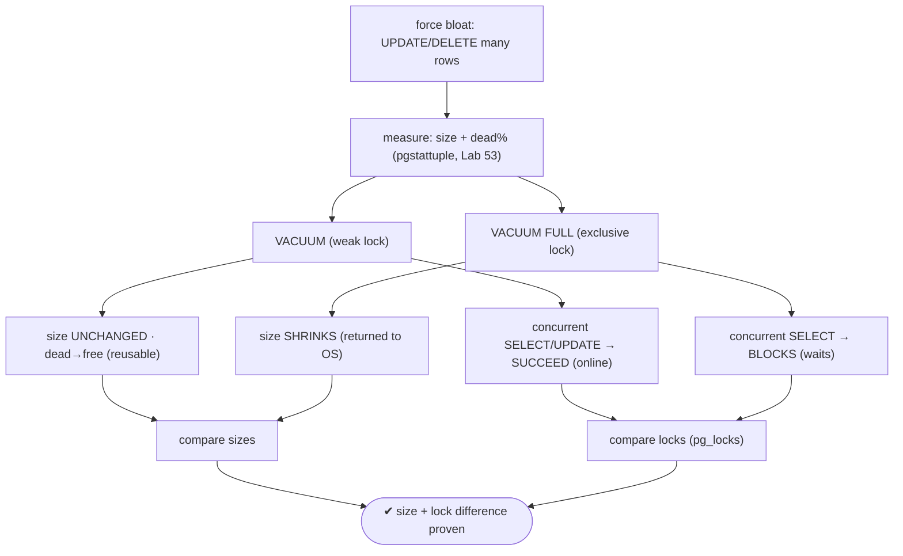
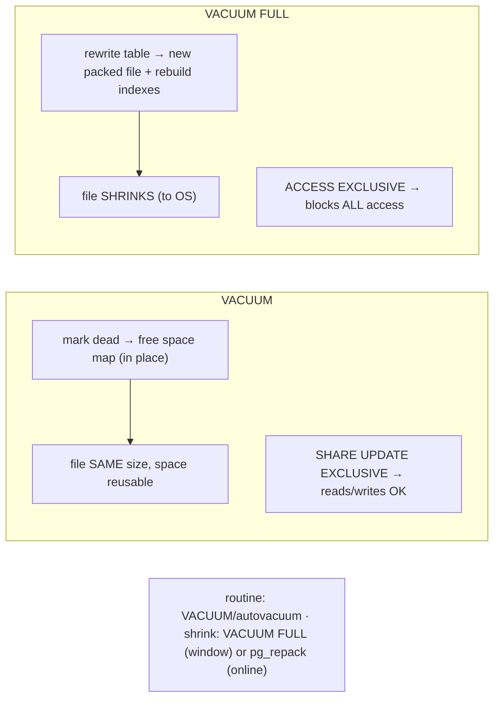

# Lab 58 — Force Bloat, Reclaim with `VACUUM` vs `VACUUM FULL`; Measure Size + Lock Difference

> **Track A · DBA · A8 Maintenance & Vacuum · Lab 1 of 7 (Lab 58/222)**
> Teaching package: concept → diagram → steps → verify → quick-ref → self-test → video script.
> **Depends on:** Lab 53 (measuring bloat), Lab 52 (lock diagnosis). Opens the maintenance track.

---

## 0. Lab Card (at a glance)

| Field | Value |
|---|---|
| **Objective** | Create bloat, reclaim it with plain `VACUUM` and with `VACUUM FULL`, and directly measure the difference in **file size** and **locking behavior**. |
| **Success criterion** | `VACUUM` leaves the file size unchanged and is non-blocking; `VACUUM FULL` shrinks the file but blocks all access — both demonstrated. |
| **Scope boundary** | The two reclaim methods head-to-head. Autovacuum tuning is Lab 59; `pg_repack` is Lab 62. |
| **Prereqs** | Lab 53; two sessions to show locking |
| **Time** | 25–35 min |
| **Difficulty** | ★★★☆☆ |
| **Risk** | Medium — `VACUUM FULL` locks the whole table; do it on a scratch table, never a busy prod one. |

---

## 1. Learning Objectives

1. **What each reclaims** — reuse (VACUUM) vs return-to-OS (VACUUM FULL).
2. **File size** — unchanged vs shrunk.
3. **Locks** — `SHARE UPDATE EXCLUSIVE` (online) vs `ACCESS EXCLUSIVE` (blocks all).
4. **Disk + speed** — VACUUM FULL needs up to 2× space and is slow.
5. **When to use which** — routine vs maintenance-window shrink.

---

## 2. Concept Primer — the "why"

Both commands remove dead tuples, but they do fundamentally different things:

**`VACUUM` (plain) — reclaim for reuse, online.**
- Marks dead-tuple space as **free in the free space map** so future inserts/updates reuse it. **The file does not shrink** — the OS still sees the same size; the space is just reusable internally.
- Takes a **`SHARE UPDATE EXCLUSIVE`** lock — a **weak** lock. `SELECT`, `INSERT`, `UPDATE`, `DELETE` all **continue** during it. It only conflicts with other `VACUUM`/`ANALYZE`/`ALTER TABLE`. So VACUUM is **fully online** — no downtime.
- Fast and incremental (skips all-visible pages via the visibility map). This is what **autovacuum** runs routinely (Lab 59) to keep bloat from growing.

**`VACUUM FULL` — shrink, but blocks everything.**
- **Rewrites the entire table** into a new, tightly packed file, swaps it in, deletes the old one — and **rebuilds the indexes**. This **returns space to the OS**: the file **shrinks** to minimal size.
- Takes an **`ACCESS EXCLUSIVE`** lock — the **strongest** lock. It **blocks all access** (reads *and* writes) to the table for the entire operation. That's **downtime** for that table.
- Needs **up to 2× the table size** in free disk (old + new copies coexist), and is **slow** (full rewrite). Not for production tables during business hours.

**The comparison at a glance:**

| | `VACUUM` | `VACUUM FULL` |
|---|---|---|
| Space | reusable in-table | returned to OS |
| File size | **unchanged** | **shrinks** |
| Lock | `SHARE UPDATE EXCLUSIVE` (online) | `ACCESS EXCLUSIVE` (blocks all) |
| Concurrency | reads + writes continue | table fully locked |
| Extra disk | none | up to 2× |
| Indexes | not rebuilt | rebuilt |
| Use | routine / autovacuum | emergency shrink in a window |

**The takeaway:** use `VACUUM`/autovacuum routinely to keep space reusable and bloat flat; reach for `VACUUM FULL` only when you must **actually reclaim disk** (e.g. after a huge delete) and can afford the lock — or use **`pg_repack`** (Lab 62), which shrinks **without** the `ACCESS EXCLUSIVE` lock, for production.

---

## 3. Diagrams

### 3.1 Force → reclaim → compare flow



### 3.2 Reclaim mechanics + locks



---

## 4. Prerequisites

```bash
sudo -u postgres psql -d benchdb -c "CREATE EXTENSION IF NOT EXISTS pgstattuple;"
```

---

## 5. Step-by-Step

### Step 1 — Create a table and force bloat

```bash
sudo -u postgres psql -d benchdb <<'SQL'
DROP TABLE IF EXISTS vac_demo;
CREATE TABLE vac_demo AS SELECT g AS id, md5(g::text) AS v FROM generate_series(1,500000) g;
ALTER TABLE vac_demo DISABLE TRIGGER ALL;   -- (no triggers; just churn)
UPDATE vac_demo SET v = md5(random()::text);
UPDATE vac_demo SET v = md5(random()::text);
DELETE FROM vac_demo WHERE id % 2 = 0;       -- lots of dead tuples
SQL
sudo -u postgres psql -d benchdb -c "SELECT pg_size_pretty(pg_relation_size('vac_demo')) AS size_before;"
sudo -u postgres psql -d benchdb -x -c "SELECT dead_tuple_percent, free_percent FROM pgstattuple('vac_demo');"
```

### Step 2 — Plain VACUUM: prove it's ONLINE (concurrent access works)

```bash
# start VACUUM in the background:
sudo -u postgres psql -d benchdb -c "VACUUM (VERBOSE) vac_demo;" &
# immediately run reads AND writes on the SAME table — they succeed (weak lock):
sleep 1
sudo -u postgres psql -d benchdb -c "SELECT count(*) FROM vac_demo; UPDATE vac_demo SET v='x' WHERE id=1;"   # OK during VACUUM
# what lock does VACUUM hold?
sudo -u postgres psql -c "SELECT mode FROM pg_locks WHERE relation='vac_demo'::regclass AND mode LIKE '%Update%';"   # ShareUpdateExclusiveLock
wait
```

### Step 3 — Measure size after VACUUM (unchanged) + bloat (dead→free)

```bash
sudo -u postgres psql -d benchdb -c "SELECT pg_size_pretty(pg_relation_size('vac_demo')) AS size_after_vacuum;"   # ≈ size_before
sudo -u postgres psql -d benchdb -x -c "SELECT dead_tuple_percent, free_percent FROM pgstattuple('vac_demo');"    # dead↓, free↑
#   → space reclaimed FOR REUSE (free_percent high), file NOT shrunk
```

### Step 4 — VACUUM FULL: prove it BLOCKS (concurrent access waits)

```bash
# start VACUUM FULL in the background:
sudo -u postgres psql -d benchdb -c "VACUUM FULL vac_demo;" &
sleep 1
# a concurrent query on the table — it BLOCKS (bounded with timeout to show it):
timeout 6 sudo -u postgres psql -d benchdb -c "SELECT count(*) FROM vac_demo;"; echo "exit $? (124 = blocked, as expected)"
# the lock held by VACUUM FULL:
sudo -u postgres psql -c "SELECT mode, granted FROM pg_locks WHERE relation='vac_demo'::regclass ORDER BY granted;"   # AccessExclusiveLock (granted); waiter granted=false
wait
```

### Step 5 — Measure size after VACUUM FULL (shrunk)

```bash
sudo -u postgres psql -d benchdb -c "SELECT pg_size_pretty(pg_relation_size('vac_demo')) AS size_after_full;"   # SMALLER
sudo -u postgres psql -d benchdb -x -c "SELECT dead_tuple_percent, free_percent FROM pgstattuple('vac_demo');"  # free↓ (tightly packed)
```

### Step 6 — Summarize the difference

```bash
sudo -u postgres psql -d benchdb -c "
SELECT 'reads/writes during VACUUM'    AS test, 'allowed (online)'      AS result
UNION ALL SELECT 'reads during VACUUM FULL',       'blocked (exclusive)'
UNION ALL SELECT 'file size after VACUUM',          'unchanged (reuse)'
UNION ALL SELECT 'file size after VACUUM FULL',     'shrunk (to OS)';"
```

---

## 6. Verification Checklist

- [ ] Bloat forced (high `dead_tuple_percent`)
- [ ] During `VACUUM`: concurrent SELECT **and** UPDATE succeed
- [ ] `VACUUM` lock = `ShareUpdateExclusiveLock`
- [ ] Size after `VACUUM` ≈ before; `free_percent` rose (reusable)
- [ ] During `VACUUM FULL`: concurrent query **blocks**
- [ ] `VACUUM FULL` lock = `AccessExclusiveLock`
- [ ] Size after `VACUUM FULL` is **smaller**

---

## 7. Troubleshooting

| Symptom | Cause | Fix |
|---|---|---|
| `VACUUM` didn't shrink the file | Expected — reclaims for reuse | Use `VACUUM FULL`/`pg_repack` to shrink |
| `VACUUM FULL` blocked everything | Expected — `ACCESS EXCLUSIVE` | Use a maintenance window, or `pg_repack` (online) |
| `VACUUM FULL`: no space | Needs up to 2× the table free | Free disk, or use `pg_repack` (also needs space) |
| Dead tuples not removed by `VACUUM` | Long transaction holds the xmin horizon | End the long transaction (Lab 53) |
| `VACUUM FULL` very slow | Full rewrite + index rebuild | Expected on big tables; plan the window |
| Query hangs during `VACUUM FULL` | The exclusive lock | Wait, or cancel the `VACUUM FULL` |
| Want automatic reclaim | Autovacuum runs plain VACUUM | `VACUUM FULL` is never automatic (Lab 59) |

---

## 8. Quick Reference Card (paste-ready)

```sql
-- measure (Lab 53): pg_size_pretty(pg_relation_size('t')) · pgstattuple('t')

-- ROUTINE, ONLINE — reclaim for reuse (file size unchanged), reads/writes continue:
VACUUM (VERBOSE) t;                 -- lock: ShareUpdateExclusiveLock

-- SHRINK — returns space to OS (file smaller), but BLOCKS ALL ACCESS:
VACUUM FULL t;                      -- lock: AccessExclusiveLock · needs up to 2× disk · rebuilds indexes

-- prove locks:  SELECT mode,granted FROM pg_locks WHERE relation='t'::regclass;
-- routine cleanup = autovacuum/VACUUM · disk reclaim = VACUUM FULL (window) OR pg_repack (online, Lab 62)
```

---

## 9. Self-Check

1. What happens to the file size after `VACUUM` vs `VACUUM FULL`?
2. What locks do they take, and how does that affect concurrency?
3. When would you use each?
4. How much extra disk does `VACUUM FULL` need?
5. What's the online alternative to `VACUUM FULL`?
6. Does `VACUUM` rebuild indexes? Does `VACUUM FULL`?

<details>
<summary>Answers</summary>

1. `VACUUM` leaves it **unchanged** (space reusable in-table); `VACUUM FULL` **shrinks** it (returns space to the OS).
2. `VACUUM` = `SHARE UPDATE EXCLUSIVE` (online — reads/writes continue); `VACUUM FULL` = `ACCESS EXCLUSIVE` (blocks all access).
3. `VACUUM`/autovacuum for routine cleanup; `VACUUM FULL` to actually reclaim disk, in a maintenance window.
4. Up to **2×** the table size (old + new copies coexist).
5. **`pg_repack`** (shrinks without the exclusive lock).
6. `VACUUM` does **not** rebuild indexes; `VACUUM FULL` **does**.
</details>

---

## 10. Video / Teaching Script

| # | On screen | Say (narration) |
|---|---|---|
| 1 | Title: "VACUUM vs VACUUM FULL" | "Same word, wildly different commands. One is safe and online; the other locks your table solid. Know which is which." |
| 2 | force bloat + measure | "First, bloat — updates and deletes leave dead tuples, and our table balloons." |
| 3 | VACUUM + concurrent access | "Plain VACUUM: watch — I read *and* write the same table while it runs. It never blocks. That's why autovacuum can run all day." |
| 4 | size unchanged | "But the file? Same size. It reclaimed space *for reuse*, not for the operating system." |
| 5 | VACUUM FULL + blocked query | "Now VACUUM FULL. Try to read the table… and you wait. It holds the strongest lock there is — nothing else touches the table until it's done." |
| 6 | size shrunk | "The payoff: the file actually shrinks. Space back to the OS." |
| 7 | the rule | "So: VACUUM for routine, always. VACUUM FULL only when you must reclaim disk — and only in a window. Or use pg_repack to do it online." |
| 8 | Outro | "Reclaim, understood. Next: tuning autovacuum so you rarely need to think about this." |

---

## 11. Glossary

- **VACUUM** — reclaims dead space for reuse; online (`SHARE UPDATE EXCLUSIVE`).
- **VACUUM FULL** — rewrites the table to shrink it; `ACCESS EXCLUSIVE` (blocks all).
- **Free space map** — where reusable space is tracked.
- **Reclaim vs shrink** — reusable in-table vs returned to the OS.
- **`ShareUpdateExclusiveLock` / `AccessExclusiveLock`** — weak/online vs strongest/blocking.
- **`pg_repack`** — online shrink without the exclusive lock (Lab 62).

---
*NETAPORT lab series · PostgreSQL 17 on AlmaLinux 9 · Lab 58/222 · A8 Maintenance & Vacuum*
