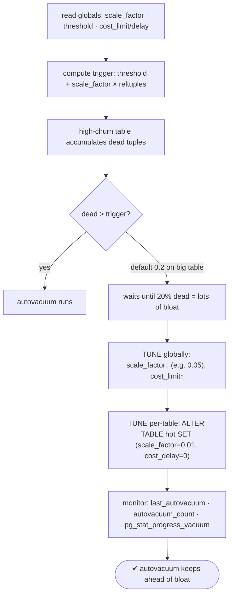
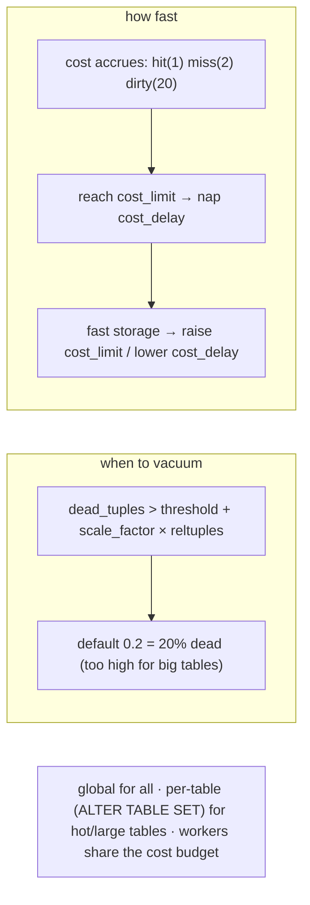

# Lab 59 — Tune Autovacuum Globally and Per-Table (`autovacuum_vacuum_scale_factor`, Cost Limits)

> **Track A · DBA · A8 Maintenance & Vacuum · Lab 2 of 7 (Lab 59/222)**
> Teaching package: concept → diagram → steps → verify → quick-ref → self-test → video script.
> **Depends on:** Labs 50 (stats), 53 (bloat), 58 (VACUUM). Makes routine VACUUM automatic and well-tuned.

---

## 0. Lab Card (at a glance)

| Field | Value |
|---|---|
| **Objective** | Understand the autovacuum trigger formula and cost throttling, then tune both globally and per-table so a hot table stays ahead of bloat. |
| **Success criterion** | You can compute when a table will autovacuum, lower the scale factor / raise cost limits, apply a per-table override, and observe autovacuum running sooner. |
| **Scope boundary** | Routine autovacuum tuning. Wraparound-freeze is Lab 60; the VACUUM/FULL mechanics were Lab 58. |
| **Prereqs** | Labs 50/53/58; a high-churn table |
| **Time** | 30–40 min |
| **Difficulty** | ★★★☆☆ |
| **Risk** | Low — reloadable/per-table settings; aggressive cost can raise I/O. |

---

## 1. Learning Objectives

1. **The trigger formula** — when autovacuum decides to vacuum.
2. **Why the default scale factor hurts big tables** — and lowering it.
3. **Cost-based throttling** — `cost_limit`/`cost_delay` and fast storage.
4. **Per-table overrides** — surgical tuning for hot tables.
5. **Monitor** — `pg_stat_user_tables`, `pg_stat_progress_vacuum`.

---

## 2. Concept Primer — the "why"

**Autovacuum keeps bloat and stats in check automatically.** The launcher periodically checks each table and dispatches a worker to VACUUM (and ANALYZE) when it's due — the routine VACUUM from Lab 58, run for you.

**The trigger formula (this is the lever).** A table becomes eligible for autovacuum when:
```
dead_tuples > autovacuum_vacuum_threshold + autovacuum_vacuum_scale_factor × reltuples
```
Defaults: `threshold=50`, `scale_factor=0.2` (20%). So a table is vacuumed only after **~20% of its rows are dead**. That's fine for small tables — but on a **100M-row table, 20% is 20M dead tuples** of accumulated bloat before autovacuum even starts. **The default scale factor is too high for large/high-churn tables.** Lower it — globally to something like `0.05`, or per-table to `0.01` on the biggest tables — so vacuum runs *more often* on *less* bloat. (ANALYZE has its own pair: `autovacuum_analyze_threshold`/`_scale_factor`, default 0.1.)

**Cost-based throttling (the "cost limits").** To avoid swamping I/O, autovacuum accumulates a **cost** as it works and **naps** when it hits a budget:
- Each page costs `vacuum_cost_page_hit` (1), `_miss` (2), `_dirty` (20).
- When cumulative cost reaches **`autovacuum_vacuum_cost_limit`** (effectively 200 by default), it sleeps **`autovacuum_vacuum_cost_delay`** (2 ms), then continues.
- **Higher `cost_limit` / lower `cost_delay` → autovacuum works faster** (more I/O, less throttling); the reverse is gentler but slower.

**On modern fast storage the defaults throttle too much** — autovacuum falls behind on high-write systems. Raise `autovacuum_vacuum_cost_limit` (e.g. 1000–2000) or drop `cost_delay` so it keeps up. *(Note: workers share the cost budget — raising `autovacuum_max_workers` without raising `cost_limit` just splits the same budget more ways.)*

**Per-table overrides — the surgical option.** Global settings hit every table. For one hot/huge table, use storage parameters:
```
ALTER TABLE big SET (autovacuum_vacuum_scale_factor = 0.01,
                     autovacuum_vacuum_cost_delay = 0);   -- aggressive, unthrottled
```
Small tables keep the gentle defaults; the hot table gets attention.

**Monitor:** `pg_stat_user_tables` (`last_autovacuum`, `autovacuum_count`, `n_dead_tup`, `n_mod_since_analyze`), `pg_stat_progress_vacuum` (live progress of a running vacuum), and `log_autovacuum_min_duration=0` (Lab 14) to log every autovacuum.

---

## 3. Diagrams

### 3.1 Understand → tune → monitor flow



### 3.2 Trigger + throttling



---

## 4. Prerequisites

```bash
sudo -u postgres psql -c "SHOW autovacuum; SHOW autovacuum_vacuum_scale_factor; SHOW autovacuum_vacuum_threshold;
                          SHOW autovacuum_vacuum_cost_limit; SHOW autovacuum_vacuum_cost_delay; SHOW autovacuum_max_workers;"
sudo -u postgres psql -c "ALTER SYSTEM SET log_autovacuum_min_duration='0'; SELECT pg_reload_conf();"   # log all autovacuums
```

---

## 5. Step-by-Step

### Step 1 — Compute the trigger for a table

```bash
sudo -u postgres psql -d benchdb -x -c "
SELECT relname, n_live_tup, n_dead_tup,
       (current_setting('autovacuum_vacuum_threshold')::int
        + current_setting('autovacuum_vacuum_scale_factor')::float * n_live_tup)::bigint AS vacuum_trigger_at
FROM pg_stat_user_tables WHERE relname='pgbench_accounts';"
#   autovacuum fires when n_dead_tup exceeds vacuum_trigger_at (≈ 20% of the table by default)
```

### Step 2 — Create a high-churn table and watch autovacuum lag at defaults

```bash
sudo -u postgres psql -d benchdb <<'SQL'
DROP TABLE IF EXISTS churn;
CREATE TABLE churn AS SELECT g AS id, 0 AS n FROM generate_series(1,200000) g;
SQL
# churn it, then check dead tuples vs the (default) trigger:
sudo -u postgres psql -d benchdb -c "UPDATE churn SET n=n+1;"    # 200k dead — well over threshold
sleep 5
sudo -u postgres psql -d benchdb -c "SELECT relname, n_dead_tup, last_autovacuum, autovacuum_count FROM pg_stat_user_tables WHERE relname='churn';"
```

### Step 3 — Tune GLOBALLY (lower scale factor, raise cost limit)

```bash
sudo -u postgres psql <<'SQL'
ALTER SYSTEM SET autovacuum_vacuum_scale_factor = 0.05;    -- vacuum at 5% dead (was 20%)
ALTER SYSTEM SET autovacuum_vacuum_cost_limit   = 1000;    -- less throttling (fast storage)
ALTER SYSTEM SET autovacuum_vacuum_cost_delay   = '2ms';
ALTER SYSTEM SET autovacuum_naptime             = '15s';   -- check more often
SELECT pg_reload_conf();
SQL
sudo -u postgres psql -c "SHOW autovacuum_vacuum_scale_factor; SHOW autovacuum_vacuum_cost_limit;"
```

### Step 4 — Tune PER-TABLE (aggressive for the hot table only)

```bash
sudo -u postgres psql -d benchdb -c "
ALTER TABLE churn SET (
  autovacuum_vacuum_scale_factor = 0.01,   -- 1% dead → vacuum
  autovacuum_vacuum_threshold    = 1000,
  autovacuum_vacuum_cost_delay   = 0        -- no throttle for this hot table
);"
sudo -u postgres psql -d benchdb -c "SELECT reloptions FROM pg_class WHERE relname='churn';"
```

### Step 5 — Force churn and watch autovacuum trigger sooner

```bash
sudo -u postgres psql -d benchdb -c "UPDATE churn SET n=n+1;"
sleep 20     # naptime is 15s now
sudo -u postgres psql -d benchdb -c "SELECT relname, n_dead_tup, last_autovacuum, autovacuum_count FROM pg_stat_user_tables WHERE relname='churn';"
#   autovacuum_count should increment; n_dead_tup drops
```

### Step 6 — Watch a vacuum in progress (if you catch one)

```bash
sudo -u postgres pgbench -c 8 -T 15 benchdb >/dev/null 2>&1 &
sudo -u postgres psql -x -c "SELECT relid::regclass, phase, heap_blks_scanned, heap_blks_total
                             FROM pg_stat_progress_vacuum;"
wait
```

### Step 7 — Reset per-table override when done

```bash
sudo -u postgres psql -d benchdb -c "ALTER TABLE churn RESET (autovacuum_vacuum_scale_factor, autovacuum_vacuum_threshold, autovacuum_vacuum_cost_delay);"
```

---

## 6. Verification Checklist

- [ ] Computed the vacuum trigger for a table
- [ ] Global `autovacuum_vacuum_scale_factor` lowered; cost limit raised
- [ ] Per-table override applied (`reloptions` shows it)
- [ ] After churn, `autovacuum_count` incremented and `n_dead_tup` dropped
- [ ] `log_autovacuum_min_duration=0` logs autovacuum runs
- [ ] (If caught) `pg_stat_progress_vacuum` showed a running vacuum
- [ ] Can explain why 0.2 scale factor is bad for large tables

---

## 7. Troubleshooting

| Symptom | Cause | Fix |
|---|---|---|
| Bloat grows despite autovacuum | `scale_factor` too high for a big table / too throttled | Lower per-table `scale_factor`; raise `cost_limit`; check for long transactions (Lab 53) |
| Autovacuum never runs on a table | Dead tuples below trigger / autovacuum off | Compare `n_dead_tup` to the trigger; ensure `autovacuum=on` |
| Autovacuum I/O spikes | Too aggressive (`cost_delay=0`) globally | Throttle globally; go aggressive only per-table |
| More workers didn't help | Workers share the cost budget | Raise `autovacuum_vacuum_cost_limit` too |
| Per-table setting seems ignored | Applies on the next autovacuum cycle | Wait a `naptime`; check `reloptions` |
| Insert-only table not vacuumed | — | PG13+ uses `autovacuum_vacuum_insert_threshold` |
| Stats stale (bad plans) | Analyze threshold | Tune `autovacuum_analyze_scale_factor` |

---

## 8. Quick Reference Card (paste-ready)

```sql
-- trigger:  dead_tuples > autovacuum_vacuum_threshold + autovacuum_vacuum_scale_factor × reltuples
--           (default 50 + 0.2×rows = 20% dead — TOO HIGH for big tables)

-- GLOBAL (reload): more frequent + less throttled (fast storage)
ALTER SYSTEM SET autovacuum_vacuum_scale_factor=0.05;
ALTER SYSTEM SET autovacuum_vacuum_cost_limit=1000;
ALTER SYSTEM SET autovacuum_vacuum_cost_delay='2ms';
ALTER SYSTEM SET autovacuum_naptime='15s';
SELECT pg_reload_conf();

-- PER-TABLE (surgical, for a hot/large table):
ALTER TABLE big SET (autovacuum_vacuum_scale_factor=0.01, autovacuum_vacuum_threshold=1000, autovacuum_vacuum_cost_delay=0);
ALTER TABLE big RESET (autovacuum_vacuum_scale_factor);   -- undo

-- monitor: pg_stat_user_tables(last_autovacuum,autovacuum_count,n_dead_tup) · pg_stat_progress_vacuum
-- workers share the cost budget · log_autovacuum_min_duration=0 to log every run
```

---

## 9. Self-Check

1. What triggers autovacuum on a table?
2. Why is the default `scale_factor` (0.2) a problem for large tables?
3. What do the cost limits control, and how do you make autovacuum faster on fast storage?
4. How do you make one hot table vacuum more aggressively without affecting others?
5. Why doesn't raising `autovacuum_max_workers` alone speed things up?
6. How do you monitor autovacuum activity and progress?

<details>
<summary>Answers</summary>

1. When `n_dead_tup > autovacuum_vacuum_threshold + autovacuum_vacuum_scale_factor × reltuples`.
2. 0.2 means ~20% of rows dead before vacuuming — on a huge table that's an enormous absolute amount of bloat; lower it.
3. I/O throttling — cost accrues per page and autovacuum naps `cost_delay` at `cost_limit`. Raise `cost_limit` / lower `cost_delay` to speed it up.
4. A per-table override: `ALTER TABLE t SET (autovacuum_vacuum_scale_factor=…, autovacuum_vacuum_cost_delay=0)`.
5. Workers **share** the cost budget, so more workers just split the same I/O allowance; raise `cost_limit` too.
6. `pg_stat_user_tables` (`last_autovacuum`/`autovacuum_count`/`n_dead_tup`), `pg_stat_progress_vacuum`, and `log_autovacuum_min_duration`.
</details>

---

## 10. Video / Teaching Script

| # | On screen | Say (narration) |
|---|---|---|
| 1 | Title: "Make autovacuum keep up" | "Autovacuum runs itself — but the defaults are cautious. On a big, busy table, they let bloat pile up. Let's fix that." |
| 2 | trigger formula | "Here's the rule: a table gets vacuumed when 20% of it is dead. For a hundred-million-row table, that's twenty million dead rows first. Way too much." |
| 3 | lower scale_factor | "So we lower the scale factor — vacuum at five percent, or one percent for the biggest tables." |
| 4 | cost limits | "And the throttle: autovacuum deliberately slows itself down. On SSDs that's too timid — raise the cost limit so it actually keeps pace." |
| 5 | per-table | "Best of all: tune just the hot table. Aggressive there, gentle everywhere else. One ALTER TABLE." |
| 6 | monitor | "Then watch it work — last autovacuum time, the count climbing, dead tuples dropping." |
| 7 | Outro | "Autovacuum tuned to your workload. Next: the one thing autovacuum absolutely must prevent — transaction ID wraparound." |

---

## 11. Glossary

- **Autovacuum** — the daemon that runs VACUUM/ANALYZE automatically.
- **`autovacuum_vacuum_scale_factor` / `_threshold`** — the trigger formula inputs.
- **Trigger** — `threshold + scale_factor × reltuples`.
- **Cost limits** — `autovacuum_vacuum_cost_limit`/`_delay` I/O throttling.
- **Per-table storage parameters** — `ALTER TABLE … SET (autovacuum_…)`.
- **`pg_stat_progress_vacuum`** — live vacuum progress.
- **Cost budget sharing** — workers split one cost allowance.

---
*NETAPORT lab series · PostgreSQL 17 on AlmaLinux 9 · Lab 59/222 · A8 Maintenance & Vacuum*
