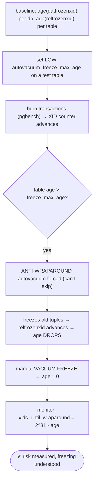

# Lab 60 — Simulate and Detect Transaction-ID Wraparound Risk; Read `datfrozenxid` / `age()`

> **Track A · DBA · A8 Maintenance & Vacuum · Lab 3 of 7 (Lab 60/222)**
> Teaching package: concept → diagram → steps → verify → quick-ref → self-test → video script.
> **Depends on:** Lab 59 (autovacuum). The failure autovacuum's freezing exists to prevent.

---

## 0. Lab Card (at a glance)

| Field | Value |
|---|---|
| **Objective** | Understand XID wraparound, measure risk with `age(datfrozenxid)`/`age(relfrozenxid)`, safely trigger anti-wraparound (freeze) autovacuum with a low `freeze_max_age`, and know the emergency behavior. |
| **Success criterion** | You can read wraparound age per database and table, watch freezing advance `relfrozenxid` (age drops), and explain the emergency shutdown and its #1 cause. |
| **Scope boundary** | Detection + freezing mechanics. General autovacuum tuning was Lab 59. |
| **Prereqs** | Lab 59; ability to burn transactions |
| **Time** | 30–45 min |
| **Difficulty** | ★★★★☆ |
| **Risk** | Low — the lab uses low thresholds and never reaches real wraparound. |

---

## 1. Learning Objectives

1. **Why wraparound happens** — 32-bit circular XIDs and MVCC visibility.
2. **Freezing** — how VACUUM prevents it; anti-wraparound autovacuum.
3. **Measure risk** — `age(datfrozenxid)` / `age(relfrozenxid)` and thresholds.
4. **The emergency** — the write-stopping shutdown, and recovery.
5. **The real cause** — what holds the xmin horizon.

---

## 2. Concept Primer — the "why"

**PostgreSQL 17 still uses 32-bit transaction IDs.** Every transaction gets an XID; the counter wraps after **~4.29 billion (2³²)**. MVCC visibility works by comparing XIDs: a row is visible if its inserting XID (`xmin`) is "in the past." But because XIDs are **circular**, "past" is relative — an XID more than **2³¹ (~2.1 billion)** ahead appears to be **in the past**. So if the XID counter advances that far past an old, **unfrozen** row's `xmin`, the row can suddenly look like it's from the **future** → become **invisible** → silent data loss/corruption. Wraparound is a real, catastrophic hazard.

**The defense: freezing.** VACUUM **freezes** old tuples — marks them (via a frozen flag / `FrozenTransactionId`) as **always in the past, always visible**, immune to the counter's position. Once frozen, a row's age no longer matters. So the whole game is: **keep freezing old rows before they get dangerously old.**

**The freeze ladder:**
- **`vacuum_freeze_min_age`** (default 50M) — a normal VACUUM freezes tuples older than this.
- **`autovacuum_freeze_max_age`** (default **200M**) — when a table's **age** (oldest unfrozen XID) exceeds this, an **anti-wraparound autovacuum** is forced — even on tables that otherwise wouldn't be vacuumed, **even if autovacuum is off**, and it **cannot be skipped**. This is the safety net.
- **~2.1 billion (the emergency limit)** — if freezing still falls behind and the oldest unfrozen XID nears wraparound, PostgreSQL **stops accepting new transactions cluster-wide**: *"database is not accepting commands to avoid wraparound data loss."* You then VACUUM (in single-user mode if needed) to freeze and recover. **This is a full write outage** — the DBA doomsday.

**Measuring risk:**
- Per database: `age(datfrozenxid)` from `pg_database` — how many XIDs old the oldest unfrozen row is. Watch it against 200M (anti-wraparound kicks in) and 2.1B (emergency).
- Per table: `age(relfrozenxid)` from `pg_class`.
- `xids_until_wraparound = 2^31 - age(datfrozenxid)`.
- *(A parallel counter exists for row-lock **MultiXacts** — monitor `age(datminmxid)` and `autovacuum_multixact_freeze_max_age` too.)*

**The #1 real-world cause of trouble.** Freezing can only advance the frozen horizon if there's no **older transaction** pinning it. Anything holding the **xmin horizon** back stops freezing: a **long-running / idle-in-transaction** session, a **stale/abandoned replication slot**, an **uncommitted prepared (2PC) transaction**, or a leftover snapshot. Autovacuum then *runs but can't freeze*, `age()` climbs, and you march toward the emergency. When wraparound age is rising and won't drop, **hunt for the oldest transaction/slot** first.

---

## 3. Diagrams

### 3.1 Detect + freeze flow



### 3.2 The XID circle + freeze ladder

```mermaid
flowchart LR
    subgraph XID [32-bit circular XID space (~4.29B)]
      P["past (visible)"] --> FUT["> 2^31 ahead → appears PAST → old unfrozen row becomes INVISIBLE ✗"]
    end
    FREEZE["freezing = always-visible (immune)"] -.protects.-> P
    subgraph LADDER [freeze ladder]
      L1["vacuum_freeze_min_age 50M (normal vacuum freezes)"]
      L2["autovacuum_freeze_max_age 200M (anti-wraparound, forced)"]
      L3["~2.1B → EMERGENCY: writes stop cluster-wide"]
      L1 --> L2 --> L3
    end
    note["age() = distance of oldest unfrozen XID · xmin horizon holders (long txn/slot/2PC) block freezing"]
```

---

## 4. Prerequisites

```bash
sudo -u postgres psql -c "SHOW autovacuum_freeze_max_age; SHOW vacuum_freeze_min_age;"
sudo -u postgres psql -d benchdb -c "SELECT txid_current();"   # current XID (advances the counter)
```

---

## 5. Step-by-Step

### Step 1 — Measure wraparound risk (per database)

```bash
sudo -u postgres psql -x -c "
SELECT datname,
       age(datfrozenxid) AS xid_age,
       (2^31)::bigint - age(datfrozenxid) AS xids_until_wraparound,
       round(100.0*age(datfrozenxid)/2147483648,4) AS pct_to_emergency
FROM pg_database ORDER BY age(datfrozenxid) DESC;"
```

### Step 2 — Per-table oldest frozen XID (the tables driving risk)

```bash
sudo -u postgres psql -d benchdb -c "
SELECT relname, age(relfrozenxid) AS xid_age
FROM pg_class WHERE relkind IN ('r','m','t') ORDER BY age(relfrozenxid) DESC LIMIT 10;"
```

### Step 3 — Create a test table with a LOW freeze_max_age (safe simulation)

```bash
sudo -u postgres psql -d benchdb <<'SQL'
DROP TABLE IF EXISTS wrap_demo;
CREATE TABLE wrap_demo AS SELECT g AS id FROM generate_series(1,1000) g;
-- force anti-wraparound vacuum after only ~150k XIDs of age (min is 100000):
ALTER TABLE wrap_demo SET (autovacuum_freeze_max_age = 150000);
SQL
sudo -u postgres psql -d benchdb -c "SELECT age(relfrozenxid) FROM pg_class WHERE relname='wrap_demo';"
```

### Step 4 — Burn transactions to age the table

```bash
# each pgbench write transaction consumes an XID; run enough to push age past 150k:
sudo -u postgres pgbench -c 4 -j 4 -t 40000 benchdb >/dev/null 2>&1     # ~160k transactions
sudo -u postgres psql -d benchdb -c "SELECT age(relfrozenxid) AS age_before_freeze FROM pg_class WHERE relname='wrap_demo';"
```

### Step 5 — Watch anti-wraparound autovacuum freeze it (age drops)

```bash
sleep 30    # give the autovacuum launcher a cycle (naptime)
sudo -u postgres psql -d benchdb -c "
SELECT relname, age(relfrozenxid) AS age_after, autovacuum_count, last_autovacuum
FROM pg_stat_user_tables t JOIN pg_class c ON c.relname=t.relname WHERE t.relname='wrap_demo';"
# check the log for the anti-wraparound run:
sudo grep -i "wrap_demo\|to prevent wraparound\|aggressive" /var/lib/pgsql/17/data/log/postgresql-$(date +%a).log | tail -3
```

### Step 6 — Manual VACUUM FREEZE resets age immediately

```bash
sudo -u postgres psql -d benchdb -c "VACUUM (FREEZE, VERBOSE) wrap_demo;"
sudo -u postgres psql -d benchdb -c "SELECT age(relfrozenxid) AS age_after_freeze FROM pg_class WHERE relname='wrap_demo';"   # ≈ small
```

### Step 7 — Check for xmin-horizon holders (the real cause of emergencies)

```bash
sudo -u postgres psql -c "
SELECT 'oldest backend xmin' AS src, backend_xmin::text AS val FROM pg_stat_activity WHERE backend_xmin IS NOT NULL ORDER BY age(backend_xmin) DESC LIMIT 1;"
sudo -u postgres psql -c "SELECT slot_name, age(xmin) AS slot_xmin_age FROM pg_replication_slots WHERE xmin IS NOT NULL;"   # stale slots block freezing
sudo -u postgres psql -c "SELECT gid, age(transaction::text::xid) FROM pg_prepared_xacts;" 2>/dev/null || true
```

---

## 6. Verification Checklist

- [ ] Read `age(datfrozenxid)` and `xids_until_wraparound` per database
- [ ] Read per-table `age(relfrozenxid)`
- [ ] Set a low `autovacuum_freeze_max_age` on the test table
- [ ] Burned transactions; table age rose past the threshold
- [ ] Anti-wraparound autovacuum froze it → age dropped
- [ ] `VACUUM FREEZE` reset the age immediately
- [ ] Checked for xmin-horizon holders (backends, slots, prepared xacts)

---

## 7. Troubleshooting

| Symptom | Cause | Fix |
|---|---|---|
| `age(datfrozenxid)` keeps climbing | Freezing blocked / autovacuum can't keep up | Find and end the xmin holder (long txn, stale slot, 2PC); tune autovacuum |
| "not accepting commands to avoid wraparound" | Reached the emergency limit | VACUUM the offending DB/tables (single-user: `postgres --single` if needed) |
| Anti-wraparound vacuum never runs | Age below `freeze_max_age` | Normal until the threshold; lower it to test |
| Freezing runs but age doesn't drop | An older transaction pins the horizon | End the oldest transaction / drop the stale slot |
| Emergency after "vacuum ran" | Vacuum couldn't freeze past the horizon | Remove the blocker, then vacuum |
| MultiXact wraparound warning | Row-lock counter aging | Monitor `age(datminmxid)`; freeze multixacts |
| Long VACUUM FREEZE | Full scan to freeze | Expected on big tables |

---

## 8. Quick Reference Card (paste-ready)

```sql
-- RISK per database:
SELECT datname, age(datfrozenxid) AS xid_age,
       (2^31)::bigint - age(datfrozenxid) AS xids_until_wraparound
FROM pg_database ORDER BY age(datfrozenxid) DESC;

-- per table:
SELECT relname, age(relfrozenxid) FROM pg_class WHERE relkind IN ('r','m','t') ORDER BY 2 DESC LIMIT 10;

-- freeze it: VACUUM (FREEZE) t;   (or force anti-wraparound test: ALTER TABLE t SET (autovacuum_freeze_max_age=150000))

-- find xmin-horizon HOLDERS (the real cause of wraparound emergencies):
SELECT pid, age(backend_xmin) FROM pg_stat_activity WHERE backend_xmin IS NOT NULL ORDER BY 2 DESC;
SELECT slot_name, age(xmin) FROM pg_replication_slots WHERE xmin IS NOT NULL;   -- stale slots
SELECT gid FROM pg_prepared_xacts;                                              -- abandoned 2PC

-- ladder: vacuum_freeze_min_age 50M → autovacuum_freeze_max_age 200M (forced) → ~2.1B EMERGENCY (writes stop)
-- PG17 = 32-bit XIDs · freezing = always-visible · watch age vs 200M and 2^31
```

---

## 9. Self-Check

1. Why does XID wraparound threaten correctness?
2. What prevents it, and what forces it when a table gets too old?
3. How do you measure wraparound risk per database and per table?
4. What is `autovacuum_freeze_max_age`'s role?
5. What happens at the emergency limit, and how do you recover?
6. What's the #1 real-world reason freezing can't keep up?

<details>
<summary>Answers</summary>

1. XIDs are 32-bit and circular; an old **unfrozen** row's `xmin` can appear to be in the future once the counter advances past 2³¹, making the row invisible — corruption.
2. **Freezing** (VACUUM marks rows always-visible); an **anti-wraparound autovacuum** is forced when a table's age exceeds `autovacuum_freeze_max_age` (200M) and cannot be skipped.
3. `age(datfrozenxid)` from `pg_database`; `age(relfrozenxid)` from `pg_class`; compare to 200M and 2³¹.
4. The age at which a forced anti-wraparound autovacuum runs to freeze the table.
5. PostgreSQL **stops accepting new transactions** cluster-wide; recover by VACUUMing the offending database/tables (single-user mode if it won't start normally).
6. Something holding the **xmin horizon** — a long/idle-in-transaction session, a stale replication slot, or an abandoned prepared (2PC) transaction — which blocks freezing.
</details>

---

## 10. Video / Teaching Script

| # | On screen | Say (narration) |
|---|---|---|
| 1 | Title: "The 4-billion-transaction cliff" | "PostgreSQL counts transactions in 32 bits. Run out, and old rows vanish into the future. This is the failure autovacuum exists to prevent." |
| 2 | age(datfrozenxid) | "Here's your risk gauge: how many transactions old the oldest unfrozen row is. Watch it against 200 million and 2.1 billion." |
| 3 | freezing concept | "The fix is freezing — marking old rows 'always visible,' immune to the counter. VACUUM does this constantly." |
| 4 | low freeze_max_age + burn | "Let's trigger it safely: a tiny freeze threshold, burn some transactions, and…" |
| 5 | anti-wraparound vacuum | "…there — a forced anti-wraparound vacuum. It can't be skipped. It freezes the table and the age drops." |
| 6 | the emergency | "Ignore it long enough and PostgreSQL stops accepting writes — everywhere. Recovery means vacuuming, sometimes in single-user mode." |
| 7 | the real cause | "And the real killer: a forgotten open transaction or a dead replication slot pins the horizon, so freezing *can't* advance. When age climbs and won't fall — hunt the oldest transaction." |
| 8 | Outro | "Wraparound: understood, measured, avoided. Next: rebuilding bloated indexes online with REINDEX CONCURRENTLY." |

---

## 11. Glossary

- **Transaction ID (XID)** — 32-bit per-transaction id; wraps at ~4.29B.
- **Wraparound** — the counter cycling past old unfrozen rows → invisibility.
- **Freezing / `VACUUM FREEZE`** — mark rows always-visible.
- **`datfrozenxid` / `relfrozenxid` / `age()`** — frozen horizons and their age.
- **`autovacuum_freeze_max_age`** — forces anti-wraparound autovacuum (200M).
- **Emergency shutdown** — writes stop cluster-wide near 2³¹.
- **xmin horizon** — oldest transaction pinning freezing (the real blocker).

---
*NETAPORT lab series · PostgreSQL 17 on AlmaLinux 9 · Lab 60/222 · A8 Maintenance & Vacuum*
