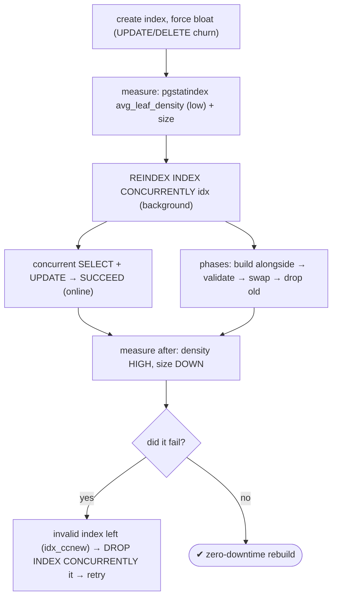
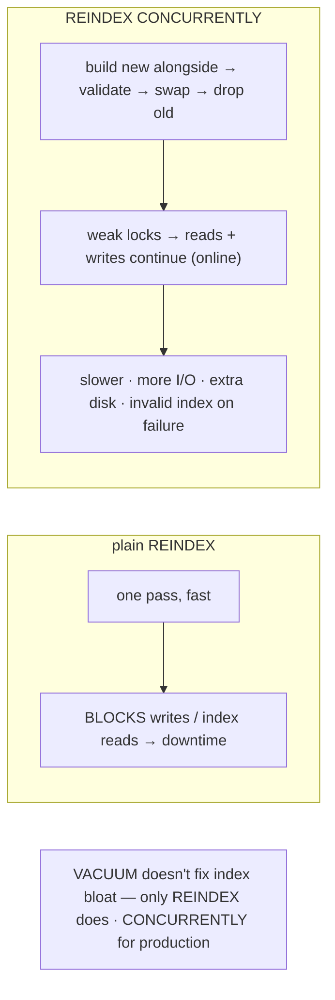

# Lab 61 — `REINDEX CONCURRENTLY` a Bloated Index with Zero Downtime

> **Track A · DBA · A8 Maintenance & Vacuum · Lab 4 of 7 (Lab 61/222)**
> Teaching package: concept → diagram → steps → verify → quick-ref → self-test → video script.
> **Depends on:** Lab 53 (index bloat / `pgstatindex`), Lab 52 (locks), Lab 58 (VACUUM).

---

## 0. Lab Card (at a glance)

| Field | Value |
|---|---|
| **Objective** | Force index bloat, rebuild the index with `REINDEX CONCURRENTLY` while reads and writes continue, and compare to plain `REINDEX`'s locking. |
| **Success criterion** | The index shrinks / density improves; concurrent SELECT and UPDATE succeed during `REINDEX CONCURRENTLY`; you can detect and clean up an invalid leftover index. |
| **Scope boundary** | Online index rebuild. Online table shrink is `pg_repack` (Lab 62); fillfactor/HOT is Lab 205. |
| **Prereqs** | Lab 53; two sessions to show concurrency |
| **Time** | 25–35 min |
| **Difficulty** | ★★★☆☆ |
| **Risk** | Low — online; needs extra disk for the duplicate index. |

---

## 1. Learning Objectives

1. **Index bloat** — why it happens; detect with `pgstatindex`.
2. **Plain vs CONCURRENTLY** — the lock/downtime difference.
3. **How CONCURRENTLY works** — build-alongside, validate, swap, drop.
4. **The invalid-index caveat** — cleanup after a failure.
5. **Trade-offs** — slower, more I/O, extra disk.

---

## 2. Concept Primer — the "why"

**Indexes bloat too.** After many updates and deletes, a B-tree's leaf pages go **sparse and fragmented** — `avg_leaf_density` drops (Lab 53). A bloated index wastes disk and slows scans (more pages to traverse for the same data). **VACUUM doesn't fix this** — it reclaims table dead space but doesn't compact the index. Only a **REINDEX** rebuilds the index tightly.

**Plain `REINDEX` — fast but blocking.** `REINDEX INDEX idx;` rebuilds the index in one pass, but it takes strong locks: it **blocks writes** to the table (and reads that use the index) for the whole rebuild. On a busy table that's **downtime**.

**`REINDEX CONCURRENTLY` (PG12+) — online.** It rebuilds **without** the strong lock, so reads *and* writes continue. Internally it works in phases (like `CREATE INDEX CONCURRENTLY`):
1. **Build** a new index alongside the old one.
2. **Validate** it, waiting for concurrent transactions to see all rows.
3. **Swap** the new index in and **drop** the old.
Throughout, it holds only brief `SHARE UPDATE EXCLUSIVE` locks — **non-blocking** for DML. That's the near-zero-downtime rebuild.

**The costs of CONCURRENTLY:** it's **slower** (multiple passes, and it **waits** for long-running transactions to finish before completing), uses more CPU/I/O, and needs **extra disk** (both the old and new index exist at once).

**The caveat that bites — invalid leftover indexes.** If `REINDEX CONCURRENTLY` **fails midway** (error, cancellation, crash), it can leave behind an **invalid** new index (named like `idx_ccnew`). Invalid indexes take space and aren't used for queries but *are* maintained on writes. You must detect and drop them:
```
SELECT indexrelid::regclass FROM pg_index WHERE NOT indisvalid;   -- find them
DROP INDEX CONCURRENTLY <invalid_index>;                          -- clean up
```
Then retry the reindex.

**Other limits:** can't reindex **system catalogs** concurrently (use plain REINDEX in a window); can't run inside a transaction block; on partitioned tables it reindexes each partition.

---

## 3. Diagrams

### 3.1 Rebuild online flow



### 3.2 Plain vs CONCURRENTLY



---

## 4. Prerequisites

```bash
sudo -u postgres psql -d benchdb -c "CREATE EXTENSION IF NOT EXISTS pgstattuple;"
```

---

## 5. Step-by-Step

### Step 1 — Create a table + index and force index bloat

```bash
sudo -u postgres psql -d benchdb <<'SQL'
DROP TABLE IF EXISTS idx_demo;
CREATE TABLE idx_demo AS SELECT g AS id, md5(g::text) AS v FROM generate_series(1,500000) g;
CREATE INDEX idx_demo_v ON idx_demo(v);
-- churn to bloat the index:
UPDATE idx_demo SET v = md5(random()::text);
UPDATE idx_demo SET v = md5(random()::text);
DELETE FROM idx_demo WHERE id % 3 = 0;
VACUUM idx_demo;    -- reclaims table dead space but NOT index compaction
SQL
```

### Step 2 — Measure index bloat

```bash
sudo -u postgres psql -d benchdb -c "SELECT pg_size_pretty(pg_relation_size('idx_demo_v')) AS index_size_before;"
sudo -u postgres psql -d benchdb -x -c "SELECT avg_leaf_density, leaf_fragmentation FROM pgstatindex('idx_demo_v');"
#   low avg_leaf_density / high fragmentation = bloated
```

### Step 3 — REINDEX CONCURRENTLY while running concurrent traffic

```bash
# background: rebuild online
sudo -u postgres psql -d benchdb -c "REINDEX INDEX CONCURRENTLY idx_demo_v;" &
sleep 1
# concurrent reads AND writes on the SAME table — they succeed (no downtime):
sudo -u postgres psql -d benchdb -c "SELECT count(*) FROM idx_demo WHERE v LIKE 'a%'; UPDATE idx_demo SET v='new' WHERE id=1;"
# what lock does it hold? (weak, not AccessExclusive):
sudo -u postgres psql -c "SELECT mode FROM pg_locks WHERE relation='idx_demo'::regclass AND mode LIKE '%Update%';"   # ShareUpdateExclusiveLock
wait
```

### Step 4 — Measure after (compacted)

```bash
sudo -u postgres psql -d benchdb -c "SELECT pg_size_pretty(pg_relation_size('idx_demo_v')) AS index_size_after;"      # smaller
sudo -u postgres psql -d benchdb -x -c "SELECT avg_leaf_density, leaf_fragmentation FROM pgstatindex('idx_demo_v');"  # density HIGH
```

### Step 5 — Contrast: plain REINDEX blocks writes

```bash
# start a plain REINDEX in the background, then try to write → it blocks:
sudo -u postgres psql -d benchdb -c "REINDEX INDEX idx_demo_v;" &
sleep 1
timeout 6 sudo -u postgres psql -d benchdb -c "UPDATE idx_demo SET v='y' WHERE id=2;"; echo "exit $? (124 = blocked by plain REINDEX)"
wait
```

### Step 6 — Detect and clean up any invalid index

```bash
sudo -u postgres psql -d benchdb -c "SELECT indexrelid::regclass AS invalid_index FROM pg_index WHERE NOT indisvalid;"
# if any 'idx_ccnew' style invalid index exists after a failed run:
#   sudo -u postgres psql -d benchdb -c "DROP INDEX CONCURRENTLY <invalid_index>;"
```

---

## 6. Verification Checklist

- [ ] Index bloated (low `avg_leaf_density`)
- [ ] `REINDEX CONCURRENTLY` completed; index smaller / density improved
- [ ] Concurrent SELECT **and** UPDATE succeeded during CONCURRENTLY
- [ ] CONCURRENTLY held only `ShareUpdateExclusiveLock`
- [ ] Plain `REINDEX` **blocked** a concurrent write
- [ ] Checked for invalid leftover indexes (`NOT indisvalid`)
- [ ] You can explain why VACUUM doesn't fix index bloat

---

## 7. Troubleshooting

| Symptom | Cause | Fix |
|---|---|---|
| Leftover `idx_ccnew` after failure | CONCURRENTLY failed midway | `DROP INDEX CONCURRENTLY <invalid>`; retry |
| CONCURRENTLY very slow / hangs | Waits for long-running transactions | End the long transaction; expected multi-pass cost |
| Out of disk during reindex | Both indexes coexist | Free space; ensure room for a duplicate index |
| Can't reindex a catalog concurrently | Not supported | Plain `REINDEX` in a maintenance window |
| Plain REINDEX blocked writes | Strong lock | Use `CONCURRENTLY` for online |
| Index still bloated after VACUUM | VACUUM doesn't rebuild indexes | `REINDEX [CONCURRENTLY]` |
| Repeated re-bloat | Heavy updates | Tune `fillfactor`/HOT (Lab 205) |

---

## 8. Quick Reference Card (paste-ready)

```sql
-- detect index bloat:
SELECT avg_leaf_density, leaf_fragmentation FROM pgstatindex('idx_demo_v');   -- low density = bloat

-- ONLINE rebuild (reads + writes continue):
REINDEX INDEX CONCURRENTLY idx_demo_v;      -- or: REINDEX TABLE CONCURRENTLY t;
--   lock: ShareUpdateExclusiveLock · slower · extra disk (duplicate index)

-- plain (BLOCKS writes — downtime): REINDEX INDEX idx_demo_v;

-- after a FAILED CONCURRENTLY — clean up the invalid index:
SELECT indexrelid::regclass FROM pg_index WHERE NOT indisvalid;
DROP INDEX CONCURRENTLY <invalid_index>;

-- VACUUM does NOT compact indexes — only REINDEX does · catalogs: plain REINDEX only
```

---

## 9. Self-Check

1. What causes index bloat, and how do you detect it?
2. What's the lock difference between plain `REINDEX` and `REINDEX CONCURRENTLY`?
3. How does `REINDEX CONCURRENTLY` work internally?
4. What happens if `REINDEX CONCURRENTLY` fails, and how do you fix it?
5. What are the costs of CONCURRENTLY?
6. Does VACUUM fix index bloat?

<details>
<summary>Answers</summary>

1. Sparse/fragmented B-tree pages from many updates/deletes; detect with `pgstatindex` (`avg_leaf_density` low).
2. Plain `REINDEX` blocks writes (and index reads) — downtime; `CONCURRENTLY` holds only weak locks so reads and writes continue.
3. It builds a new index alongside the old, validates it, swaps it in, and drops the old — in phases, waiting for concurrent transactions.
4. It can leave an **invalid** index; find it (`NOT indisvalid`), `DROP INDEX CONCURRENTLY` it, and retry.
5. Slower, more CPU/I/O, and **extra disk** (both indexes exist at once).
6. **No** — VACUUM doesn't compact indexes; only `REINDEX` does.
</details>

---

## 10. Video / Teaching Script

| # | On screen | Say (narration) |
|---|---|---|
| 1 | Title: "Rebuild a bloated index — without downtime" | "Indexes bloat too. And VACUUM won't fix them — only a rebuild will. The trick is rebuilding *while the app keeps running*." |
| 2 | measure bloat | "Here's a bloated index — low leaf density. It's fat and slow." |
| 3 | REINDEX CONCURRENTLY + concurrent traffic | "Rebuild it concurrently — and watch: I read and write the same table the whole time. No blocking." |
| 4 | after: compacted | "Result: smaller, dense index. Done, with zero downtime." |
| 5 | plain REINDEX blocks | "Compare the plain version — try to write, and you wait. That's the downtime concurrently avoids." |
| 6 | invalid index cleanup | "One warning: if concurrently fails, it leaves an invalid index behind. Find it, drop it, retry — don't leave it lurking." |
| 7 | Outro | "Online index rebuilds, standard practice. Next: pg_repack — the same idea for whole tables." |

---

## 11. Glossary

- **Index bloat** — sparse/fragmented index pages (low `avg_leaf_density`).
- **REINDEX** — rebuild an index compactly (plain = blocks writes).
- **`REINDEX CONCURRENTLY`** — online rebuild (weak locks).
- **Phases** — build alongside → validate → swap → drop old.
- **Invalid index / `indisvalid`** — leftover from a failed concurrent build.
- **`DROP INDEX CONCURRENTLY`** — remove an index without blocking.

---
*NETAPORT lab series · PostgreSQL 17 on AlmaLinux 9 · Lab 61/222 · A8 Maintenance & Vacuum*
