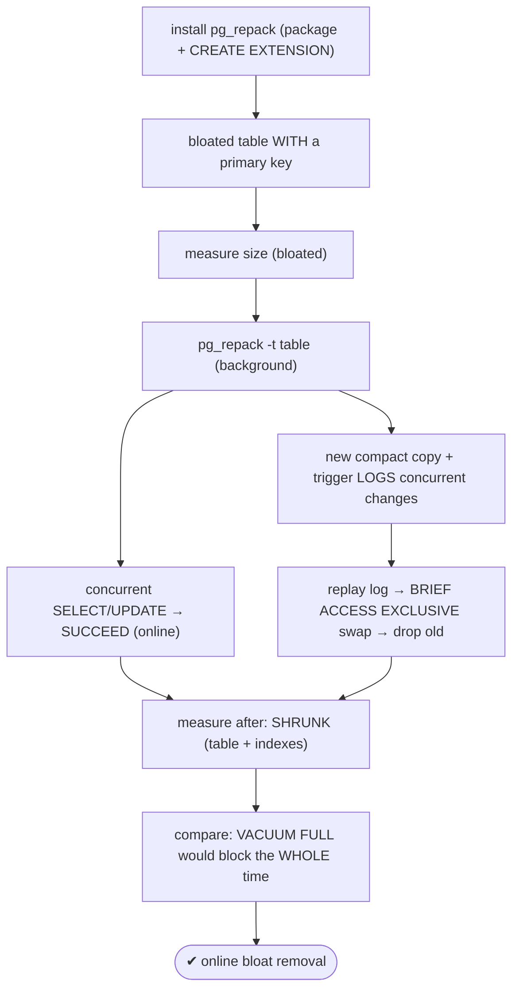
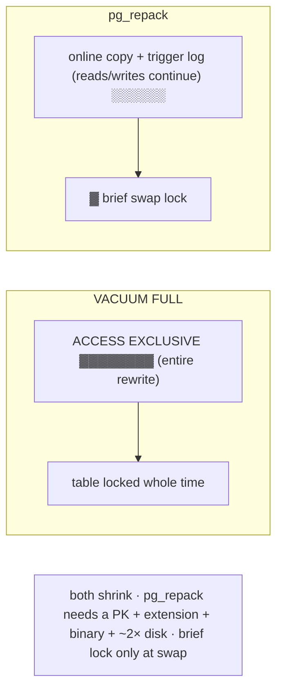

# Lab 62 — `pg_repack` to Remove Bloat Online; Compare to `VACUUM FULL`

> **Track A · DBA · A8 Maintenance & Vacuum · Lab 5 of 7 (Lab 62/222)**
> Teaching package: concept → diagram → steps → verify → quick-ref → self-test → video script.
> **Depends on:** Lab 58 (VACUUM FULL), Lab 53 (bloat), Lab 61 (online index rebuild).

---

## 0. Lab Card (at a glance)

| Field | Value |
|---|---|
| **Objective** | Remove table bloat online with `pg_repack` — reclaiming disk like `VACUUM FULL` but without its full-duration exclusive lock — and compare the two. |
| **Success criterion** | The table shrinks; reads and writes continue during `pg_repack` (brief lock only at the swap); you can articulate the difference vs `VACUUM FULL`. |
| **Scope boundary** | Online table reorg. Online *index* rebuild was Lab 61; VACUUM/FULL mechanics Lab 58. |
| **Prereqs** | Labs 58/53; the `pg_repack` package; a table with a PK |
| **Time** | 30–40 min |
| **Difficulty** | ★★★☆☆ |
| **Risk** | Medium — needs ~2× disk; may cancel blocking queries at the swap. |

---

## 1. Learning Objectives

1. **What pg_repack does** — online table+index shrink.
2. **How it stays online** — copy + trigger log + brief swap.
3. **vs VACUUM FULL** — lock duration and downtime.
4. **Its requirements** — a PK/unique index, extension + binary, ~2× disk.
5. **When to use which** — and vs REINDEX CONCURRENTLY.

---

## 2. Concept Primer — the "why"

**`VACUUM FULL` shrinks — but blocks (Lab 58).** It rewrites the table to return space to the OS, holding `ACCESS EXCLUSIVE` for the **entire** operation — the table is fully locked, reads and writes stopped, for however long the rewrite takes. Unacceptable for a busy production table.

**`pg_repack` shrinks — online.** It's an extension + client tool that reorganizes (de-bloats) tables and indexes **without** the full-duration lock:
1. Creates a **new, compact copy** of the table.
2. Installs a **trigger** on the original that **logs** all concurrent INSERT/UPDATE/DELETE into a change-log table.
3. Copies live rows into the new table, then **replays** the logged changes onto it.
4. Takes a **brief** `ACCESS EXCLUSIVE` lock **only at the final swap** — renaming the new table/indexes in for the old — then drops the old. That momentary lock is a fraction of a second, not the whole rebuild.

Result: the table **and its indexes shrink** (space returned to the OS), just like `VACUUM FULL`, but with **near-zero downtime**.

**VACUUM FULL vs pg_repack:**

| | `VACUUM FULL` | `pg_repack` |
|---|---|---|
| Lock | `ACCESS EXCLUSIVE`, **whole operation** | `ACCESS EXCLUSIVE`, **brief (swap only)** |
| Downtime | full | near-zero (online) |
| Shrinks table + indexes | ✓ | ✓ |
| Extra disk | ~2× | ~2× (copy + log) |
| Built-in | ✓ (core) | ✗ (extension + binary) |
| Requires | nothing | **a PRIMARY KEY / unique NOT NULL index** |

**The requirement that trips people first:** pg_repack needs the table to have a **primary key or a unique NOT NULL index** — it uses it to identify rows when replaying the change log. Tables without one **can't** be repacked (as a full-table reorg). It also needs the **extension** (`CREATE EXTENSION pg_repack`) *and* the matching **client binary** (versions must align), ~2× disk, and superuser-level privileges. During the repack the trigger adds slight write overhead, and at the swap it **waits for (and may cancel) blocking queries** to grab the brief lock (`-T` timeout controls the wait).

**pg_repack vs REINDEX CONCURRENTLY (Lab 61):** REINDEX CONCURRENTLY rebuilds **indexes** online (built-in, no extension). pg_repack rebuilds the **whole table (heap) + indexes** online. For **table** bloat → pg_repack; for just **index** bloat → REINDEX CONCURRENTLY. (pg_repack `--only-indexes` can do indexes too, but the built-in is simpler for that.)

---

## 3. Diagrams

### 3.1 Repack online flow



### 3.2 Lock duration contrast



---

## 4. Prerequisites

```bash
sudo dnf install -y pg_repack_17 2>/dev/null || sudo dnf install -y pg_repack     # PGDG name may vary
sudo -u postgres psql -d benchdb -c "CREATE EXTENSION IF NOT EXISTS pg_repack;"
pg_repack --version
```

---

## 5. Step-by-Step

### Step 1 — Create a bloated table WITH a primary key (required)

```bash
sudo -u postgres psql -d benchdb <<'SQL'
DROP TABLE IF EXISTS repack_demo;
CREATE TABLE repack_demo (id int PRIMARY KEY, v text);        -- PK is REQUIRED by pg_repack
INSERT INTO repack_demo SELECT g, md5(g::text) FROM generate_series(1,500000) g;
UPDATE repack_demo SET v = md5(random()::text);
UPDATE repack_demo SET v = md5(random()::text);
DELETE FROM repack_demo WHERE id % 3 = 0;
VACUUM repack_demo;    -- reclaims for reuse, file NOT shrunk (Lab 58)
SQL
sudo -u postgres psql -d benchdb -c "SELECT pg_size_pretty(pg_total_relation_size('repack_demo')) AS size_before;"
```

### Step 2 — Repack online, with concurrent traffic

```bash
# background: pg_repack the table
sudo -u postgres pg_repack -d benchdb -t repack_demo &
sleep 1
# concurrent reads AND writes during the repack — they succeed (online):
sudo -u postgres psql -d benchdb -c "SELECT count(*) FROM repack_demo; UPDATE repack_demo SET v='x' WHERE id=1;"
# the source table's locks during repack are weak until the brief swap:
sudo -u postgres psql -c "SELECT mode, granted FROM pg_locks WHERE relation='repack_demo'::regclass;" | head
wait
```

### Step 3 — Measure after (shrunk, like VACUUM FULL)

```bash
sudo -u postgres psql -d benchdb -c "SELECT pg_size_pretty(pg_total_relation_size('repack_demo')) AS size_after;"   # smaller
```

### Step 4 — Contrast: VACUUM FULL blocks the whole time

```bash
# re-bloat then VACUUM FULL, and try a concurrent read → it BLOCKS the entire operation:
sudo -u postgres psql -d benchdb -c "UPDATE repack_demo SET v=md5(random()::text);"
sudo -u postgres psql -d benchdb -c "VACUUM FULL repack_demo;" &
sleep 1
timeout 6 sudo -u postgres psql -d benchdb -c "SELECT count(*) FROM repack_demo;"; echo "exit $? (124 = blocked by VACUUM FULL)"
wait
```

### Step 5 — (Only indexes) pg_repack can also repack indexes online

```bash
# alternative to REINDEX CONCURRENTLY (Lab 61) for index bloat:
sudo -u postgres pg_repack -d benchdb -t repack_demo --only-indexes
```

### Step 6 — Cleanup after an interrupted run (if needed)

```bash
# pg_repack leaves objects in the 'repack' schema if interrupted; it cleans up on rerun, or:
sudo -u postgres psql -d benchdb -c "SELECT nspname FROM pg_namespace WHERE nspname='repack';"
# (rerun pg_repack, or drop stray repack.* objects/triggers if it fails to clean up)
```

---

## 6. Verification Checklist

- [ ] `pg_repack` extension + matching binary installed
- [ ] Table has a primary key (repack requirement)
- [ ] During `pg_repack`: concurrent SELECT **and** UPDATE succeed
- [ ] Table size **shrinks** after repack
- [ ] `VACUUM FULL` **blocked** a concurrent read the whole time
- [ ] (Optional) `--only-indexes` repacked indexes online
- [ ] You can state the lock-duration difference

---

## 7. Troubleshooting

| Symptom | Cause | Fix |
|---|---|---|
| "table has no primary key or unique index" | pg_repack needs one | Add a PK / unique NOT NULL index |
| Extension not found | Not installed | `CREATE EXTENSION pg_repack`; install `pg_repack_17` |
| Version mismatch (binary vs extension) | Different versions | Install matching binary + extension |
| Out of disk | Needs ~2× table | Free space |
| Blocking queries cancelled at swap | pg_repack takes the brief lock | Expected; use `-T <secs>` to wait; schedule off-peak |
| Interrupted → leftover `repack.*` objects | Aborted run | Rerun pg_repack (it cleans up), or drop stray objects |
| Can't repack catalogs/temp tables | Not supported | Use VACUUM FULL in a window for those |

---

## 8. Quick Reference Card (paste-ready)

```bash
sudo dnf install -y pg_repack_17
sudo -u postgres psql -d benchdb -c "CREATE EXTENSION IF NOT EXISTS pg_repack;"   # + table needs a PK

# ONLINE shrink (reads/writes continue; brief lock only at swap):
sudo -u postgres pg_repack -d benchdb -t mytable
sudo -u postgres pg_repack -d benchdb                 # all eligible tables
sudo -u postgres pg_repack -d benchdb -t mytable --only-indexes   # indexes only (vs REINDEX CONCURRENTLY)
#   -j N parallel index builds · -T secs lock-wait timeout · --order-by like CLUSTER · --dry-run

# vs VACUUM FULL: same shrink, but VACUUM FULL locks the table the ENTIRE time (downtime)
# requires: PK/unique index + extension + matching binary + ~2× disk · brief ACCESS EXCLUSIVE at swap
```

---

## 9. Self-Check

1. What does `pg_repack` do, and how does it differ from `VACUUM FULL`?
2. How does `pg_repack` stay online?
3. What requirement does `pg_repack` have that `VACUUM FULL` doesn't?
4. When does `pg_repack` take an exclusive lock?
5. `pg_repack` vs `REINDEX CONCURRENTLY` — which for what?
6. How much extra disk does `pg_repack` need?

<details>
<summary>Answers</summary>

1. Both shrink the table and indexes; `pg_repack` does it **online** (brief lock only at the final swap), whereas `VACUUM FULL` holds `ACCESS EXCLUSIVE` for the entire operation.
2. It builds a compact copy, logs concurrent changes via a trigger, replays them onto the copy, and swaps it in under a brief lock.
3. A **primary key or unique NOT NULL index** (to replay the change log) — plus the extension and matching client binary.
4. Only at the **final swap** (renaming the new table/indexes in), for a fraction of a second.
5. `pg_repack` for **table** bloat (heap + indexes); `REINDEX CONCURRENTLY` for **index** bloat (built-in).
6. About **2×** the table size (the compact copy plus the change log).
</details>

---

## 10. Video / Teaching Script

| # | On screen | Say (narration) |
|---|---|---|
| 1 | Title: "Shrink a table — without locking it" | "VACUUM FULL reclaims disk, but it locks the table the whole time. pg_repack does the same shrink — online." |
| 2 | install + PK note | "It's an extension plus a tool. And one hard requirement: the table needs a primary key." |
| 3 | pg_repack + concurrent traffic | "Repack the bloated table — and watch: I read and write it the entire time. It's copying behind the scenes." |
| 4 | shrunk | "Result: smaller table and indexes, space back to the OS — just like VACUUM FULL." |
| 5 | VACUUM FULL blocks | "Now the contrast: VACUUM FULL the same table, and a simple read *waits* — the whole rebuild. That's the downtime pg_repack avoids." |
| 6 | brief swap lock | "The one moment pg_repack does lock is the final swap — a fraction of a second, not minutes." |
| 7 | Outro | "Online bloat removal for whole tables. Next: scheduling all this maintenance with systemd timers." |

---

## 11. Glossary

- **pg_repack** — extension/tool for online table+index de-bloat.
- **Trigger log** — records concurrent changes during the copy for replay.
- **Brief swap lock** — the momentary `ACCESS EXCLUSIVE` at the end.
- **VACUUM FULL** — core in-place rewrite; locks the whole time.
- **PK requirement** — a primary/unique index pg_repack needs.
- **`--only-indexes`** — repack indexes only (vs REINDEX CONCURRENTLY).

---
*NETAPORT lab series · PostgreSQL 17 on AlmaLinux 9 · Lab 62/222 · A8 Maintenance & Vacuum*
