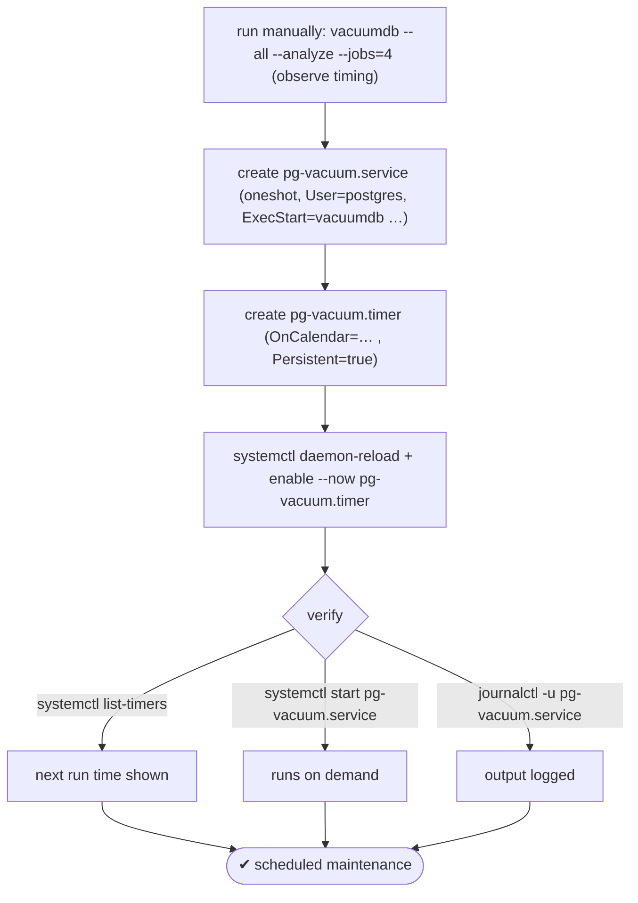
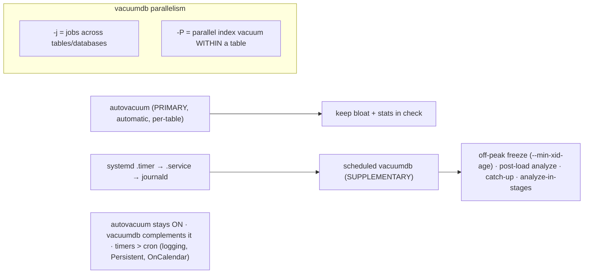

# Lab 63 — Schedule Maintenance with `vacuumdb --all --analyze --jobs`; Wire It into a systemd Timer

> **Track A · DBA · A8 Maintenance & Vacuum · Lab 6 of 7 (Lab 63/222)**
> Teaching package: concept → diagram → steps → verify → quick-ref → self-test → video script.
> **Depends on:** Labs 59 (autovacuum), 60 (wraparound). **Related:** Lab 130 (systemd timers for backups).

---

## 0. Lab Card (at a glance)

| Field | Value |
|---|---|
| **Objective** | Run `vacuumdb --all --analyze --jobs` for parallel cluster maintenance, then schedule it with a systemd `.service` + `.timer` (no cron). |
| **Success criterion** | The command runs in parallel; a systemd timer is enabled, shows a next-run time, executes on demand, and logs to journald. |
| **Scope boundary** | Scheduled supplementary maintenance. Autovacuum tuning was Lab 59; corruption checks are Lab 64. |
| **Prereqs** | Labs 59/60; a cluster; systemd |
| **Time** | 20–30 min |
| **Difficulty** | ★★☆☆☆ |
| **Risk** | Low — read-mostly maintenance; avoid `--full` in unattended jobs. |

---

## 1. Learning Objectives

1. **`vacuumdb`** — the CLI wrapper and its parallel `--jobs`.
2. **Why schedule it** — supplementing (not replacing) autovacuum.
3. **Targeted sweeps** — `--min-xid-age`, `--analyze-in-stages`.
4. **systemd timers** — `.service` + `.timer`, `OnCalendar`.
5. **Verify** — `list-timers`, manual run, journald logs.

---

## 2. Concept Primer — the "why"

**`vacuumdb` runs VACUUM/ANALYZE from the shell** — scriptable and cron/timer-friendly. Key options:
- `-a`/`--all` — every database in the cluster.
- `-z`/`--analyze` — also refresh statistics; `-Z`/`--analyze-only` — stats only.
- `-j N`/`--jobs=N` — **N parallel jobs across tables/databases** (each a connection) — faster on multi-core clusters. *(Distinct from `-P`/`--parallel`, which parallelizes index vacuuming **within** a single table.)*
- `--min-xid-age` / `--min-mxid-age` — vacuum only tables whose XID/MXID **age** exceeds a threshold — a **targeted anti-wraparound sweep** (Lab 60).
- `--analyze-in-stages` — build stats in three progressive passes (quick usable stats first) — ideal **after a restore/upgrade**.
- `-f`/`--full` — VACUUM FULL (blocks — avoid in unattended schedules).

**It does NOT replace autovacuum.** Autovacuum (Lab 59) is the **primary, automatic** mechanism and must stay on. Scheduled `vacuumdb` is **supplementary**, for specific goals:
- an **off-peak targeted freeze** (`--min-xid-age`) so aging tables get frozen during quiet hours instead of triggering daytime anti-wraparound autovacuum I/O;
- a **cluster-wide ANALYZE** after a big bulk load;
- a **catch-up** vacuum in a maintenance window for tables autovacuum struggles to keep up with;
- `--analyze-in-stages` right after a restore to get usable plans fast.

Use it as a scheduled *complement*, not a substitute.

**systemd timers — schedule the RHEL-native way (no cron).** A **`.service`** unit defines *what* to run (`Type=oneshot`, `ExecStart=vacuumdb …`, `User=postgres`); a **`.timer`** unit defines *when* (`OnCalendar=…`). Advantages over cron: journald **logging**, flexible **`OnCalendar`** expressions, **`Persistent=true`** to run missed timers after downtime, `RandomizedDelaySec` to spread load, and unit dependencies. Enable the **timer** (not the service) with `systemctl enable --now`.

`OnCalendar` examples: `*-*-* 02:00:00` (daily 02:00), `Sun 03:00` (weekly Sun 03:00), `daily`, `weekly`. Test any expression with `systemd-analyze calendar '<expr>'`.

---

## 3. Diagrams

### 3.1 Run → schedule → verify flow



### 3.2 Where it fits + parallelism



---

## 4. Prerequisites

```bash
which vacuumdb
sudo -u postgres psql -c "SELECT count(*) FROM pg_database WHERE datallowconn;"   # DBs that will be vacuumed
```

---

## 5. Step-by-Step

### Step 1 — Run it manually (parallel), observe

```bash
time sudo -u postgres vacuumdb --all --analyze --jobs=4 --echo 2>&1 | tail -15
#   --jobs runs 4 parallel connections across tables; --echo shows the VACUUM/ANALYZE commands
```

### Step 2 — Create the service unit

```bash
sudo tee /etc/systemd/system/pg-vacuum.service >/dev/null <<'EOF'
[Unit]
Description=PostgreSQL scheduled VACUUM ANALYZE (all databases)
After=postgresql-17.service
Wants=postgresql-17.service

[Service]
Type=oneshot
User=postgres
Group=postgres
ExecStart=/usr/pgsql-17/bin/vacuumdb --all --analyze --jobs=4
# targeted anti-wraparound variant (alternative): --all --min-xid-age=150000000 --jobs=4
EOF
```

### Step 3 — Create the timer unit

```bash
sudo tee /etc/systemd/system/pg-vacuum.timer >/dev/null <<'EOF'
[Unit]
Description=Run PostgreSQL VACUUM ANALYZE nightly

[Timer]
OnCalendar=*-*-* 02:00:00
RandomizedDelaySec=600
Persistent=true

[Install]
WantedBy=timers.target
EOF
# validate the schedule expression:
systemd-analyze calendar '*-*-* 02:00:00'
```

### Step 4 — Enable the TIMER (not the service)

```bash
sudo systemctl daemon-reload
sudo systemctl enable --now pg-vacuum.timer
systemctl list-timers pg-vacuum.timer --no-pager      # shows NEXT run and LAST run
```

### Step 5 — Trigger a run on demand and check the log

```bash
sudo systemctl start pg-vacuum.service                # run now, out of schedule
systemctl status pg-vacuum.service --no-pager | head
journalctl -u pg-vacuum.service --no-pager -n 20      # journald captures the output
```

### Step 6 — (Variant) a weekly targeted anti-wraparound sweep

```bash
# a separate service/timer for off-peak freezing of aging tables (Lab 60):
sudo -u postgres vacuumdb --all --min-xid-age=150000000 --jobs=2 --echo 2>&1 | tail -5
# (wire into its own weekly timer, e.g. OnCalendar=Sun 03:00)
```

---

## 6. Verification Checklist

- [ ] `vacuumdb --all --analyze --jobs=4` ran in parallel
- [ ] `.service` (oneshot, User=postgres) and `.timer` (OnCalendar) created
- [ ] `systemctl list-timers` shows a next-run time
- [ ] `systemctl start pg-vacuum.service` runs on demand
- [ ] `journalctl -u pg-vacuum.service` shows output
- [ ] Autovacuum remains **on** (this supplements it)
- [ ] `Persistent=true` set (catches missed runs)

---

## 7. Troubleshooting

| Symptom | Cause | Fix |
|---|---|---|
| Timer never fires | Timer not enabled/started | `systemctl enable --now pg-vacuum.timer`; check `list-timers` |
| Service fails | Wrong user/path/auth | `User=postgres`; full binary path; `journalctl -u` |
| `-j` too high | Exceeds `max_connections`/cores | Lower `--jobs` |
| `--full` in a schedule locked tables | VACUUM FULL is blocking | Never `--full` unattended; use `pg_repack` (Lab 62) |
| `OnCalendar` invalid | Syntax error | `systemd-analyze calendar '<expr>'` |
| Missed runs after downtime | No catch-up | `Persistent=true` |
| No visible output | Journald | `journalctl -u pg-vacuum.service`; add `--echo`/`-v` |

---

## 8. Quick Reference Card (paste-ready)

```bash
# run: vacuum + analyze all DBs, 4 parallel jobs
sudo -u postgres /usr/pgsql-17/bin/vacuumdb --all --analyze --jobs=4
#   -Z analyze-only · --analyze-in-stages (post-restore) · --min-xid-age=N (anti-wraparound) · -P within-table

# SERVICE unit (oneshot, as postgres):
#   [Service] Type=oneshot User=postgres ExecStart=/usr/pgsql-17/bin/vacuumdb --all --analyze --jobs=4
# TIMER unit:
#   [Timer] OnCalendar=*-*-* 02:00:00  RandomizedDelaySec=600  Persistent=true   [Install] WantedBy=timers.target

sudo systemctl daemon-reload && sudo systemctl enable --now pg-vacuum.timer
systemctl list-timers pg-vacuum.timer            # next/last run
sudo systemctl start pg-vacuum.service           # run now
journalctl -u pg-vacuum.service                  # logs

# autovacuum stays ON — vacuumdb SUPPLEMENTS it (off-peak freeze / post-load analyze / catch-up)
# -j = across tables/DBs · -P = within a table · timers > cron (journald, Persistent, OnCalendar)
```

---

## 9. Self-Check

1. What does `vacuumdb --all --analyze --jobs=4` do?
2. Does scheduled `vacuumdb` replace autovacuum?
3. What's the difference between `-j` and `-P` in `vacuumdb`?
4. How do you target only aging tables for an anti-wraparound sweep?
5. Which two systemd units schedule the job, and which do you enable?
6. Why prefer a systemd timer over cron?

<details>
<summary>Answers</summary>

1. VACUUMs **and** ANALYZEs **all** databases, using **4 parallel jobs** across tables/databases.
2. **No** — autovacuum is the primary automatic mechanism; scheduled `vacuumdb` supplements it (off-peak freezing, post-load analyze, catch-up).
3. `-j` runs parallel jobs **across** tables/databases; `-P` parallelizes index vacuuming **within** a single table.
4. `--min-xid-age=<threshold>` — only vacuums tables whose XID age exceeds it.
5. A `.service` (the command) and a `.timer` (the schedule); you enable the **timer**.
6. journald logging, flexible `OnCalendar`, `Persistent=true` catch-up, dependencies — systemd-native.
</details>

---

## 10. Video / Teaching Script

| # | On screen | Say (narration) |
|---|---|---|
| 1 | Title: "Scheduled maintenance, the systemd way" | "Autovacuum handles the day-to-day. But sometimes you want a deliberate, off-peak sweep — on a schedule, with logs. No cron needed." |
| 2 | vacuumdb --jobs | "vacuumdb runs vacuum and analyze from the shell — and jobs runs them in parallel across your tables." |
| 3 | the honesty note | "One thing: this doesn't replace autovacuum. It complements it — for a nightly analyze, or freezing aging tables before they cause trouble." |
| 4 | service + timer | "Two systemd units: a service that runs the command, and a timer that says when. OnCalendar — two a.m., every day." |
| 5 | enable timer | "Enable the *timer* — not the service — and there's your next run time." |
| 6 | run + journalctl | "Trigger it now, and every line lands in journald. That's the win over cron: real logs, and it catches up if the box was down." |
| 7 | Outro | "Maintenance on a schedule, logged and reliable. Last maintenance lab: detecting corruption with pg_amcheck." |

---

## 11. Glossary

- **`vacuumdb`** — CLI wrapper for VACUUM/ANALYZE.
- **`--jobs` / `-j`** — parallel jobs across tables/databases.
- **`--parallel` / `-P`** — parallel index vacuum within a table.
- **`--min-xid-age`** — target aging tables (anti-wraparound).
- **`--analyze-in-stages`** — progressive stats (post-restore).
- **systemd `.service` / `.timer`** — the command / the schedule.
- **`OnCalendar` / `Persistent`** — schedule expression / missed-run catch-up.

---
*NETAPORT lab series · PostgreSQL 17 on AlmaLinux 9 · Lab 63/222 · A8 Maintenance & Vacuum*
