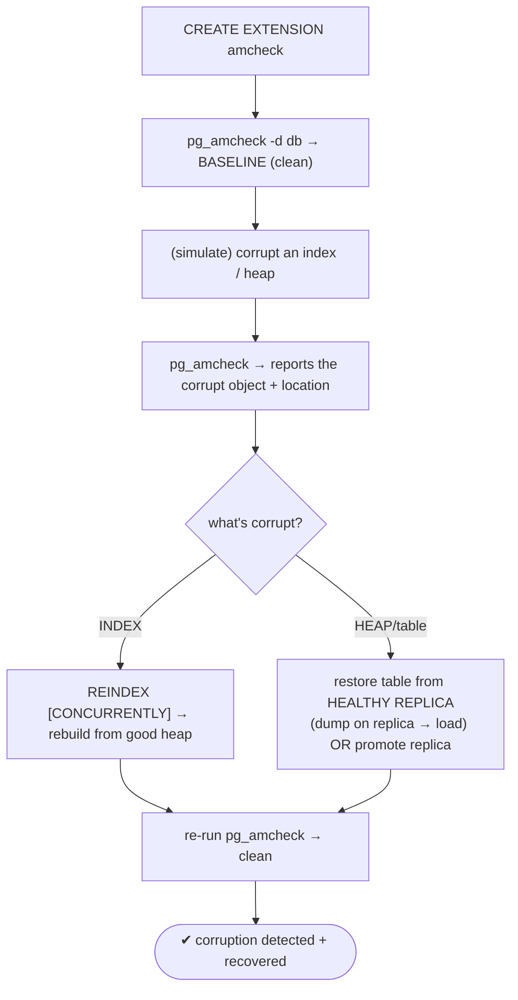
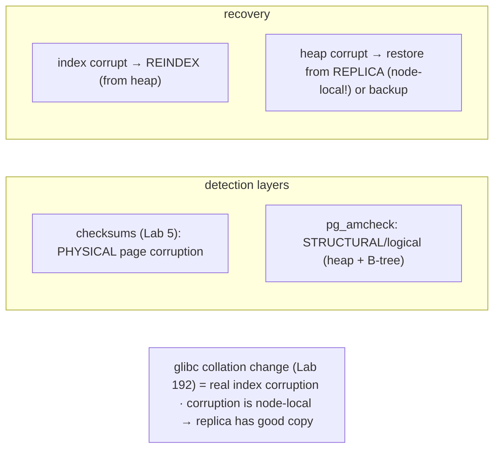

# Lab 64 — Detect Corruption with `pg_amcheck`; Recover Using a Good Replica

> **Track A · DBA · A8 Maintenance & Vacuum · Lab 7 of 7 (Lab 64/222 · A8 complete)**
> Teaching package: concept → diagram → steps → verify → quick-ref → self-test → video script.
> **Depends on:** Lab 5 (checksums), Lab 26 (replica), Lab 61 (REINDEX). The structural-integrity layer.

---

## 0. Lab Card (at a glance)

| Field | Value |
|---|---|
| **Objective** | Use `pg_amcheck` to detect structural corruption in heaps and B-tree indexes, then recover — rebuild a corrupt index, and restore a corrupt table from a healthy replica. |
| **Success criterion** | `pg_amcheck` reports a clean database, and (on simulated damage) flags the corrupt object; the index is fixed by REINDEX and a table is recovered from a replica. |
| **Scope boundary** | Structural corruption detection + recovery. Physical checksums were Lab 5; collation corruption is Lab 192. |
| **Prereqs** | Lab 5; a replica (Lab 26); the `amcheck` extension |
| **Time** | 30–45 min |
| **Difficulty** | ★★★★☆ |
| **Risk** | Medium — corruption simulation; do it on a scratch table. |

---

## 1. Learning Objectives

1. **What pg_amcheck finds** — structural corruption beyond checksums.
2. **Run it** — whole DB, targeted, heap + index checks.
3. **Recover an index** — REINDEX from the good heap.
4. **Recover a heap** — restore the table from a healthy replica (or promote it).
5. **Why a replica helps** — corruption is usually node-local.

---

## 2. Concept Primer — the "why"

**Two layers of corruption detection.** **Checksums** (Lab 5) catch **physical** page corruption — a bit flip or torn page produces a checksum mismatch on read. But some corruption is written to disk **with a valid checksum** yet is **structurally wrong** — broken B-tree ordering, invalid heap tuple headers, corrupt line pointers, an index that no longer matches its table. Checksums are blind to that. **`pg_amcheck`** (PG14+, a frontend for the `amcheck` extension) verifies the **logical structure**.

**What amcheck checks:**
- **`bt_index_check(index)`** — a B-tree's logical consistency (ordering, page structure); light lock.
- **`bt_index_parent_check(index)`** — deeper (parent-child relationships across the tree); stronger `ShareLock` (blocks writes).
- **`verify_heapam(relation)`** — the **heap**: tuple headers, line pointers, `xmin`/`xmax` sanity, TOAST consistency.
- `pg_amcheck` wraps these into a CLI that checks whole databases/schemas/tables, with `--heapallindexed` (every heap tuple is indexed), `--parent-check`, `--rootdescend` (thorough), and `-j` parallelism. It **reports** corruption (relation, block, tuple, problem) with a nonzero exit code — it does **not** fix.

**Common real causes:** bad RAM/disk/controller, storage that lies about fsync (Lab 15), a bad restore, PostgreSQL bugs (rare) — and a classic one: an **OS/glibc collation change** on upgrade (Lab 192) that silently makes index ordering wrong. That index is "corrupt" to amcheck (order no longer matches the collation) even though every page checksum is valid. `--heapallindexed` catches it.

**Recovery — and why a replica is the answer.** Corruption is usually **node-local** — it's damage on *this* node's storage, not in the logical data. So a **healthy streaming replica** (A4), on separate storage, holds a **good copy**. Recovery depends on what's corrupt:
- **A corrupt INDEX** → **`REINDEX`** (Lab 61) rebuilds it from the (good) heap. Easiest fix; no replica needed if only the index is damaged.
- **A corrupt HEAP (table data)** → the data itself is gone locally; **restore it from the replica**: dump the table on the healthy replica and load it back, or, for widespread damage, **promote the replica** (Lab 30) to become the new primary and discard the corrupt node. PITR from backup (Lab 21) is the alternative when there's no clean replica.

*(Caveat: if corruption entered via **WAL** — logical rather than storage-level — a physical replica may have replicated it too; then use a **backup**/PITR from before the damage. Storage bit-rot, being node-local, spares the replica.)*

---

## 3. Diagrams

### 3.1 Detect → recover flow



### 3.2 Corruption layers + recovery



---

## 4. Prerequisites

```bash
sudo -u postgres psql -d benchdb -c "CREATE EXTENSION IF NOT EXISTS amcheck;"
which pg_amcheck
# a healthy replica (Lab 26) for heap recovery (adjust ports): primary 5432, replica 5433
sudo -u postgres psql -p 5433 -c "SELECT pg_is_in_recovery();" 2>/dev/null   # t if replica available
```

---

## 5. Step-by-Step

### Step 1 — Baseline: check a healthy database

```bash
sudo -u postgres pg_amcheck -d benchdb --heapallindexed --progress 2>&1 | tail -10
echo "exit code: $?"    # 0 = no corruption found
```

### Step 2 — Create a scratch table + index to damage

```bash
sudo -u postgres psql -d benchdb <<'SQL'
DROP TABLE IF EXISTS amc_demo;
CREATE TABLE amc_demo (id int PRIMARY KEY, v text);
INSERT INTO amc_demo SELECT g, md5(g::text) FROM generate_series(1,50000) g;
CREATE INDEX amc_demo_v_idx ON amc_demo(v);
SQL
```

### Step 3 — Simulate INDEX corruption (offline byte flip)

```bash
sudo systemctl stop postgresql-17
IDXFILE=$(sudo -u postgres find /var/lib/pgsql/17/data/base -name "$(sudo -u postgres psql -tAc "SELECT relfilenode FROM pg_class WHERE relname='amc_demo_v_idx';" 2>/dev/null)" 2>/dev/null | head -1)
# (with the server down, corrupt a middle block of the index file)
sudo dd if=/dev/urandom of="$IDXFILE" bs=1 count=200 seek=9000 conv=notrunc 2>/dev/null
sudo systemctl start postgresql-17
```

### Step 4 — Detect it with pg_amcheck

```bash
sudo -u postgres pg_amcheck -d benchdb -t amc_demo -i amc_demo_v_idx --heapallindexed 2>&1 | tail -10
echo "exit code: $?"    # nonzero + reports the corrupt index/block
```

### Step 5 — Recover the corrupt INDEX with REINDEX

```bash
sudo -u postgres psql -d benchdb -c "REINDEX INDEX CONCURRENTLY amc_demo_v_idx;" \
  || sudo -u postgres psql -d benchdb -c "REINDEX INDEX amc_demo_v_idx;"
# re-verify — clean now (rebuilt from the good heap):
sudo -u postgres pg_amcheck -d benchdb -t amc_demo -i amc_demo_v_idx 2>&1 | tail -3; echo "exit: $?"
```

### Step 6 — Recover a corrupt HEAP from a healthy replica

```bash
# scenario: the TABLE data is corrupt (REINDEX can't help). The replica (5433) has a good copy.
# dump the good table from the REPLICA and restore it onto the primary:
sudo -u postgres pg_dump -p 5433 -d benchdb -t amc_demo -Fc -f /tmp/amc_good.dump
sudo -u postgres psql -p 5432 -d benchdb -c "TRUNCATE amc_demo;"                     # (or DROP + recreate)
sudo -u postgres pg_restore -p 5432 -d benchdb --data-only -t amc_demo /tmp/amc_good.dump
sudo -u postgres pg_amcheck -p 5432 -d benchdb -t amc_demo 2>&1 | tail -3; echo "exit: $?"    # clean
# for WIDESPREAD corruption: promote the replica instead (Lab 30) and discard the corrupt node.
```

---

## 6. Verification Checklist

- [ ] `amcheck` extension created; baseline `pg_amcheck` clean (exit 0)
- [ ] Index corruption **detected** (nonzero exit, object/block reported)
- [ ] Corrupt **index** fixed by `REINDEX` (re-check clean)
- [ ] Corrupt **heap** recovered from the healthy **replica** (or promote noted)
- [ ] Understood: corruption is usually **node-local** → replica has a good copy
- [ ] `--heapallindexed` used for a thorough index check
- [ ] Know the WAL-propagated caveat (use a backup then)

---

## 7. Troubleshooting

| Symptom | Cause | Fix |
|---|---|---|
| `pg_amcheck` reports corruption | Real structural damage | Index → `REINDEX`; heap → restore from replica/backup; investigate hardware |
| `amcheck` extension missing | Not created | `CREATE EXTENSION amcheck` |
| `--parent-check` blocks writes | Uses `ShareLock` | Run off-peak |
| Sudden index "corruption" cluster-wide | glibc/ICU **collation change** (Lab 192) | Fix collation/reindex; move to ICU/builtin provider |
| `verify_heapam` slow | Full heap scan | Target relations; `-j` parallel |
| REINDEX fails to fix | Heap also corrupt | Restore the table from a replica/backup |
| Replica also corrupt | Corruption propagated via WAL | Use a **backup**/PITR (Lab 21) instead |

---

## 8. Quick Reference Card (paste-ready)

```bash
sudo -u postgres psql -d benchdb -c "CREATE EXTENSION IF NOT EXISTS amcheck;"

# DETECT (structural): whole DB or targeted
sudo -u postgres pg_amcheck -d benchdb --heapallindexed --progress   # exit 0 = clean, nonzero = corruption
sudo -u postgres pg_amcheck -d benchdb -t mytable -i myindex         # target · --parent-check (deeper) · -j N

# functions: bt_index_check / bt_index_parent_check (indexes) · verify_heapam (heap)

# RECOVER:
#   corrupt INDEX → REINDEX [CONCURRENTLY] idx        (rebuild from good heap)
#   corrupt HEAP  → dump table from a HEALTHY REPLICA → restore on primary  (corruption is node-local)
#                   OR promote the replica (Lab 30) for widespread damage
#   WAL-propagated corruption → restore from BACKUP/PITR (Lab 21)

# checksums (Lab 5) = physical · amcheck = structural · glibc collation change (Lab 192) = real index corruption
```

---

## 9. Self-Check

1. What does `pg_amcheck` detect that page checksums don't?
2. Which amcheck functions check indexes vs the heap?
3. How do you recover a corrupt index?
4. How do you recover a corrupt heap/table?
5. Why is a replica a good recovery source for corruption?
6. Name a common real cause of index corruption.

<details>
<summary>Answers</summary>

1. **Structural/logical** corruption — broken B-tree invariants, invalid heap tuple headers/line pointers, index-heap mismatches — which can have valid checksums.
2. Indexes: `bt_index_check` / `bt_index_parent_check`. Heap: `verify_heapam`.
3. `REINDEX` — it rebuilds the index from the (good) heap.
4. Restore the table from a **healthy replica** (dump there, load back) or **promote** the replica; PITR from backup if no clean replica.
5. Corruption is usually **node-local** (this node's storage); the replica's separate storage holds a good copy.
6. A **glibc/ICU collation change** on an OS upgrade (Lab 192) — index ordering no longer matches the collation.
</details>

---

## 10. Video / Teaching Script

| # | On screen | Say (narration) |
|---|---|---|
| 1 | Title: "When checksums aren't enough" | "Checksums catch bit flips. But some corruption is written perfectly to disk and still *structurally* wrong. For that, you need pg_amcheck." |
| 2 | baseline clean | "Run it on a healthy database — exit zero, all clear. That's your baseline." |
| 3 | corrupt + detect | "Now damage an index and re-check. There — it names the corrupt index and the block. Checksums would've said nothing." |
| 4 | REINDEX fix | "If it's an index, recovery is easy: rebuild it from the good table data. Re-check — clean." |
| 5 | heap → replica | "But if the *table* is corrupt, the data's gone here. Here's the key idea: corruption is usually local to one machine. Your replica, on different disks, has a perfect copy. Pull the table from there." |
| 6 | promote note | "Widespread damage? Just promote the healthy replica and walk away from the sick one." |
| 7 | collation callout | "And a heads-up: the most common real cause is an OS collation change silently breaking index order. Same detection, same fix — reindex." |
| 8 | Outro | "Detect deep, recover from a good copy. That completes Maintenance and Vacuum." |

---

## 11. Glossary

- **pg_amcheck / amcheck** — structural corruption checker (frontend/extension).
- **`bt_index_check` / `bt_index_parent_check`** — B-tree verification.
- **`verify_heapam`** — heap verification.
- **`--heapallindexed`** — every heap tuple is indexed check.
- **Physical vs structural corruption** — checksum-detectable vs amcheck-detectable.
- **Node-local corruption** — damage on one node's storage (replica spared).
- **Recovery** — REINDEX (index) / replica restore or promote (heap).

---
*NETAPORT lab series · PostgreSQL 17 on AlmaLinux 9 · Lab 64/222 · **A8 Maintenance & Vacuum complete***
