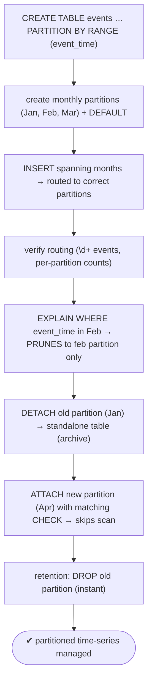
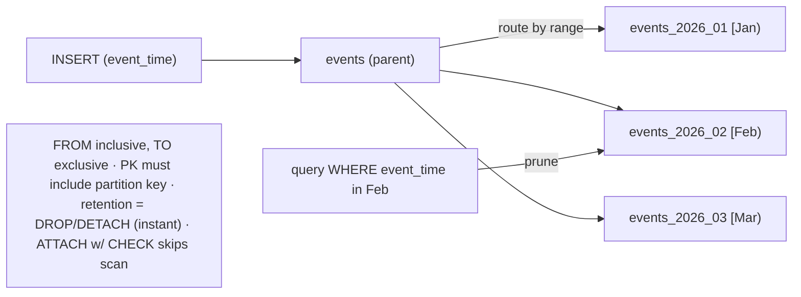

# Lab 65 — Range-Partition a Time-Series Table; Attach/Detach Partitions

> **Track A · DBA · A9 Partitioning & Large Data · Lab 1 of 5 (Lab 65/222)**
> Teaching package: concept → diagram → steps → verify → quick-ref → self-test → video script.
> **Depends on:** Labs 50 (stats), 52 (locks). Opens the partitioning track. **Feeds:** Lab 67 (pg_partman).

---

## 0. Lab Card (at a glance)

| Field | Value |
|---|---|
| **Objective** | Build a range-partitioned time-series table, verify row routing and partition pruning, and roll partitions in/out with `ATTACH`/`DETACH`. |
| **Success criterion** | Inserts route to the correct monthly partition; `EXPLAIN` prunes to matching partitions; a partition can be detached to standalone and a new one attached (skipping the scan). |
| **Scope boundary** | Range partitioning + attach/detach. List/hash is Lab 66; automation is Lab 67. |
| **Prereqs** | Labs 50/52; a database |
| **Time** | 30–40 min |
| **Difficulty** | ★★★☆☆ |
| **Risk** | Low — additive; scratch table. |

---

## 1. Learning Objectives

1. **Why partition time-series** — retention + pruning.
2. **Range partitioning** — `PARTITION BY RANGE`, bounds, DEFAULT.
3. **The PK rule** — unique constraints must include the partition key.
4. **ATTACH / DETACH** — roll partitions in and out.
5. **Skip the scan** — a matching `CHECK` speeds ATTACH.

---

## 2. Concept Primer — the "why"

**Declarative partitioning splits one logical table into many.** A **partitioned** parent table has a **partition key**; each **partition** is a separate table holding a subset of rows. The parent **routes** inserts to the right partition and lets the planner **prune** irrelevant ones. Strategies: **RANGE**, LIST, HASH. **Range by time** is the canonical time-series design.

**Two payoffs that matter for time-series:**
- **Retention is instant.** Dropping a month of old data is `DROP TABLE events_2026_01` (or `DETACH` then drop) — a metadata operation. Compare to `DELETE FROM events WHERE event_time < …`, which scans, generates dead tuples, and leaves bloat to vacuum. Partitioning turns retention from an expensive job into an instant one.
- **Partition pruning.** With a `WHERE` on the partition key, the planner **skips partitions that can't match** — scanning only the relevant month(s) instead of the whole dataset. Smaller per-partition indexes help too.

**Creating a range-partitioned table:**
```sql
CREATE TABLE events (id bigserial, event_time timestamptz NOT NULL, data text)
  PARTITION BY RANGE (event_time);
CREATE TABLE events_2026_01 PARTITION OF events FOR VALUES FROM ('2026-01-01') TO ('2026-02-01');
```
**Bounds:** `FROM` is **inclusive**, `TO` is **exclusive** — so January holds `[2026-01-01, 2026-02-01)`. A **DEFAULT** partition catches rows outside every range:
```sql
CREATE TABLE events_default PARTITION OF events DEFAULT;
```

**The PK rule (a real constraint):** a primary key or unique index on a partitioned table **must include the partition key**. So a PK here is `(id, event_time)`, not `(id)` alone. This surprises people migrating an existing table.

**ATTACH / DETACH — rolling partitions:**
- **`ALTER TABLE events ATTACH PARTITION t FOR VALUES FROM … TO …`** adds an existing standalone table as a partition. PostgreSQL **validates** that its rows fall in the range — a **scan** — *unless* the table already has a matching **`CHECK` constraint**, which lets ATTACH **skip the scan** (much faster for big tables). PG14+ ATTACH also takes a **weaker lock** (concurrent reads/writes allowed).
- **`ALTER TABLE events DETACH PARTITION t`** turns a partition back into a **standalone table with its data preserved** — for archival, or detach-then-drop. **`DETACH … CONCURRENTLY`** (PG14+) avoids a strong lock (can't run in a transaction block).

This is the load/archive workflow: **ATTACH** a pre-built or historical partition in; **DETACH** an old one out to archive or drop.

---

## 3. Diagrams

### 3.1 Build + roll flow



### 3.2 Routing + pruning



---

## 4. Prerequisites

```bash
sudo -u postgres psql -d benchdb -c "SHOW enable_partition_pruning;"   # on (default)
```

---

## 5. Step-by-Step

### Step 1 — Create the partitioned table + monthly partitions

```bash
sudo -u postgres psql -d benchdb <<'SQL'
DROP TABLE IF EXISTS events CASCADE;
CREATE TABLE events (
  id         bigserial,
  event_time timestamptz NOT NULL,
  data       text,
  PRIMARY KEY (id, event_time)              -- PK MUST include the partition key
) PARTITION BY RANGE (event_time);

CREATE TABLE events_2026_01 PARTITION OF events FOR VALUES FROM ('2026-01-01') TO ('2026-02-01');
CREATE TABLE events_2026_02 PARTITION OF events FOR VALUES FROM ('2026-02-01') TO ('2026-03-01');
CREATE TABLE events_2026_03 PARTITION OF events FOR VALUES FROM ('2026-03-01') TO ('2026-04-01');
CREATE TABLE events_default  PARTITION OF events DEFAULT;    -- catches out-of-range rows
SQL
sudo -u postgres psql -d benchdb -c "\d+ events" | head -25
```

### Step 2 — Insert data spanning months; verify routing

```bash
sudo -u postgres psql -d benchdb <<'SQL'
INSERT INTO events (event_time, data)
SELECT '2026-01-01'::timestamptz + (random()*89) * interval '1 day', 'x'
FROM generate_series(1,90000);
SQL
sudo -u postgres psql -d benchdb -c "
SELECT tableoid::regclass AS partition, count(*) FROM events GROUP BY 1 ORDER BY 1;"
#   rows routed into events_2026_01/02/03 by event_time
```

### Step 3 — Prove partition pruning with EXPLAIN

```bash
sudo -u postgres psql -d benchdb -c "
EXPLAIN (COSTS OFF) SELECT count(*) FROM events WHERE event_time >= '2026-02-01' AND event_time < '2026-03-01';"
#   → only events_2026_02 is scanned (others pruned)
```

### Step 4 — DETACH an old partition (archive)

```bash
sudo -u postgres psql -d benchdb -c "ALTER TABLE events DETACH PARTITION events_2026_01;"
# it's now a standalone table with its data; the parent no longer includes it:
sudo -u postgres psql -d benchdb -c "SELECT count(*) FROM events_2026_01;"                     # data preserved
sudo -u postgres psql -d benchdb -c "SELECT count(*) FROM events WHERE event_time < '2026-02-01';"   # 0 (Jan detached)
```

### Step 5 — ATTACH a new partition, skipping the scan via CHECK

```bash
sudo -u postgres psql -d benchdb <<'SQL'
-- build April as a standalone table WITH a matching CHECK so ATTACH skips validation:
CREATE TABLE events_2026_04 (LIKE events INCLUDING ALL);
ALTER TABLE events_2026_04 ADD CONSTRAINT ck_apr
  CHECK (event_time >= '2026-04-01' AND event_time < '2026-05-01');
INSERT INTO events_2026_04 (id, event_time, data)
  SELECT g, '2026-04-15'::timestamptz, 'apr' FROM generate_series(1,1000) g;
-- attach (no full scan, thanks to the CHECK):
ALTER TABLE events ATTACH PARTITION events_2026_04 FOR VALUES FROM ('2026-04-01') TO ('2026-05-01');
SQL
sudo -u postgres psql -d benchdb -c "SELECT count(*) FROM events WHERE event_time >= '2026-04-01';"   # 1000 (Apr now attached)
```

### Step 6 — Retention: drop an old partition (instant)

```bash
# archive events_2026_01 elsewhere first if needed, then drop it — instant, no bloat:
sudo -u postgres psql -d benchdb -c "DROP TABLE events_2026_01;"   # (the detached standalone table)
```

---

## 6. Verification Checklist

- [ ] Partitioned table created with PK including the partition key
- [ ] Rows routed to correct monthly partitions
- [ ] DEFAULT partition present for out-of-range rows
- [ ] `EXPLAIN` prunes to the matching partition
- [ ] DETACH produced a standalone table with data preserved
- [ ] ATTACH with a matching `CHECK` skipped the validation scan
- [ ] DROP of an old partition was instant

---

## 7. Troubleshooting

| Symptom | Cause | Fix |
|---|---|---|
| `no partition of relation … found for row` | Row's key outside all ranges | Add a partition or a `DEFAULT` |
| PK error "must include partition key" | PK omits partition key | Include it: `PRIMARY KEY (id, event_time)` |
| ATTACH slow (scans table) | No matching `CHECK` | Add a `CHECK` matching the range before ATTACH |
| ATTACH "would overlap" | Range overlaps an existing partition | Adjust the bounds |
| Pruning not happening | `WHERE` not on partition key / function on key | Filter directly on the key; keep `enable_partition_pruning=on` |
| DETACH CONCURRENTLY errors | Run in a transaction block | Run it standalone |
| Slow planning | Too many partitions | Balance partition count vs size |

---

## 8. Quick Reference Card (paste-ready)

```sql
-- range-partitioned time-series table (PK MUST include the partition key)
CREATE TABLE events (id bigserial, event_time timestamptz NOT NULL, data text,
  PRIMARY KEY (id, event_time)) PARTITION BY RANGE (event_time);
CREATE TABLE events_2026_02 PARTITION OF events FOR VALUES FROM ('2026-02-01') TO ('2026-03-01');   -- FROM incl, TO excl
CREATE TABLE events_default PARTITION OF events DEFAULT;

-- prune check:  EXPLAIN (COSTS OFF) SELECT ... WHERE event_time >= '...' AND event_time < '...';

-- DETACH (→ standalone table, data kept):  ALTER TABLE events DETACH PARTITION events_2026_01;
-- ATTACH fast (add matching CHECK to skip the scan):
CREATE TABLE p (LIKE events INCLUDING ALL); ALTER TABLE p ADD CHECK (event_time >= '...' AND event_time < '...');
ALTER TABLE events ATTACH PARTITION p FOR VALUES FROM ('...') TO ('...');

-- retention:  DROP TABLE old_partition;   (instant, no bloat — vs DELETE)
-- automate partition creation → pg_partman (Lab 67)
```

---

## 9. Self-Check

1. What two benefits make range partitioning ideal for time-series?
2. Are range bounds inclusive or exclusive?
3. What must a primary key on a partitioned table include?
4. How do you make `ATTACH PARTITION` skip its validation scan?
5. What does `DETACH PARTITION` produce?
6. What is partition pruning?

<details>
<summary>Answers</summary>

1. **Instant retention** (drop/detach a partition vs a slow, bloating DELETE) and **partition pruning** (skip irrelevant partitions).
2. `FROM` inclusive, `TO` exclusive.
3. The **partition key** (e.g. `PRIMARY KEY (id, event_time)`).
4. Add a `CHECK` constraint matching the partition range **before** attaching.
5. A **standalone table** with its data preserved.
6. The planner skipping partitions that can't match the query's `WHERE` on the partition key.
</details>

---

## 10. Video / Teaching Script

| # | On screen | Say (narration) |
|---|---|---|
| 1 | Title: "Time-series data, partitioned by month" | "Time-series tables grow forever. Partitioning makes them manageable — and fast." |
| 2 | create partitions | "Split by month. One rule to remember: the primary key must include the partition column." |
| 3 | insert + routing | "Insert data across months, and each row lands in the right partition automatically." |
| 4 | EXPLAIN pruning | "Query one month, and the planner skips the rest entirely. That's pruning — it only reads what it needs." |
| 5 | DETACH | "Old data? Detach the partition — it becomes a normal table you can archive." |
| 6 | ATTACH with CHECK | "Rolling new data in? Attach it. And with a matching check constraint, PostgreSQL skips the full scan — instant." |
| 7 | DROP retention | "Retention becomes trivial: drop the old partition. No DELETE, no bloat, no vacuum backlog." |
| 8 | Outro | "Partitioned time-series, done right. Next: list and hash partitioning." |

---

## 11. Glossary

- **Declarative partitioning** — split a table by a partition key.
- **Range partition** — partitions by key ranges (dates/numbers).
- **`PARTITION OF` / bounds** — define a partition; `FROM` incl, `TO` excl.
- **DEFAULT partition** — catches out-of-range rows.
- **Partition pruning** — planner skips non-matching partitions.
- **ATTACH / DETACH** — roll partitions in/out; `CHECK` skips ATTACH scan.
- **Retention by DROP** — instant old-data removal.

---
*NETAPORT lab series · PostgreSQL 17 on AlmaLinux 9 · Lab 65/222 · A9 Partitioning & Large Data*
