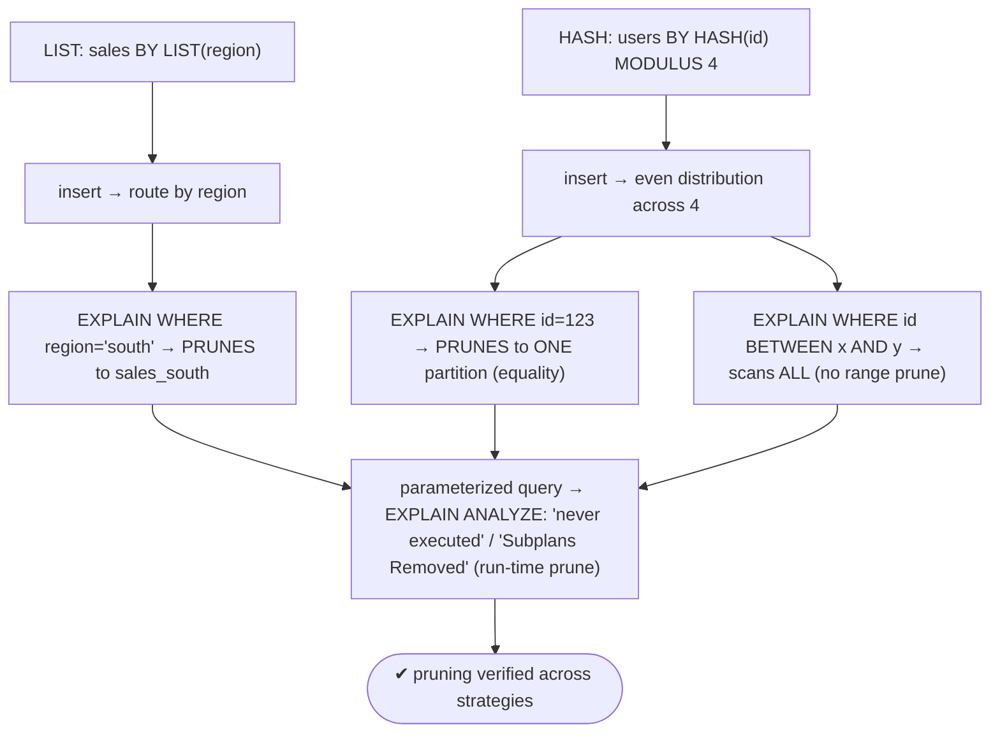
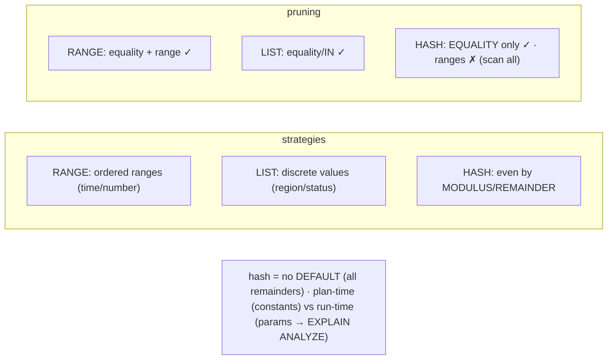

# Lab 66 — List/Hash Partitioning; Verify Partition Pruning in `EXPLAIN`

> **Track A · DBA · A9 Partitioning & Large Data · Lab 2 of 5 (Lab 66/222)**
> Teaching package: concept → diagram → steps → verify → quick-ref → self-test → video script.
> **Depends on:** Lab 65 (range partitioning + pruning basics).

---

## 0. Lab Card (at a glance)

| Field | Value |
|---|---|
| **Objective** | Build LIST and HASH partitioned tables, verify row routing, and confirm partition pruning in `EXPLAIN` — including HASH's equality-only pruning and plan-time vs execution-time pruning. |
| **Success criterion** | LIST prunes on a value/IN filter; HASH prunes on equality but scans all on a range; you can distinguish plan-time from execution-time pruning. |
| **Scope boundary** | LIST/HASH + pruning verification. Range was Lab 65; sub-partitioning is Lab 68. |
| **Prereqs** | Lab 65 |
| **Time** | 30–40 min |
| **Difficulty** | ★★★☆☆ |
| **Risk** | Low — additive scratch tables. |

---

## 1. Learning Objectives

1. **LIST partitioning** — discrete values, `FOR VALUES IN`.
2. **HASH partitioning** — even distribution via `MODULUS`/`REMAINDER`.
3. **When each fits** — vs range.
4. **HASH pruning limits** — equality prunes, ranges don't.
5. **Plan-time vs execution-time pruning** — reading `EXPLAIN` vs `EXPLAIN ANALYZE`.

---

## 2. Concept Primer — the "why"

Three strategies; range was Lab 65. The other two:

**LIST — partition by discrete values.** Each partition holds rows matching specific value(s) of the key — natural for **categories**: region, status, type, tenant.
```sql
CREATE TABLE sales (id bigserial, region text NOT NULL, amount numeric, PRIMARY KEY (id, region))
  PARTITION BY LIST (region);
CREATE TABLE sales_north PARTITION OF sales FOR VALUES IN ('north', 'northeast');   -- multiple values OK
CREATE TABLE sales_south PARTITION OF sales FOR VALUES IN ('south');
CREATE TABLE sales_other PARTITION OF sales DEFAULT;                                -- catches the rest
```

**HASH — even distribution.** When there's **no natural range or list** but you want rows spread **evenly** across N partitions (to balance I/O, parallelize maintenance, avoid a hot partition), hash by a high-cardinality key:
```sql
CREATE TABLE users (id bigint NOT NULL, name text, PRIMARY KEY (id)) PARTITION BY HASH (id);
CREATE TABLE users_0 PARTITION OF users FOR VALUES WITH (MODULUS 4, REMAINDER 0);
-- ... REMAINDER 1, 2, 3 — all remainders must be covered (NO DEFAULT for hash)
```
A row lands in the partition where `hash(key) % MODULUS == REMAINDER`. Distribution is even for a high-cardinality key.

**Choosing:** **RANGE** for ordered/continuous keys (time, numbers — retention by range); **LIST** for discrete categories; **HASH** for even spread with no natural grouping.

**Pruning — and HASH's crucial limit.** Pruning works for all strategies **when the `WHERE` filters on the partition key**:
- **LIST**: `WHERE region = 'south'` (or `IN (...)`) → prunes to the matching partition(s).
- **HASH — equality only.** `WHERE id = 123` → PostgreSQL computes `hash(123) % modulus` → prunes to **one** partition. But a **range** query — `WHERE id BETWEEN x AND y` — **can't prune**: hashing doesn't preserve order, so matching rows could be in *any* partition → **all are scanned**. If range queries on the key dominate, hash is the wrong strategy.

**Two pruning times (how you see it in `EXPLAIN`):**
- **Plan-time pruning** — when the filter value is a **constant** known at planning. `EXPLAIN (COSTS OFF)` shows **only the surviving partitions** (the rest never appear).
- **Execution-time (run-time) pruning** — when the value is **dynamic** (a parameter/prepared statement generic plan, a subquery, a join). `EXPLAIN` shows **all** partitions, but `EXPLAIN ANALYZE` reveals pruning as **`(never executed)`** on skipped partitions or **`Subplans Removed: N`**.

---

## 3. Diagrams

### 3.1 Build + verify pruning flow



### 3.2 Strategies + pruning matrix



---

## 4. Prerequisites

```bash
sudo -u postgres psql -d benchdb -c "SHOW enable_partition_pruning;"   # on
```

---

## 5. Step-by-Step

### Step 1 — LIST partitioning by region

```bash
sudo -u postgres psql -d benchdb <<'SQL'
DROP TABLE IF EXISTS sales CASCADE;
CREATE TABLE sales (id bigserial, region text NOT NULL, amount numeric, PRIMARY KEY (id, region))
  PARTITION BY LIST (region);
CREATE TABLE sales_north PARTITION OF sales FOR VALUES IN ('north','northeast');
CREATE TABLE sales_south PARTITION OF sales FOR VALUES IN ('south');
CREATE TABLE sales_west  PARTITION OF sales FOR VALUES IN ('west');
CREATE TABLE sales_other PARTITION OF sales DEFAULT;
INSERT INTO sales (region, amount)
SELECT (ARRAY['north','south','west','east'])[1+floor(random()*4)], random()*100 FROM generate_series(1,40000);
SQL
sudo -u postgres psql -d benchdb -c "SELECT tableoid::regclass AS partition, count(*) FROM sales GROUP BY 1 ORDER BY 1;"
```

### Step 2 — Verify LIST pruning

```bash
sudo -u postgres psql -d benchdb -c "EXPLAIN (COSTS OFF) SELECT count(*) FROM sales WHERE region='south';"
#   → only sales_south scanned (others pruned)
sudo -u postgres psql -d benchdb -c "EXPLAIN (COSTS OFF) SELECT count(*) FROM sales WHERE region IN ('south','west');"
#   → sales_south + sales_west only
```

### Step 3 — HASH partitioning by id

```bash
sudo -u postgres psql -d benchdb <<'SQL'
DROP TABLE IF EXISTS users CASCADE;
CREATE TABLE users (id bigint NOT NULL, name text, PRIMARY KEY (id)) PARTITION BY HASH (id);
CREATE TABLE users_0 PARTITION OF users FOR VALUES WITH (MODULUS 4, REMAINDER 0);
CREATE TABLE users_1 PARTITION OF users FOR VALUES WITH (MODULUS 4, REMAINDER 1);
CREATE TABLE users_2 PARTITION OF users FOR VALUES WITH (MODULUS 4, REMAINDER 2);
CREATE TABLE users_3 PARTITION OF users FOR VALUES WITH (MODULUS 4, REMAINDER 3);
INSERT INTO users SELECT g, 'user_'||g FROM generate_series(1,100000) g;
SQL
# even distribution across the 4 partitions:
sudo -u postgres psql -d benchdb -c "SELECT tableoid::regclass AS partition, count(*) FROM users GROUP BY 1 ORDER BY 1;"
```

### Step 4 — HASH prunes on EQUALITY

```bash
sudo -u postgres psql -d benchdb -c "EXPLAIN (COSTS OFF) SELECT * FROM users WHERE id = 12345;"
#   → exactly ONE partition scanned (hash of 12345 → its partition)
```

### Step 5 — HASH does NOT prune on RANGE

```bash
sudo -u postgres psql -d benchdb -c "EXPLAIN (COSTS OFF) SELECT count(*) FROM users WHERE id BETWEEN 1 AND 1000;"
#   → ALL 4 partitions scanned — hash doesn't preserve order, so no range pruning
```

### Step 6 — Execution-time pruning (parameterized)

```bash
sudo -u postgres psql -d benchdb <<'SQL'
PREPARE getuser(bigint) AS SELECT * FROM users WHERE id = $1;
EXPLAIN (ANALYZE, COSTS OFF, SUMMARY OFF) EXECUTE getuser(555);
SQL
#   → EXPLAIN shows all partitions in the plan, but ANALYZE reports "(never executed)" / "Subplans Removed: N" for pruned ones
```

---

## 6. Verification Checklist

- [ ] LIST table routes rows by value; DEFAULT catches the rest
- [ ] LIST pruning on `=` and `IN` shows only matching partitions
- [ ] HASH table distributes rows ~evenly across the 4 partitions
- [ ] HASH pruning on **equality** → one partition
- [ ] HASH on a **range** → all partitions scanned (no prune)
- [ ] Parameterized query shows **execution-time** pruning under `EXPLAIN ANALYZE`
- [ ] HASH has no DEFAULT (all remainders covered)

---

## 7. Troubleshooting

| Symptom | Cause | Fix |
|---|---|---|
| LIST insert fails: no partition for row | Value not listed + no DEFAULT | Add the value to a partition, or a `DEFAULT` |
| HASH: some rows fail | A remainder isn't covered | Create all `MODULUS N` partitions (remainders 0..N-1) |
| HASH range query scans all | Hash doesn't preserve order | Expected — use RANGE if range queries dominate |
| Pruning not in `EXPLAIN`, but fast | Run-time pruning | Use `EXPLAIN ANALYZE` → "never executed"/"Subplans Removed" |
| Uneven hash distribution | Low-cardinality/skewed key | Hash needs a high-cardinality key |
| PK error | PK omits partition key | Include the partition key in the PK |
| Can't add a LIST value | DEFAULT already holds matching rows | Move those rows first, then add the value |

---

## 8. Quick Reference Card (paste-ready)

```sql
-- LIST (discrete values):
CREATE TABLE sales (..., region text NOT NULL, PRIMARY KEY (id,region)) PARTITION BY LIST (region);
CREATE TABLE sales_south PARTITION OF sales FOR VALUES IN ('south');
CREATE TABLE sales_other PARTITION OF sales DEFAULT;
-- prune: EXPLAIN (COSTS OFF) ... WHERE region='south';   (or IN (...))

-- HASH (even distribution — NO DEFAULT, cover all remainders):
CREATE TABLE users (id bigint, ..., PRIMARY KEY (id)) PARTITION BY HASH (id);
CREATE TABLE users_0 PARTITION OF users FOR VALUES WITH (MODULUS 4, REMAINDER 0);   -- + 1,2,3
-- prune: WHERE id = 123  → ONE partition (EQUALITY) · WHERE id BETWEEN ... → ALL (no range prune)

-- run-time pruning: PREPARE q(...) ...; EXPLAIN (ANALYZE) EXECUTE q(...)  → "Subplans Removed" / "never executed"
-- RANGE (time/number) · LIST (categories) · HASH (even spread) · hash prunes on equality only
```

---

## 9. Self-Check

1. When would you choose LIST, HASH, or RANGE?
2. What's the HASH partition definition syntax?
3. Does HASH partitioning prune on range queries? Why or why not?
4. What's the difference between plan-time and execution-time pruning?
5. Does LIST allow a DEFAULT partition? Does HASH?
6. How do you verify execution-time pruning?

<details>
<summary>Answers</summary>

1. RANGE for ordered/continuous keys (time, numbers); LIST for discrete categories; HASH for even distribution with no natural grouping.
2. `FOR VALUES WITH (MODULUS N, REMAINDER r)`.
3. **No** — only equality. Hashing doesn't preserve order, so a range could match rows in any partition (all scanned).
4. Plan-time prunes on constants known at planning (`EXPLAIN` shows fewer partitions); execution-time prunes dynamic/parameterized values (`EXPLAIN ANALYZE` shows "never executed"/"Subplans Removed").
5. LIST: **yes**; HASH: **no** — all remainders must be covered.
6. `EXPLAIN (ANALYZE)` on a parameterized/prepared query — look for `Subplans Removed` or `(never executed)`.
</details>

---

## 10. Video / Teaching Script

| # | On screen | Say (narration) |
|---|---|---|
| 1 | Title: "List and hash — the other two partition types" | "Range is for time. But sometimes you partition by category, or just want even spread. That's list and hash." |
| 2 | LIST + prune | "List: by region. Query 'south', and the planner reads only the south partition. Categories, cleanly split." |
| 3 | HASH + distribution | "Hash: no natural grouping, just even distribution. A hundred thousand rows, spread evenly across four partitions." |
| 4 | hash equality prune | "Look up one id, and hash prunes straight to its partition." |
| 5 | hash range = all | "But ask for a *range* of ids? All four partitions. Hashing scrambles order — so range queries can't prune. Remember that." |
| 6 | run-time pruning | "And when the value is a parameter, pruning moves to execution time — you'll only see it under EXPLAIN ANALYZE, as 'subplans removed.'" |
| 7 | Outro | "Three strategies, one pruning goal. Next: automating partition creation with pg_partman." |

---

## 11. Glossary

- **LIST partitioning** — partitions by discrete values (`FOR VALUES IN`).
- **HASH partitioning** — even distribution (`MODULUS`/`REMAINDER`).
- **Partition pruning** — skipping non-matching partitions.
- **Plan-time / execution-time pruning** — constants vs dynamic values.
- **`Subplans Removed` / `(never executed)`** — run-time pruning in `EXPLAIN ANALYZE`.
- **Equality-only pruning** — HASH prunes on `=`, not ranges.

---
*NETAPORT lab series · PostgreSQL 17 on AlmaLinux 9 · Lab 66/222 · A9 Partitioning & Large Data*
