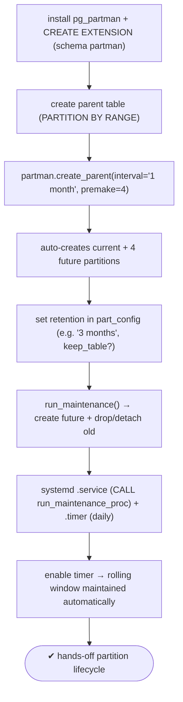
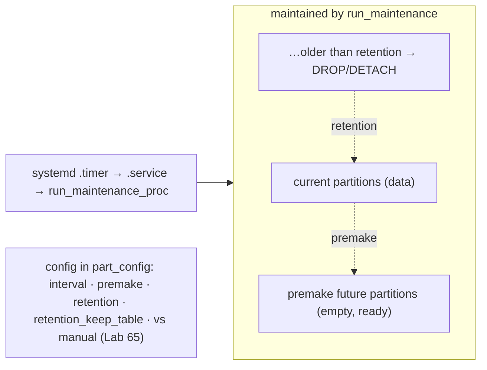

# Lab 67 — Automate Partition Creation with `pg_partman` + a Maintenance Timer

> **Track A · DBA · A9 Partitioning & Large Data · Lab 3 of 5 (Lab 67/222)**
> Teaching package: concept → diagram → steps → verify → quick-ref → self-test → video script.
> **Depends on:** Lab 65 (range partitioning), Lab 63 (systemd timers). Automates the manual work.

---

## 0. Lab Card (at a glance)

| Field | Value |
|---|---|
| **Objective** | Register a time-partitioned table with `pg_partman`, have it auto-create future partitions and apply retention, and schedule `run_maintenance` with a systemd timer. |
| **Success criterion** | `create_parent` builds current + N future partitions; `run_maintenance` creates new ones and drops/detaches old per retention; a timer runs it on a cadence. |
| **Scope boundary** | Automated partition lifecycle. Manual range partitioning was Lab 65; sub-partitioning is Lab 68. |
| **Prereqs** | Labs 65/63; the `pg_partman` package |
| **Time** | 30–40 min |
| **Difficulty** | ★★★☆☆ |
| **Risk** | Low — retention can **drop** partitions; use `retention_keep_table` to detach instead. |

---

## 1. Learning Objectives

1. **What pg_partman automates** — future partitions + retention.
2. **`create_parent`** — register a managed partition set.
3. **`run_maintenance`** — the periodic engine (premake + retention).
4. **Retention** — drop vs detach old partitions.
5. **Schedule it** — systemd timer (or background worker).

---

## 2. Concept Primer — the "why"

**Manual partitioning doesn't scale to "forever."** In Lab 65 you hand-created each month's partition and hand-dropped old ones. Do that for years and you'll forget a partition (inserts fail) or let old data pile up. **`pg_partman`** automates the whole **rolling window**:
- **Pre-creates future partitions** — always keeps `premake` (default 4) partitions ahead, so inserts for upcoming periods always have a home.
- **Applies retention** — drops or detaches partitions older than a configured `retention` interval.
- All driven by one periodic function: **`run_maintenance()`**.

**The pieces:**
- **`create_parent(...)`** registers an existing partitioned parent as a pg_partman-managed set and creates the initial partitions. (pg_partman **v5+**, for PG14+, uses PostgreSQL's **native declarative** partitioning — you create the parent with `PARTITION BY RANGE`, then call `create_parent`.)
- **`part_config`** — pg_partman's config table: `partition_interval` (e.g. `'1 month'`), `premake`, `retention`, `retention_keep_table`.
- **`run_maintenance()`** (or `run_maintenance_proc()`, which commits between partitions — better when many partitions change) — **creates needed future partitions and applies retention**. Run it periodically.

**Retention — drop vs detach.** `UPDATE part_config SET retention = '3 months'` drops partitions whose data is entirely older than 3 months. `retention_keep_table = true` **detaches** them to standalone tables instead (archive) rather than dropping — the automated version of Lab 65's DETACH.

**Scheduling — two options:**
1. **systemd timer** (this lab, Lab 63 pattern): a `.service` runs `CALL partman.run_maintenance_proc();`, a `.timer` fires it (e.g. daily/hourly).
2. **Background worker** (`pg_partman_bgw` in `shared_preload_libraries`): pg_partman runs maintenance itself on an interval — no external scheduler. (Alternative; the timer is more transparent and easier to log.)

---

## 3. Diagrams

### 3.1 Automate flow



### 3.2 The rolling window



---

## 4. Prerequisites

```bash
sudo dnf install -y pg_partman_17 2>/dev/null || sudo dnf install -y pg_partman
sudo -u postgres psql -d benchdb -c "CREATE SCHEMA IF NOT EXISTS partman; CREATE EXTENSION IF NOT EXISTS pg_partman SCHEMA partman;"
sudo -u postgres psql -d benchdb -c "SELECT extversion FROM pg_extension WHERE extname='pg_partman';"   # v5+ for PG17
```

---

## 5. Step-by-Step

### Step 1 — Create the parent partitioned table (empty of partitions)

```bash
sudo -u postgres psql -d benchdb <<'SQL'
DROP TABLE IF EXISTS pm_events CASCADE;
CREATE TABLE pm_events (
  id         bigserial,
  event_time timestamptz NOT NULL,
  data       text,
  PRIMARY KEY (id, event_time)
) PARTITION BY RANGE (event_time);
SQL
```

### Step 2 — Register it with pg_partman (create_parent)

```bash
# v5+ signature (native declarative). Args may differ slightly by point release — adjust to \df partman.create_parent
sudo -u postgres psql -d benchdb -c "
SELECT partman.create_parent(
  p_parent_table := 'public.pm_events',
  p_control      := 'event_time',
  p_interval     := '1 month',
  p_premake      := 4
);"
# pg_partman created current + 4 future monthly partitions:
sudo -u postgres psql -d benchdb -c "SELECT tableoid::regclass FROM pm_events LIMIT 0;" 2>/dev/null; \
sudo -u postgres psql -d benchdb -c "\d+ pm_events" | grep -i partition | head
sudo -u postgres psql -d benchdb -c "SELECT relname FROM pg_class WHERE relname LIKE 'pm_events_p%' ORDER BY relname;"
```

### Step 3 — Configure retention

```bash
sudo -u postgres psql -d benchdb -c "
UPDATE partman.part_config
SET retention = '3 months', retention_keep_table = false      -- false = drop; true = detach (archive)
WHERE parent_table = 'public.pm_events';"
sudo -u postgres psql -d benchdb -x -c "SELECT partition_interval, premake, retention, retention_keep_table FROM partman.part_config WHERE parent_table='public.pm_events';"
```

### Step 4 — Run maintenance manually (create future / apply retention)

```bash
sudo -u postgres psql -d benchdb -c "CALL partman.run_maintenance_proc();"
sudo -u postgres psql -d benchdb -c "SELECT relname FROM pg_class WHERE relname LIKE 'pm_events_p%' ORDER BY relname;"
#   future partitions extended; any partitions older than retention dropped/detached
```

### Step 5 — Wire run_maintenance into a systemd timer

```bash
sudo tee /etc/systemd/system/pg-partman.service >/dev/null <<'EOF'
[Unit]
Description=pg_partman maintenance (create future + retention)
After=postgresql-17.service
Wants=postgresql-17.service
[Service]
Type=oneshot
User=postgres
Group=postgres
ExecStart=/usr/pgsql-17/bin/psql -d benchdb -c "CALL partman.run_maintenance_proc();"
EOF

sudo tee /etc/systemd/system/pg-partman.timer >/dev/null <<'EOF'
[Unit]
Description=Run pg_partman maintenance daily
[Timer]
OnCalendar=*-*-* 01:00:00
RandomizedDelaySec=300
Persistent=true
[Install]
WantedBy=timers.target
EOF

sudo systemctl daemon-reload && sudo systemctl enable --now pg-partman.timer
systemctl list-timers pg-partman.timer --no-pager
```

### Step 6 — Verify a scheduled run

```bash
sudo systemctl start pg-partman.service        # run now
journalctl -u pg-partman.service -n 10 --no-pager
```

---

## 6. Verification Checklist

- [ ] `pg_partman` extension in schema `partman` (v5+)
- [ ] `create_parent` created current + `premake` future partitions
- [ ] `part_config` shows interval, premake, retention
- [ ] `run_maintenance_proc` created new future / applied retention
- [ ] systemd `.service` + `.timer` created; timer enabled
- [ ] `list-timers` shows a next run; a manual run logged in journald
- [ ] Retention behavior chosen (drop vs detach)

---

## 7. Troubleshooting

| Symptom | Cause | Fix |
|---|---|---|
| `create_parent` errors | Parent not partitioned / wrong args / version | Ensure `PARTITION BY RANGE`; check `\df partman.create_parent` for your version's signature |
| No future partitions | `run_maintenance` not run/scheduled | Run it; enable the timer |
| Old partitions not removed | `retention` unset | `UPDATE part_config SET retention='…'` |
| Extension API mismatch | v4 vs v5 differences | Use v5 (native) for PG14+; match the installed version |
| Inserts for far-future dates fail | `premake` too small / no default | Raise `premake` or run maintenance more often |
| Retention dropped a wanted table | Chose drop | Set `retention_keep_table=true` to detach instead |
| Want no external scheduler | — | Use `pg_partman_bgw` in `shared_preload_libraries` |

---

## 8. Quick Reference Card (paste-ready)

```bash
sudo dnf install -y pg_partman_17
sudo -u postgres psql -d benchdb -c "CREATE SCHEMA IF NOT EXISTS partman; CREATE EXTENSION IF NOT EXISTS pg_partman SCHEMA partman;"
```
```sql
-- parent (native declarative) then register:
CREATE TABLE pm_events (id bigserial, event_time timestamptz NOT NULL, data text, PRIMARY KEY (id,event_time))
  PARTITION BY RANGE (event_time);
SELECT partman.create_parent(p_parent_table:='public.pm_events', p_control:='event_time', p_interval:='1 month', p_premake:=4);

-- retention (drop or detach):
UPDATE partman.part_config SET retention='3 months', retention_keep_table=false WHERE parent_table='public.pm_events';

-- maintenance (create future + apply retention) — run periodically:
CALL partman.run_maintenance_proc();     -- or SELECT partman.run_maintenance();
```
```
# schedule (systemd, Lab 63): .service = CALL run_maintenance_proc · .timer = OnCalendar daily · enable --now .timer
# config: partition_interval · premake · retention · retention_keep_table (true=detach/archive, false=drop)
# alternative scheduler: pg_partman_bgw in shared_preload_libraries
```

---

## 9. Self-Check

1. What does `pg_partman` automate?
2. Which function registers a managed partition set?
3. What does `run_maintenance()` do?
4. What are two ways to schedule maintenance?
5. What's the difference between `retention_keep_table` true and false?
6. What does `premake` control?

<details>
<summary>Answers</summary>

1. Automatic creation of future partitions (`premake`) and retention (drop/detach of old ones) for a partition set.
2. `partman.create_parent(...)`.
3. Creates any needed future partitions and applies the retention policy — the periodic maintenance engine.
4. A **systemd timer** running `run_maintenance_proc`, or the **`pg_partman_bgw`** background worker.
5. `true` **detaches** old partitions to standalone tables (archive); `false` **drops** them.
6. How many future partitions to keep pre-created ahead of the current one.
</details>

---

## 10. Video / Teaching Script

| # | On screen | Say (narration) |
|---|---|---|
| 1 | Title: "Never hand-make a partition again" | "Creating monthly partitions by hand works — until you forget one and inserts start failing. pg_partman does it for you, forever." |
| 2 | create_parent | "Register the table, tell it the interval and how many future partitions to keep ready — and it builds them." |
| 3 | part_config + retention | "Set a retention policy — three months — and old partitions clean themselves up. Drop them, or detach them to archive." |
| 4 | run_maintenance | "One function does the work: extend the future, retire the past. That's the whole engine." |
| 5 | systemd timer | "Schedule it with a timer — daily at one a.m. — and the rolling window maintains itself." |
| 6 | verify | "Check the next run, trigger one now, read the log. Hands-off." |
| 7 | Outro | "Automated partition lifecycle. Next: sub-partitioning — partitions within partitions." |

---

## 11. Glossary

- **pg_partman** — extension automating partition creation + retention.
- **`create_parent`** — register a managed partition set.
- **`run_maintenance` / `_proc`** — periodic engine (future + retention).
- **`part_config`** — pg_partman config (interval, premake, retention).
- **`premake`** — future partitions kept ahead.
- **`retention` / `retention_keep_table`** — age-out policy; drop vs detach.
- **`pg_partman_bgw`** — background worker alternative to a timer.

---
*NETAPORT lab series · PostgreSQL 17 on AlmaLinux 9 · Lab 67/222 · A9 Partitioning & Large Data*
