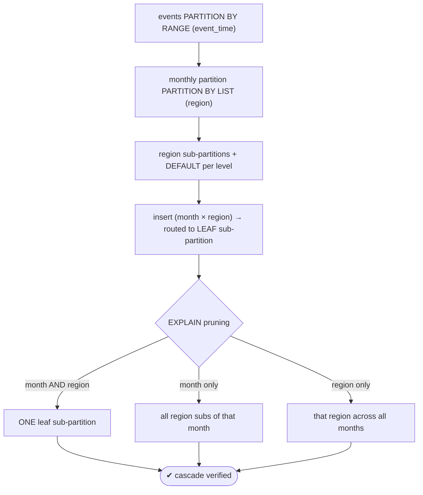
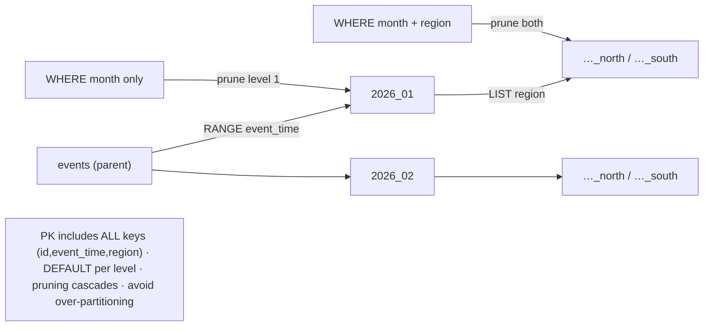

# Lab 68 — Sub-Partitioning (Range → List); Test Constraint Exclusion

> **Track A · DBA · A9 Partitioning & Large Data · Lab 4 of 5 (Lab 68/222)**
> Teaching package: concept → diagram → steps → verify → quick-ref → self-test → video script.
> **Depends on:** Labs 65 (range), 66 (list + pruning).

---

## 0. Lab Card (at a glance)

| Field | Value |
|---|---|
| **Objective** | Build a two-level partition hierarchy (month → region), verify row routing, and confirm pruning cascades through both levels via `EXPLAIN`. |
| **Success criterion** | Filtering on both keys prunes to one leaf sub-partition; filtering on one prunes to a subset; you understand pruning vs `constraint_exclusion`. |
| **Scope boundary** | Two-level range→list sub-partitioning. Automation was Lab 67; bulk load is Lab 69. |
| **Prereqs** | Labs 65/66 |
| **Time** | 30–40 min |
| **Difficulty** | ★★★☆☆ |
| **Risk** | Low — additive; but over-partitioning hurts planning. |

---

## 1. Learning Objectives

1. **Sub-partitioning** — a partition that is itself partitioned.
2. **Build range → list** — month at level 1, region at level 2.
3. **The PK rule** — include all keys at all levels.
4. **Pruning cascade** — both keys vs one.
5. **Pruning vs `constraint_exclusion`** — declarative vs legacy.

---

## 2. Concept Primer — the "why"

**A partition can itself be partitioned.** That's **sub-partitioning** (multi-level partitioning): partition the parent by key1, then partition each of those partitions by key2. The canonical shape is **range (month) → list (region)** — a two-level tree:
```
events                          -- PARTITION BY RANGE (event_time)
 ├─ events_2026_01              -- PARTITION BY LIST (region)
 │   ├─ events_2026_01_north
 │   └─ events_2026_01_south
 └─ events_2026_02
     ├─ …
```
A row routes **twice**: by `event_time` to its month, then by `region` to the leaf sub-partition within that month.

**When it's worth it.** Use sub-partitioning only when you have **two independent dimensions** that both genuinely need partitioning — e.g. **time** (for retention: drop a month) *and* **region** (for locality/pruning: read only one region's rows within a month). If only one dimension matters, a single level is simpler and faster. **Beware over-partitioning:** months × regions multiplies quickly, and too many partitions add planning overhead. Don't sub-partition "just because."

**The PK rule (stricter here):** a primary key or unique constraint must include **every** partition key at **every** level — so `PRIMARY KEY (id, event_time, region)`. Each level also needs a **DEFAULT** (or full coverage) or an out-of-range row fails at that level.

**Pruning cascades through both levels.** Partition pruning (Labs 65–66) applies at each level:
- filter on **both** keys → prunes to a **single leaf** sub-partition;
- filter on **event_time only** → prunes to a month, scanning **all** its region sub-partitions;
- filter on **region only** → prunes to that region across **all** months (no month pruning).
So order the hierarchy by which dimension you filter/retain on most.

**Pruning vs `constraint_exclusion` (the named topic).** Modern **declarative** partitioning uses **partition pruning** (`enable_partition_pruning`, default **on**) — efficient, plan-time and run-time, multi-level aware. The older **`constraint_exclusion`** GUC (`off`/`partition`/`on`, default `partition`) is the legacy mechanism that excludes child tables using their `CHECK` constraints — it matters for **inheritance-based** (legacy) partitioning and tables with explicit CHECKs, not for declarative partitions (where the bounds act as implicit constraints and pruning does the work). For your declarative hierarchy, **pruning is what you verify**; `constraint_exclusion` is the historical equivalent.

---

## 3. Diagrams

### 3.1 Build + prune-cascade flow



### 3.2 Hierarchy + pruning



---

## 4. Prerequisites

```bash
sudo -u postgres psql -d benchdb -c "SHOW enable_partition_pruning; SHOW constraint_exclusion;"   # on ; partition
```

---

## 5. Step-by-Step

### Step 1 — Build the two-level hierarchy (month → region)

```bash
sudo -u postgres psql -d benchdb <<'SQL'
DROP TABLE IF EXISTS sp_events CASCADE;
CREATE TABLE sp_events (
  id bigserial, event_time timestamptz NOT NULL, region text NOT NULL, data text,
  PRIMARY KEY (id, event_time, region)                 -- ALL partition keys, all levels
) PARTITION BY RANGE (event_time);

-- January: itself partitioned BY LIST (region)
CREATE TABLE sp_events_2026_01 PARTITION OF sp_events
  FOR VALUES FROM ('2026-01-01') TO ('2026-02-01') PARTITION BY LIST (region);
CREATE TABLE sp_events_2026_01_north   PARTITION OF sp_events_2026_01 FOR VALUES IN ('north');
CREATE TABLE sp_events_2026_01_south   PARTITION OF sp_events_2026_01 FOR VALUES IN ('south');
CREATE TABLE sp_events_2026_01_default PARTITION OF sp_events_2026_01 DEFAULT;

-- February: same structure
CREATE TABLE sp_events_2026_02 PARTITION OF sp_events
  FOR VALUES FROM ('2026-02-01') TO ('2026-03-01') PARTITION BY LIST (region);
CREATE TABLE sp_events_2026_02_north   PARTITION OF sp_events_2026_02 FOR VALUES IN ('north');
CREATE TABLE sp_events_2026_02_south   PARTITION OF sp_events_2026_02 FOR VALUES IN ('south');
CREATE TABLE sp_events_2026_02_default PARTITION OF sp_events_2026_02 DEFAULT;

CREATE TABLE sp_events_default PARTITION OF sp_events DEFAULT;   -- top-level catch-all
SQL
```

### Step 2 — Insert across months × regions; verify leaf routing

```bash
sudo -u postgres psql -d benchdb <<'SQL'
INSERT INTO sp_events (event_time, region, data)
SELECT '2026-01-01'::timestamptz + (random()*58)*interval '1 day',
       (ARRAY['north','south'])[1+floor(random()*2)], 'x'
FROM generate_series(1,60000);
SQL
sudo -u postgres psql -d benchdb -c "SELECT tableoid::regclass AS leaf, count(*) FROM sp_events GROUP BY 1 ORDER BY 1;"
#   rows land in the LEAF sub-partitions (month_region)
```

### Step 3 — Prune BOTH levels (month AND region → one leaf)

```bash
sudo -u postgres psql -d benchdb -c "
EXPLAIN (COSTS OFF) SELECT count(*) FROM sp_events
WHERE event_time >= '2026-01-01' AND event_time < '2026-02-01' AND region='south';"
#   → only sp_events_2026_01_south scanned
```

### Step 4 — Prune ONE level (month only → all its regions)

```bash
sudo -u postgres psql -d benchdb -c "
EXPLAIN (COSTS OFF) SELECT count(*) FROM sp_events
WHERE event_time >= '2026-01-01' AND event_time < '2026-02-01';"
#   → all January sub-partitions (north, south, default) — February pruned out
```

### Step 5 — Prune the other key (region only → that region across months)

```bash
sudo -u postgres psql -d benchdb -c "
EXPLAIN (COSTS OFF) SELECT count(*) FROM sp_events WHERE region='south';"
#   → south sub-partition of EVERY month (months not pruned without a time filter)
```

### Step 6 — Retention cascades: drop a month drops its sub-partitions

```bash
sudo -u postgres psql -d benchdb -c "SELECT relname FROM pg_class WHERE relname LIKE 'sp_events_2026_01%' ORDER BY relname;"
sudo -u postgres psql -d benchdb -c "DROP TABLE sp_events_2026_01;"   # removes the month AND its region sub-partitions
sudo -u postgres psql -d benchdb -c "SELECT relname FROM pg_class WHERE relname LIKE 'sp_events_2026_01%';"   # gone
```

---

## 6. Verification Checklist

- [ ] Two-level hierarchy built (month → region), PK includes all keys
- [ ] DEFAULT at each level
- [ ] Rows routed to leaf sub-partitions
- [ ] Both-key filter → one leaf sub-partition
- [ ] Month-only filter → all that month's region subs (other months pruned)
- [ ] Region-only filter → that region across all months
- [ ] Dropping a month cascaded to its sub-partitions

---

## 7. Troubleshooting

| Symptom | Cause | Fix |
|---|---|---|
| PK error | PK omits a partition key | Include **all** keys: `(id, event_time, region)` |
| Insert: no partition for row | Missing sub-partition/DEFAULT at a level | Add a `DEFAULT` at each level |
| Pruning doesn't cascade | Filter not on the sub-key / pruning off | Filter on both keys; `enable_partition_pruning=on` |
| Too many partitions, slow planning | Over-sub-partitioned | Only sub-partition when justified; fewer levels/partitions |
| Region-only query slow | No month pruning without a time filter | Add a time filter, or reorder the hierarchy |
| Confused pruning vs constraint_exclusion | Declarative uses pruning | `constraint_exclusion` is for legacy inheritance |
| Dropped month left orphans | — | Dropping the parent partition cascades to its subs |

---

## 8. Quick Reference Card (paste-ready)

```sql
-- two-level: RANGE (month) → LIST (region)
CREATE TABLE sp_events (id bigserial, event_time timestamptz NOT NULL, region text NOT NULL, data text,
  PRIMARY KEY (id, event_time, region)) PARTITION BY RANGE (event_time);
CREATE TABLE sp_2026_01 PARTITION OF sp_events FOR VALUES FROM ('2026-01-01') TO ('2026-02-01')
  PARTITION BY LIST (region);                                   -- sub-partitioned
CREATE TABLE sp_2026_01_south PARTITION OF sp_2026_01 FOR VALUES IN ('south');
CREATE TABLE sp_2026_01_default PARTITION OF sp_2026_01 DEFAULT;

-- pruning cascade (EXPLAIN COSTS OFF):
--   WHERE month AND region → ONE leaf · WHERE month → all its regions · WHERE region → that region all months

-- declarative → partition pruning (enable_partition_pruning, default on)
-- constraint_exclusion GUC = legacy (inheritance/CHECK tables), not declarative
-- PK includes ALL keys · DEFAULT per level · dropping a month cascades to sub-partitions · avoid over-partitioning
```

---

## 9. Self-Check

1. What is sub-partitioning?
2. What must the PK include in a multi-level hierarchy?
3. When is sub-partitioning worth it — and when not?
4. Filtering on both keys vs one — what does pruning do?
5. What's the difference between partition pruning and `constraint_exclusion`?
6. What happens to sub-partitions when you drop their top-level month partition?

<details>
<summary>Answers</summary>

1. A partition that is itself partitioned — a multi-level hierarchy (partition by key1, then each by key2).
2. **All** partition keys at all levels (e.g. `(id, event_time, region)`).
3. Worth it when two independent dimensions both need partitioning (e.g. time for retention + region for pruning); not worth it for one dimension — over-partitioning adds planning overhead.
4. Both keys → prunes to a single leaf sub-partition; one key → prunes to a subset at that level.
5. Declarative partitioning uses **partition pruning** (default on); `constraint_exclusion` is the older mechanism for legacy inheritance / explicit-CHECK tables.
6. They're **dropped with it** (the drop cascades).
</details>

---

## 10. Video / Teaching Script

| # | On screen | Say (narration) |
|---|---|---|
| 1 | Title: "Partitions inside partitions" | "Sometimes one dimension isn't enough. Partition by month — then split each month by region. Two levels." |
| 2 | build hierarchy | "The key rule gets stricter: your primary key must include *every* partition column, at every level." |
| 3 | routing | "A row now routes twice — to its month, then to its region within that month." |
| 4 | both-key prune | "Filter on both, and the planner drills to a single leaf partition. Precise." |
| 5 | one-key prune | "Filter on just the month, and you get all its regions. Just the region, and you get that region across every month. Pruning cascades — as far as your filter allows." |
| 6 | caution | "One warning: months times regions adds up fast. Only sub-partition when both dimensions truly earn it." |
| 7 | Outro | "Two-level partitioning, pruned intelligently. Last partitioning lab: bulk-loading 100 million rows fast." |

---

## 11. Glossary

- **Sub-partitioning** — a partition that is itself partitioned (multi-level).
- **Leaf partition** — a bottom-level partition holding rows.
- **Pruning cascade** — pruning applied at each level per the filter.
- **`constraint_exclusion`** — legacy exclusion via CHECK (inheritance).
- **`enable_partition_pruning`** — declarative pruning (default on).
- **DEFAULT per level** — catch-all at each partition level.
- **Over-partitioning** — too many partitions → planning overhead.

---
*NETAPORT lab series · PostgreSQL 17 on AlmaLinux 9 · Lab 68/222 · A9 Partitioning & Large Data*
