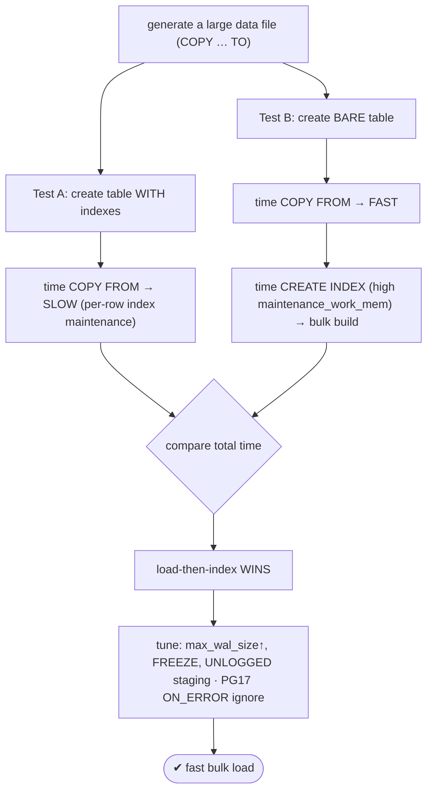
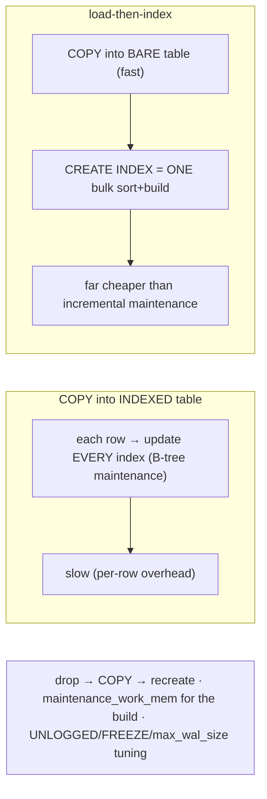

# Lab 69 — Bulk-Load with `COPY`; Compare Load Time Indexed vs Load-Then-Index

> **Track A · DBA · A9 Partitioning & Large Data · Lab 5 of 5 (Lab 69/222 · A9 complete)**
> Teaching package: concept → diagram → steps → verify → quick-ref → self-test → video script.
> **Depends on:** Labs 9 (memory), 57 (checkpoints). Closes the large-data track.

---

## 0. Lab Card (at a glance)

| Field | Value |
|---|---|
| **Objective** | Bulk-load a large dataset with `COPY`, timing two approaches — into a pre-indexed table vs load-then-index — and quantify the difference; apply load tuning. |
| **Success criterion** | Load-then-index is measurably faster than loading into an indexed table; you can tune `maintenance_work_mem`/`max_wal_size` for loads. |
| **Scope boundary** | Bulk load + index-build strategy. Partitioning was Labs 65–68. |
| **Prereqs** | Labs 9/57; disk for a large dataset |
| **Time** | 30–50 min (load-dependent) |
| **Difficulty** | ★★★☆☆ |
| **Risk** | Low — scratch tables; large data needs disk. |

---

## 1. Learning Objectives

1. **Why COPY beats INSERTs** — bulk, low overhead.
2. **The load-then-index win** — bulk build vs per-row maintenance.
3. **Measure** — time both approaches.
4. **Tune loads** — `maintenance_work_mem`, `max_wal_size`, FREEZE, UNLOGGED.
5. **PG17 COPY** — `ON_ERROR ignore` for bad rows.

---

## 2. Concept Primer — the "why"

**`COPY` is PostgreSQL's bulk loader.** Loading via individual `INSERT`s pays per-statement parse/plan/commit overhead for every row. `COPY` streams many rows in one command/transaction, bypassing that — often **10–100× faster** for bulk data. It reads a file, `STDIN`, or a program's output, in text/CSV/binary. (`COPY` reads a **server-side** file and needs privilege; `\copy` in psql reads a **client-side** file.)

**The counterintuitive optimization — load-then-index.** Loading into a table that **already has indexes** is slow: **every inserted row must update every index**, maintaining each B-tree incrementally. Across millions of rows that per-row maintenance dominates the load. The faster pattern:
1. **Drop** (or omit) the indexes.
2. **`COPY`** the data into the bare table — fast, no index maintenance.
3. **`CREATE INDEX`** afterward — a **single bulk build** that sorts all the data once and builds the tree in one pass, far cheaper than incremental maintenance.

So **drop → COPY → recreate** beats **COPY into indexed** for large loads. This is standard for initial loads and restores (it's exactly what `pg_restore` does when it defers index creation).

**Load tuning knobs:**
- **`maintenance_work_mem`** — raise it (e.g. 1–2 GB) for the `CREATE INDEX` build (more memory for the sort → faster).
- **`max_wal_size` / `checkpoint_timeout`** — raise during the load so checkpoints fire less often (less write amplification, Lab 57).
- **`COPY … WITH (FREEZE)`** — mark tuples frozen during load (saves a later vacuum-freeze) — requires the table created/truncated in the **same transaction**.
- **UNLOGGED** staging table — no WAL during load (huge speedup); convert to logged after, or it's fine if the staging data is recreatable.
- **wal_level=minimal** + create/truncate + load in one transaction → WAL-optimized load (only if no replicas).
- Disable FK checks / triggers during the load; re-enable after.

**PG17 COPY features:** **`ON_ERROR ignore`** skips malformed rows instead of aborting the whole `COPY` (with `LOG_VERBOSITY` to report how many were skipped) — a big quality-of-life win for messy data; plus general COPY performance improvements.

*(This lab uses a lab-feasible row count to observe the pattern; production loads of 100M+ show the same — larger — gap.)*

---

## 3. Diagrams

### 3.1 Compare-loads flow



### 3.2 Why load-then-index is faster



---

## 4. Prerequisites

```bash
sudo -u postgres psql -c "SHOW maintenance_work_mem; SHOW max_wal_size;"
df -h /var/lib/pgsql   # ensure disk for the dataset + indexes
```

---

## 5. Step-by-Step

### Step 1 — Generate a large dataset file (once)

```bash
# lab-feasible size (20M rows ≈ ~1GB); production target is 100M+
sudo -u postgres psql -d benchdb -c "
COPY (SELECT g AS id, md5(g::text) AS v, (random()*1000)::int AS n FROM generate_series(1,20000000) g)
TO '/tmp/bulk.csv' WITH (FORMAT csv);"
ls -lh /tmp/bulk.csv
```

### Step 2 — Test A: COPY into a PRE-INDEXED table (slow)

```bash
sudo -u postgres psql -d benchdb <<'SQL'
DROP TABLE IF EXISTS load_indexed;
CREATE TABLE load_indexed (id bigint, v text, n int);
CREATE INDEX ON load_indexed (id);
CREATE INDEX ON load_indexed (n);
SQL
echo "== COPY into INDEXED table =="
time sudo -u postgres psql -d benchdb -c "COPY load_indexed FROM '/tmp/bulk.csv' WITH (FORMAT csv);"
```

### Step 3 — Test B: COPY bare, then CREATE INDEX (fast)

```bash
sudo -u postgres psql -d benchdb -c "DROP TABLE IF EXISTS load_lti; CREATE TABLE load_lti (id bigint, v text, n int);"
# raise memory for the index build:
sudo -u postgres psql -d benchdb -c "SET maintenance_work_mem='1GB';" 2>/dev/null
echo "== COPY into BARE table =="
time sudo -u postgres psql -d benchdb -c "COPY load_lti FROM '/tmp/bulk.csv' WITH (FORMAT csv);"
echo "== CREATE INDEX (bulk build) =="
time sudo -u postgres psql -d benchdb -c "SET maintenance_work_mem='1GB'; CREATE INDEX ON load_lti (id); CREATE INDEX ON load_lti (n);"
```

### Step 4 — Compare totals

```bash
echo "Test A (indexed load) = COPY time above"
echo "Test B (load-then-index) = COPY(bare) + CREATE INDEX times above"
echo "→ Test B total should be notably LESS than Test A"
```

### Step 5 — Fully-optimized load (UNLOGGED + FREEZE, single transaction)

```bash
sudo -u postgres psql -d benchdb <<'SQL'
BEGIN;
CREATE UNLOGGED TABLE load_fast (id bigint, v text, n int);   -- no WAL during load
COMMIT;
SQL
echo "== UNLOGGED load =="
time sudo -u postgres psql -d benchdb -c "COPY load_fast FROM '/tmp/bulk.csv' WITH (FORMAT csv);"
# convert to logged when done (if the data must persist through crashes):
sudo -u postgres psql -d benchdb -c "ALTER TABLE load_fast SET LOGGED;"
```

### Step 6 — PG17: skip bad rows with ON_ERROR ignore

```bash
# corrupt a couple of lines to demonstrate:
sed '5s/.*/not,a,valid,row,extra/' /tmp/bulk.csv | head -100 | sudo -u postgres tee /tmp/bulk_bad.csv >/dev/null
sudo -u postgres psql -d benchdb -c "DROP TABLE IF EXISTS load_onerr; CREATE TABLE load_onerr (id bigint, v text, n int);"
sudo -u postgres psql -d benchdb -c "COPY load_onerr FROM '/tmp/bulk_bad.csv' WITH (FORMAT csv, ON_ERROR ignore, LOG_VERBOSITY verbose);"
#   → loads valid rows, skips + reports the bad one (PG17) instead of aborting the whole COPY
```

---

## 6. Verification Checklist

- [ ] Dataset file generated
- [ ] Test A (indexed load) timed
- [ ] Test B (bare COPY + CREATE INDEX) timed
- [ ] Test B total **< ** Test A total (load-then-index wins)
- [ ] `maintenance_work_mem` raised for the index build
- [ ] UNLOGGED (and/or FREEZE) load observed
- [ ] PG17 `ON_ERROR ignore` skipped a bad row instead of aborting

---

## 7. Troubleshooting

| Symptom | Cause | Fix |
|---|---|---|
| COPY into indexed table very slow | Per-row index maintenance | Drop indexes, load, recreate |
| CREATE INDEX slow | Low `maintenance_work_mem` | Raise it for the build (e.g. 1–2 GB) |
| Disk fills during load | Data + WAL | Ensure space; UNLOGGED / `wal_level=minimal` load |
| Whole COPY aborts on a bad row | Default all-or-nothing | PG17 `ON_ERROR ignore` |
| Checkpoints spike I/O mid-load | Frequent checkpoints | Raise `max_wal_size`/`checkpoint_timeout` (Lab 57) |
| FREEZE had no effect | Table not created/truncated in same txn | Do both in one transaction |
| `COPY` permission denied on server file | Server-side path | Use `\copy` (client-side) or grant `pg_read_server_files` |

---

## 8. Quick Reference Card (paste-ready)

```sql
-- COPY (bulk): server-side file (needs privilege) vs \copy (client-side)
COPY t FROM '/path/data.csv' WITH (FORMAT csv, HEADER);
-- PG17: skip bad rows
COPY t FROM '/path/data.csv' WITH (FORMAT csv, ON_ERROR ignore, LOG_VERBOSITY verbose);

-- FAST bulk load pattern: DROP indexes → COPY → CREATE INDEX
--   SET maintenance_work_mem='1GB';   (for the index build)
--   raise max_wal_size / checkpoint_timeout during load (Lab 57)
--   UNLOGGED staging table (no WAL) → ALTER TABLE ... SET LOGGED after
--   COPY ... WITH (FREEZE)  (table created/truncated in the SAME transaction)

-- WHY: COPY into INDEXED = per-row index maintenance (slow)
--      load-then-index = COPY bare (fast) + ONE bulk index build (sorts once)
```

---

## 9. Self-Check

1. Why is `COPY` faster than individual `INSERT`s?
2. Why is load-then-index faster than loading into an indexed table?
3. What's the load-then-index workflow?
4. Which setting speeds up `CREATE INDEX`?
5. What PG17 COPY feature handles bad rows?
6. What's the difference between `COPY` and `\copy`?

<details>
<summary>Answers</summary>

1. It streams many rows in one command/transaction, skipping per-statement parse/plan/commit overhead.
2. Loading into an indexed table maintains every index per row; load-then-index does a single **bulk index build** (sort once) afterward — far cheaper.
3. Drop/omit indexes → `COPY` into the bare table → `CREATE INDEX`.
4. `maintenance_work_mem` (raise it for the build).
5. `ON_ERROR ignore` — skips malformed rows instead of aborting the whole `COPY`.
6. `COPY` reads a **server-side** file (needs privilege); `\copy` reads a **client-side** file.
</details>

---

## 10. Video / Teaching Script

| # | On screen | Say (narration) |
|---|---|---|
| 1 | Title: "Loading a hundred million rows — fast" | "COPY is the bulk loader. But there's a trick that halves your load time, and it's counterintuitive." |
| 2 | COPY into indexed | "Load into a table that already has indexes, and every single row updates every index. Watch the clock — it drags." |
| 3 | load-then-index | "Now the trick: load into a *bare* table, then build the indexes. The COPY flies, and the index build sorts everything once." |
| 4 | compare | "Add it up — dropping and rebuilding the indexes beats loading into them. Every time, for big loads." |
| 5 | tuning | "Push it further: more memory for the index build, bigger WAL room, an unlogged staging table for no WAL at all." |
| 6 | ON_ERROR ignore | "And a PostgreSQL 17 gift: one bad row used to kill the whole load. Now, ON_ERROR ignore just skips it." |
| 7 | Outro | "Bulk loading, done right. That completes Partitioning and Large Data." |

---

## 11. Glossary

- **COPY / `\copy`** — bulk load; server-side / client-side file.
- **Load-then-index** — drop indexes, load, recreate.
- **Bulk index build** — one sort+build vs per-row maintenance.
- **`maintenance_work_mem`** — memory for the index build.
- **UNLOGGED / FREEZE** — no-WAL staging / pre-freeze tuples.
- **`ON_ERROR ignore`** (PG17) — skip malformed rows.
- **`wal_level=minimal`** — WAL-optimized single-transaction load.

---
*NETAPORT lab series · PostgreSQL 17 on AlmaLinux 9 · Lab 69/222 · **A9 Partitioning & Large Data complete***
