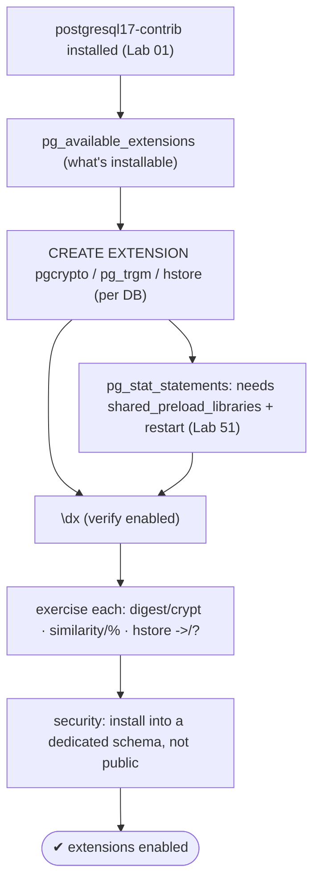
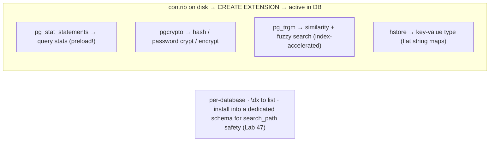

# Lab 70 — Install Core Contrib Extensions (`pg_stat_statements`, `pgcrypto`, `pg_trgm`, `hstore`); Enable Each

> **Track A · DBA · A10 Extensions · Lab 1 of 4 (Lab 70/222)**
> Teaching package: concept → diagram → steps → verify → quick-ref → self-test → video script.
> **Depends on:** Lab 01 (contrib package), Lab 51 (pg_stat_statements), Lab 47 (search_path safety). Opens the extensions track.

---

## 0. Lab Card (at a glance)

| Field | Value |
|---|---|
| **Objective** | Enable four core contrib extensions and exercise each: query stats, crypto, fuzzy search, and key-value. |
| **Success criterion** | `\dx` shows all four; a functional check works for each (hash/encrypt, similarity, hstore lookup). |
| **Scope boundary** | Enabling + basic use. Deep fuzzy search is Lab 118; column encryption Lab 179; hstore vs jsonb Lab 116. |
| **Prereqs** | Lab 01 (`postgresql17-contrib`); Lab 51 (preload for pg_stat_statements) |
| **Time** | 25–35 min |
| **Difficulty** | ★★☆☆☆ |
| **Risk** | Low — additive. |

---

## 1. Learning Objectives

1. **`CREATE EXTENSION`** — enable a contrib module, per database.
2. **What each provides** — the four extensions' roles.
3. **The preload exception** — `pg_stat_statements`.
4. **Schema placement** — install extensions safely (not `public`).
5. **Inspect** — `\dx`, `pg_available_extensions`.

---

## 2. Concept Primer — the "why"

**Contrib modules extend PostgreSQL.** The `postgresql17-contrib` package (Lab 01) ships extra modules — cryptography, search, data types, foreign data, and more. They're on disk but **inactive** until you enable them **per database** with `CREATE EXTENSION extname;`, which installs their functions/types/operators. Extensions are **database-scoped** (except a shared-preloaded library), so you enable each in every database that needs it. `\dx` lists what's enabled; `pg_available_extensions` shows what's installable.

**The four in this lab:**

- **`pg_stat_statements`** (Lab 51) — per-query execution stats. **The exception:** it's a shared library, so it also needs `shared_preload_libraries` + a **restart** before `CREATE EXTENSION`. The other three need only `CREATE EXTENSION`.

- **`pgcrypto`** — cryptographic functions:
  - **Hashing:** `digest(data, 'sha256')`, `hmac(...)`.
  - **Password hashing:** `crypt()` + `gen_salt('bf')` (bcrypt) — store `crypt(pw, gen_salt('bf'))`; verify with `crypt(input, stored) = stored`.
  - **Symmetric encryption:** `pgp_sym_encrypt/decrypt`; raw `encrypt/decrypt`.
  - **Random:** `gen_random_bytes()`. *(Note: `gen_random_uuid()` is now in **core**, not pgcrypto.)*
  - Use: column-level encryption (Lab 179), secure password storage.

- **`pg_trgm`** (trigrams) — text **similarity** and **fuzzy search** via 3-char sequences:
  - `similarity(a, b)` → 0..1; the `%` operator → "similar enough" (above `pg_trgm.similarity_threshold`).
  - Supports **GIN/GiST indexes** that accelerate `LIKE '%x%'`, `ILIKE`, and similarity queries — otherwise unindexable wildcard searches (Lab 118).
  - Use: typo-tolerant search, fast substring matching.

- **`hstore`** — a **key-value** data type in one column: `'k1=>v1, k2=>v2'`. Operators `->` (get), `?` (key exists), `@>` (contains); GIN/GiST-indexable. Predates `jsonb`; for **new** designs `jsonb` (Lab 116) is usually preferred, but hstore is lighter for flat **string** maps and still common.

**Security: don't dump extensions in `public`.** Objects an extension creates live in a schema — by default `public`, which every role can see and (historically) write. That's a `search_path` hazard (Lab 47). Best practice: install security-sensitive extensions into a **dedicated schema** (`CREATE EXTENSION … SCHEMA ext;`) and reference their functions qualified.

---

## 3. Diagrams

### 3.1 Enable + exercise flow



### 3.2 The four extensions



---

## 4. Prerequisites

```bash
sudo -u postgres psql -d benchdb -c "SELECT name, default_version FROM pg_available_extensions WHERE name IN ('pg_stat_statements','pgcrypto','pg_trgm','hstore') ORDER BY name;"
# (if empty → install: sudo dnf install -y postgresql17-contrib)
```

---

## 5. Step-by-Step

### Step 1 — Enable pgcrypto, pg_trgm, hstore (per database)

```bash
sudo -u postgres psql -d benchdb <<'SQL'
CREATE SCHEMA IF NOT EXISTS ext;                 -- dedicated schema for security
CREATE EXTENSION IF NOT EXISTS pgcrypto SCHEMA ext;
CREATE EXTENSION IF NOT EXISTS pg_trgm  SCHEMA ext;
CREATE EXTENSION IF NOT EXISTS hstore   SCHEMA ext;
SQL
```

### Step 2 — pg_stat_statements (the preload exception)

```bash
# already done in Lab 51? just enable; else add to shared_preload_libraries + restart first:
sudo -u postgres psql -c "SHOW shared_preload_libraries;" | grep -q pg_stat_statements \
  || { sudo -u postgres psql -c "ALTER SYSTEM SET shared_preload_libraries='pg_stat_statements';"; sudo systemctl restart postgresql-17; }
sudo -u postgres psql -d benchdb -c "CREATE EXTENSION IF NOT EXISTS pg_stat_statements;"
```

### Step 3 — Verify all four are enabled

```bash
sudo -u postgres psql -d benchdb -c "\dx" | grep -E "pg_stat_statements|pgcrypto|pg_trgm|hstore"
```

### Step 4 — Exercise pgcrypto

```bash
sudo -u postgres psql -d benchdb <<'SQL'
-- SHA-256 hash:
SELECT encode(ext.digest('hello', 'sha256'), 'hex') AS sha256;
-- password hashing (bcrypt) + verify:
SELECT ext.crypt('secret', ext.gen_salt('bf')) AS stored \gset
SELECT ext.crypt('secret', :'stored') = :'stored' AS password_ok;
-- symmetric encryption round-trip:
SELECT ext.pgp_sym_decrypt(ext.pgp_sym_encrypt('sensitive', 'key123'), 'key123') AS decrypted;
SQL
```

### Step 5 — Exercise pg_trgm (fuzzy search + index)

```bash
sudo -u postgres psql -d benchdb <<'SQL'
CREATE TABLE IF NOT EXISTS names (name text);
INSERT INTO names VALUES ('Postgres'),('Postgres SQL'),('PostgreSQL'),('MySQL'),('MongoDB');
-- similarity score:
SELECT name, ext.similarity(name, 'Postgre') AS sim FROM names ORDER BY sim DESC;
-- GIN trigram index accelerates LIKE '%...%' and % (fuzzy):
CREATE INDEX IF NOT EXISTS names_trgm ON names USING gin (name ext.gin_trgm_ops);
SET pg_trgm.similarity_threshold = 0.3;
SELECT name FROM names WHERE name % 'Postgre';         -- fuzzy match
SELECT name FROM names WHERE name ILIKE '%sql%';        -- index-accelerated wildcard
SQL
```

### Step 6 — Exercise hstore (key-value)

```bash
sudo -u postgres psql -d benchdb <<'SQL'
CREATE TABLE IF NOT EXISTS products (id int, attrs ext.hstore);
INSERT INTO products VALUES (1, 'color=>red, size=>M'::ext.hstore), (2, 'color=>blue, weight=>2kg'::ext.hstore);
SELECT id, attrs -> 'color' AS color FROM products;             -- get value
SELECT id FROM products WHERE attrs ? 'weight';                  -- key exists
SELECT id FROM products WHERE attrs @> 'color=>red';             -- contains
SQL
```

---

## 6. Verification Checklist

- [ ] `postgresql17-contrib` provides the extensions (`pg_available_extensions`)
- [ ] pgcrypto, pg_trgm, hstore enabled via `CREATE EXTENSION` (in `ext` schema)
- [ ] pg_stat_statements enabled (with the preload requirement met)
- [ ] `\dx` lists all four
- [ ] pgcrypto: hash / password verify / encrypt round-trip work
- [ ] pg_trgm: `similarity`/`%` work; GIN index created
- [ ] hstore: `->`, `?`, `@>` queries work

---

## 7. Troubleshooting

| Symptom | Cause | Fix |
|---|---|---|
| "could not open extension control file" | contrib package missing | `dnf install postgresql17-contrib` |
| pg_stat_statements: no data / can't create | Not preloaded | Add to `shared_preload_libraries` + restart (Lab 51) |
| `\dx` shows nothing in a DB | Not created there | `CREATE EXTENSION` per database |
| Extension objects in `public` | No `SCHEMA` given | Install into a dedicated schema; qualify calls |
| `%` returns nothing | Below similarity threshold | Lower `pg_trgm.similarity_threshold` |
| Version mismatch | Old extension version | `ALTER EXTENSION … UPDATE` |
| `gen_random_uuid` not found in pgcrypto | It's in core now | Use core `gen_random_uuid()` |

---

## 8. Quick Reference Card (paste-ready)

```sql
-- available: SELECT name FROM pg_available_extensions;   enabled: \dx
CREATE SCHEMA IF NOT EXISTS ext;                          -- keep extensions out of public (Lab 47)
CREATE EXTENSION IF NOT EXISTS pgcrypto SCHEMA ext;       -- digest/crypt/gen_salt/pgp_sym_*
CREATE EXTENSION IF NOT EXISTS pg_trgm  SCHEMA ext;       -- similarity(), %, GIN/GiST fuzzy index
CREATE EXTENSION IF NOT EXISTS hstore   SCHEMA ext;       -- key-value: ->  ?  @>
-- pg_stat_statements: shared_preload_libraries + restart, THEN CREATE EXTENSION (Lab 51)

-- pgcrypto:  SELECT crypt('pw', gen_salt('bf'));  SELECT pgp_sym_decrypt(pgp_sym_encrypt('x','k'),'k');
-- pg_trgm:   CREATE INDEX ON t USING gin (col gin_trgm_ops);  WHERE col % 'query'  /  col ILIKE '%x%'
-- hstore:    attrs -> 'key'   attrs ? 'key'   attrs @> 'k=>v'   (jsonb often preferred for new work)
```

---

## 9. Self-Check

1. How do you enable a contrib extension, and what's its scope?
2. What does each of the four provide?
3. Which one requires `shared_preload_libraries`?
4. What package must be installed for contrib extensions?
5. What's the security best practice for extension schema placement?
6. What's pg_trgm's main use?

<details>
<summary>Answers</summary>

1. `CREATE EXTENSION name;` — **per database** (database-scoped).
2. pg_stat_statements: per-query stats; pgcrypto: crypto/hashing/encryption; pg_trgm: similarity/fuzzy search (+ index acceleration); hstore: key-value type.
3. **pg_stat_statements** (plus a restart).
4. `postgresql17-contrib`.
5. Install into a **dedicated schema** (not `public`) and qualify references — `search_path` safety (Lab 47).
6. Fuzzy/similarity search and accelerating `LIKE '%x%'`/`ILIKE` with a GIN/GiST trigram index.
</details>

---

## 10. Video / Teaching Script

| # | On screen | Say (narration) |
|---|---|---|
| 1 | Title: "Four extensions every DBA reaches for" | "PostgreSQL ships extras — crypto, fuzzy search, key-value. They're on disk; one command turns each on." |
| 2 | CREATE EXTENSION | "Enable them per database. And a security habit: put them in their own schema, not public." |
| 3 | pgcrypto | "pgcrypto: hash a password with bcrypt, verify it, encrypt a column. Real cryptography, built in." |
| 4 | pg_trgm | "pg_trgm: fuzzy matching. 'Postgre' finds 'PostgreSQL' — and a trigram index makes wildcard searches actually fast." |
| 5 | hstore | "hstore: key-value pairs in one column, queryable with simple operators." |
| 6 | preload note | "One exception: pg_stat_statements needs a preload and a restart before you can create it." |
| 7 | Outro | "Extensions, enabled and exercised. Next: reaching into another database with postgres_fdw." |

---

## 11. Glossary

- **Contrib extension** — a bundled optional module (`postgresql17-contrib`).
- **`CREATE EXTENSION`** — enable a module in a database.
- **`\dx` / `pg_available_extensions`** — enabled / installable extensions.
- **pgcrypto** — hashing, password crypt, encryption.
- **pg_trgm** — trigram similarity/fuzzy search + index.
- **hstore** — key-value data type.
- **Extension schema** — where its objects live (dedicated for safety).

---
*NETAPORT lab series · PostgreSQL 17 on AlmaLinux 9 · Lab 70/222 · A10 Extensions*
