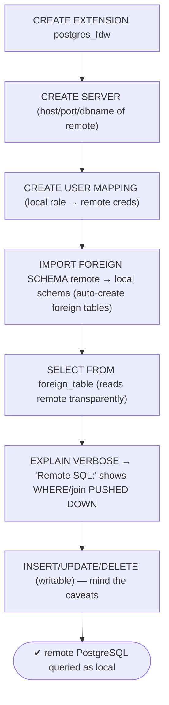
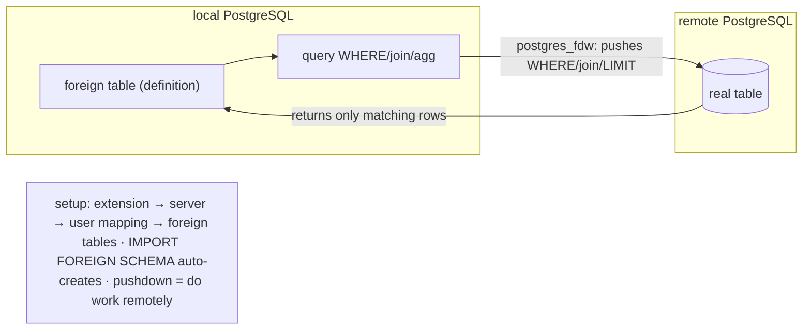

# Lab 71 — `postgres_fdw`: Query a Remote PostgreSQL; `IMPORT FOREIGN SCHEMA`

> **Track A · DBA · A10 Extensions · Lab 2 of 4 (Lab 71/222)**
> Teaching package: concept → diagram → steps → verify → quick-ref → self-test → video script.
> **Depends on:** Lab 70 (extensions), Lab 06 (auth). **Related:** Lab 72 (file_fdw).

---

## 0. Lab Card (at a glance)

| Field | Value |
|---|---|
| **Objective** | Use `postgres_fdw` to query tables in a remote PostgreSQL: set up the server + user mapping, define foreign tables, bulk-create them with `IMPORT FOREIGN SCHEMA`, and confirm pushdown. |
| **Success criterion** | Local queries read remote tables transparently; `IMPORT FOREIGN SCHEMA` creates foreign tables automatically; `EXPLAIN` shows predicates/joins pushed to the remote. |
| **Scope boundary** | Cross-PostgreSQL FDW. CSV-on-disk is `file_fdw` (Lab 72); migrations are Track D. |
| **Prereqs** | Lab 70; two PostgreSQL instances (or two DBs) |
| **Time** | 30–40 min |
| **Difficulty** | ★★★☆☆ |
| **Risk** | Low — read/write to a remote via mapped credentials. |

---

## 1. Learning Objectives

1. **What an FDW is** — query external data as local tables.
2. **The setup chain** — extension → server → user mapping → foreign tables.
3. **`IMPORT FOREIGN SCHEMA`** — auto-create foreign tables in bulk.
4. **Pushdown** — sending WHERE/joins to the remote.
5. **Write + limits** — inserts/updates and the caveats.

---

## 2. Concept Primer — the "why"

**Foreign Data Wrappers (FDWs) make external data look local.** SQL/MED (Management of External Data) lets PostgreSQL define **foreign tables** backed by data elsewhere. **`postgres_fdw`** is the wrapper for **another PostgreSQL** server — you query its tables from your database as if they were local, and PostgreSQL fetches rows over a connection on demand. Uses: data federation, cross-database reporting, gradual consolidation, and it's a building block for cross-server migrations.

**The setup chain (four objects):**
1. **`CREATE EXTENSION postgres_fdw;`** — enable the wrapper.
2. **`CREATE SERVER`** — describe the remote (host, port, dbname).
3. **`CREATE USER MAPPING`** — map a *local* role to *remote* credentials (so the FDW can authenticate to the remote).
4. **`CREATE FOREIGN TABLE`** — a local definition mirroring a remote table's structure.

Then `SELECT … FROM foreign_table` transparently reads the remote.

**`IMPORT FOREIGN SCHEMA` — skip the tedium.** Defining each foreign table by hand is error-prone. `IMPORT FOREIGN SCHEMA remote_schema FROM SERVER s INTO local_schema;` connects to the remote, reads its catalog, and **auto-creates foreign tables for every table** in that schema — with `LIMIT TO (…)` / `EXCEPT (…)` to filter. This is how you onboard a remote schema in one command.

**Pushdown — the performance key.** A naive FDW would pull *all* rows locally and filter here — slow across a network. `postgres_fdw` **pushes down** work to the remote where it can: **WHERE predicates**, **joins between two foreign tables on the same server**, **aggregates**, `ORDER BY`, and `LIMIT` — so the remote does the filtering and returns only what's needed. Verify with `EXPLAIN (VERBOSE)` — look for the `Remote SQL:` line showing the pushed query. Functions/operators must be known-safe to push (immutable, on the remote); non-pushable conditions are applied locally after fetching more rows.

**Writes and limits.** `postgres_fdw` supports `INSERT`/`UPDATE`/`DELETE` on foreign tables (with `updatable` on). Caveats: no cross-server transactions with full 2PC by default (each server commits independently unless configured), constraints aren't enforced locally (they live on the remote), and performance depends on pushdown + network. Options like `fetch_size`, `use_remote_estimate` (get real remote cost estimates for better plans), and `keep_connections` tune behavior.

---

## 3. Diagrams

### 3.1 Setup + query flow



### 3.2 Architecture + pushdown



---

## 4. Prerequisites

```bash
# "remote" = a second DB/instance. Here: local db=benchdb (5432), remote db=remotedb with a real table.
sudo -u postgres createdb remotedb 2>/dev/null || true
sudo -u postgres psql -d remotedb <<'SQL'
CREATE SCHEMA IF NOT EXISTS sales;
CREATE TABLE IF NOT EXISTS sales.orders (id int PRIMARY KEY, amount numeric, region text);
INSERT INTO sales.orders SELECT g, (random()*100)::numeric, (ARRAY['north','south'])[1+floor(random()*2)] FROM generate_series(1,10000) g ON CONFLICT DO NOTHING;
SQL
# a role the FDW will authenticate as on the remote:
sudo -u postgres psql -c "CREATE ROLE fdw_user LOGIN PASSWORD 'FdwPass!1';" 2>/dev/null || true
sudo -u postgres psql -d remotedb -c "GRANT USAGE ON SCHEMA sales TO fdw_user; GRANT SELECT, INSERT, UPDATE, DELETE ON sales.orders TO fdw_user;"
# pg_hba: allow fdw_user to remotedb from localhost:
HBA=$(sudo -u postgres psql -tAc "SHOW hba_file;"); echo "host remotedb fdw_user 127.0.0.1/32 scram-sha-256" | sudo tee -a "$HBA"; sudo systemctl reload postgresql-17
```

---

## 5. Step-by-Step

### Step 1 — Extension + server + user mapping (in the LOCAL database)

```bash
sudo -u postgres psql -d benchdb <<'SQL'
CREATE EXTENSION IF NOT EXISTS postgres_fdw;
CREATE SERVER remote_pg FOREIGN DATA WRAPPER postgres_fdw
  OPTIONS (host '127.0.0.1', port '5432', dbname 'remotedb', use_remote_estimate 'true');
CREATE USER MAPPING FOR postgres SERVER remote_pg
  OPTIONS (user 'fdw_user', password 'FdwPass!1');
SQL
```

### Step 2 — IMPORT FOREIGN SCHEMA (auto-create foreign tables)

```bash
sudo -u postgres psql -d benchdb <<'SQL'
CREATE SCHEMA IF NOT EXISTS remote_sales;
IMPORT FOREIGN SCHEMA sales
  FROM SERVER remote_pg INTO remote_sales;          -- LIMIT TO (orders) / EXCEPT (...) to filter
SQL
sudo -u postgres psql -d benchdb -c "\det remote_sales.*"    # foreign tables created automatically
```

### Step 3 — Query the remote table transparently

```bash
sudo -u postgres psql -d benchdb -c "SELECT count(*), avg(amount) FROM remote_sales.orders;"
sudo -u postgres psql -d benchdb -c "SELECT * FROM remote_sales.orders WHERE region='south' ORDER BY amount DESC LIMIT 5;"
```

### Step 4 — Confirm pushdown with EXPLAIN VERBOSE

```bash
sudo -u postgres psql -d benchdb -c "
EXPLAIN (VERBOSE, COSTS OFF)
SELECT id, amount FROM remote_sales.orders WHERE region='south' AND amount > 50 ORDER BY amount DESC LIMIT 10;"
#   → look for 'Remote SQL:' with the WHERE/ORDER BY/LIMIT pushed to the remote
```

### Step 5 — Write through the FDW

```bash
sudo -u postgres psql -d benchdb -c "INSERT INTO remote_sales.orders VALUES (99999, 12.5, 'west');"
# confirm it landed on the REMOTE:
sudo -u postgres psql -d remotedb -c "SELECT * FROM sales.orders WHERE id=99999;"
```

### Step 6 — (Optional) a single foreign table by hand

```bash
sudo -u postgres psql -d benchdb -c "
CREATE FOREIGN TABLE remote_sales.orders_manual (id int, amount numeric, region text)
  SERVER remote_pg OPTIONS (schema_name 'sales', table_name 'orders');"
```

---

## 6. Verification Checklist

- [ ] `postgres_fdw` extension enabled locally
- [ ] `CREATE SERVER` + `CREATE USER MAPPING` succeeded
- [ ] `IMPORT FOREIGN SCHEMA` auto-created foreign tables
- [ ] `SELECT` on a foreign table returns remote data
- [ ] `EXPLAIN VERBOSE` shows `Remote SQL:` with pushed-down WHERE/ORDER/LIMIT
- [ ] An `INSERT` through the FDW appears on the remote
- [ ] `use_remote_estimate` set for better plans

---

## 7. Troubleshooting

| Symptom | Cause | Fix |
|---|---|---|
| "could not connect to server" | Server options / pg_hba / creds | Fix `CREATE SERVER` host/port/dbname; add pg_hba for the mapped user |
| Authentication failed | Wrong user mapping password | Correct `CREATE USER MAPPING … password` |
| `IMPORT FOREIGN SCHEMA` empty | Remote schema/table perms | Grant the mapped user access on the remote |
| Query pulls all rows (no pushdown) | Non-pushable predicate/function | Use pushable conditions; check `Remote SQL:` |
| Bad plans | No remote estimates | `use_remote_estimate 'true'` on the server/table |
| Write fails | Foreign table not updatable / no remote privilege | Ensure `updatable` + remote grants |
| Constraint not enforced locally | Constraints live on the remote | Rely on remote constraints |

---

## 8. Quick Reference Card (paste-ready)

```sql
-- SETUP CHAIN (in the local database)
CREATE EXTENSION postgres_fdw;
CREATE SERVER remote_pg FOREIGN DATA WRAPPER postgres_fdw
  OPTIONS (host '...', port '5432', dbname 'remotedb', use_remote_estimate 'true');
CREATE USER MAPPING FOR local_role SERVER remote_pg OPTIONS (user 'remote_user', password '...');

-- BULK create foreign tables:
IMPORT FOREIGN SCHEMA sales FROM SERVER remote_pg INTO remote_sales;   -- LIMIT TO (...) / EXCEPT (...)

-- or one table by hand:
CREATE FOREIGN TABLE remote_sales.orders (...) SERVER remote_pg OPTIONS (schema_name 'sales', table_name 'orders');

-- query + verify pushdown:
SELECT ... FROM remote_sales.orders WHERE ...;
EXPLAIN (VERBOSE) SELECT ...;   -- look for 'Remote SQL:'  (WHERE/join/agg/LIMIT pushed down)

-- writable (INSERT/UPDATE/DELETE) · tune: fetch_size, use_remote_estimate, keep_connections
```

---

## 9. Self-Check

1. What does `postgres_fdw` let you do?
2. What are the four setup objects, in order?
3. What does `IMPORT FOREIGN SCHEMA` do?
4. What is pushdown, and how do you verify it?
5. Can you write through a foreign table? Any caveats?
6. Which option improves remote-based query plans?

<details>
<summary>Answers</summary>

1. Query tables in a **remote PostgreSQL** as if they were local (foreign tables).
2. `CREATE EXTENSION postgres_fdw` → `CREATE SERVER` → `CREATE USER MAPPING` → `CREATE FOREIGN TABLE` (or `IMPORT FOREIGN SCHEMA`).
3. Connects to the remote and **auto-creates foreign tables** for a whole schema (with `LIMIT TO`/`EXCEPT`).
4. Sending WHERE/joins/aggregates/LIMIT to the **remote** to filter there; verify with `EXPLAIN (VERBOSE)` → `Remote SQL:`.
5. Yes — INSERT/UPDATE/DELETE; caveats: constraints live on the remote, no full cross-server 2PC by default, performance hinges on pushdown/network.
6. `use_remote_estimate 'true'` (fetch real remote cost estimates).
</details>

---

## 10. Video / Teaching Script

| # | On screen | Say (narration) |
|---|---|---|
| 1 | Title: "Query another database as if it were yours" | "Data lives in two Postgres servers. With a foreign data wrapper, one can read the other's tables — transparently." |
| 2 | setup chain | "Four steps: enable the wrapper, describe the remote server, map your credentials, then point at its tables." |
| 3 | IMPORT FOREIGN SCHEMA | "Rather than define each table by hand, import the whole schema — Postgres reads the remote catalog and builds them for you." |
| 4 | query | "Now query it like any local table. The rows come from across the network." |
| 5 | pushdown | "The magic is pushdown: your WHERE and joins run *on the remote*, so only matching rows come back. Check EXPLAIN — there's the remote SQL." |
| 6 | write | "It's two-way — insert here, and it lands there." |
| 7 | Outro | "One database, many sources. Next: file_fdw — treating a CSV on disk as a table." |

---

## 11. Glossary

- **FDW** — Foreign Data Wrapper; access external data as tables.
- **`postgres_fdw`** — wrapper for a remote PostgreSQL.
- **`CREATE SERVER` / `USER MAPPING`** — remote definition / credential mapping.
- **Foreign table** — local definition backed by remote data.
- **`IMPORT FOREIGN SCHEMA`** — bulk-create foreign tables from a remote schema.
- **Pushdown** — executing WHERE/joins/aggregates on the remote.
- **`use_remote_estimate`** — fetch real remote cost estimates.

---
*NETAPORT lab series · PostgreSQL 17 on AlmaLinux 9 · Lab 71/222 · A10 Extensions*
