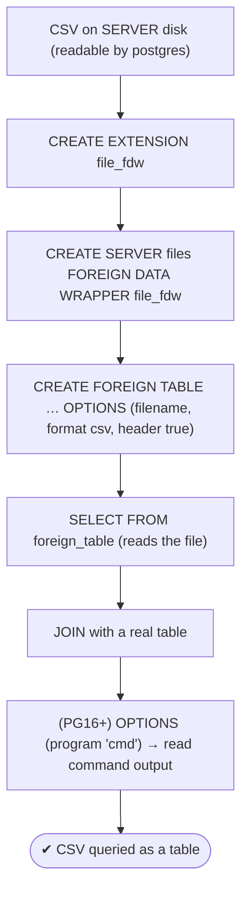

# Lab 72 — `file_fdw`: Expose a CSV on Disk as a Table

> **Track A · DBA · A10 Extensions · Lab 3 of 4 (Lab 72/222)**
> Teaching package: concept → diagram → steps → verify → quick-ref → self-test → video script.
> **Depends on:** Lab 71 (FDW concepts), Lab 14 (csvlog), Lab 04 (SELinux/perms).

---

## 0. Lab Card (at a glance)

| Field | Value |
|---|---|
| **Objective** | Use `file_fdw` to query a CSV file on the server as a read-only table, join it with a real table, and understand its limits. |
| **Server serves the file** | The file lives on the **server** filesystem, readable by the postgres user. |
| **Success criterion** | A `SELECT` reads the CSV via a foreign table; a join works; you can explain the read-only/re-read/security caveats. |
| **Scope boundary** | Local file access. Remote PostgreSQL is `postgres_fdw` (Lab 71). |
| **Prereqs** | Lab 71; a CSV on the server; superuser or `pg_read_server_files` |
| **Time** | 20–30 min |
| **Difficulty** | ★★☆☆☆ |
| **Risk** | Low — read-only. |

---

## 1. Learning Objectives

1. **What file_fdw does** — files as read-only tables.
2. **Set it up** — extension → server → foreign table with `filename`.
3. **COPY options** — format/header/delimiter reuse.
4. **The caveats** — read-only, re-read per query, server-side, privileged.
5. **Program option** — read command output (PG16+).

---

## 2. Concept Primer — the "why"

**`file_fdw` makes a file look like a table — read-only.** It's a contrib Foreign Data Wrapper (sibling to `postgres_fdw`, Lab 71) that exposes a **file on the server's filesystem** as a **foreign table** you can `SELECT` from. No import step: query the CSV directly, and **join it with real tables**. Common uses:
- Query a **CSV / reference file** with SQL without loading it.
- Read PostgreSQL's own **CSV logs** (`csvlog`, Lab 14) as a table — analyze the log with SQL.
- Ad-hoc analysis or staging without a `COPY` load.

**Setup — three objects:**
1. `CREATE EXTENSION file_fdw;`
2. `CREATE SERVER files FOREIGN DATA WRAPPER file_fdw;` (no options needed).
3. `CREATE FOREIGN TABLE … SERVER files OPTIONS (filename '/path/data.csv', format 'csv', header 'true');` — columns matching the file.

**It reuses COPY's options:** `format` (csv/text), `header`, `delimiter`, `null`, `quote`, `escape`, `encoding` — same semantics as `COPY`.

**The caveats — know these before relying on it:**
- **Read-only.** No `INSERT`/`UPDATE`/`DELETE` — it's just reading a file.
- **Re-read on every query.** There's no cache and no index — each query scans the whole file. Fine for occasional/ad-hoc access or small files; for **repeated** large scans, `COPY` the data into a **real** table (indexable) instead.
- **Server-side file.** The path is on the **server's** filesystem (not the client), and the file must be readable by the **postgres OS user**. On Enforcing SELinux a custom path may be **denied** — place the file in a postgres-accessible location or label it (Lab 04).
- **Privileged.** Creating a `file_fdw` foreign table that reads a server file requires **superuser** or the **`pg_read_server_files`** role — because it exposes server files to SQL. Grant deliberately.

**Program option (PG16+):** instead of `filename`, `OPTIONS (program 'shell command')` reads the **stdout of a command** as the table — dynamic data (e.g., a script emitting CSV). Requires appropriate privilege and is a security-sensitive feature.

---

## 3. Diagrams

### 3.1 Setup + query flow



### 3.2 file_fdw vs postgres_fdw

```mermaid
flowchart LR
    subgraph FILE [file_fdw]
      F1["server-side FILE → read-only foreign table"] --> F2["re-reads each query · no index · COPY options"]
    end
    subgraph PG [postgres_fdw (Lab 71)]
      P1["remote PostgreSQL → writable · pushdown"]
    end
    note["file_fdw: local file, read-only · needs superuser/pg_read_server_files + postgres-readable path (SELinux)"]
```

---

## 4. Prerequisites

```bash
# a CSV on the SERVER, readable by postgres:
sudo -u postgres bash -c 'printf "id,name,dept\n1,Asha,eng\n2,Ravi,sales\n3,Meera,eng\n" > /tmp/staff.csv'
ls -l /tmp/staff.csv
```

---

## 5. Step-by-Step

### Step 1 — Extension + server

```bash
sudo -u postgres psql -d benchdb <<'SQL'
CREATE EXTENSION IF NOT EXISTS file_fdw;
CREATE SERVER IF NOT EXISTS files FOREIGN DATA WRAPPER file_fdw;
SQL
```

### Step 2 — Foreign table over the CSV

```bash
sudo -u postgres psql -d benchdb <<'SQL'
CREATE FOREIGN TABLE staff_csv (id int, name text, dept text)
  SERVER files OPTIONS (filename '/tmp/staff.csv', format 'csv', header 'true');
SQL
```

### Step 3 — Query the CSV as a table

```bash
sudo -u postgres psql -d benchdb -c "SELECT * FROM staff_csv;"
sudo -u postgres psql -d benchdb -c "SELECT dept, count(*) FROM staff_csv GROUP BY dept;"
```

### Step 4 — Join the file with a real table

```bash
sudo -u postgres psql -d benchdb <<'SQL'
CREATE TABLE IF NOT EXISTS dept_budget (dept text, budget numeric);
INSERT INTO dept_budget VALUES ('eng', 500000), ('sales', 300000) ON CONFLICT DO NOTHING;
SELECT s.name, s.dept, b.budget
FROM staff_csv s JOIN dept_budget b ON s.dept = b.dept;
SQL
```

### Step 5 — Prove it's read-only + re-read

```bash
# writes are rejected:
sudo -u postgres psql -d benchdb -c "INSERT INTO staff_csv VALUES (4,'x','eng');" 2>&1 | tail -1
#   → ERROR: cannot insert into foreign table "staff_csv" (file_fdw is read-only)
# change the file → the next query sees it (re-read each time):
sudo -u postgres bash -c 'echo "4,Dev,sales" >> /tmp/staff.csv'
sudo -u postgres psql -d benchdb -c "SELECT count(*) FROM staff_csv;"   # now 4 — reflects the edited file
```

### Step 6 — (PG16+) read a command's output as a table

```bash
sudo -u postgres psql -d benchdb <<'SQL'
CREATE FOREIGN TABLE proc_list (pid text, cmd text)
  SERVER files OPTIONS (program 'ps -eo pid,comm | tail -n +2 | awk ''{print $1","$2}''', format 'csv');
SQL
sudo -u postgres psql -d benchdb -c "SELECT * FROM proc_list LIMIT 5;"   # live command output as a table
```

---

## 6. Verification Checklist

- [ ] `file_fdw` extension + server created
- [ ] Foreign table over the CSV created (matching columns)
- [ ] `SELECT` returns the CSV rows
- [ ] Join with a real table works
- [ ] `INSERT` is rejected (read-only)
- [ ] Editing the file changes the next query's result (re-read)
- [ ] (PG16+) `program` option reads command output

---

## 7. Troubleshooting

| Symptom | Cause | Fix |
|---|---|---|
| "could not open file … Permission denied" | Not readable by postgres / SELinux | `chown`/`chmod`; place in a postgres-readable, labeled path (Lab 04) |
| "permission denied to create foreign table" | Needs privilege | Superuser, or `GRANT pg_read_server_files` |
| CSV parse errors | Wrong format options | Match `COPY` options (delimiter/quote/header) |
| Slow on a big file | Re-read every query, no index | `COPY` into a real table for repeated scans |
| File not found | Path is client-side | The file must be on the **server** filesystem |
| `program` option fails | Privilege / command error / pre-PG16 | Check command; needs the right privilege and PG16+ |
| Column count mismatch | Foreign table ≠ CSV columns | Align the definition to the file |

---

## 8. Quick Reference Card (paste-ready)

```sql
CREATE EXTENSION file_fdw;
CREATE SERVER files FOREIGN DATA WRAPPER file_fdw;

-- CSV file as a READ-ONLY table (COPY options):
CREATE FOREIGN TABLE staff_csv (id int, name text, dept text)
  SERVER files OPTIONS (filename '/path/staff.csv', format 'csv', header 'true');
SELECT * FROM staff_csv;                    -- re-reads the file each query
-- join with real tables freely.

-- PG16+: read command output
CREATE FOREIGN TABLE t (...) SERVER files OPTIONS (program 'cmd | ...', format 'csv');

-- caveats: READ-ONLY · re-read per query (no index) · SERVER-side file, postgres-readable · superuser/pg_read_server_files
-- repeated large scans → COPY into a real table instead (Lab 69)
```

---

## 9. Self-Check

1. What does `file_fdw` let you do?
2. Is it read-only or writable?
3. What options does it use for parsing?
4. Where must the file be, and who must be able to read it?
5. What's the performance caveat, and the alternative?
6. What privilege is required to create a file-reading foreign table?

<details>
<summary>Answers</summary>

1. Query a file on the **server's** filesystem as a **read-only** table (and join it with real tables).
2. **Read-only**.
3. The same options as `COPY` (`format`, `header`, `delimiter`, `quote`, …).
4. On the **server** filesystem, readable by the **postgres** OS user (mind SELinux).
5. It **re-reads the whole file on every query** (no cache/index) — for repeated scans, `COPY` into a real, indexable table.
6. **Superuser** or the **`pg_read_server_files`** role.
</details>

---

## 10. Video / Teaching Script

| # | On screen | Say (narration) |
|---|---|---|
| 1 | Title: "A CSV that acts like a table" | "Sometimes the data's just a file on disk. file_fdw lets you query it with SQL — no load step." |
| 2 | extension + foreign table | "Enable the wrapper, point a foreign table at the CSV, describe its columns. Done." |
| 3 | SELECT + join | "Now it's a table — select from it, even join it against real data." |
| 4 | read-only + re-read | "Two things to know: it's read-only, and it re-reads the file every single query. Edit the file, and the next query sees the change." |
| 5 | server-side + privilege | "The file lives on the *server*, readable by postgres — and creating this needs superuser or the read-server-files role. It's exposing files to SQL, after all." |
| 6 | program option | "A bonus in 16: point it at a *command* instead of a file, and its output becomes a table." |
| 7 | Outro | "Files as tables, on demand. Next: TimescaleDB and Citus — extensions that reshape how data scales." |

---

## 11. Glossary

- **file_fdw** — FDW exposing a server file as a read-only table.
- **`filename` / `program`** — read a file / a command's output (PG16+).
- **COPY options** — format/header/delimiter/quote parsing.
- **Read-only / re-read** — no writes; scans the file each query.
- **`pg_read_server_files`** — role permitting server-file access.
- **Server filesystem** — where the file must live (not client).

---
*NETAPORT lab series · PostgreSQL 17 on AlmaLinux 9 · Lab 72/222 · A10 Extensions*
