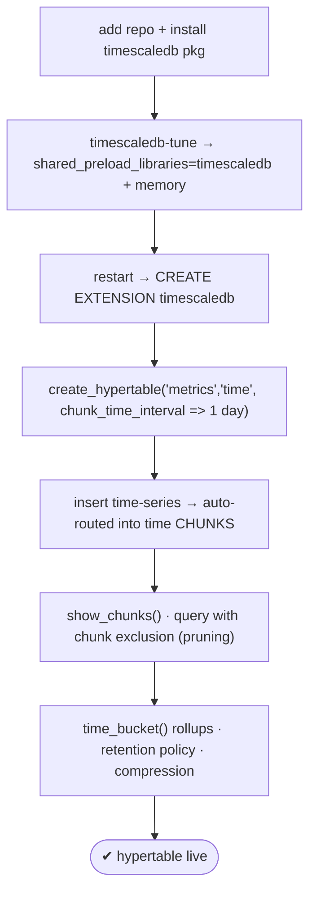
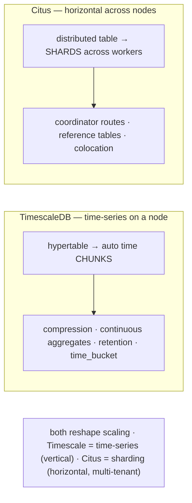

# Lab 73 — Deploy TimescaleDB (or Citus); Convert a Table to a Hypertable/Distributed Table

> **Track A · DBA · A10 Extensions · Lab 4 of 4 (Lab 73/222 · A10 complete)**
> Teaching package: concept → diagram → steps → verify → quick-ref → self-test → video script.
> **Depends on:** Labs 65–68 (partitioning), 70 (extensions). **Related:** Lab 217 (Citus sharding).

---

## 0. Lab Card (at a glance)

| Field | Value |
|---|---|
| **Objective** | Deploy TimescaleDB, convert a table to a **hypertable** (auto time-chunked), verify chunks and time-series queries; understand Citus **distributed tables** as the sharding alternative. |
| **Success criterion** | The extension loads; `create_hypertable` chunks the table; inserts auto-route to time chunks; `time_bucket` queries work. (Citus path: `create_distributed_table` shards it.) |
| **Scope boundary** | Deploy + convert. Deep Citus sharding is Lab 217; A9 covered native partitioning. |
| **Prereqs** | Lab 70; the TimescaleDB (or Citus) package |
| **Time** | 35–50 min |
| **Difficulty** | ★★★★☆ |
| **Risk** | Low — additive extensions; a restart for the preload. |

---

## 1. Learning Objectives

1. **Two scaling axes** — time-series (TimescaleDB) vs horizontal (Citus).
2. **Deploy TimescaleDB** — preload, tune, `CREATE EXTENSION`.
3. **Hypertables** — `create_hypertable`, chunks, migration.
4. **Time-series queries** — chunk exclusion, `time_bucket`, retention/compression.
5. **Citus distributed tables** — the sharding alternative.

---

## 2. Concept Primer — the "why"

Two extensions reshape how PostgreSQL scales — on **different axes**:

**TimescaleDB — time-series on a node.** Its core object is a **hypertable**: one logical table that TimescaleDB **automatically partitions into "chunks"** by time (and optionally a space/hash dimension). You query the hypertable as a single table; TimescaleDB creates chunks as data arrives, routes inserts, and **prunes** irrelevant chunks on read. It's like A9's declarative partitioning + pg_partman, but **built-in, automatic, and time-series-optimized**, plus features native partitioning lacks:
- **Automatic chunk creation** — no manual partition management (chunk_time_interval sets the size, e.g. 1 day).
- **Columnar compression** of old chunks — massive space savings for time-series.
- **Continuous aggregates** — incrementally-refreshed materialized rollups.
- **Retention policies** — auto-drop old chunks.
- **Hyperfunctions** — `time_bucket`, gap-filling, etc.

*(Licensing: TimescaleDB has an Apache-2 open core — hypertables and basics — and TSL/source-available advanced features; the self-hosted **community** edition includes compression, continuous aggregates, and policies.)*

**Citus — horizontal scale across nodes.** Its core object is a **distributed (sharded) table**: `create_distributed_table('t', 'shard_key')` splits a table into **shards** spread across **worker** nodes; a **coordinator** routes queries and gathers results. It also offers **reference tables** (replicated to every node for local joins) and **colocation** (tables sharded on the same key sit together, so joins run locally). Use: **multi-tenant SaaS** at scale (shard by `tenant_id`), real-time analytics, and growth beyond a single machine. Choose a **high-cardinality, evenly-distributed** shard key (in the PK).

**Same goal, different axis:** Timescale scales **time-series vertically** (chunks + compression + rollups on a node); Citus scales **horizontally** (shards across nodes). This lab does the TimescaleDB hypertable hands-on; the Citus path is the parallel alternative.

---

## 3. Diagrams

### 3.1 TimescaleDB deploy + hypertable flow



### 3.2 Two scaling models



---

## 4. Prerequisites — TimescaleDB path

```bash
# add the Timescale repo, then install the PG17 package (adjust per their docs):
sudo dnf install -y https://packagecloud.io/timescale/timescaledb/packages/el/9/timescaledb-2-postgresql-17.noarch.rpm 2>/dev/null \
  || echo "add the timescaledb yum repo per docs, then: dnf install -y timescaledb-2-postgresql-17"
```

---

## 5. Step-by-Step — TimescaleDB

### Step 1 — Tune + preload + restart

```bash
sudo timescaledb-tune --quiet --yes 2>/dev/null || \
  sudo -u postgres psql -c "ALTER SYSTEM SET shared_preload_libraries='timescaledb';"
sudo systemctl restart postgresql-17
sudo -u postgres psql -c "SHOW shared_preload_libraries;" | grep -q timescaledb && echo "preloaded"
```

### Step 2 — Create the extension

```bash
sudo -u postgres psql -d benchdb -c "CREATE EXTENSION IF NOT EXISTS timescaledb;"
sudo -u postgres psql -d benchdb -c "\dx timescaledb"
```

### Step 3 — A time-series table → convert to a hypertable

```bash
sudo -u postgres psql -d benchdb <<'SQL'
DROP TABLE IF EXISTS metrics CASCADE;
CREATE TABLE metrics (
  time   timestamptz NOT NULL,
  device int,
  value  double precision
);
-- convert to a hypertable, chunked by 1 day:
SELECT create_hypertable('metrics', by_range('time', INTERVAL '1 day'));
--   (classic API: SELECT create_hypertable('metrics','time', chunk_time_interval => INTERVAL '1 day');)
SQL
```

### Step 4 — Insert time-series data → auto-chunked

```bash
sudo -u postgres psql -d benchdb <<'SQL'
INSERT INTO metrics (time, device, value)
SELECT now() - (g || ' minutes')::interval, (random()*10)::int, random()*100
FROM generate_series(1, 200000) g;
SQL
# chunks were created automatically:
sudo -u postgres psql -d benchdb -c "SELECT show_chunks('metrics');" | head
sudo -u postgres psql -d benchdb -c "SELECT count(*) FROM timescaledb_information.chunks WHERE hypertable_name='metrics';"
```

### Step 5 — Time-series query with chunk exclusion + time_bucket

```bash
# chunk exclusion (pruning) for a time range:
sudo -u postgres psql -d benchdb -c "EXPLAIN (COSTS OFF) SELECT count(*) FROM metrics WHERE time > now() - interval '1 day';"
# rollup by 1-hour buckets:
sudo -u postgres psql -d benchdb -c "
SELECT time_bucket('1 hour', time) AS hour, device, avg(value)
FROM metrics WHERE time > now() - interval '6 hours'
GROUP BY hour, device ORDER BY hour DESC LIMIT 10;"
```

### Step 6 — (Community features) retention + compression

```bash
sudo -u postgres psql -d benchdb <<'SQL'
-- drop chunks older than 30 days automatically:
SELECT add_retention_policy('metrics', INTERVAL '30 days');
-- compress chunks older than 7 days (columnar):
ALTER TABLE metrics SET (timescaledb.compress);
SELECT add_compression_policy('metrics', INTERVAL '7 days');
SQL
```

---

## 5b. Alternative — Citus distributed table (sharding)

```bash
# install + preload
sudo dnf install -y citus_17 2>/dev/null || echo "add the Citus repo, then: dnf install -y citus_17"
sudo -u postgres psql -c "ALTER SYSTEM SET shared_preload_libraries='citus'; " && sudo systemctl restart postgresql-17
sudo -u postgres psql -d benchdb -c "CREATE EXTENSION IF NOT EXISTS citus;"

# (multi-node: SELECT citus_add_node('worker1',5432);  single-node works for testing)
sudo -u postgres psql -d benchdb <<'SQL'
CREATE TABLE events (tenant_id int, id bigint, ts timestamptz, data text, PRIMARY KEY (tenant_id, id));
SELECT create_distributed_table('events', 'tenant_id');   -- shard by tenant_id (high-cardinality, in PK)
-- reference table replicated to all nodes:
CREATE TABLE lookup (code int PRIMARY KEY, label text);
SELECT create_reference_table('lookup');
SQL
sudo -u postgres psql -d benchdb -c "SELECT * FROM citus_shards LIMIT 5;"   # shards
```

---

## 6. Verification Checklist

- [ ] `timescaledb` in `shared_preload_libraries`; extension created
- [ ] `create_hypertable` succeeded (table is now a hypertable)
- [ ] Inserts created **chunks** (`show_chunks`)
- [ ] Time-range query shows chunk exclusion
- [ ] `time_bucket` rollup works
- [ ] (Community) retention + compression policies added
- [ ] (Citus path) `create_distributed_table` produced shards

---

## 7. Troubleshooting

| Symptom | Cause | Fix |
|---|---|---|
| `CREATE EXTENSION timescaledb` fails | Not preloaded/restarted | `timescaledb-tune` (preload) + restart |
| `create_hypertable`: table has data | Existing rows | `migrate_data => true` |
| Too many / huge chunks | Bad `chunk_time_interval` | Size it to your volume (e.g. 1 day high, 1 week low) |
| Compression/continuous aggregate missing | Edition | Use the self-hosted community edition (includes TSL features) |
| Citus `CREATE EXTENSION` fails | Not preloaded | `shared_preload_libraries='citus'` + restart |
| `create_distributed_table` needs nodes | No workers | Single-node works for testing; add workers for real distribution |
| Skewed shards | Poor shard key | Choose a high-cardinality, even-distribution key (in the PK) |

---

## 8. Quick Reference Card (paste-ready)

```sql
-- TIMESCALEDB (hypertable — time-series on a node)
-- deploy: shared_preload_libraries=timescaledb (timescaledb-tune) + restart
CREATE EXTENSION timescaledb;
SELECT create_hypertable('metrics', by_range('time', INTERVAL '1 day'));   -- or ('metrics','time', chunk_time_interval=>...)
--   existing data: add migrate_data => true
SELECT show_chunks('metrics');
SELECT time_bucket('1 hour', time) h, avg(value) FROM metrics GROUP BY h;   -- rollup
SELECT add_retention_policy('metrics', INTERVAL '30 days');                 -- auto-drop old
ALTER TABLE metrics SET (timescaledb.compress); SELECT add_compression_policy('metrics', INTERVAL '7 days');

-- CITUS (distributed table — horizontal sharding across nodes)
CREATE EXTENSION citus;   -- shared_preload_libraries=citus + restart
SELECT create_distributed_table('events','tenant_id');   -- shard key: high-cardinality, in PK
SELECT create_reference_table('lookup');                 -- replicated everywhere

-- Timescale = time-series (chunks/compression/rollups) · Citus = sharding (shards/coordinator/multi-tenant)
```

---

## 9. Self-Check

1. What is a hypertable?
2. How do you convert an existing table to a hypertable (with data)?
3. What must you do before `CREATE EXTENSION timescaledb`?
4. How do a hypertable and a Citus distributed table differ in scaling model?
5. What's the Citus command to shard a table, and a key consideration?
6. Name three TimescaleDB features beyond auto-partitioning.

<details>
<summary>Answers</summary>

1. A TimescaleDB virtual table automatically partitioned into time-based **chunks**, managed for you.
2. `SELECT create_hypertable('t','time', migrate_data => true);` — `migrate_data` moves existing rows into chunks.
3. Add `timescaledb` to `shared_preload_libraries` (via `timescaledb-tune`) and **restart**.
4. Hypertable scales **time-series on a node** (chunks/compression/rollups); a Citus distributed table scales **horizontally** by sharding across worker nodes with a coordinator.
5. `SELECT create_distributed_table('t','shard_key');` — pick a high-cardinality, evenly-distributed shard key that's in the PK.
6. Any of: columnar **compression**, **continuous aggregates**, **retention policies**, `time_bucket`/hyperfunctions.
</details>

---

## 10. Video / Teaching Script

| # | On screen | Say (narration) |
|---|---|---|
| 1 | Title: "Extensions that change how Postgres scales" | "Two extensions reshape scaling on different axes: TimescaleDB for time-series, Citus for horizontal sharding." |
| 2 | deploy + create_hypertable | "TimescaleDB: preload, restart, create the extension, then one function turns a table into a *hypertable*." |
| 3 | chunks | "Insert data, and it auto-partitions into time chunks — no partition management, ever. Look, they built themselves." |
| 4 | time_bucket + pruning | "Query a range and it skips the irrelevant chunks. And time_bucket rolls your data up by any interval." |
| 5 | compression/retention | "Then the big wins: compress old chunks for huge space savings, and auto-drop data past your retention." |
| 6 | Citus | "Need more than one node? Citus shards a table across workers — perfect for multi-tenant, sharded by tenant." |
| 7 | Outro | "Time-series or horizontal — pick your axis. That completes Extensions." |

---

## 11. Glossary

- **TimescaleDB / hypertable** — time-series extension / auto time-chunked table.
- **Chunk / `chunk_time_interval`** — a time partition / its size.
- **`create_hypertable` / `time_bucket`** — convert a table / bucket by interval.
- **Continuous aggregate / compression / retention** — rollups / columnar / auto-drop.
- **Citus / distributed table** — sharding extension / table sharded across workers.
- **Shard / coordinator / reference table / colocation** — Citus sharding building blocks.

---
*NETAPORT lab series · PostgreSQL 17 on AlmaLinux 9 · Lab 73/222 · **A10 Extensions complete***
