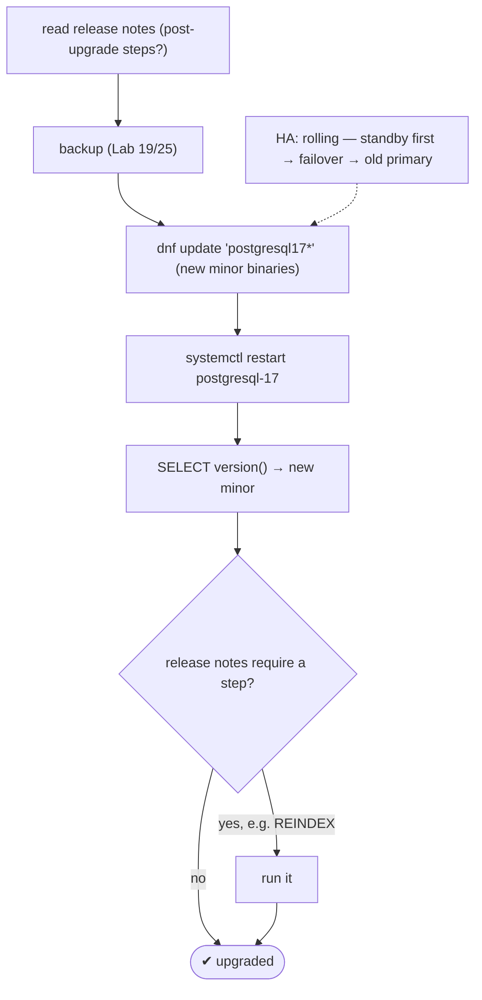
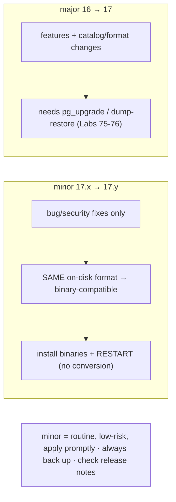

# Lab 74 — Minor-Version Upgrade (17.x → 17.y) via RPM; Verify with `SELECT version()`

> **Track A · DBA · A11 Upgrade & Migration · Lab 1 of 3 (Lab 74/222)**
> Teaching package: concept → diagram → steps → verify → quick-ref → self-test → video script.
> **Depends on:** Lab 01 (RPM install), Lab 19/25 (backups). Opens the upgrade track.

---

## 0. Lab Card (at a glance)

| Field | Value |
|---|---|
| **Objective** | Upgrade PostgreSQL from one minor version to the next via RPM — install new binaries, restart, and verify — understanding why no data conversion is needed. |
| **Success criterion** | `SELECT version()` shows the new minor version; the server starts cleanly on the same data directory; any release-note step is applied. |
| **Scope boundary** | Minor (binary-compatible) upgrade. Major upgrades are Labs 75–76. |
| **Prereqs** | Lab 01; a backup (Lab 19/25) |
| **Time** | 15–25 min |
| **Difficulty** | ★★☆☆☆ |
| **Risk** | Low — brief restart; always back up first. |

---

## 1. Learning Objectives

1. **Minor vs major** — what changes and what doesn't.
2. **Why no conversion** — binary compatibility.
3. **The RPM steps** — update + restart.
4. **The one caveat** — release notes / post-upgrade steps.
5. **Minimize downtime** — rolling upgrade for HA.

---

## 2. Concept Primer — the "why"

**Minor upgrades are the easy case — because the data format doesn't change.** PostgreSQL versions are `major.minor`: `17` is the **major**, `17.4`/`17.5` the **minor**.
- A **minor** upgrade (17.4 → 17.5) contains **only bug fixes and security patches**. There are **no catalog or on-disk format changes** — the data directory is **identical** and **binary-compatible**. So upgrading is just: **install the new binaries, restart**. No `pg_upgrade`, no dump/restore, no data migration.
- A **major** upgrade (16 → 17) adds features and may change the on-disk/catalog format → it **requires** `pg_upgrade` or dump/restore (Labs 75–76).

**Apply minor upgrades promptly.** They carry security fixes and are **low-risk** precisely because there's no data conversion. Skipping them leaves known vulnerabilities in place. This is routine, expected maintenance.

**The RPM process (AlmaLinux/PGDG):**
1. **Read the release notes** for the target minor — usually nothing special, but *occasionally* a minor release requires a **post-upgrade step** (e.g. a `REINDEX` because a fixed bug affected certain indexes). This is the one thing that catches people.
2. **Back up** (Lab 19/25) — always, even for a minor.
3. **Update the packages:** `dnf update 'postgresql17*'` — pulls the new minor binaries from PGDG. (The `17*` pin keeps you on major 17; don't accidentally pull PG18.)
4. **Restart:** `systemctl restart postgresql-17` — loads the new binaries. Brief downtime (seconds).
5. **Verify:** `SELECT version();`.

**Downtime & HA.** A standalone upgrade's downtime is just the restart. For **high availability**, do a **rolling upgrade**: update+restart the **standby** first, **failover** (Lab 30) so it becomes primary, then upgrade the old primary — near-zero downtime.

**Rollback.** If needed, `dnf downgrade` to the previous minor and restart — usually fine since the data format is unchanged. Your backup is the ultimate safety net. And if the release shipped a new **extension** version, run `ALTER EXTENSION … UPDATE` afterward.

---

## 3. Diagrams

### 3.1 Minor upgrade flow



### 3.2 Minor vs major



---

## 4. Prerequisites

```bash
sudo -u postgres psql -c "SELECT version();"                     # current minor
sudo -u postgres psql -tAc "SHOW server_version_num;"            # e.g. 170004 = 17.4
dnf list installed 'postgresql17*' | head
```

---

## 5. Step-by-Step

### Step 1 — Check what's available + read release notes

```bash
dnf check-update 'postgresql17*'    # shows a newer 17.y if available
#   READ the release notes for that minor: https://www.postgresql.org/docs/release/  (any post-upgrade step?)
```

### Step 2 — Back up first (always)

```bash
sudo -u postgres pg_dumpall -f /backup/pre_minor_upgrade.sql      # or pgBackRest (Lab 25)
sudo chmod 600 /backup/pre_minor_upgrade.sql
```

### Step 3 — Update the packages

```bash
sudo dnf update -y 'postgresql17*'     # new minor binaries (stays on major 17)
```

### Step 4 — Restart to load the new binaries

```bash
sudo systemctl restart postgresql-17
systemctl status postgresql-17 --no-pager | head -3
```

### Step 5 — Verify the new version

```bash
sudo -u postgres psql -c "SELECT version();"
sudo -u postgres psql -tAc "SHOW server_version;"                 # the new 17.y
sudo -u postgres psql -tAc "SHOW server_version_num;"
```

### Step 6 — Apply any release-note step (e.g. REINDEX) + update extensions

```bash
# ONLY if the release notes call for it (rare) — example:
# sudo -u postgres reindexdb --all --concurrently
# update any extension whose version bumped:
sudo -u postgres psql -d benchdb -c "SELECT name, installed_version, default_version FROM pg_available_extensions WHERE installed_version <> default_version;"
# for each: ALTER EXTENSION <name> UPDATE;
```

---

## 6. Verification Checklist

- [ ] Read the target minor's release notes
- [ ] Backup taken before upgrading
- [ ] `dnf update 'postgresql17*'` pulled the new minor (stayed on major 17)
- [ ] Service restarted cleanly on the **same** data directory
- [ ] `SELECT version()` shows the new minor
- [ ] Any release-note post-step applied
- [ ] Extensions updated if their version bumped

---

## 7. Troubleshooting

| Symptom | Cause | Fix |
|---|---|---|
| Won't start after update | Missed release-note step / dependency | `journalctl -u postgresql-17`; read release notes |
| Version unchanged | Old binaries / no restart | Confirm `dnf` updated; `systemctl restart` |
| `dnf` wants a major (18) | Wrong pin | Use `'postgresql17*'`; don't install `postgresql18` |
| Index issue after upgrade | Release fixed an index bug | `REINDEX` per release notes |
| Need to roll back | Regression | `dnf downgrade 'postgresql17*'` + restart; restore backup if needed |
| Extension error | Extension version bumped | `ALTER EXTENSION … UPDATE` |
| HA downtime longer than needed | Not rolling | Upgrade standby first → failover → old primary |

---

## 8. Quick Reference Card (paste-ready)

```bash
# 1. read release notes for the target minor (postgresql.org/docs/release)
# 2. BACK UP (always):  pg_dumpall -f /backup/pre_upgrade.sql   (or pgBackRest, Lab 25)
# 3. update binaries (stays on major 17):
sudo dnf update -y 'postgresql17*'
# 4. restart:
sudo systemctl restart postgresql-17
# 5. verify:
sudo -u postgres psql -c "SELECT version();"

# minor upgrade = SAME data format → install + restart, NO conversion · apply promptly (security)
# HA: rolling (standby first → failover → old primary) · rollback: dnf downgrade + restart
# post-steps only if release notes say so (rare, e.g. REINDEX) · ALTER EXTENSION UPDATE if bumped
```

---

## 9. Self-Check

1. What changes in a minor upgrade vs a major one, format-wise?
2. Why does a minor upgrade need no `pg_upgrade` or dump/restore?
3. What are the minor-upgrade steps?
4. Why apply minor upgrades promptly?
5. What's the one thing to always check before a minor upgrade?
6. How do you verify the upgrade?

<details>
<summary>Answers</summary>

1. Minor = **only bug/security fixes**, identical on-disk format (binary-compatible); major = features + possible format/catalog changes.
2. The data directory format is **unchanged**, so the new binaries read the same data — no conversion needed.
3. Read release notes → back up → `dnf update 'postgresql17*'` → restart → verify.
4. They contain **security and bug fixes** and are low-risk (no data migration).
5. The **release notes** — occasionally a minor release requires a post-upgrade step (e.g. `REINDEX`).
6. `SELECT version();` (and `SHOW server_version`).
</details>

---

## 10. Video / Teaching Script

| # | On screen | Say (narration) |
|---|---|---|
| 1 | Title: "The easy upgrade: minor versions" | "Minor upgrades — 17.4 to 17.5 — are the simple case. Same data format, so it's just new binaries and a restart." |
| 2 | current version | "Here's what we're on. We want the latest 17-dot-something, for the security fixes." |
| 3 | release notes + backup | "Two habits, always: skim the release notes for any special step, and back up first — even for a minor." |
| 4 | dnf update + restart | "Update the packages, restart the service. Seconds of downtime. Notice — nothing touched the data directory." |
| 5 | SELECT version() | "And there it is — new version, same data. Done." |
| 6 | HA note | "Running a standby? Upgrade it first, fail over, then the old primary — near-zero downtime." |
| 7 | Outro | "Minor upgrades: routine and safe. Next: the harder one — a major version upgrade with pg_upgrade." |

---

## 11. Glossary

- **Minor version** — the second number (17.**x**); bug/security fixes only.
- **Major version** — the first number (**17**); features + possible format change.
- **Binary compatibility** — same on-disk format across a major's minors.
- **`dnf update 'postgresql17*'`** — pull new minor binaries.
- **Release notes** — check for any post-upgrade step.
- **Rolling upgrade** — standby-first, failover, then primary (HA).
- **`ALTER EXTENSION … UPDATE`** — bump an extension version.

---
*NETAPORT lab series · PostgreSQL 17 on AlmaLinux 9 · Lab 74/222 · A11 Upgrade & Migration*
