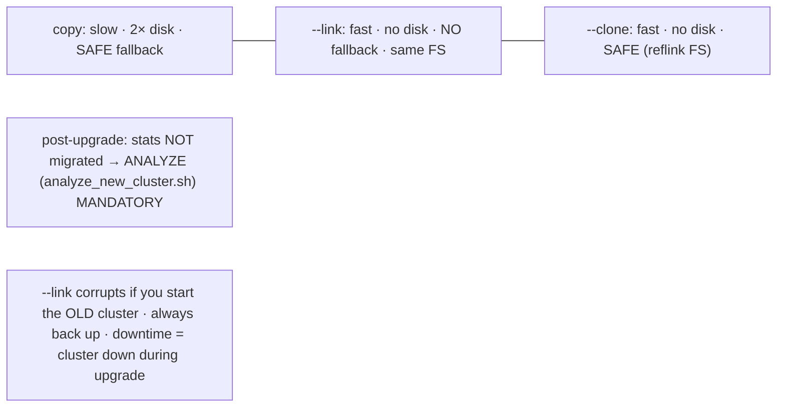

# Lab 75 — Major-Version Upgrade with `pg_upgrade` (`--link` and Copy Modes); Validate + `analyze` After

> **Track A · DBA · A11 Upgrade & Migration · Lab 2 of 3 (Lab 75/222)**
> Teaching package: concept → diagram → steps → verify → quick-ref → self-test → video script.
> **Depends on:** Labs 01/07 (side-by-side installs), 74 (minor upgrade), 19/25 (backups).

---

## 0. Lab Card (at a glance)

| Field | Value |
|---|---|
| **Objective** | Upgrade a cluster across a major version with `pg_upgrade`, compare copy vs `--link` modes, and run the mandatory post-upgrade ANALYZE. |
| **Success criterion** | `pg_upgrade --check` passes; the upgrade completes; the new cluster starts on the migrated data; `SELECT version()` shows the new major; ANALYZE regenerates stats. |
| **Scope boundary** | In-place `pg_upgrade`. Minor was Lab 74; near-zero-downtime logical upgrade is Lab 76. |
| **Prereqs** | Old + new major binaries installed; a backup |
| **Time** | 35–50 min |
| **Difficulty** | ★★★★☆ |
| **Risk** | **Medium–High** — major upgrade; `--link` is **one-way** (no fallback to the old cluster). Back up. |

---

## 1. Learning Objectives

1. **When pg_upgrade is needed** — major (format-changing) upgrades.
2. **Prerequisites** — side-by-side binaries, initdb'd new cluster, both stopped.
3. **`--check`** — validate compatibility first.
4. **copy vs `--link` vs `--clone`** — speed/disk/fallback trade-offs.
5. **The mandatory ANALYZE** — stats aren't migrated.

---

## 2. Concept Primer — the "why"

**Major upgrades change the format — so minor's "just restart" won't do.** A major upgrade (16 → 17) can change the **catalog and on-disk format**, so the new binaries can't simply read the old data directory (unlike a minor, Lab 74). `pg_upgrade` migrates the cluster **in place** — it recreates the system catalogs for the new version and reuses the data files — far faster than a full dump/restore for large clusters.

**Prerequisites:**
- **Both** major versions' binaries installed **side by side** (`/usr/pgsql-16/bin` and `/usr/pgsql-17/bin` — Labs 01/07).
- A **new, empty** cluster `initdb`'d for the target version, with **matching locale/encoding** to the old one.
- **Both clusters stopped** during the upgrade.

**`--check` first — a dry run.** `pg_upgrade --check` validates that the old cluster *can* be upgraded (data types, extensions, incompatibilities) **without changing anything**. Always run it and clear any issues before the real upgrade.

**The three modes — the core trade-off:**

| Mode | How | Speed | Disk | Fallback to old cluster |
|---|---|---|---|---|
| **copy** (default) | physically **copies** data files | slow | ~**2×** | **yes** (old cluster untouched) |
| **`--link`** | **hard-links** files (same inodes) | **fast** (seconds) | none extra | **NO** (clusters share files) |
| **`--clone`** | copy-on-write **reflink** (btrfs/XFS) | fast | none extra | **yes** (independent copies) |

- **copy** is the safe default: the old cluster is untouched, so you can fall back — but you need ~2× disk and it's slow on big clusters.
- **`--link`** is dramatically faster and uses no extra disk, but it's **one-way**: the old and new clusters now **share the same data files**, so **you must never start the old cluster again** (it would corrupt the shared files). No fallback except from **backup**. Also requires old and new data dirs on the **same filesystem** (hard links can't cross filesystems).
- **`--clone`** gives link's speed *and* copy's safety — if the filesystem supports reflinks. Prefer it when available.

**The mandatory post-upgrade ANALYZE (the step people skip and regret).** `pg_upgrade` does **not** carry over optimizer **statistics**. Right after the upgrade every table has **no stats**, so the planner makes terrible choices and queries crawl. You **must** run ANALYZE — pg_upgrade generates `analyze_new_cluster.sh`, which runs `vacuumdb --all --analyze-in-stages` (three progressive passes for usable stats fast). **Do this immediately** after starting the new cluster.

**Downtime:** the cluster is **down during the upgrade** — brief with `--link`/`--clone`, longer with copy. For truly minimal-downtime major upgrades, use **logical replication** (Lab 76) or **`pg_createsubscriber`** (Lab 35).

---

## 3. Diagrams

### 3.1 Upgrade flow

```mermaid
flowchart TD
    A["install OLD + NEW major binaries side by side"] --> B["initdb NEW cluster (empty, matching locale)"]
    B --> C["STOP both clusters + BACK UP"]
    C --> D["pg_upgrade --check (compatibility dry-run)"]
    D --> E{mode}
    E -->|copy (safe, 2× disk)| F["physical copy"]
    E -->|--link (fast, one-way)| G["hard links — NO fallback"]
    E -->|--clone (fast+safe, reflink FS)| H["CoW clone"]
    F & G & H --> I["start NEW cluster"]
    I --> J["run analyze_new_cluster.sh (MANDATORY — stats not migrated)"]
    J --> K["SELECT version() + validate + delete_old_cluster.sh (after verify)"]
    K --> L([✔ upgraded])
```

### 3.2 Mode trade-off



---

## 4. Prerequisites (example: upgrade 16 → 17; adapt to your versions)

```bash
# both majors installed:
ls /usr/pgsql-16/bin/pg_upgrade /usr/pgsql-17/bin/pg_upgrade 2>/dev/null || echo "install both major RPMs (Lab 01)"
# old cluster data + new (empty) cluster data:
OLD_BIN=/usr/pgsql-16/bin; NEW_BIN=/usr/pgsql-17/bin
OLD_DATA=/var/lib/pgsql/16/data; NEW_DATA=/var/lib/pgsql/17/data
# ensure old cluster's locale/encoding, then initdb the NEW cluster to match:
sudo -u postgres $OLD_BIN/pg_controldata $OLD_DATA | grep -Ei "encoding|collate|ctype"
```

---

## 5. Step-by-Step

### Step 1 — initdb the new cluster (matching locale) + back up the old

```bash
sudo -u postgres $NEW_BIN/initdb -D $NEW_DATA --encoding=UTF8 --locale=en_US.UTF-8 -k
sudo -u postgres pg_dumpall -p 5432 -f /backup/pre_major_upgrade.sql    # from the OLD cluster (safety net)
```

### Step 2 — Stop BOTH clusters

```bash
sudo systemctl stop postgresql-16 postgresql-17
```

### Step 3 — Compatibility check (dry-run, changes nothing)

```bash
sudo -u postgres $NEW_BIN/pg_upgrade \
  --old-bindir=$OLD_BIN --new-bindir=$NEW_BIN \
  --old-datadir=$OLD_DATA --new-datadir=$NEW_DATA \
  --check
#   → "Clusters are compatible" (fix any reported incompatibilities first)
```

### Step 4 — Run the upgrade (choose a mode)

```bash
# COPY (safe, 2× disk) — omit --link:
# sudo -u postgres $NEW_BIN/pg_upgrade --old-bindir=$OLD_BIN --new-bindir=$NEW_BIN --old-datadir=$OLD_DATA --new-datadir=$NEW_DATA

# --LINK (fast, no extra disk, ONE-WAY — same filesystem required):
sudo -u postgres $NEW_BIN/pg_upgrade \
  --old-bindir=$OLD_BIN --new-bindir=$NEW_BIN \
  --old-datadir=$OLD_DATA --new-datadir=$NEW_DATA \
  --link
#   (or --clone on a reflink-capable FS for fast + safe)
```

### Step 5 — Start the new cluster + MANDATORY analyze

```bash
sudo systemctl start postgresql-17
# stats were NOT migrated — regenerate them NOW (pg_upgrade wrote this script):
sudo -u postgres ./analyze_new_cluster.sh 2>/dev/null \
  || sudo -u postgres /usr/pgsql-17/bin/vacuumdb --all --analyze-in-stages
```

### Step 6 — Validate

```bash
sudo -u postgres psql -c "SELECT version();"                          # new major (17.x)
sudo -u postgres psql -d benchdb -c "SELECT count(*) FROM pgbench_accounts;"   # data intact
# extensions may need updating:
sudo -u postgres psql -d benchdb -c "SELECT name, installed_version, default_version FROM pg_available_extensions WHERE installed_version <> default_version;"
```

### Step 7 — Retire the old cluster (only after verifying)

```bash
# pg_upgrade generated a script to remove the old data dir:
# sudo -u postgres ./delete_old_cluster.sh        # run ONLY once you're confident (esp. after --link)
```

---

## 6. Verification Checklist

- [ ] Both major binaries installed; new cluster `initdb`'d with matching locale
- [ ] Both clusters stopped; backup taken
- [ ] `pg_upgrade --check` reported compatible
- [ ] Upgrade completed in the chosen mode (copy/`--link`/`--clone`)
- [ ] New cluster started; `SELECT version()` shows the new major
- [ ] `analyze_new_cluster.sh` (or `vacuumdb --analyze-in-stages`) run — **stats regenerated**
- [ ] Data validated; extensions updated; old cluster not started after `--link`

---

## 7. Troubleshooting

| Symptom | Cause | Fix |
|---|---|---|
| `--check` fails | Incompatible objects/extensions/types | Fix per the report (drop/upgrade); re-check |
| `--link`: "cannot cross filesystems" | Old/new data on different filesystems | Use the same FS, or copy mode |
| Corruption after `--link` | Started the OLD cluster | Never do that; restore from backup |
| Queries crawl after upgrade | **Skipped ANALYZE** | Run `analyze_new_cluster.sh` / `vacuumdb --analyze-in-stages` |
| Locale/encoding error | New cluster initdb'd differently | Re-initdb with the old cluster's locale/encoding |
| Extension missing | Not installed for new major | Install matching extension packages; `ALTER EXTENSION … UPDATE` |
| Need a fallback but used `--link` | One-way | Restore from backup (why copy/`--clone` keep fallback) |

---

## 8. Quick Reference Card (paste-ready)

```bash
OLD_BIN=/usr/pgsql-16/bin; NEW_BIN=/usr/pgsql-17/bin
OLD_DATA=/var/lib/pgsql/16/data; NEW_DATA=/var/lib/pgsql/17/data

# prep: initdb new (matching locale) · BACK UP · STOP both
sudo -u postgres $NEW_BIN/initdb -D $NEW_DATA --encoding=UTF8 --locale=en_US.UTF-8 -k
sudo systemctl stop postgresql-16 postgresql-17

# CHECK (dry-run):
sudo -u postgres $NEW_BIN/pg_upgrade --old-bindir=$OLD_BIN --new-bindir=$NEW_BIN --old-datadir=$OLD_DATA --new-datadir=$NEW_DATA --check

# UPGRADE:  copy (omit --link, safe/2× disk) · --link (fast/one-way/same FS) · --clone (fast+safe, reflink FS)
sudo -u postgres $NEW_BIN/pg_upgrade --old-bindir=$OLD_BIN --new-bindir=$NEW_BIN --old-datadir=$OLD_DATA --new-datadir=$NEW_DATA --link

# POST: start new → MANDATORY analyze (stats NOT migrated) → validate
sudo systemctl start postgresql-17
sudo -u postgres ./analyze_new_cluster.sh   # or: vacuumdb --all --analyze-in-stages
sudo -u postgres psql -c "SELECT version();"
# retire old (after verifying): ./delete_old_cluster.sh
# ⚠ after --link NEVER start the old cluster · minimal-downtime major upgrade → logical (Lab 76)
```

---

## 9. Self-Check

1. When do you need `pg_upgrade` instead of a minor upgrade?
2. What are the trade-offs of copy vs `--link` vs `--clone`?
3. What must you never do after an `--link` upgrade, and why?
4. What's the mandatory post-upgrade step, and why?
5. What does `pg_upgrade --check` do?
6. What are the prerequisites for `pg_upgrade`?

<details>
<summary>Answers</summary>

1. For a **major** upgrade — the catalog/on-disk format can change, so new binaries can't just read the old data dir.
2. copy = slow, 2× disk, **safe fallback**; `--link` = fast, no extra disk, **no fallback** (shared files, same FS); `--clone` = fast **and** safe fallback (needs reflink FS).
3. **Never start the old cluster** — with `--link` it shares data files with the new one, so starting it corrupts them. No fallback except backup.
4. **ANALYZE** (`analyze_new_cluster.sh` / `vacuumdb --analyze-in-stages`) — statistics aren't migrated, so plans are bad until you regenerate them.
5. A **dry-run compatibility validation** that changes nothing.
6. Both majors' binaries installed side by side, a new empty cluster `initdb`'d with matching locale/encoding, both clusters stopped (and a backup).
</details>

---

## 10. Video / Teaching Script

| # | On screen | Say (narration) |
|---|---|---|
| 1 | Title: "The big one: major-version upgrade" | "Major upgrades change the data format, so 'just restart' won't work. pg_upgrade migrates in place — fast, if you do it right." |
| 2 | prereqs + check | "Install both versions side by side, init an empty new cluster, stop both — then always run --check first. It tells you if anything's incompatible, without touching a thing." |
| 3 | copy vs link | "Two modes. Copy is safe — the old cluster survives, but you need double the disk. Link is *instant* — but it's one-way. Start the old cluster after linking and you've corrupted both." |
| 4 | run --link | "We'll link. Seconds, regardless of database size." |
| 5 | ANALYZE | "Now the step everyone forgets: statistics don't come across. Until you ANALYZE, every query is flying blind. Run the script immediately." |
| 6 | validate | "New version, data intact, plans healthy. Verify before you delete the old cluster." |
| 7 | Outro | "A major upgrade, in minutes. But it still needs downtime — next lab, we do it with near-zero downtime using logical replication." |

---

## 11. Glossary

- **pg_upgrade** — in-place major-version upgrade tool.
- **`--check`** — dry-run compatibility validation.
- **copy / `--link` / `--clone`** — physical copy / hard links / CoW reflink.
- **One-way (`--link`)** — old cluster unusable afterward.
- **`analyze_new_cluster.sh`** — regenerates stats (not migrated).
- **`delete_old_cluster.sh`** — removes the old data dir.
- **`--old-bindir` / `--new-bindir`** — the two versions' binaries.

---
*NETAPORT lab series · PostgreSQL 17 on AlmaLinux 9 · Lab 75/222 · A11 Upgrade & Migration*
