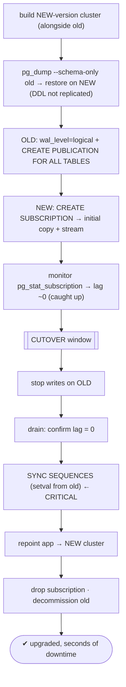

# Lab 76 — Zero-Downtime Major Upgrade Using Logical Replication Between Old and New Clusters

> **Track A · DBA · A11 Upgrade & Migration · Lab 3 of 3 (Lab 76/222 · A11 complete)**
> Teaching package: concept → diagram → steps → verify → quick-ref → self-test → video script.
> **Depends on:** Labs 33 (logical replication), 35 (pg_createsubscriber), 75 (pg_upgrade), 30 (cutover).

---

## 0. Lab Card (at a glance)

| Field | Value |
|---|---|
| **Objective** | Upgrade across a major version with near-zero downtime by logically replicating from the old cluster to a new-version cluster, then cutting over — handling schema and sequences explicitly. |
| **Success criterion** | The new-version cluster catches up via logical replication; a brief cutover (stop writes → drain → sync sequences → repoint) moves the app with only seconds of downtime; data matches. |
| **Scope boundary** | The logical-replication upgrade path. In-place `pg_upgrade` was Lab 75. |
| **Prereqs** | Labs 33/35; old + new major clusters |
| **Time** | 45–70 min |
| **Difficulty** | ★★★★★ |
| **Risk** | Medium — high-stakes cutover; sequence sync is critical. |

---

## 1. Learning Objectives

1. **Why logical replication enables it** — cross-version, near-zero downtime.
2. **Pre-create the schema** — DDL isn't replicated.
3. **Set up + monitor** replication old → new.
4. **The cutover** — stop writes, drain, **sync sequences**, repoint.
5. **The faster variant** — `pg_createsubscriber` skips the initial copy.

---

## 2. Concept Primer — the "why"

**`pg_upgrade` needs the cluster down; logical replication doesn't.** In Lab 75, the cluster is offline during the upgrade. For systems that can't tolerate that, exploit a key property from Lab 33: **logical replication works across major versions**. So you stand up a **new-version** cluster, **logically replicate** the old cluster into it while both run, let it **catch up**, and then **cut over** in a window of only **seconds** — the app is down just long enough to drain final changes and repoint. That's the near-zero-downtime major upgrade.

**The workflow:**
1. **Build the new cluster** on the target major version, running alongside the old.
2. **Pre-create the schema on the new cluster** — logical replication replicates **data, not DDL** (Lab 33). `pg_dump --schema-only` from old → restore on new (and `pg_dumpall -g` for globals). *Any DDL during the migration must be applied to both.*
3. **Replicate:** `wal_level=logical` + `CREATE PUBLICATION … FOR ALL TABLES` on the **old**; `CREATE SUBSCRIPTION` on the **new** → it does the **initial data copy**, then streams changes. (Tables need a **replica identity**/PK for UPDATE/DELETE.)
4. **Catch up:** wait until the subscription's lag is ~0 (monitor `pg_stat_subscription`).
5. **Cutover (the brief downtime):**
   - **Stop writes** to the old cluster (maintenance mode / stop the app).
   - **Drain** — confirm all remaining changes have replicated (lag = 0).
   - **Sync sequences** — *(see below)*.
   - **Repoint** the app to the new cluster.
   - **Drop the subscription**.
6. The new cluster is now primary; decommission the old.

**The two things you MUST handle yourself:**
- **Schema/DDL** — not replicated → pre-create it (and mirror any DDL applied mid-migration).
- **Sequences — the critical gotcha.** Logical replication replicates table **data**, **not sequence state**. The new cluster's sequences stay at their initial values, so once you point writes at it, new inserts **reuse old IDs → duplicate-key errors / data corruption**. **At cutover you must advance the new cluster's sequences to match the old** (`setval()` from each sequence's `last_value`, or dump the sequences). Skipping this breaks the upgrade.

**The faster variant — skip the initial copy.** For large databases the initial snapshot is slow/heavy. **`pg_createsubscriber`** (Lab 35) converts a **physical standby** (byte-identical, no copy) into a logical subscriber — then you `pg_upgrade` that subscriber to the new version while logical replication continues cross-version. Same cutover, but no gigabytes re-copied.

**Downtime = only the cutover window** (stop-writes → drain → sync sequences → repoint), typically seconds — not the whole upgrade.

---

## 3. Diagrams

### 3.1 Upgrade-by-replication flow



### 3.2 What replicates vs what you handle

```mermaid
flowchart LR
    OLD["OLD cluster (PG16)"] -->|logical replication (CROSS-VERSION): table DATA| NEW["NEW cluster (PG17)"]
    subgraph MANUAL [you must handle]
      S1["schema/DDL → pg_dump -s pre-create"]
      S2["sequences → setval at cutover"]
      S3["replica identity (PK) for UPDATE/DELETE"]
    end
    note["downtime = cutover only · pg_createsubscriber skips the initial copy (Lab 35) · vs pg_upgrade whole-cluster downtime"]
```

---

## 4. Prerequisites (example 16 → 17; adapt versions/ports)

```bash
# OLD = PG16 on 5432 (has data) ; NEW = PG17 on 5433 (empty, running)
OLD="host=127.0.0.1 port=5432 dbname=benchdb"
sudo -u postgres psql "port=5432" -c "ALTER SYSTEM SET wal_level='logical';"   # on OLD
sudo systemctl restart postgresql-16
sudo -u postgres psql -p 5432 -c "SHOW wal_level;"   # logical
```

---

## 5. Step-by-Step

### Step 1 — Pre-create schema + globals on the NEW cluster

```bash
# globals (roles/tablespaces) then schema-only (DDL isn't replicated):
sudo -u postgres pg_dumpall -p 5432 -g | sudo -u postgres psql -p 5433
sudo -u postgres pg_dump -p 5432 -d benchdb --schema-only | sudo -u postgres psql -p 5433 -d benchdb
```

### Step 2 — Publication on OLD, subscription on NEW

```bash
# on OLD (5432):
sudo -u postgres psql -p 5432 -d benchdb -c "CREATE PUBLICATION upgrade_pub FOR ALL TABLES;"
# on NEW (5433): subscription does initial copy + streams
sudo -u postgres psql -p 5433 -d benchdb -c "
CREATE SUBSCRIPTION upgrade_sub
  CONNECTION 'host=127.0.0.1 port=5432 dbname=benchdb user=repl password=ReplPass!1'
  PUBLICATION upgrade_pub;"
```

### Step 3 — Monitor catch-up

```bash
# on NEW: watch until it's caught up (received ≈ latest_end)
watch -n 3 "sudo -u postgres psql -p 5433 -d benchdb -x -c \"SELECT subname, received_lsn, latest_end_lsn FROM pg_stat_subscription;\""
# on OLD: replication lag toward the subscriber
sudo -u postgres psql -p 5432 -c "SELECT application_name, replay_lag FROM pg_stat_replication;"
```

### Step 4 — CUTOVER: stop writes, drain

```bash
# stop the app / block writes to OLD (e.g., set default_transaction_read_only, revoke, or stop the app tier):
sudo -u postgres psql -p 5432 -d benchdb -c "ALTER DATABASE benchdb SET default_transaction_read_only = on;"
# confirm the subscriber drained everything (lag 0):
sudo -u postgres psql -p 5432 -tAc "SELECT pg_current_wal_lsn();"      # OLD current
sudo -u postgres psql -p 5433 -d benchdb -tAc "SELECT latest_end_lsn FROM pg_stat_subscription;"   # NEW applied — should match/exceed
```

### Step 5 — SYNC SEQUENCES (the critical step)

```bash
# generate setval statements from OLD's sequences and apply on NEW:
sudo -u postgres psql -p 5432 -d benchdb -tAc "
SELECT format('SELECT setval(%L, %s, true);', schemaname||'.'||sequencename, last_value)
FROM pg_sequences WHERE last_value IS NOT NULL;" | sudo -u postgres psql -p 5433 -d benchdb
#   → NEW's sequences now match OLD's — no duplicate IDs after cutover
```

### Step 6 — Repoint the app + drop the subscription

```bash
# point the application to the NEW cluster (5433) — DNS/VIP/connstring/target_session_attrs (Lab 30)
sudo -u postgres psql -p 5433 -d benchdb -c "DROP SUBSCRIPTION upgrade_sub;"    # detach from old
# NEW is now the primary. Verify + decommission old.
sudo -u postgres psql -p 5433 -c "SELECT version();"
sudo -u postgres psql -p 5433 -d benchdb -c "SELECT count(*) FROM pgbench_accounts;"
```

---

## 6. Verification Checklist

- [ ] NEW cluster on the target major version, running
- [ ] Schema + globals pre-created on NEW (DDL not replicated)
- [ ] Publication (old) + subscription (new); initial copy + streaming
- [ ] Subscriber caught up (lag ~0) before cutover
- [ ] Writes stopped on OLD; final changes drained
- [ ] **Sequences synced** (setval from old) — no duplicate IDs
- [ ] App repointed to NEW; subscription dropped; data validated

---

## 7. Troubleshooting

| Symptom | Cause | Fix |
|---|---|---|
| Tables missing on NEW | Schema not pre-created | `pg_dump --schema-only` before subscribing |
| Duplicate key after cutover | **Sequences not synced** | `setval` from OLD's `last_value` before writes on NEW |
| Subscriber never catches up | Large initial copy / lag | Wait; monitor `pg_stat_subscription`; use `pg_createsubscriber` (Lab 35) to skip the copy |
| UPDATE/DELETE not replicating | No replica identity | Add PK / `REPLICA IDENTITY FULL` (Lab 33) |
| DDL changes lost | DDL isn't replicated | Apply mid-migration DDL to both clusters |
| Data loss at cutover | Didn't drain final lag | Ensure lag = 0 after stopping writes |
| Schema restore errors | Cross-version DDL differences | Test the schema restore on NEW first |

---

## 8. Quick Reference Card (paste-ready)

```bash
# OLD=5432, NEW=5433 (new major)
# 1. schema + globals to NEW (DDL NOT replicated):
sudo -u postgres pg_dumpall -p 5432 -g | sudo -u postgres psql -p 5433
sudo -u postgres pg_dump -p 5432 -d benchdb --schema-only | sudo -u postgres psql -p 5433 -d benchdb
# 2. replicate (OLD wal_level=logical):
sudo -u postgres psql -p 5432 -d benchdb -c "CREATE PUBLICATION upgrade_pub FOR ALL TABLES;"
sudo -u postgres psql -p 5433 -d benchdb -c "CREATE SUBSCRIPTION upgrade_sub CONNECTION 'host=127.0.0.1 port=5432 dbname=benchdb user=repl password=...' PUBLICATION upgrade_pub;"
# 3. wait for lag ~0 (pg_stat_subscription) → CUTOVER:
sudo -u postgres psql -p 5432 -d benchdb -c "ALTER DATABASE benchdb SET default_transaction_read_only=on;"   # stop writes
# 4. SYNC SEQUENCES (critical):
sudo -u postgres psql -p 5432 -d benchdb -tAc "SELECT format('SELECT setval(%L,%s,true);', schemaname||'.'||sequencename, last_value) FROM pg_sequences WHERE last_value IS NOT NULL;" | sudo -u postgres psql -p 5433 -d benchdb
# 5. repoint app → NEW · DROP SUBSCRIPTION upgrade_sub · decommission old

# downtime = CUTOVER window only (seconds) · logical replication is CROSS-VERSION
# faster (skip initial copy): pg_createsubscriber (Lab 35)
```

---

## 9. Self-Check

1. Why does logical replication enable a near-zero-downtime major upgrade?
2. What two things does logical replication NOT replicate that you must handle?
3. What are the cutover steps?
4. Why must you sync sequences, and when?
5. How do you skip the slow initial copy?
6. What is the actual downtime?

<details>
<summary>Answers</summary>

1. It works **across major versions**, so you replicate old → new while both run and cut over in seconds — versus `pg_upgrade`'s whole-cluster downtime.
2. **Schema/DDL** (pre-create with `pg_dump -s`) and **sequences** (sync at cutover).
3. Stop writes on old → drain remaining lag → **sync sequences** → repoint the app → drop the subscription.
4. Sequence state isn't replicated, so the new cluster's sequences lag; without syncing, new inserts reuse old IDs → duplicate keys. Do it **at cutover**, after writes stop.
5. **`pg_createsubscriber`** — convert a physical standby to a logical subscriber (Lab 35), reusing existing data.
6. Only the **cutover window** — seconds/minutes to drain, sync sequences, and repoint — not the whole upgrade.
</details>

---

## 10. Video / Teaching Script

| # | On screen | Say (narration) |
|---|---|---|
| 1 | Title: "Upgrade a major version — without downtime" | "pg_upgrade takes the database offline. But logical replication works across versions — so we can upgrade while the old one keeps serving." |
| 2 | schema pre-create | "First trap: logical replication copies *data*, not schema. So we dump the schema to the new cluster ourselves." |
| 3 | publication + subscription | "Then replicate: publish everything on the old, subscribe on the new. It copies the data, then streams every change." |
| 4 | catch-up | "Let it catch up — lag near zero. Both clusters live, the old one still taking traffic." |
| 5 | cutover + sequences | "Now the cutover — seconds long. Stop writes, drain the last changes, and — critically — sync the sequences. Miss that, and your new cluster hands out IDs that already exist." |
| 6 | repoint | "Repoint the app, drop the subscription. Done — new major version, seconds of downtime." |
| 7 | Outro | "That completes Upgrade and Migration — and the whole DBA operational track." |

---

## 11. Glossary

- **Logical replication upgrade** — cross-version replicate then cut over.
- **Publication / subscription** — old-side / new-side replication objects.
- **Schema pre-creation** — DDL isn't replicated; dump it first.
- **Sequence sync** — `setval` new sequences to match old at cutover.
- **Cutover** — the brief write-stop + repoint window.
- **Replica identity** — PK needed for UPDATE/DELETE replication.
- **`pg_createsubscriber`** — skip the initial copy (Lab 35).

---
*NETAPORT lab series · PostgreSQL 17 on AlmaLinux 9 · Lab 76/222 · **A11 Upgrade & Migration complete***
