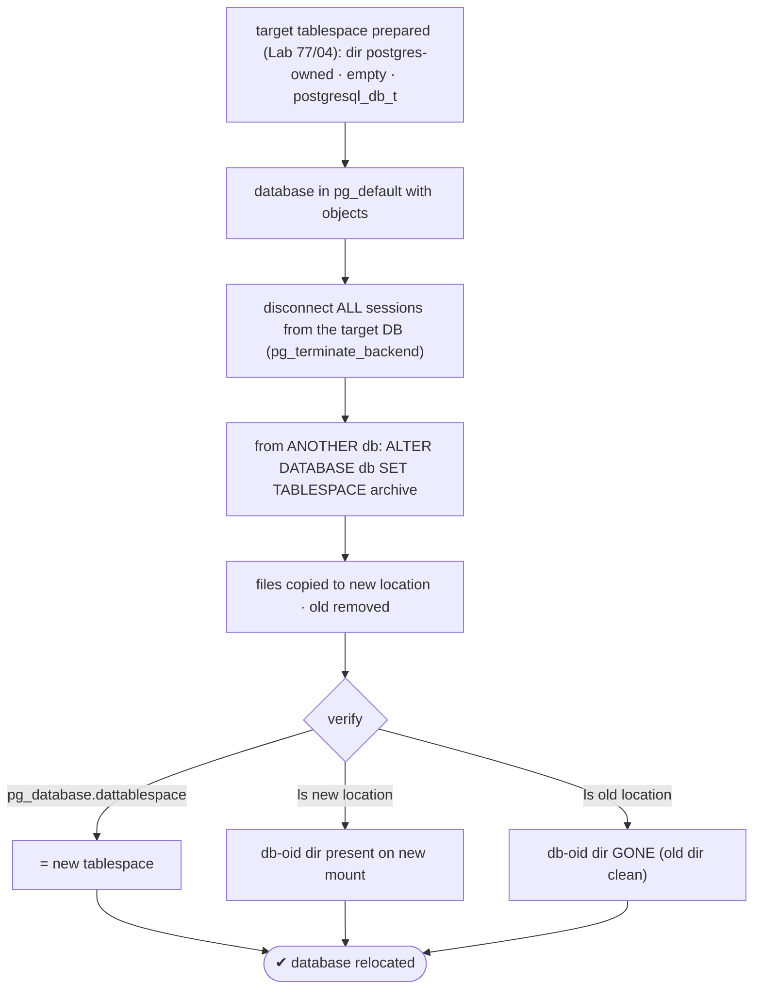
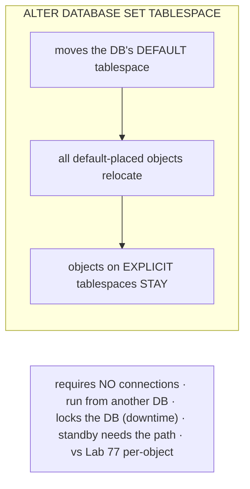

# Lab 78 — Move an Entire Database's Default Tablespace; Confirm Files Relocated and Old Dir Clean

> **Track A · DBA · A12 Storage & Tablespaces · Lab 2 of 2 (Lab 78/222 · A12 complete · DBA track complete)**
> Teaching package: concept → diagram → steps → verify → quick-ref → self-test → video script.
> **Depends on:** Lab 77 (create tablespace / per-object move), Lab 04 (volumes/SELinux), Lab 52 (terminate backends).

---

## 0. Lab Card (at a glance)

| Field | Value |
|---|---|
| **Objective** | Move an entire database's default tablespace to a new location, and verify the files relocated and the old directory is clean. |
| **Success criterion** | `pg_database.dattablespace` points to the new tablespace; the database's files are under the new location; the old location no longer holds them. |
| **Scope boundary** | Whole-database default-tablespace move. Per-object move was Lab 77. |
| **Prereqs** | Lab 77 (a prepared target tablespace); ability to disconnect the target DB |
| **Time** | 25–35 min |
| **Difficulty** | ★★★☆☆ |
| **Risk** | Medium — the whole database is locked and offline during the move; needs no active connections. |

---

## 1. Learning Objectives

1. **`ALTER DATABASE … SET TABLESPACE`** — move a database's default.
2. **The no-connections rule** — run from another database.
3. **What moves vs stays** — default-placed objects vs explicit ones.
4. **Verify** — catalog, new files, clean old directory.
5. **Caveats** — lock/downtime, disk, standby.

---

## 2. Concept Primer — the "why"

**A database has a *default* tablespace.** Objects created without an explicit `TABLESPACE` clause land in the database's default (usually `pg_default`, the data dir). **`ALTER DATABASE db SET TABLESPACE new_ts;`** changes that default **and physically relocates** every object currently in the **old default** to the **new** tablespace's location — the whole database's data files move at once. Use it to migrate an entire database onto a different disk/volume (e.g. move a whole archive database to cheaper storage), rather than moving objects one at a time (Lab 77).

**What moves — and what doesn't.** Only objects in the **old default** tablespace move. Objects you **explicitly** placed on *another* tablespace (Lab 77, e.g. `TABLESPACE fast`) **stay where they are** — the move touches the default-placed objects only.

**The operational constraint — no connections.** `ALTER DATABASE … SET TABLESPACE` requires that **no one is connected to the target database** — including you. So you:
1. Connect to a **different** database (e.g. `postgres`).
2. **Terminate** any other sessions on the target (`pg_terminate_backend`, Lab 52) — and optionally block new ones.
3. Run the `ALTER`.

The move **locks the database** and takes it **offline** for the duration (it copies all files to the new location, then removes the old) — so it's **downtime** for that database; plan a window for a large one.

**Prep the target directory** exactly as in Labs 77/04: the tablespace must already exist on a directory that's **postgres-owned, empty, and `postgresql_db_t`-labeled**. Ensure the new location has **disk space** for the whole database (both copies may briefly coexist).

**Verify the move:**
- `pg_database.dattablespace` for the database → the **new** tablespace's OID.
- The database's files (a subdirectory named by the **database OID**) now live under the **new** tablespace's location.
- The **old** location (e.g. `$PGDATA/base/<dboid>`) **no longer** contains that database's directory — the old dir is clean.

**Standby caveat (Lab 77):** the new tablespace path must exist on any physical standby too.

---

## 3. Diagrams

### 3.1 Move + verify flow



### 3.2 Whole-DB move vs per-object



---

## 4. Prerequisites

```bash
# a prepared target tablespace on a separate mount (Lab 77). Example: 'archive' on /mnt/archive/pgdata
sudo mkdir -p /mnt/archive/pgdata && sudo chown -R postgres:postgres /mnt/archive/pgdata && sudo chmod 0700 /mnt/archive/pgdata
sudo semanage fcontext -a -t postgresql_db_t "/mnt/archive/pgdata(/.*)?" 2>/dev/null || true
sudo restorecon -Rv /mnt/archive/pgdata
sudo -u postgres psql -c "CREATE TABLESPACE archive LOCATION '/mnt/archive/pgdata';" 2>/dev/null || true

# a database to move, with objects in its default tablespace:
sudo -u postgres psql -c "CREATE DATABASE moveme_db;" 2>/dev/null || true
sudo -u postgres psql -d moveme_db -c "CREATE TABLE t1 AS SELECT g id, md5(g::text) v FROM generate_series(1,50000) g; CREATE INDEX ON t1(id);"
```

### Note the OLD location before moving

```bash
DBOID=$(sudo -u postgres psql -tAc "SELECT oid FROM pg_database WHERE datname='moveme_db';")
echo "moveme_db oid = $DBOID"
sudo -u postgres psql -c "SELECT datname, dattablespace::regclass AS current_tablespace FROM pg_database WHERE datname='moveme_db';"
sudo ls -ld /var/lib/pgsql/17/data/base/$DBOID       # the db's files under pg_default (data dir) — before
```

---

## 5. Step-by-Step

### Step 1 — Disconnect everyone from the target database

```bash
# terminate other sessions on moveme_db (run from postgres db):
sudo -u postgres psql -d postgres -c "
SELECT pg_terminate_backend(pid) FROM pg_stat_activity WHERE datname='moveme_db' AND pid <> pg_backend_pid();"
# (optionally block new connections while moving)
sudo -u postgres psql -d postgres -c "ALTER DATABASE moveme_db WITH ALLOW_CONNECTIONS false;"
```

### Step 2 — Move the database's default tablespace (from another DB)

```bash
sudo -u postgres psql -d postgres -c "ALTER DATABASE moveme_db SET TABLESPACE archive;"
# re-allow connections:
sudo -u postgres psql -d postgres -c "ALTER DATABASE moveme_db WITH ALLOW_CONNECTIONS true;"
```

### Step 3 — Confirm the catalog reflects the new tablespace

```bash
sudo -u postgres psql -c "SELECT datname, dattablespace::regclass AS tablespace FROM pg_database WHERE datname='moveme_db';"
#   → tablespace = archive
```

### Step 4 — Confirm files moved to the new location

```bash
DBOID=$(sudo -u postgres psql -tAc "SELECT oid FROM pg_database WHERE datname='moveme_db';")
sudo find /mnt/archive/pgdata -maxdepth 2 -name "$DBOID" -type d     # the db-oid dir now under archive
sudo du -sh /mnt/archive/pgdata/PG_*/$DBOID 2>/dev/null
```

### Step 5 — Confirm the OLD directory is clean

```bash
sudo ls -ld /var/lib/pgsql/17/data/base/$DBOID 2>&1 | tail -1
#   → "No such file or directory" — the db's files are gone from the old default location
```

### Step 6 — Data intact + objects on explicit tablespaces unaffected

```bash
sudo -u postgres psql -d moveme_db -c "SELECT count(*) FROM t1;"      # 50000 — data intact
# any table you'd explicitly put on another tablespace (Lab 77) would still be there, not moved.
```

---

## 6. Verification Checklist

- [ ] Target tablespace prepared (postgres-owned, empty, labeled) and created
- [ ] All sessions disconnected from the target DB before the move
- [ ] `ALTER DATABASE … SET TABLESPACE` ran from another database
- [ ] `pg_database.dattablespace` = the new tablespace
- [ ] The db-oid directory is present under the **new** location
- [ ] The db-oid directory is **gone** from the old (`base/`) location
- [ ] Data intact; explicit-tablespace objects unaffected

---

## 7. Troubleshooting

| Symptom | Cause | Fix |
|---|---|---|
| "database … is being accessed by other users" | Active connections | `pg_terminate_backend` all sessions; set `ALLOW_CONNECTIONS false` during the move |
| "cannot change the tablespace of the currently open database" | Connected to the target | Run the `ALTER` from **another** database (postgres) |
| Explicit-tablespace objects didn't move | By design | Only default-placed objects move |
| Out of disk | New location too small | Ensure room for the whole database |
| Old files remain | Interrupted move | Retry; verify/clean orphans |
| Standby fails / path missing | Tablespace path absent on replica | Create matching path on standby (Lab 77) |
| Long downtime | Whole DB locked during move | Plan a window; large DBs take time |

---

## 8. Quick Reference Card (paste-ready)

```bash
# prep target tablespace (Lab 77/04): postgres-owned · empty · postgresql_db_t · CREATE TABLESPACE
# 1. disconnect everyone from the target DB (run from postgres):
sudo -u postgres psql -d postgres -c "ALTER DATABASE moveme_db WITH ALLOW_CONNECTIONS false;
  SELECT pg_terminate_backend(pid) FROM pg_stat_activity WHERE datname='moveme_db' AND pid<>pg_backend_pid();"
# 2. move (from ANOTHER db):
sudo -u postgres psql -d postgres -c "ALTER DATABASE moveme_db SET TABLESPACE archive;"
sudo -u postgres psql -d postgres -c "ALTER DATABASE moveme_db WITH ALLOW_CONNECTIONS true;"

# verify:
sudo -u postgres psql -c "SELECT datname, dattablespace::regclass FROM pg_database WHERE datname='moveme_db';"
DBOID=$(sudo -u postgres psql -tAc "SELECT oid FROM pg_database WHERE datname='moveme_db';")
sudo find /mnt/archive/pgdata -name "$DBOID" -type d           # new location has it
sudo ls /var/lib/pgsql/17/data/base/$DBOID                     # old: gone (clean)

# moves the DB DEFAULT (all default-placed objects) · explicit-tablespace objects STAY
# NO connections during move · run from another DB · locks the DB (downtime) · standby needs the path
```

---

## 9. Self-Check

1. What does `ALTER DATABASE … SET TABLESPACE` do?
2. What's the key requirement to run it, and from where?
3. Do objects on explicit (non-default) tablespaces move?
4. How do you confirm the move — catalog and filesystem?
5. How does this differ from Lab 77's per-object move?
6. What's the lock/downtime implication?

<details>
<summary>Answers</summary>

1. Changes the database's **default** tablespace and physically relocates all objects in the old default to the new one.
2. **No connections** to the target database; run the `ALTER` from **another** database (e.g. `postgres`).
3. **No** — only objects in the old default move; explicitly-placed objects stay.
4. `pg_database.dattablespace` shows the new tablespace; the db-OID directory appears under the new location and is **gone** from the old (`base/`) directory.
5. Lab 77 moves a single table/index; this moves a **whole database's default** and all its default-placed objects at once.
6. It **locks the database offline** for the duration of the file move — downtime; plan a window.
</details>

---

## 10. Video / Teaching Script

| # | On screen | Say (narration) |
|---|---|---|
| 1 | Title: "Move a whole database to another disk" | "Last lab we moved one table. Now the whole database — every default-placed object — in one command." |
| 2 | disconnect | "The one hard rule: nobody can be connected, including you. Kick everyone off, block new logins, and run it from *another* database." |
| 3 | ALTER DATABASE | "One statement moves it all. It copies the files to the new tablespace, then clears the old." |
| 4 | verify catalog + files | "Confirm three things: the catalog points at the new tablespace, the files are on the new mount, and the old directory is empty." |
| 5 | explicit stays | "One subtlety — anything you'd deliberately pinned to another tablespace stays put. Only the default moves." |
| 6 | downtime note | "And it's offline while it moves. For a big database, that's a maintenance window." |
| 7 | Outro | "A whole database, relocated. And that completes the entire DBA track — install to storage, A to Z." |

---

## 11. Glossary

- **Default tablespace** — where a database's unqualified objects live (`dattablespace`).
- **`ALTER DATABASE … SET TABLESPACE`** — move a database's default + its objects.
- **No-connections rule** — the target DB must have no sessions.
- **Database OID directory** — the per-database folder named by OID.
- **Explicit tablespace** — an object placed on a specific tablespace (stays).
- **`ALLOW_CONNECTIONS`** — block/allow logins during the move.

---
*NETAPORT lab series · PostgreSQL 17 on AlmaLinux 9 · Lab 78/222 · **A12 Storage & Tablespaces complete · DBA TRACK (A1–A12) COMPLETE***
