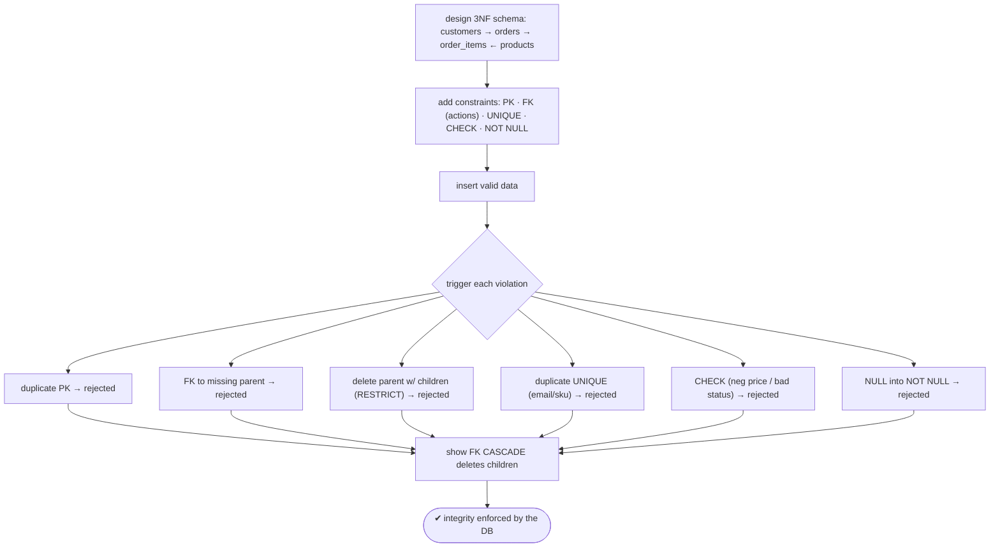

# Lab 79 — Model a Normalized OLTP Schema (3NF) with PK/FK/Unique/Check Constraints; Test Constraint Violations

> **Track B · Developer · B1 Schema Design & Data Modeling · Lab 1 of 8 (Lab 79/222)**
> Teaching package: concept → diagram → steps → verify → quick-ref → self-test → video script.
> **Depends on:** A-track fundamentals. Opens the developer track. **Feeds:** Labs 80–86 (keys, constraints, hierarchies).

---

## 0. Lab Card (at a glance)

| Field | Value |
|---|---|
| **Objective** | Design a normalized (3NF) OLTP schema with primary keys, foreign keys, unique and check constraints, then deliberately trigger each constraint violation to confirm enforcement. |
| **Success criterion** | The schema models entities without redundancy; every constraint type rejects its violation (duplicate PK, bad FK, delete-with-children, duplicate unique, failed check, null). |
| **Scope boundary** | 3NF modeling + declarative constraints. Keys deep-dive is Lab 80; deferrable Lab 81; exclusion Lab 82. |
| **Prereqs** | A database to build in |
| **Time** | 30–40 min |
| **Difficulty** | ★★★☆☆ |
| **Risk** | Low — schema design; scratch database. |

---

## 1. Learning Objectives

1. **Normalization / 3NF** — the rule and why it matters for OLTP.
2. **The constraint toolkit** — PK, FK, UNIQUE, CHECK, NOT NULL.
3. **Referential integrity** — FK actions (CASCADE/RESTRICT/…).
4. **Test enforcement** — trigger each violation.
5. **Deliberate exceptions** — when storing a "redundant" value is correct.

---

## 2. Concept Primer — the "why"

**Normalization removes redundancy so data can't contradict itself.** The progression:
- **1NF** — atomic values, no repeating groups (no comma-lists in a cell).
- **2NF** — 1NF + no *partial* dependency (with a composite key, every non-key attribute depends on the **whole** key).
- **3NF** — 2NF + no *transitive* dependency (non-key attributes depend on the key, **not on other non-key attributes**).

The mnemonic: **"every non-key attribute depends on the key, the whole key, and nothing but the key."** OLTP schemas normalize to **3NF** to eliminate redundancy and prevent **update anomalies** (change a customer's email once, not in every order). *(Analytics/OLAP often deliberately denormalize for read speed — different trade-off.)*

**The constraint toolkit — integrity enforced by the database, not hoped for in app code:**
- **PRIMARY KEY** — unique + not null; identifies each row (one per table; can be composite). Backed by a unique index.
- **FOREIGN KEY** — references a PK/unique elsewhere, enforcing **referential integrity** (no orphan rows). `ON DELETE`/`ON UPDATE` actions: `CASCADE` (propagate), `SET NULL`, `SET DEFAULT`, `RESTRICT`/`NO ACTION` (block).
- **UNIQUE** — no duplicates. It **allows NULLs** — and by default treats multiple NULLs as *distinct* (so several NULLs are permitted); PG15+ adds `UNIQUE NULLS NOT DISTINCT` to forbid that.
- **CHECK** — a boolean expression that must hold per row (`CHECK (price > 0)`, `CHECK (status IN (…))`) — domain/business rules.
- **NOT NULL** — the column must have a value.

**A 3NF OLTP example (e-commerce):** `customers` (one row per customer) → `orders` (one per order, FK to customer) → `order_items` (one per order line, composite PK, FKs to order + product) ← `products` (one per product). Customer data lives *only* in `customers`; storing `customer_email` in `orders` would be a **transitive dependency** (email depends on customer, not order) — a 3NF violation.

**The deliberate exception people misjudge.** `order_items.unit_price` looks redundant (products have a price) — but it's **correct to store it**. The price *at the time of the order* is a **fact about that order line**, not derivable from the *current* product price (which changes). Storing it isn't a 3NF violation; it captures history. Modeling judgment: distinguish true redundancy from point-in-time facts.

**FK performance note:** a foreign key indexes the *referenced* side (the PK), but **not** the *referencing* column — index FK columns yourself for join/lookup performance and faster parent deletes.

---

## 3. Diagrams

### 3.1 Model + test flow



### 3.2 3NF entities + constraints

```mermaid
flowchart LR
    C["customers (PK id · UNIQUE email)"] -->|FK customer_id| O["orders (PK id · CHECK status/total)"]
    O -->|FK order_id (CASCADE)| OI["order_items (PK order_id,product_id · CHECK qty>0)"]
    P["products (PK id · UNIQUE sku · CHECK price>0)"] -->|FK product_id (RESTRICT)| OI
    note["3NF: attr depends on key, whole key, nothing but the key · unit_price = point-in-time fact (OK) · index FK columns"]
```

---

## 4. Prerequisites

```bash
sudo -u postgres createdb shopdb 2>/dev/null || true
```

---

## 5. Step-by-Step

### Step 1 — Design the normalized 3NF schema

```bash
sudo -u postgres psql -d shopdb <<'SQL'
DROP TABLE IF EXISTS order_items, orders, products, customers CASCADE;

CREATE TABLE customers (
  customer_id  bigint GENERATED ALWAYS AS IDENTITY PRIMARY KEY,
  email        text NOT NULL UNIQUE,                         -- UNIQUE + NOT NULL
  name         text NOT NULL,
  created_at   timestamptz NOT NULL DEFAULT now()
);

CREATE TABLE products (
  product_id   bigint GENERATED ALWAYS AS IDENTITY PRIMARY KEY,
  sku          text NOT NULL UNIQUE,
  name         text NOT NULL,
  price        numeric(10,2) NOT NULL CHECK (price > 0)      -- CHECK: positive price
);

CREATE TABLE orders (
  order_id     bigint GENERATED ALWAYS AS IDENTITY PRIMARY KEY,
  customer_id  bigint NOT NULL REFERENCES customers ON DELETE RESTRICT,   -- FK, block parent delete
  order_date   timestamptz NOT NULL DEFAULT now(),
  status       text NOT NULL DEFAULT 'pending'
                 CHECK (status IN ('pending','paid','shipped','cancelled')),
  total        numeric(12,2) NOT NULL DEFAULT 0 CHECK (total >= 0)
);

CREATE TABLE order_items (
  order_id     bigint NOT NULL REFERENCES orders ON DELETE CASCADE,        -- children go with the order
  product_id   bigint NOT NULL REFERENCES products ON DELETE RESTRICT,     -- can't delete a product in use
  quantity     int NOT NULL CHECK (quantity > 0),
  unit_price   numeric(10,2) NOT NULL CHECK (unit_price >= 0),             -- point-in-time price (intentional)
  PRIMARY KEY (order_id, product_id)                                       -- composite PK (junction table)
);
CREATE INDEX ON orders (customer_id);          -- index FK columns (not automatic)
CREATE INDEX ON order_items (product_id);
SQL
```

### Step 2 — Insert valid data

```bash
sudo -u postgres psql -d shopdb <<'SQL'
INSERT INTO customers (email, name) VALUES ('a@co','Asha'), ('r@co','Ravi');
INSERT INTO products (sku, name, price) VALUES ('SKU1','Widget',9.99), ('SKU2','Gadget',19.50);
INSERT INTO orders (customer_id, status, total) VALUES (1,'paid',29.49);
INSERT INTO order_items (order_id, product_id, quantity, unit_price) VALUES (1,1,1,9.99),(1,2,1,19.50);
SQL
```

### Step 3 — Test PRIMARY KEY + UNIQUE violations

```bash
sudo -u postgres psql -d shopdb -c "INSERT INTO order_items VALUES (1,1,5,9.99);" 2>&1 | tail -1   # dup composite PK
sudo -u postgres psql -d shopdb -c "INSERT INTO customers (email,name) VALUES ('a@co','Dup');" 2>&1 | tail -1   # dup UNIQUE email
#   → duplicate key value violates unique constraint
```

### Step 4 — Test FOREIGN KEY violations

```bash
sudo -u postgres psql -d shopdb -c "INSERT INTO orders (customer_id) VALUES (999);" 2>&1 | tail -1   # FK: no such customer
sudo -u postgres psql -d shopdb -c "DELETE FROM customers WHERE customer_id=1;" 2>&1 | tail -1        # RESTRICT: has orders
#   → violates foreign key constraint
```

### Step 5 — Test CHECK + NOT NULL violations

```bash
sudo -u postgres psql -d shopdb -c "INSERT INTO products (sku,name,price) VALUES ('SKU3','Bad',-5);" 2>&1 | tail -1   # CHECK price>0
sudo -u postgres psql -d shopdb -c "UPDATE orders SET status='unknown' WHERE order_id=1;" 2>&1 | tail -1              # CHECK status
sudo -u postgres psql -d shopdb -c "INSERT INTO customers (name) VALUES ('NoEmail');" 2>&1 | tail -1                  # NOT NULL email
#   → violates check constraint / null value in column violates not-null constraint
```

### Step 6 — Show FK CASCADE (children follow the parent)

```bash
sudo -u postgres psql -d shopdb -c "SELECT count(*) FROM order_items WHERE order_id=1;"   # 2
sudo -u postgres psql -d shopdb -c "DELETE FROM orders WHERE order_id=1;"                 # ON DELETE CASCADE
sudo -u postgres psql -d shopdb -c "SELECT count(*) FROM order_items WHERE order_id=1;"   # 0 — items cascaded away
```

---

## 6. Verification Checklist

- [ ] Schema is 3NF (no redundant/transitive-dependent columns)
- [ ] PK, FK, UNIQUE, CHECK, NOT NULL all present
- [ ] Duplicate PK / UNIQUE rejected
- [ ] FK to missing parent rejected; RESTRICT blocks parent delete
- [ ] CHECK rejects bad price/status; NOT NULL rejects missing email
- [ ] CASCADE removes child rows with the parent
- [ ] FK columns indexed; `unit_price` justified as point-in-time

---

## 7. Troubleshooting

| Symptom | Cause | Fix |
|---|---|---|
| FK error on insert | Parent row doesn't exist | Insert the parent first |
| Can't delete parent | Children reference it (RESTRICT) | Delete children first, or use `ON DELETE CASCADE` |
| Multiple NULLs allowed in UNIQUE | NULLs distinct by default | `UNIQUE NULLS NOT DISTINCT` (PG15+) |
| CHECK too strict/loose | Expression | Adjust the `CHECK` condition |
| Slow FK joins / parent deletes | FK column not indexed | Index the referencing column |
| Circular FK insert fails | Chicken-and-egg | Use `DEFERRABLE` constraints (Lab 81) |
| Over-normalized (too many joins) | Excess decomposition | Balance; denormalize deliberately where justified |

---

## 8. Quick Reference Card (paste-ready)

```sql
-- 3NF: every non-key attr depends on the KEY, the WHOLE key, and NOTHING BUT the key
CREATE TABLE customers (customer_id bigint GENERATED ALWAYS AS IDENTITY PRIMARY KEY,
  email text NOT NULL UNIQUE, name text NOT NULL);
CREATE TABLE orders (order_id bigint GENERATED ALWAYS AS IDENTITY PRIMARY KEY,
  customer_id bigint NOT NULL REFERENCES customers ON DELETE RESTRICT,
  status text NOT NULL CHECK (status IN ('pending','paid','shipped','cancelled')));
CREATE TABLE order_items (order_id bigint REFERENCES orders ON DELETE CASCADE,
  product_id bigint REFERENCES products ON DELETE RESTRICT,
  quantity int CHECK (quantity>0), unit_price numeric CHECK (unit_price>=0),
  PRIMARY KEY (order_id, product_id));            -- composite PK (junction)
CREATE INDEX ON orders(customer_id);              -- FK columns aren't auto-indexed

-- constraints: PRIMARY KEY · FOREIGN KEY (ON DELETE CASCADE/RESTRICT/SET NULL) · UNIQUE (NULLS [NOT] DISTINCT) · CHECK · NOT NULL
-- unit_price = POINT-IN-TIME fact (not a 3NF violation) · index FK columns for performance
```

---

## 9. Self-Check

1. State the 3NF rule in one sentence.
2. Name the five main constraint types.
3. What does a foreign key enforce, and what are its `ON DELETE` options?
4. Does `UNIQUE` allow NULLs? How many?
5. Why store `unit_price` in `order_items` when products already have a price?
6. Are foreign-key columns indexed automatically?

<details>
<summary>Answers</summary>

1. Every non-key attribute depends on **the key, the whole key, and nothing but the key** (no partial or transitive dependencies).
2. PRIMARY KEY, FOREIGN KEY, UNIQUE, CHECK, NOT NULL.
3. **Referential integrity** (no orphan rows); `ON DELETE`: CASCADE / SET NULL / SET DEFAULT / RESTRICT / NO ACTION.
4. Yes — and by default multiple NULLs are allowed (treated as distinct); `NULLS NOT DISTINCT` (PG15+) forbids that.
5. It's the **point-in-time** price — a fact about that order line, not derivable from the ever-changing current product price; storing it captures history and isn't a 3NF violation.
6. **No** — the referenced PK is indexed, but the referencing FK column must be indexed manually for performance.
</details>

---

## 10. Video / Teaching Script

| # | On screen | Say (narration) |
|---|---|---|
| 1 | Title: "A schema that can't hold bad data" | "Good design isn't just tidy tables — it's constraints that make invalid data *impossible*. Let's build one and try to break it." |
| 2 | 3NF entities | "Normalize to third normal form: each fact in one place. Customer email lives with the customer — never copied into orders." |
| 3 | constraints | "Then the guardrails: primary keys, foreign keys, uniques, checks. The database enforces them — not your app code." |
| 4 | test violations | "Now attack it. Duplicate key? Rejected. Order for a customer who doesn't exist? Rejected. Negative price? Rejected. Every bad write bounces." |
| 5 | cascade | "And relationships behave: delete an order, and its line items go with it — automatically." |
| 6 | unit_price nuance | "One judgment call: we store the price *on the order line*. Looks redundant — but it's history. The price then isn't the price now." |
| 7 | Outro | "Integrity by design. Next: choosing surrogate versus natural keys." |

---

## 11. Glossary

- **Normalization / 3NF** — removing redundancy; the key/whole-key/nothing-but rule.
- **Primary key / composite key** — row identifier (single or multi-column).
- **Foreign key** — reference enforcing integrity; `ON DELETE` actions.
- **UNIQUE / NULLS NOT DISTINCT** — no duplicates; NULL handling.
- **CHECK / NOT NULL** — value rules / required value.
- **Junction table** — associative table for many-to-many (composite PK).
- **Transitive dependency** — non-key depends on another non-key (3NF violation).

---
*NETAPORT lab series · PostgreSQL 17 on AlmaLinux 9 · Lab 79/222 · B1 Schema Design & Data Modeling*
