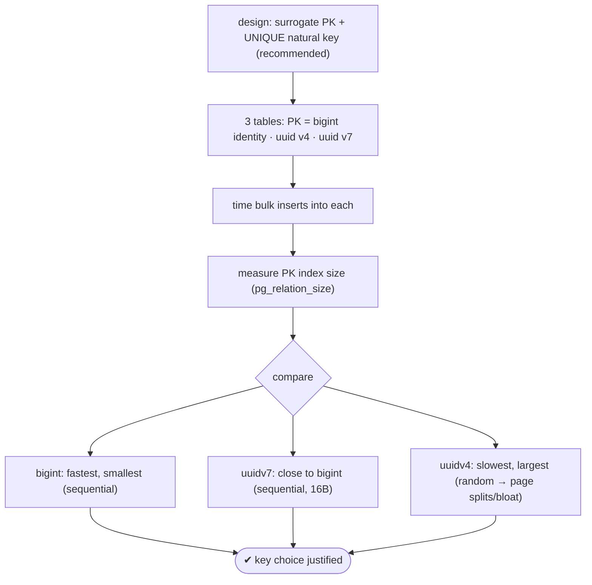
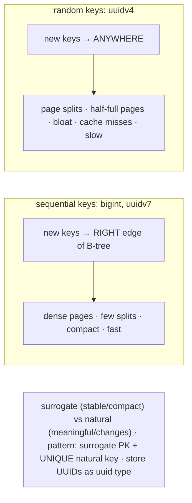

# Lab 80 — Surrogate vs Natural Keys; Benchmark `bigint` Identity vs UUID (v4 vs v7) as PK

> **Track B · Developer · B1 Schema Design & Data Modeling · Lab 2 of 8 (Lab 80/222)**
> Teaching package: concept → diagram → steps → verify → quick-ref → self-test → video script.
> **Depends on:** Lab 79 (constraints), Lab 09 (pgbench/timing). **Related:** Labs 95–102 (indexing).

---

## 0. Lab Card (at a glance)

| Field | Value |
|---|---|
| **Objective** | Contrast surrogate vs natural keys, then benchmark three surrogate PK types — `bigint` identity, UUIDv4, UUIDv7 — for insert speed and index size. |
| **Success criterion** | A recorded comparison showing `bigint`/UUIDv7 (sequential) beat UUIDv4 (random) on insert time and index size; you can justify a key choice. |
| **Scope boundary** | Key design + PK type benchmark. Deferrable is Lab 81; exclusion Lab 82. |
| **Prereqs** | Lab 79; a database; a UUIDv7 generator (provided) |
| **Time** | 35–50 min |
| **Difficulty** | ★★★★☆ |
| **Risk** | Low — benchmark on scratch tables. |

---

## 1. Learning Objectives

1. **Surrogate vs natural keys** — trade-offs and the recommended pattern.
2. **PK type options** — `bigint` identity, UUIDv4, UUIDv7.
3. **Index locality** — why sequential beats random.
4. **Measure** — insert time + PK index size for each.
5. **Choose** — the right key for the situation.

---

## 2. Concept Primer — the "why"

**Surrogate vs natural — the design choice.**
- A **natural key** is real-world data that identifies a row (email, SKU, ISBN, country code). Meaningful, no extra column — but it can **change** (an email edit cascades through FKs), can be **large/composite** (bigger indexes, slower joins), may not be truly stable/unique, and can raise privacy issues (SSN as a key).
- A **surrogate key** is a synthetic, meaningless identifier the system generates (an integer or UUID). **Stable** (never changes), **compact**, no business meaning — at the cost of an extra column and needing a join to reach meaningful data.
- **Recommended pattern:** a **surrogate PK for stability + a UNIQUE constraint on the natural key** for integrity (Lab 79). Natural keys as the PK only when they're genuinely small and immutable.

**Three surrogate PK types — and their performance story:**

- **`bigint` identity** (`GENERATED … AS IDENTITY`) — a 64-bit auto-increment (8 bytes). **Sequential**: new values append to the **right edge** of the B-tree → minimal page splits, compact index, cache-friendly, **fast inserts**. Downsides: **predictable/guessable** (enumeration; reveals row counts/rates), and it needs a **central sequence** (coordination pain in sharded/distributed systems).

- **UUIDv4 (random)** — a 128-bit fully random UUID (16 bytes), `gen_random_uuid()` (core). **Globally unique**, **unguessable**, generable anywhere (no coordination). But **random → poor index locality**: inserts **scatter** across the B-tree, causing **page splits**, **index bloat**, cache misses, and WAL amplification → **slower inserts and larger indexes** at volume.

- **UUIDv7 (time-ordered)** — a 128-bit UUID with a **timestamp prefix** (RFC 9562). **Sequential** like `bigint` (good locality) **and** globally unique like a UUID — the best of both. Costs: 16 bytes (2× `bigint`) and the timestamp **leaks creation time**.

> **PG17 note:** core provides `gen_random_uuid()` (v4) but **no native `uuidv7()`** — that arrives in **PG18**. For PG17, use the `pg_uuidv7` extension, generate app-side, or the SQL function in this lab.

**Why locality dominates the benchmark.** A B-tree fills best when new keys are **monotonically increasing** — each insert lands at the rightmost leaf, pages fill densely, few splits. Random keys (v4) land **anywhere**, splitting pages and leaving them half-full → a bigger, more fragmented index and more I/O per insert. `bigint` and UUIDv7 are sequential; UUIDv4 is not. That single property drives most of the difference you'll measure.

**Choosing:** `bigint` for single-node OLTP (smallest/fastest, if guessability is acceptable); **UUIDv7** when you need global uniqueness/no-coordination **and** good locality; UUIDv4 when unguessability is paramount and locality matters less. Always store UUIDs in the `uuid` type (16 bytes), never `text` (36 bytes).

---

## 3. Diagrams

### 3.1 Benchmark flow



### 3.2 Index locality



---

## 4. Prerequisites — a UUIDv7 generator (PG17)

```bash
sudo -u postgres psql -d shopdb <<'SQL'
-- time-ordered UUID (v7-style: 48-bit ms timestamp prefix → sequential locality)
CREATE OR REPLACE FUNCTION uuidv7() RETURNS uuid LANGUAGE sql VOLATILE AS $$
  SELECT (
    lpad(to_hex((extract(epoch from clock_timestamp())*1000)::bigint), 12, '0')
    || '7' || substr(md5(random()::text),1,3)
    || '8' || substr(md5(random()::text),1,3)
    ||         substr(md5(random()::text),1,12)
  )::uuid;
$$;
-- (PG18 has native uuidv7(); or use the pg_uuidv7 extension)
SELECT uuidv7(), uuidv7();     -- note the shared time prefix (ordered)
SQL
```

---

## 5. Step-by-Step

### Step 1 — Three tables, three PK types

```bash
sudo -u postgres psql -d shopdb <<'SQL'
DROP TABLE IF EXISTS k_bigint, k_uuidv4, k_uuidv7;
CREATE TABLE k_bigint (id bigint GENERATED ALWAYS AS IDENTITY PRIMARY KEY, v text);
CREATE TABLE k_uuidv4 (id uuid DEFAULT gen_random_uuid() PRIMARY KEY, v text);
CREATE TABLE k_uuidv7 (id uuid DEFAULT uuidv7()          PRIMARY KEY, v text);
SQL
```

### Step 2 — Time bulk inserts into each

```bash
N=2000000
echo "== bigint identity =="
time sudo -u postgres psql -d shopdb -c "INSERT INTO k_bigint (v) SELECT md5(g::text) FROM generate_series(1,$N) g;"
echo "== uuid v4 (random) =="
time sudo -u postgres psql -d shopdb -c "INSERT INTO k_uuidv4 (v) SELECT md5(g::text) FROM generate_series(1,$N) g;"
echo "== uuid v7 (time-ordered) =="
time sudo -u postgres psql -d shopdb -c "INSERT INTO k_uuidv7 (v) SELECT md5(g::text) FROM generate_series(1,$N) g;"
```

### Step 3 — Compare PK index sizes

```bash
sudo -u postgres psql -d shopdb -c "
SELECT relname,
       pg_size_pretty(pg_relation_size(relname||'_pkey')) AS pk_index_size,
       pg_size_pretty(pg_relation_size(relname))          AS table_size
FROM (VALUES ('k_bigint'),('k_uuidv4'),('k_uuidv7')) t(relname);"
#   expect: bigint smallest PK index · uuidv7 a bit larger (16B, sequential) · uuidv4 largest (bloat)
```

### Step 4 — Confirm the locality difference (index bloat)

```bash
sudo -u postgres psql -d shopdb -c "CREATE EXTENSION IF NOT EXISTS pgstattuple;"
sudo -u postgres psql -d shopdb -c "
SELECT 'k_uuidv4' AS pk, avg_leaf_density FROM pgstatindex('k_uuidv4_pkey')
UNION ALL SELECT 'k_uuidv7', avg_leaf_density FROM pgstatindex('k_uuidv7_pkey')
UNION ALL SELECT 'k_bigint', avg_leaf_density FROM pgstatindex('k_bigint_pkey');"
#   uuidv4 has LOWER leaf density (random inserts left pages half-full)
```

### Step 5 — The recommended pattern (surrogate PK + UNIQUE natural)

```bash
sudo -u postgres psql -d shopdb -c "
CREATE TABLE users_good (
  id    bigint GENERATED ALWAYS AS IDENTITY PRIMARY KEY,   -- stable surrogate PK
  email text NOT NULL UNIQUE                               -- natural key enforced, not the PK
);"
#   PK never changes even if email does; integrity still guaranteed on email.
```

---

## 6. Verification Checklist & Results Table

- [ ] `uuidv7()` generator returns time-ordered UUIDs (shared prefix)
- [ ] Insert times recorded for all three PK types
- [ ] PK index sizes compared
- [ ] `uuidv4` shows lower `avg_leaf_density` (bloat) than v7/bigint
- [ ] `bigint` fastest/smallest; `uuidv4` slowest/largest
- [ ] Recommended pattern (surrogate PK + UNIQUE natural) built
- [ ] Can justify a key choice for a given scenario

| PK type | insert time | PK index size | leaf density |
|---|---|---|---|
| bigint identity | | | |
| uuid v7 (ordered) | | | |
| uuid v4 (random) | | | |

---

## 7. Troubleshooting

| Symptom | Cause | Fix |
|---|---|---|
| `uuidv7()` missing | Not native in PG17 | Use the provided function / `pg_uuidv7` (PG18 has native) |
| UUIDv4 inserts slow, index huge | Random locality (page splits) | Use v7 or `bigint` where locality matters |
| UUIDv4 index bloated over time | Random inserts | `REINDEX` (Lab 61) or switch key type |
| Need unguessable IDs | `bigint` is predictable | Use a UUID |
| Distributed uniqueness needed | Central sequence is a bottleneck | UUID (v7 for locality) |
| UUID stored as text | 36 bytes, slower | Use the `uuid` type (16 bytes) |
| Natural key keeps changing | Used as PK | Surrogate PK + UNIQUE on the natural key |

---

## 8. Quick Reference Card (paste-ready)

```sql
-- surrogate PK options:
id bigint GENERATED ALWAYS AS IDENTITY PRIMARY KEY   -- 8B, sequential, fast, predictable, needs central sequence
id uuid DEFAULT gen_random_uuid() PRIMARY KEY        -- v4: 16B, RANDOM → poor locality, globally unique, unguessable
id uuid DEFAULT uuidv7() PRIMARY KEY                 -- v7: 16B, TIME-ORDERED → good locality + globally unique (PG18 native)

-- RECOMMENDED: surrogate PK + UNIQUE natural key
CREATE TABLE users (id bigint GENERATED ALWAYS AS IDENTITY PRIMARY KEY, email text NOT NULL UNIQUE);

-- benchmark: time inserts · pg_relation_size('t_pkey') · pgstatindex avg_leaf_density
-- sequential (bigint/v7) = dense/compact/fast · random (v4) = splits/bloat/slow · store UUIDs as uuid type
```

---

## 9. Self-Check

1. Define surrogate vs natural keys and their trade-offs.
2. Why is UUIDv4 poor for index locality?
3. How does UUIDv7 fix that?
4. Compare `bigint` and UUID as PKs.
5. When would you pick each key type?
6. What's the best-practice pattern combining surrogate and natural keys?

<details>
<summary>Answers</summary>

1. Surrogate = synthetic, stable, compact, meaningless (needs a join for meaning); natural = real data, meaningful, but can change and be large/composite.
2. It's random, so inserts scatter across the B-tree causing page splits, bloat, and cache misses.
3. Its timestamp prefix makes it **time-ordered**, so inserts append to the right edge (good locality) while staying globally unique.
4. `bigint`: 8 bytes, sequential/fast, but predictable and needs a central sequence; UUID: 16 bytes, globally unique/no coordination, unguessable (v4) but random unless v7.
5. `bigint` for single-node OLTP; UUIDv7 for distributed + locality; UUIDv4 when unguessability matters most and locality less.
6. A **surrogate PK** (stable) plus a **UNIQUE constraint on the natural key** (integrity).
</details>

---

## 10. Video / Teaching Script

| # | On screen | Say (narration) |
|---|---|---|
| 1 | Title: "The key choice that touches every table" | "Every table needs a primary key. The type you pick affects speed, size, and whether IDs are guessable. Let's measure it." |
| 2 | surrogate vs natural | "Natural keys carry meaning but change. Surrogate keys are stable and compact. The usual answer: a surrogate primary key, with a unique constraint on the natural one." |
| 3 | three types | "Three surrogates: a plain bigint, a random UUID, and a time-ordered UUID." |
| 4 | benchmark inserts | "Insert a couple million rows into each. Watch the clock — the random UUID lags." |
| 5 | index sizes | "And the indexes: the random UUID's is bloated. Random inserts split pages and leave them half empty." |
| 6 | v7 fixes it | "The time-ordered UUID? Almost as tight as the bigint — because its inserts are sequential. Global uniqueness *and* good locality." |
| 7 | Outro | "Pick your key with data, not habit. Next: deferrable constraints." |

---

## 11. Glossary

- **Surrogate / natural key** — synthetic ID / real-world identifier.
- **`bigint` identity** — 64-bit auto-increment PK (sequential).
- **UUIDv4 / v7** — random / time-ordered 128-bit UUID.
- **`gen_random_uuid()` / `uuidv7()`** — v4 (core) / v7 (PG18 native).
- **Index locality** — how sequential keys keep the B-tree compact.
- **Page split** — a full B-tree page dividing (random-insert cost).
- **Surrogate + UNIQUE natural** — the recommended key pattern.

---
*NETAPORT lab series · PostgreSQL 17 on AlmaLinux 9 · Lab 80/222 · B1 Schema Design & Data Modeling*
