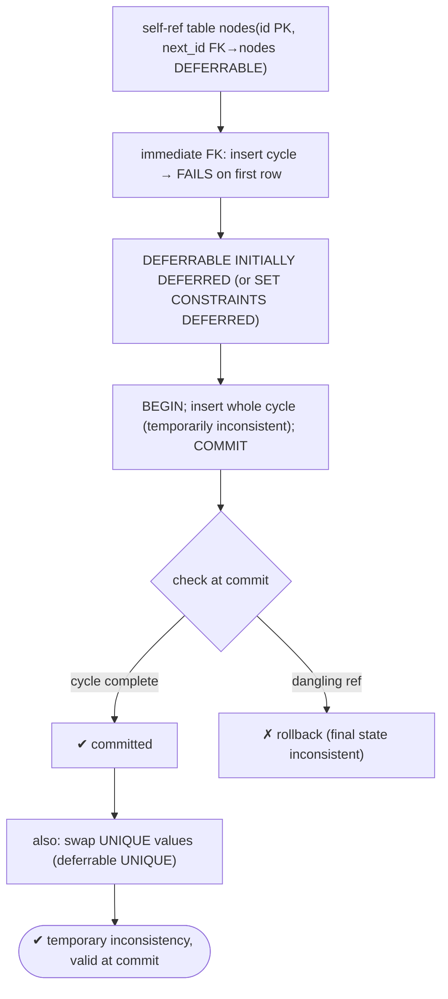
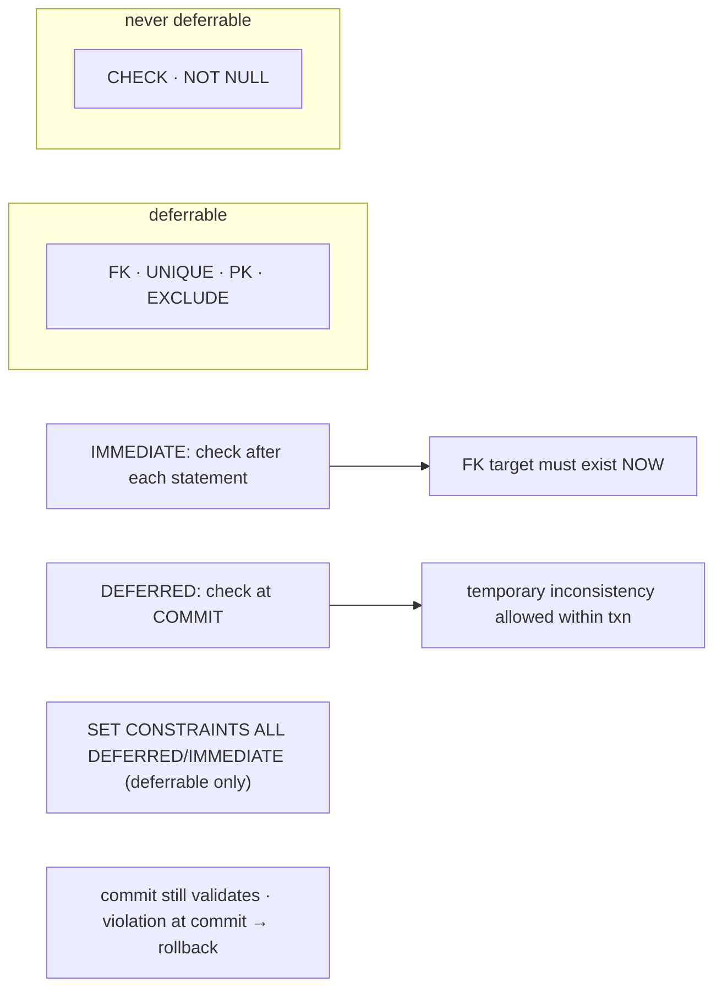

# Lab 81 — Deferrable Constraints + `SET CONSTRAINTS`; Insert a Temporarily-Inconsistent Graph in One Transaction

> **Track B · Developer · B1 Schema Design & Data Modeling · Lab 3 of 8 (Lab 81/222)**
> Teaching package: concept → diagram → steps → verify → quick-ref → self-test → video script.
> **Depends on:** Lab 79 (constraints). **Related:** Labs 103–109 (transactions).

---

## 0. Lab Card (at a glance)

| Field | Value |
|---|---|
| **Objective** | Use deferrable constraints and `SET CONSTRAINTS` to insert circular/mutually-referencing rows (a graph cycle) in one transaction, and swap unique values — temporarily inconsistent, valid at commit. |
| **Success criterion** | An immediate FK blocks the cyclic insert; a deferrable one allows it in a single transaction; `SET CONSTRAINTS` toggles timing; a genuinely inconsistent commit rolls back. |
| **Scope boundary** | Constraint timing. General transactions are Labs 103–109. |
| **Prereqs** | Lab 79 |
| **Time** | 25–35 min |
| **Difficulty** | ★★★☆☆ |
| **Risk** | Low — scratch tables. |

---

## 1. Learning Objectives

1. **Immediate vs deferred** — when constraints are checked.
2. **Declare deferrable** — `DEFERRABLE INITIALLY IMMEDIATE/DEFERRED`.
3. **`SET CONSTRAINTS`** — toggle timing within a transaction.
4. **The use cases** — circular refs, value swaps, bulk reorder.
5. **The limits** — CHECK/NOT NULL can't defer; commit still validates.

---

## 2. Concept Primer — the "why"

**By default, constraints are checked immediately.** After each `INSERT`/`UPDATE`/`DELETE`, PostgreSQL validates affected constraints *right away*. So a foreign key must reference an existing row **at the moment of the statement**. That's usually what you want — but it makes some legitimate operations impossible without reordering tricks.

**Deferrable constraints defer the check to commit.** A constraint declared **`DEFERRABLE`** can have its check postponed to the **end of the transaction**. This permits **temporary inconsistency within the transaction**, as long as everything is consistent by **commit**. Declaration options:
- **`DEFERRABLE INITIALLY IMMEDIATE`** — deferrable, but checked immediately unless you defer it (`SET CONSTRAINTS`).
- **`DEFERRABLE INITIALLY DEFERRED`** — checked at commit by default.

**`SET CONSTRAINTS` toggles timing inside a transaction:**
- `SET CONSTRAINTS ALL DEFERRED;` — defer all deferrable constraints to commit.
- `SET CONSTRAINTS <name> DEFERRED;` — defer a specific one.
- `SET CONSTRAINTS ALL IMMEDIATE;` — check now (surfacing any pending violation immediately).
It only affects **deferrable** constraints; non-deferrable ones are always immediate.

**What can and can't be deferred:**
- **Deferrable:** `FOREIGN KEY`, `UNIQUE`, `PRIMARY KEY`, `EXCLUDE`.
- **Never deferrable (always immediate):** `CHECK` and `NOT NULL`.

**The use cases:**
- **Circular / mutual references.** Two rows that reference each other (A→B, B→A), or a cycle in a graph (node points to node points back). With immediate FKs you can't insert the *first* row (its target doesn't exist yet). Deferring lets you insert them all in one transaction and validate the whole cycle at commit.
- **Swapping unique values.** `UPDATE t SET rank = <other row's rank>` transiently duplicates a unique value mid-statement. A `DEFERRABLE` `UNIQUE` lets both updates happen and checks uniqueness once, at commit.
- **Bulk reorder / renumber** where intermediate states violate a constraint but the final state doesn't.

**Commit still enforces consistency.** Deferring only postpones the check — it doesn't skip it. At commit (or `SET CONSTRAINTS IMMEDIATE`), all deferred constraints are validated, and a genuinely inconsistent final state **fails and rolls back**. A trade-off: violations surface **later** (at commit), and PostgreSQL holds the check list until then.

---

## 3. Diagrams

### 3.1 Deferred-insert flow



### 3.2 Timing model



---

## 4. Prerequisites

```bash
sudo -u postgres psql -d shopdb -c "SELECT current_database();"
```

---

## 5. Step-by-Step

### Step 1 — Show the problem: immediate FK blocks a cyclic insert

```bash
sudo -u postgres psql -d shopdb <<'SQL'
DROP TABLE IF EXISTS nodes_imm;
CREATE TABLE nodes_imm (id int PRIMARY KEY, next_id int REFERENCES nodes_imm(id));  -- immediate FK
BEGIN;
  INSERT INTO nodes_imm VALUES (1, 2);   -- references id=2 which doesn't exist yet → FAILS here
COMMIT;
SQL
#   → ERROR: insert or update violates foreign key constraint (immediate check)
```

### Step 2 — Deferrable FK: insert the whole cycle in one transaction

```bash
sudo -u postgres psql -d shopdb <<'SQL'
DROP TABLE IF EXISTS nodes;
CREATE TABLE nodes (
  id      int PRIMARY KEY,
  next_id int REFERENCES nodes(id) DEFERRABLE INITIALLY DEFERRED    -- checked at COMMIT
);
BEGIN;
  INSERT INTO nodes VALUES (1, 2);   -- temporarily dangling
  INSERT INTO nodes VALUES (2, 3);
  INSERT INTO nodes VALUES (3, 1);   -- closes the cycle 1→2→3→1
COMMIT;                              -- FK validated here → all resolve → SUCCESS
SQL
sudo -u postgres psql -d shopdb -c "SELECT * FROM nodes ORDER BY id;"
```

### Step 3 — SET CONSTRAINTS: defer a deferrable-but-immediate constraint

```bash
sudo -u postgres psql -d shopdb <<'SQL'
DROP TABLE IF EXISTS graph;
CREATE TABLE graph (
  id      int PRIMARY KEY,
  next_id int REFERENCES graph(id) DEFERRABLE INITIALLY IMMEDIATE   -- immediate by default
);
BEGIN;
  SET CONSTRAINTS ALL DEFERRED;      -- defer for THIS transaction
  INSERT INTO graph VALUES (1,2),(2,1);   -- mutual references
COMMIT;
SQL
sudo -u postgres psql -d shopdb -c "SELECT * FROM graph ORDER BY id;"
```

### Step 4 — A genuinely inconsistent final state → rollback at commit

```bash
sudo -u postgres psql -d shopdb <<'SQL'
BEGIN;
  INSERT INTO nodes VALUES (10, 99);   -- 99 never inserted → dangling at commit
COMMIT;                                -- FK checked here → FAILS → whole txn rolls back
SQL
sudo -u postgres psql -d shopdb -c "SELECT * FROM nodes WHERE id=10;"   # not present — rolled back
```

### Step 5 — Swap two UNIQUE values with a deferrable UNIQUE

```bash
sudo -u postgres psql -d shopdb <<'SQL'
DROP TABLE IF EXISTS ranking;
CREATE TABLE ranking (
  name text PRIMARY KEY,
  rank int NOT NULL,
  UNIQUE (rank) DEFERRABLE INITIALLY IMMEDIATE
);
INSERT INTO ranking VALUES ('Asha',1), ('Ravi',2);
BEGIN;
  SET CONSTRAINTS ALL DEFERRED;
  UPDATE ranking SET rank = 2 WHERE name='Asha';   -- transiently duplicates rank=2
  UPDATE ranking SET rank = 1 WHERE name='Ravi';   -- resolves the swap
COMMIT;                                             -- UNIQUE checked here → OK
SQL
sudo -u postgres psql -d shopdb -c "SELECT * FROM ranking ORDER BY name;"   # swapped
```

### Step 6 — Confirm CHECK/NOT NULL can't be deferred

```bash
sudo -u postgres psql -d shopdb -c "
CREATE TABLE t_check (x int CHECK (x>0) DEFERRABLE);" 2>&1 | tail -1
#   → ERROR: CHECK constraints cannot be marked DEFERRABLE
```

---

## 6. Verification Checklist

- [ ] Immediate FK blocks the cyclic insert (first row fails)
- [ ] `DEFERRABLE INITIALLY DEFERRED` allows the whole cycle in one txn
- [ ] `SET CONSTRAINTS ALL DEFERRED` defers an INITIALLY IMMEDIATE constraint
- [ ] A dangling reference at commit rolls the transaction back
- [ ] A deferrable `UNIQUE` allows a value swap
- [ ] `CHECK` (and `NOT NULL`) reject `DEFERRABLE`
- [ ] You can explain when to defer

---

## 7. Troubleshooting

| Symptom | Cause | Fix |
|---|---|---|
| Cyclic insert fails in one txn | Constraint not deferrable / not deferred | Declare `DEFERRABLE INITIALLY DEFERRED`, or `SET CONSTRAINTS DEFERRED` |
| `SET CONSTRAINTS` had no effect | Constraint isn't deferrable | Must be declared `DEFERRABLE` |
| `CHECK`/`NOT NULL` won't defer | Not deferrable by design | Only FK/UNIQUE/PK/EXCLUDE can defer |
| Commit fails unexpectedly | Final state actually inconsistent | Fix the data; deferring doesn't skip the check |
| Violation surfaces late | Deferred to commit | Expected trade-off; `SET CONSTRAINTS IMMEDIATE` to check early |
| Large batch uses memory | Check list held until commit | Consider chunking; deferred checks accumulate |
| Swap still fails | UNIQUE not deferrable | Declare `UNIQUE … DEFERRABLE` |

---

## 8. Quick Reference Card (paste-ready)

```sql
-- deferrable declarations (FK/UNIQUE/PK/EXCLUDE only):
... REFERENCES parent DEFERRABLE INITIALLY DEFERRED    -- checked at COMMIT by default
... REFERENCES parent DEFERRABLE INITIALLY IMMEDIATE   -- immediate unless SET
UNIQUE (col) DEFERRABLE INITIALLY IMMEDIATE

-- toggle within a transaction (deferrable constraints only):
BEGIN;
  SET CONSTRAINTS ALL DEFERRED;      -- or: SET CONSTRAINTS <name> DEFERRED;
  ... temporarily-inconsistent inserts/updates (cycle, swap) ...
COMMIT;                               -- validated here; inconsistent → ROLLBACK
-- SET CONSTRAINTS ALL IMMEDIATE;    -- check early

-- CHECK & NOT NULL are ALWAYS immediate (cannot defer)
-- uses: circular/mutual FKs · swapping UNIQUE values · bulk reorder
```

---

## 9. Self-Check

1. What's the difference between immediate and deferred constraint checking?
2. Which constraint types can be deferred, and which can't?
3. What's the difference between `INITIALLY IMMEDIATE` and `INITIALLY DEFERRED`?
4. What does `SET CONSTRAINTS` do?
5. Give two use cases for deferring.
6. What happens if a deferred constraint is violated at commit?

<details>
<summary>Answers</summary>

1. Immediate checks after each statement; deferred checks at **commit**, allowing temporary inconsistency within the transaction.
2. Deferrable: FOREIGN KEY, UNIQUE, PRIMARY KEY, EXCLUDE. Not deferrable: **CHECK, NOT NULL**.
3. Both are for deferrable constraints: `INITIALLY IMMEDIATE` checks now unless deferred; `INITIALLY DEFERRED` checks at commit by default.
4. Toggles the timing of deferrable constraints within a transaction (`ALL/name DEFERRED` or `IMMEDIATE`).
5. Inserting circular/mutual references (cycles), and swapping unique values (also bulk reorder/renumber).
6. The transaction **fails and rolls back** — deferring postpones but doesn't skip the check; the final state must be consistent.
</details>

---

## 10. Video / Teaching Script

| # | On screen | Say (narration) |
|---|---|---|
| 1 | Title: "Break the rules — briefly" | "Sometimes valid data passes through an *invalid* state. Circular references, value swaps. Deferrable constraints let you do that — within a transaction." |
| 2 | immediate fails | "Try to insert a cycle with normal foreign keys and the very first row fails — its target doesn't exist yet." |
| 3 | deferrable succeeds | "Make the constraint deferrable, and now insert the whole cycle. The check waits until commit — where everything lines up." |
| 4 | SET CONSTRAINTS | "SET CONSTRAINTS lets you defer on demand, just for one transaction." |
| 5 | rollback | "But it's not a loophole — commit still validates. Leave a dangling reference, and the whole transaction rolls back." |
| 6 | swap + limits | "Swapping two unique values? Same trick. One caveat: checks and not-nulls can never be deferred — only keys." |
| 7 | Outro | "Temporary inconsistency, permanent integrity. Next: exclusion constraints." |

---

## 11. Glossary

- **Immediate / deferred** — check after each statement / at commit.
- **`DEFERRABLE`** — a constraint whose check can be postponed.
- **`INITIALLY IMMEDIATE` / `INITIALLY DEFERRED`** — default timing.
- **`SET CONSTRAINTS`** — toggle deferrable timing in a transaction.
- **Circular reference** — mutually-referencing rows / a cycle.
- **Commit-time validation** — deferred checks run at commit.
- **Non-deferrable** — CHECK, NOT NULL (always immediate).

---
*NETAPORT lab series · PostgreSQL 17 on AlmaLinux 9 · Lab 81/222 · B1 Schema Design & Data Modeling*
