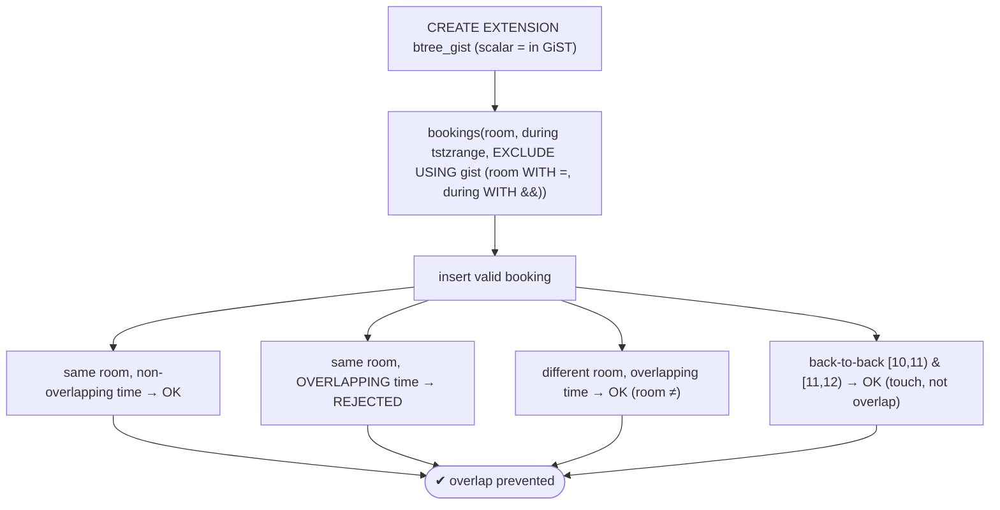
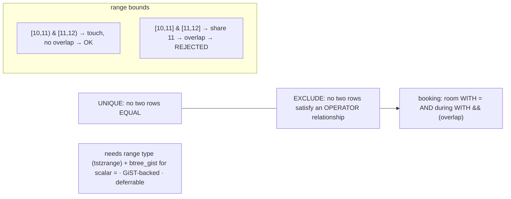

# Lab 82 — Exclusion Constraints (`EXCLUDE USING gist`) to Prevent Overlapping Bookings/Ranges

> **Track B · Developer · B1 Schema Design & Data Modeling · Lab 4 of 8 (Lab 82/222)**
> Teaching package: concept → diagram → steps → verify → quick-ref → self-test → video script.
> **Depends on:** Lab 79 (constraints), Lab 81 (deferrable). **Related:** Lab 86 (temporal tables), Lab 101 (GiST).

---

## 0. Lab Card (at a glance)

| Field | Value |
|---|---|
| **Objective** | Use an exclusion constraint to forbid overlapping time-range bookings for the same resource, and confirm the boundary semantics. |
| **Success criterion** | Overlapping bookings for the same room are rejected; non-overlapping or different-room bookings are allowed; back-to-back (touching) bookings are allowed. |
| **Scope boundary** | Range-overlap exclusion. Deferrable was Lab 81; temporal tables Lab 86. |
| **Prereqs** | Lab 79; the `btree_gist` extension |
| **Time** | 25–35 min |
| **Difficulty** | ★★★☆☆ |
| **Risk** | Low — scratch table. |

---

## 1. Learning Objectives

1. **What EXCLUDE generalizes** — UNIQUE, via operators.
2. **Range types** — `tstzrange` and the `&&` overlap operator.
3. **`btree_gist`** — mixing scalar `=` with range `&&` in GiST.
4. **The booking pattern** — `room WITH =, during WITH &&`.
5. **Boundary semantics** — why `[)` makes back-to-back OK.

---

## 2. Concept Primer — the "why"

**Exclusion constraints generalize UNIQUE.** A `UNIQUE` constraint forbids two rows from being **equal** on some columns. An **exclusion constraint** forbids two rows from satisfying a chosen **operator relationship**. The flagship use: **no two rows overlap** — perfect for **bookings/reservations** ("no two bookings for the same room overlap in time"), which `UNIQUE` can't express (overlap isn't equality).

**The definition:**
```sql
EXCLUDE USING gist (room WITH =, during WITH &&)
```
Read it as: **reject any two rows where `room` is equal AND their `during` ranges overlap.** `&&` is the **range-overlap** operator. `USING gist` is the index method (GiST supports range/geometric operators).

**Two things you need:**
1. **Range types.** Store the interval as a range, not two columns: `during tstzrange` (also `tsrange`, `daterange`, `int4range`, `numrange`). Construct with `tstzrange('2026-01-01 10:00', '2026-01-01 11:00')`. Operators: `&&` overlap, `@>` contains, `<@` contained by.
2. **`btree_gist`.** GiST natively indexes range/geometric operators but **not scalar equality**. To combine `room WITH =` (scalar equality) with `during WITH &&` (range overlap) in one GiST exclusion, install **`btree_gist`**, which adds GiST operator classes for scalar types (`int`, `text`, …). Without it you'll get *"no default operator class for access method gist"* on the `=` column.

**Boundary semantics — the subtlety that trips people.** Range bounds are `[inclusive, exclusive)` by default. So `[10:00, 11:00)` and `[11:00, 12:00)` **touch** at 11:00 but do **not overlap** — the first excludes 11:00, the second includes it. Back-to-back bookings are therefore **allowed**. If you used inclusive-inclusive `[]` bounds, they *would* overlap at the shared endpoint and be rejected. Choose bounds deliberately: `[)` is almost always right for time slots.

**How it works & deferring.** EXCLUDE builds a **GiST index**; each insert/update checks whether any existing row conflicts (all operators true) → violation if so. It's checked immediately by default, and can be **`DEFERRABLE`** like other constraints (Lab 81) — useful for reshuffling schedules.

**Other uses:** non-overlapping shifts/equipment reservations, one-active-version temporal tables (Lab 86), spatial non-overlap (PostGIS `&&`). *(SQL:2011 `WITHOUT OVERLAPS` temporal syntax is emerging in newer PostgreSQL; the EXCLUDE constraint is the established way in PG17.)*

---

## 3. Diagrams

### 3.1 Prevent-overlap flow



### 3.2 UNIQUE vs EXCLUDE + ranges



---

## 4. Prerequisites

```bash
sudo -u postgres psql -d shopdb -c "CREATE EXTENSION IF NOT EXISTS btree_gist;"
```

---

## 5. Step-by-Step

### Step 1 — Bookings table with an exclusion constraint

```bash
sudo -u postgres psql -d shopdb <<'SQL'
DROP TABLE IF EXISTS bookings;
CREATE TABLE bookings (
  id     bigint GENERATED ALWAYS AS IDENTITY PRIMARY KEY,
  room   int          NOT NULL,
  during tstzrange    NOT NULL,
  EXCLUDE USING gist (room WITH =, during WITH &&)     -- same room + overlapping time = conflict
);
SQL
```

### Step 2 — A valid booking

```bash
sudo -u postgres psql -d shopdb -c "
INSERT INTO bookings (room, during) VALUES (101, tstzrange('2026-01-01 10:00','2026-01-01 11:00'));"
```

### Step 3 — Same room, NON-overlapping → allowed

```bash
sudo -u postgres psql -d shopdb -c "
INSERT INTO bookings (room, during) VALUES (101, tstzrange('2026-01-01 12:00','2026-01-01 13:00'));"   # OK
```

### Step 4 — Same room, OVERLAPPING → rejected

```bash
sudo -u postgres psql -d shopdb -c "
INSERT INTO bookings (room, during) VALUES (101, tstzrange('2026-01-01 10:30','2026-01-01 11:30'));" 2>&1 | tail -1
#   → ERROR: conflicting key value violates exclusion constraint
```

### Step 5 — Different room, overlapping time → allowed

```bash
sudo -u postgres psql -d shopdb -c "
INSERT INTO bookings (room, during) VALUES (202, tstzrange('2026-01-01 10:30','2026-01-01 11:30'));"   # OK (room differs)
```

### Step 6 — Back-to-back (touching) → allowed; inclusive bounds → rejected

```bash
# touching with [) bounds — does NOT overlap:
sudo -u postgres psql -d shopdb -c "
INSERT INTO bookings (room, during) VALUES (101, tstzrange('2026-01-01 11:00','2026-01-01 12:00'));"   # OK ([) bounds)
# same-endpoint with INCLUSIVE bounds — DOES overlap at 12:00:
sudo -u postgres psql -d shopdb -c "
INSERT INTO bookings (room, during) VALUES (101, tstzrange('2026-01-01 12:00','2026-01-01 13:00','[]'));" 2>&1 | tail -1
#   → conflicts with the 12:00-13:00 booking (shared endpoint overlaps under []) 
```

### Step 7 — See the current bookings

```bash
sudo -u postgres psql -d shopdb -c "SELECT room, during FROM bookings ORDER BY room, during;"
```

---

## 6. Verification Checklist

- [ ] `btree_gist` installed (scalar `=` in GiST)
- [ ] Exclusion constraint created (`room WITH =, during WITH &&`)
- [ ] Same-room overlapping booking **rejected**
- [ ] Same-room non-overlapping booking allowed
- [ ] Different-room overlapping booking allowed
- [ ] Back-to-back `[)` bookings allowed (touch, not overlap)
- [ ] Inclusive `[]` shared endpoint conflicts

---

## 7. Troubleshooting

| Symptom | Cause | Fix |
|---|---|---|
| "no default operator class for access method gist" | Scalar `=` needs GiST support | `CREATE EXTENSION btree_gist` |
| Overlap not caught | Wrong operator/bounds | Use `&&` for overlap; correct range bounds |
| Adjacent bookings rejected | Inclusive `[]` bounds | Use `[)` so touching endpoints don't overlap |
| Different rooms conflict | Missing `room WITH =` | Include the scalar equality element |
| NULL range accepted | NULL doesn't conflict | `NOT NULL` on the range column |
| Slow on big tables | GiST lookups | Normal; it's index-backed |
| Need to reshuffle schedule | Immediate conflicts mid-update | Declare the constraint `DEFERRABLE` (Lab 81) |

---

## 8. Quick Reference Card (paste-ready)

```sql
CREATE EXTENSION IF NOT EXISTS btree_gist;    -- needed for scalar '=' in a GiST exclusion

CREATE TABLE bookings (
  id bigint GENERATED ALWAYS AS IDENTITY PRIMARY KEY,
  room int NOT NULL,
  during tstzrange NOT NULL,
  EXCLUDE USING gist (room WITH =, during WITH &&)   -- same room + overlapping range = REJECT
);

-- ranges: tstzrange('start','end')  bounds default '[)' (inclusive start, exclusive end)
--   [10,11) & [11,12) → touch, NO overlap → allowed
--   [10,11] & [11,12] → share 11 → overlap → rejected
-- operators: && overlap · @> contains · <@ contained-by
-- EXCLUDE generalizes UNIQUE (operator relationship, not equality) · GiST-backed · can be DEFERRABLE
```

---

## 9. Self-Check

1. What does an exclusion constraint generalize, and how?
2. What's the range-overlap operator?
3. What does `btree_gist` provide, and why is it needed here?
4. Write the exclusion definition for non-overlapping room bookings.
5. Why don't back-to-back `[10,11)` and `[11,12)` conflict?
6. Can exclusion constraints be deferred?

<details>
<summary>Answers</summary>

1. **UNIQUE** — instead of forbidding equal rows, it forbids rows that satisfy a specified **operator relationship** (e.g. overlap).
2. `&&`.
3. GiST operator classes for scalar types, so you can use `=` on a scalar (`room`) alongside a range operator (`&&`) in one GiST exclusion — GiST doesn't support scalar `=` otherwise.
4. `EXCLUDE USING gist (room WITH =, during WITH &&)`.
5. Default bounds are `[inclusive, exclusive)`, so `[10,11)` excludes 11:00 while `[11,12)` includes it — they touch but don't overlap.
6. Yes — `DEFERRABLE` like other constraints (Lab 81).
</details>

---

## 10. Video / Teaching Script

| # | On screen | Say (narration) |
|---|---|---|
| 1 | Title: "No double-bookings — enforced" | "How do you stop two reservations from overlapping? UNIQUE can't — overlap isn't equality. Exclusion constraints can." |
| 2 | btree_gist + table | "Store the time as a *range*, and add an exclusion: same room *and* overlapping time equals conflict. One extension makes it work." |
| 3 | valid + non-overlap | "Book a room, book it again later — fine." |
| 4 | overlap rejected | "But try to overlap? Rejected, right there." |
| 5 | different room | "Different room at the same time? Allowed — the rooms differ." |
| 6 | boundaries | "And the subtle bit: back-to-back slots are fine, because ranges exclude their end. Ten-to-eleven and eleven-to-twelve *touch* but don't *overlap*. Pick your bounds on purpose." |
| 7 | Outro | "Overlap, impossible by design. Next: generated columns." |

---

## 11. Glossary

- **Exclusion constraint** — forbids rows satisfying an operator relationship.
- **`EXCLUDE USING gist`** — GiST-backed exclusion definition.
- **`&&`** — range-overlap operator.
- **Range types** — `tstzrange`, `daterange`, etc.; bounds `[)`/`[]`.
- **`btree_gist`** — GiST operator classes for scalar types.
- **Boundary semantics** — inclusive/exclusive endpoints decide "touch vs overlap".
- **Deferrable** — exclusion checks can be postponed to commit.

---
*NETAPORT lab series · PostgreSQL 17 on AlmaLinux 9 · Lab 82/222 · B1 Schema Design & Data Modeling*
