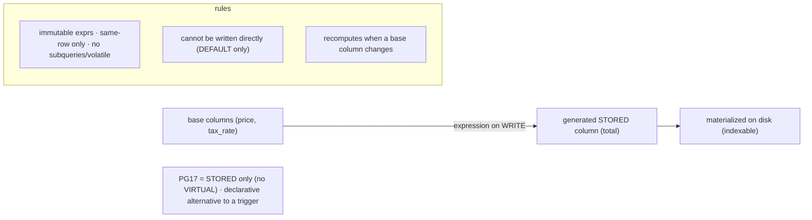

# Lab 83 — Generated Columns (Stored) + Expression-Based Logic; Verify Recomputation on Update

> **Track B · Developer · B1 Schema Design & Data Modeling · Lab 5 of 8 (Lab 83/222)**
> Teaching package: concept → diagram → steps → verify → quick-ref → self-test → video script.
> **Depends on:** Lab 79 (constraints). **Related:** Lab 100 (expression indexes), Lab 116 (jsonb).

---

## 0. Lab Card (at a glance)

| Field | Value |
|---|---|
| **Objective** | Define STORED generated columns from expressions over other columns, and verify they recompute automatically when base columns change and can't be written directly. |
| **Success criterion** | A generated column reflects its expression on insert; it updates itself when a source column changes; a direct write to it is rejected. |
| **Scope boundary** | Stored generated columns. Expression indexes are Lab 100; virtual/generated-in-index is out of scope for PG17. |
| **Prereqs** | Lab 79; a database |
| **Time** | 20–30 min |
| **Difficulty** | ★★☆☆☆ |
| **Risk** | Low — scratch tables. |

---

## 1. Learning Objectives

1. **What a generated column is** — computed from other columns.
2. **STORED semantics** — materialized on write (PG17).
3. **Recomputation** — auto-updates when a source changes.
4. **The rules** — can't write it; expression restrictions.
5. **Where it helps** — derived values, search keys, indexing.

---

## 2. Concept Primer — the "why"

**A generated column is computed, not stored by you.** Its value comes from an **expression over other columns in the same row**, and the **database maintains it** — so it can never drift from its source data the way an app-maintained "denormalized" column can. You define it once; every insert/update keeps it correct.

```sql
price      numeric NOT NULL,
tax_rate   numeric NOT NULL,
total      numeric GENERATED ALWAYS AS (price * (1 + tax_rate)) STORED
```

**STORED (what PG17 supports).** A **`STORED`** generated column is **computed on write and materialized on disk** — it occupies storage, can be indexed, and is read like any normal column (no recomputation on read). *(The SQL standard also defines VIRTUAL — computed on read, no storage — which PG17 does not yet have; PG17 generated columns are always `STORED`.)*

**The defining behavior — it recomputes itself.** Change a base column and the generated column **updates automatically** in the same statement — you never touch it. Conversely, you **cannot write to it directly**: `INSERT`/`UPDATE` that targets a generated column errors (`DEFAULT` is the only accepted "value"). That's the guarantee — the value is *always* the expression applied to the current row.

**Expression rules:**
- The expression may reference **other columns of the same row** (including other generated columns defined earlier), and use **immutable** functions/operators only — no subqueries, no reference to other rows/tables, nothing volatile (`now()`, `random()`), and not the column itself.
- `GENERATED ALWAYS AS (expr) STORED` — the full syntax.

**Where generated columns earn their place:**
- **Derived values** kept consistent: totals, full names, normalized/search text, unit conversions.
- **Search/index keys**: e.g. a `lower(email)` or a `tsvector` generated column you then index (Lab 100/117) — the derived value is stored once and indexed, instead of an expression index that recomputes.
- **Extracted fields**: pull a scalar out of `jsonb` into a typed, indexable column (Lab 116).
- **Constraints on derived data**: `CHECK` a generated column.

Compared with a **trigger** doing the same job, a generated column is declarative, can't be bypassed, and is clearer — prefer it whenever the value is a pure function of the same row.

---

## 3. Diagrams

### 3.1 Define + verify flow

```mermaid
flowchart TD
    A["column GENERATED ALWAYS AS (expr) STORED"] --> B["INSERT base columns → generated value computed + stored"]
    B --> C["read → returns stored value (no recompute on read)"]
    C --> D["UPDATE a BASE column"]
    D --> E["generated column RECOMPUTES automatically (same statement)"]
    E --> F["attempt direct write to generated column → REJECTED"]
    F --> G["index / CHECK the generated column"]
    G --> H([✔ always = expression(row)])
```

### 3.2 Stored generated column model



---

## 4. Prerequisites

```bash
sudo -u postgres psql -d shopdb -c "SELECT current_database();"
```

---

## 5. Step-by-Step

### Step 1 — A table with stored generated columns

```bash
sudo -u postgres psql -d shopdb <<'SQL'
DROP TABLE IF EXISTS invoice_lines;
CREATE TABLE invoice_lines (
  id         bigint GENERATED ALWAYS AS IDENTITY PRIMARY KEY,
  qty        int     NOT NULL CHECK (qty > 0),
  unit_price numeric(10,2) NOT NULL CHECK (unit_price >= 0),
  tax_rate   numeric(4,3)  NOT NULL DEFAULT 0.180,
  subtotal   numeric GENERATED ALWAYS AS (qty * unit_price) STORED,
  total      numeric GENERATED ALWAYS AS (qty * unit_price * (1 + tax_rate)) STORED,
  CHECK (total >= subtotal)                        -- CHECK on generated columns
);
SQL
```

### Step 2 — Insert base values; generated columns fill in

```bash
sudo -u postgres psql -d shopdb -c "
INSERT INTO invoice_lines (qty, unit_price) VALUES (3, 10.00), (2, 25.50);"
sudo -u postgres psql -d shopdb -c "SELECT id, qty, unit_price, tax_rate, subtotal, total FROM invoice_lines ORDER BY id;"
#   subtotal/total computed automatically
```

### Step 3 — Verify recomputation on update

```bash
sudo -u postgres psql -d shopdb -c "SELECT id, qty, unit_price, subtotal, total FROM invoice_lines WHERE id=1;"
sudo -u postgres psql -d shopdb -c "UPDATE invoice_lines SET qty = 5 WHERE id = 1;"          # change a BASE column
sudo -u postgres psql -d shopdb -c "SELECT id, qty, unit_price, subtotal, total FROM invoice_lines WHERE id=1;"
#   → subtotal (5*10=50) and total recomputed automatically
sudo -u postgres psql -d shopdb -c "UPDATE invoice_lines SET tax_rate = 0.050 WHERE id = 1;" # change another base
sudo -u postgres psql -d shopdb -c "SELECT id, total FROM invoice_lines WHERE id=1;"          # total recomputed
```

### Step 4 — Direct writes are rejected

```bash
sudo -u postgres psql -d shopdb -c "UPDATE invoice_lines SET total = 999 WHERE id = 1;" 2>&1 | tail -1
#   → ERROR: column "total" can only be updated to DEFAULT
sudo -u postgres psql -d shopdb -c "INSERT INTO invoice_lines (qty, unit_price, subtotal) VALUES (1,1,1);" 2>&1 | tail -1
#   → ERROR: cannot insert a non-DEFAULT value into column "subtotal"
```

### Step 5 — Expression-based logic: a normalized, indexable search key

```bash
sudo -u postgres psql -d shopdb <<'SQL'
DROP TABLE IF EXISTS people;
CREATE TABLE people (
  id        bigint GENERATED ALWAYS AS IDENTITY PRIMARY KEY,
  first     text NOT NULL,
  last      text NOT NULL,
  full_name text GENERATED ALWAYS AS (first || ' ' || last) STORED,
  email     text NOT NULL,
  email_ci  text GENERATED ALWAYS AS (lower(email)) STORED     -- normalized for case-insensitive lookup
);
CREATE UNIQUE INDEX people_email_ci ON people(email_ci);        -- index the generated column
INSERT INTO people (first,last,email) VALUES ('Asha','Rao','Asha@CO'), ('Ravi','Iyer','ravi@co');
SQL
sudo -u postgres psql -d shopdb -c "SELECT full_name, email_ci FROM people ORDER BY id;"
sudo -u postgres psql -d shopdb -c "SELECT * FROM people WHERE email_ci = lower('ASHA@co');"   # case-insensitive hit
```

### Step 6 — Confirm the immutability rule (volatile expr rejected)

```bash
sudo -u postgres psql -d shopdb -c "
CREATE TABLE bad (x int, y timestamptz GENERATED ALWAYS AS (now()) STORED);" 2>&1 | tail -1
#   → ERROR: generation expression is not immutable
```

---

## 6. Verification Checklist

- [ ] Generated columns computed on insert
- [ ] Updating a **base** column recomputes the generated columns
- [ ] Direct `UPDATE`/`INSERT` of a generated column is rejected
- [ ] A generated column indexed (and used in a lookup)
- [ ] `CHECK` on a generated column works
- [ ] Volatile expression (`now()`) rejected as non-immutable
- [ ] Read returns the stored value (no recompute on read)

---

## 7. Troubleshooting

| Symptom | Cause | Fix |
|---|---|---|
| "cannot insert a non-DEFAULT value" | Wrote to a generated column | Omit it (or use `DEFAULT`) |
| "generation expression is not immutable" | Volatile function (`now()`, `random()`) | Use only immutable expressions |
| Can't reference another table/row | Expressions are same-row only | Compute in a view/trigger for cross-row logic |
| Generated value stale | (Won't happen) — always recomputed | If using a trigger instead, it can drift; prefer generated |
| Want computed-on-read (no storage) | VIRTUAL not in PG17 | Use a view, or accept STORED |
| Index not used | Query didn't match the generated expression | Query the generated column directly (`email_ci = lower(...)`) |
| Altering the expression | Can't `ALTER` the generation expression in place | Drop and re-add the column |

---

## 8. Quick Reference Card (paste-ready)

```sql
-- STORED generated column: computed on write, materialized, indexable (PG17 = STORED only)
col numeric GENERATED ALWAYS AS (<immutable expression over same-row columns>) STORED

CREATE TABLE t (
  qty int, unit_price numeric,
  subtotal numeric GENERATED ALWAYS AS (qty*unit_price) STORED,
  email text, email_ci text GENERATED ALWAYS AS (lower(email)) STORED
);
CREATE UNIQUE INDEX ON t(email_ci);          -- index the generated column
-- CHECK (subtotal >= 0);                     -- constrain generated columns

-- RULES: immutable exprs · same-row only · no subqueries/volatile(now/random) · NOT writable (DEFAULT only)
-- recomputes automatically when a base column changes · prefer over a trigger for pure same-row derivations
```

---

## 9. Self-Check

1. What is a generated column?
2. What does `STORED` mean, and what's the alternative PG17 lacks?
3. What happens to a generated column when a base column changes?
4. Can you write directly to a generated column?
5. What restrictions apply to the generation expression?
6. Name a good use for a generated column.

<details>
<summary>Answers</summary>

1. A column whose value is computed from an expression over other columns in the same row, maintained by the database.
2. `STORED` = computed on write and materialized on disk (indexable, read as-is). PG17 lacks `VIRTUAL` (computed on read); its generated columns are always STORED.
3. It **recomputes automatically** in the same statement.
4. **No** — direct writes are rejected (only `DEFAULT` is accepted).
5. Must be **immutable**, reference only same-row columns, and use no subqueries or volatile functions.
6. Derived totals, a normalized `lower(email)` search key to index, extracting a `jsonb` field into a typed column, etc.
</details>

---

## 10. Video / Teaching Script

| # | On screen | Say (narration) |
|---|---|---|
| 1 | Title: "Columns that compute themselves" | "A generated column is a formula the database keeps up to date. It can never fall out of sync with its inputs." |
| 2 | define | "Define subtotal and total as expressions over quantity and price. Insert just the base values — the rest fills in." |
| 3 | recompute | "Now change the quantity. Watch — subtotal and total recompute on their own. You never touch them." |
| 4 | can't write | "And you *can't* touch them: try to set the total directly and it's rejected. That's the whole point — it's always the formula." |
| 5 | index it | "Best trick: a normalized lower-case email column, stored and indexed, for fast case-insensitive lookups." |
| 6 | immutable | "One rule: the expression must be immutable. No now, no random — the value has to be reproducible." |
| 7 | Outro | "Derived data that can't drift. Next: domains, composite types, and enums." |

---

## 11. Glossary

- **Generated column** — value computed from same-row columns.
- **`GENERATED ALWAYS AS (expr) STORED`** — the definition.
- **STORED / VIRTUAL** — materialized on write / computed on read (PG17 = STORED only).
- **Immutable expression** — reproducible, non-volatile (required).
- **Recomputation** — auto-update when a base column changes.
- **Non-writable** — direct writes rejected (DEFAULT only).

---
*NETAPORT lab series · PostgreSQL 17 on AlmaLinux 9 · Lab 83/222 · B1 Schema Design & Data Modeling*
