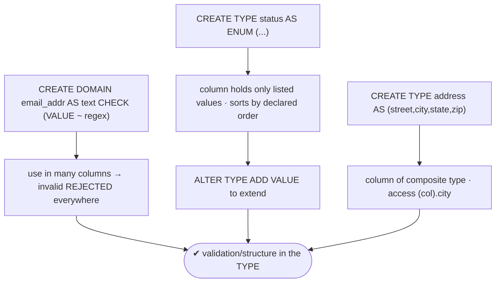
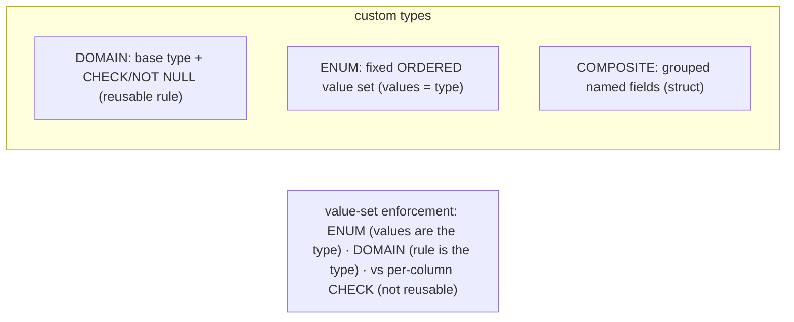

# Lab 84 — Domains + Composite Types + Enums; Enforce a Value Set at the Type Level

> **Track B · Developer · B1 Schema Design & Data Modeling · Lab 6 of 8 (Lab 84/222)**
> Teaching package: concept → diagram → steps → verify → quick-ref → self-test → video script.
> **Depends on:** Lab 79 (constraints). **Related:** Lab 83 (generated columns), Lab 116 (jsonb).

---

## 0. Lab Card (at a glance)

| Field | Value |
|---|---|
| **Objective** | Create a DOMAIN, an ENUM, and a composite type; use each to enforce validation/structure at the type level, and understand ENUM vs `CHECK IN` trade-offs. |
| **Success criterion** | The domain rejects invalid values across any column that uses it; the enum accepts only its listed values (and sorts by declared order); the composite type groups and exposes fields. |
| **Scope boundary** | Custom scalar/composite types. jsonb is Lab 116; generated columns Lab 83. |
| **Prereqs** | Lab 79 |
| **Time** | 25–35 min |
| **Difficulty** | ★★★☆☆ |
| **Risk** | Low — scratch types/tables. |

---

## 1. Learning Objectives

1. **DOMAIN** — a reusable constrained type.
2. **ENUM** — a fixed, ordered value set as a type.
3. **Composite type** — grouped named fields.
4. **Type-level enforcement** — validation in the type, not per column.
5. **ENUM vs CHECK IN** — when each fits.

---

## 2. Concept Primer — the "why"

Instead of repeating a `CHECK` on every column, push the rule into a **reusable type**. Three tools:

**DOMAIN — a base type plus constraints, reusable.** Define a rule once; use the domain as a column type everywhere, and the constraint is enforced on every assignment.
```sql
CREATE DOMAIN email_addr AS text CHECK (VALUE ~ '^[^@]+@[^@]+\.[^@]+$');
CREATE DOMAIN positive_qty AS int CHECK (VALUE > 0);
```
The `VALUE` keyword refers to the value being checked. A domain can also carry `NOT NULL` and `DEFAULT`. Now `customers.email`, `suppliers.email`, … all use `email_addr` — **one definition, consistent validation** (DRY). Extend later with `ALTER DOMAIN … ADD CONSTRAINT`.

**ENUM — a fixed, ordered set of values as a type.** The allowed values **are** the type; no `CHECK` needed.
```sql
CREATE TYPE order_status AS ENUM ('pending','paid','shipped','delivered','cancelled');
```
A column of `order_status` can hold only those values, and they **sort by declared order** (`pending < paid < …`) — handy for `ORDER BY` and comparisons. Extend with `ALTER TYPE … ADD VALUE 'x' [BEFORE|AFTER 'y']`; rename with `ALTER TYPE … RENAME VALUE`. **Removing/reordering** existing values is hard (effectively recreate the type) — the main downside.

**Composite type — grouped named fields (a struct/record).**
```sql
CREATE TYPE address AS (street text, city text, state text, zip text);
```
Use it as a column type and access fields with parentheses: `(home_addr).city`. Composite types shine as **function parameters/returns** and `ROW()` values; for *storage*, a normalized table or `jsonb` is often preferred over a composite column — but they're the right tool for structured values passed around. (Every table also implicitly defines a composite row type.)

**ENUM vs `CHECK (col IN (...))` — the trade-off you'll actually weigh:**

| | ENUM | `CHECK IN` |
|---|---|---|
| Reusable across columns | ✓ (it's a type) | ✗ (per column) |
| Ordered | ✓ (declared order) | ✗ |
| Storage | compact (4 bytes) | the base type's size |
| Add a value | `ALTER TYPE ADD VALUE` | edit the constraint |
| Remove/reorder a value | **hard** (recreate type) | easy (edit constraint) |

Use an **ENUM** when the set is stable, shared, and benefits from ordering; use **`CHECK IN`** when the set changes often or is local to one column.

---

## 3. Diagrams

### 3.1 Type-level enforcement flow



### 3.2 Three custom types



---

## 4. Prerequisites

```bash
sudo -u postgres psql -d shopdb -c "SELECT current_database();"
```

---

## 5. Step-by-Step

### Step 1 — DOMAIN: a reusable validated type

```bash
sudo -u postgres psql -d shopdb <<'SQL'
DROP DOMAIN IF EXISTS email_addr CASCADE;
DROP DOMAIN IF EXISTS positive_qty CASCADE;
CREATE DOMAIN email_addr  AS text CHECK (VALUE ~ '^[^@]+@[^@]+\.[^@]+$');
CREATE DOMAIN positive_qty AS int  CHECK (VALUE > 0);

CREATE TABLE contacts (id bigint GENERATED ALWAYS AS IDENTITY PRIMARY KEY,
  email email_addr NOT NULL, qty positive_qty NOT NULL);
SQL
sudo -u postgres psql -d shopdb -c "INSERT INTO contacts (email, qty) VALUES ('a@co.com', 3);"          # OK
sudo -u postgres psql -d shopdb -c "INSERT INTO contacts (email, qty) VALUES ('not-an-email', 3);" 2>&1 | tail -1   # domain CHECK
sudo -u postgres psql -d shopdb -c "INSERT INTO contacts (email, qty) VALUES ('a@co.com', -1);" 2>&1 | tail -1      # positive_qty
```

### Step 2 — Reuse the domain in another table (DRY)

```bash
sudo -u postgres psql -d shopdb -c "
CREATE TABLE suppliers (id bigint GENERATED ALWAYS AS IDENTITY PRIMARY KEY, email email_addr NOT NULL);
INSERT INTO suppliers (email) VALUES ('vendor@x.io');"      # same validation, no repeated CHECK
```

### Step 3 — ENUM: a fixed, ordered value set

```bash
sudo -u postgres psql -d shopdb <<'SQL'
DROP TYPE IF EXISTS order_status CASCADE;
CREATE TYPE order_status AS ENUM ('pending','paid','shipped','delivered','cancelled');
CREATE TABLE ord (id bigint GENERATED ALWAYS AS IDENTITY PRIMARY KEY, status order_status NOT NULL DEFAULT 'pending');
INSERT INTO ord (status) VALUES ('paid'), ('pending'), ('shipped');
SQL
sudo -u postgres psql -d shopdb -c "INSERT INTO ord (status) VALUES ('unknown');" 2>&1 | tail -1   # not in the enum → rejected
# ordering follows the DECLARED order:
sudo -u postgres psql -d shopdb -c "SELECT status FROM ord ORDER BY status;"
sudo -u postgres psql -d shopdb -c "SELECT count(*) FROM ord WHERE status < 'shipped';"            # comparison by enum order
```

### Step 4 — Extend the ENUM

```bash
sudo -u postgres psql -d shopdb -c "ALTER TYPE order_status ADD VALUE 'refunded' AFTER 'delivered';"
sudo -u postgres psql -d shopdb -c "SELECT enum_range(NULL::order_status);"   # see all values in order
```

### Step 5 — Composite type: grouped fields

```bash
sudo -u postgres psql -d shopdb <<'SQL'
DROP TYPE IF EXISTS address CASCADE;
CREATE TYPE address AS (street text, city text, state text, zip text);
CREATE TABLE offices (id bigint GENERATED ALWAYS AS IDENTITY PRIMARY KEY, loc address);
INSERT INTO offices (loc) VALUES (ROW('1 MG Rd','Bengaluru','KA','560001')::address);
SQL
sudo -u postgres psql -d shopdb -c "SELECT (loc).city, (loc).zip FROM offices;"     # field access
sudo -u postgres psql -d shopdb -c "SELECT loc FROM offices;"                        # whole composite value
```

### Step 6 — Contrast: CHECK IN (easy to change, not reusable)

```bash
sudo -u postgres psql -d shopdb -c "
CREATE TABLE ticket (id int, priority text CHECK (priority IN ('low','med','high')));"
#   easy to alter the set, but not a reusable type and not ordered — the ENUM/DOMAIN trade-off
```

---

## 6. Verification Checklist

- [ ] Domain rejects invalid values (email regex, positive_qty)
- [ ] Same domain reused in another table (no repeated CHECK)
- [ ] Enum rejects unlisted values
- [ ] Enum sorts/compares by declared order
- [ ] `ALTER TYPE ADD VALUE` extends the enum
- [ ] Composite type stores and exposes fields (`(col).field`)
- [ ] Can state the ENUM vs `CHECK IN` trade-off

---

## 7. Troubleshooting

| Symptom | Cause | Fix |
|---|---|---|
| Domain rule not enforced | Value not assigned as the domain type | Ensure the column is the domain type |
| Invalid value rejected | Working as intended | (That's the enforcement) |
| `ALTER TYPE ADD VALUE` fails in a txn | Older restrictions | PG12+ usually allows it; else run outside a transaction |
| Need to remove an enum value | Hard by design | Recreate the type, or use `CHECK IN` instead |
| Composite field access error | Missing parentheses | `(col).field` |
| Enum order wrong | Declared order | Use `ADD VALUE … BEFORE/AFTER` to position |
| Changing a domain constraint | — | `ALTER DOMAIN … ADD/DROP CONSTRAINT` (validates existing rows) |

---

## 8. Quick Reference Card (paste-ready)

```sql
-- DOMAIN: reusable constrained type (VALUE = the value checked)
CREATE DOMAIN email_addr AS text CHECK (VALUE ~ '^[^@]+@[^@]+\.[^@]+$');
CREATE TABLE t (email email_addr NOT NULL);     -- reuse across many columns/tables
ALTER DOMAIN email_addr ADD CONSTRAINT ... ;    -- extend later

-- ENUM: fixed, ORDERED value set (values are the type)
CREATE TYPE order_status AS ENUM ('pending','paid','shipped','delivered','cancelled');
ALTER TYPE order_status ADD VALUE 'refunded' AFTER 'delivered';   -- extend (removing is hard)
SELECT enum_range(NULL::order_status);          -- list in order

-- COMPOSITE: grouped fields (struct/record)
CREATE TYPE address AS (street text, city text, state text, zip text);
INSERT INTO t (loc) VALUES (ROW('...','...','...','...')::address);   SELECT (loc).city FROM t;

-- ENUM vs CHECK IN: ENUM reusable/ordered/compact but hard to remove values · CHECK IN easy to change, per-column
```

---

## 9. Self-Check

1. What is a DOMAIN and why use one?
2. What does an ENUM enforce, and what's special about its values?
3. What are the ENUM vs `CHECK IN` trade-offs?
4. What is a composite type?
5. How do you add a value to an ENUM?
6. What does the `VALUE` keyword mean in a domain?

<details>
<summary>Answers</summary>

1. A base type with attached constraints (CHECK/NOT NULL/DEFAULT), reusable as a column type — define a rule once, apply it everywhere (DRY).
2. A **fixed set** of allowed values that *are* the type; they're **ordered** by declaration (usable in comparisons/ORDER BY).
3. ENUM: reusable, ordered, compact, but removing/reordering values is hard; `CHECK IN`: easy to change, no new type, but not reusable or ordered.
4. A structured type grouping named fields (a struct/record), used as a column type or in functions.
5. `ALTER TYPE name ADD VALUE 'x' [BEFORE|AFTER 'y']`.
6. It refers to the **value being checked** inside the domain's `CHECK` expression.
</details>

---

## 10. Video / Teaching Script

| # | On screen | Say (narration) |
|---|---|---|
| 1 | Title: "Rules that live in the type" | "Stop repeating the same CHECK on every column. Put the rule in the type — once — and reuse it everywhere." |
| 2 | domain | "A domain is a base type plus a constraint. Define email once; every email column across every table gets the same validation." |
| 3 | reuse | "Reuse it in another table — no copied constraint, one source of truth." |
| 4 | enum | "An enum makes the allowed values *the type itself*. Only these statuses — and they even sort in the order you declare." |
| 5 | extend | "Need another value? Add it, positioned exactly where you want in the order." |
| 6 | composite + trade-off | "Composite types group fields like a struct. And the classic choice: enum for a stable, shared, ordered set; a plain CHECK-in when it changes often." |
| 7 | Outro | "Validation, structured into your types. Next: modeling hierarchies with adjacency lists and recursive CTEs." |

---

## 11. Glossary

- **DOMAIN** — a constrained, reusable base type (`VALUE` in its CHECK).
- **ENUM** — a fixed, ordered set of values as a type.
- **Composite type** — grouped named fields (struct/record).
- **`ALTER TYPE … ADD VALUE`** — extend an enum.
- **`enum_range()`** — list an enum's values in order.
- **Type-level enforcement** — validation carried by the type, not per column.
- **ENUM vs CHECK IN** — reusable/ordered vs easy-to-change.

---
*NETAPORT lab series · PostgreSQL 17 on AlmaLinux 9 · Lab 84/222 · B1 Schema Design & Data Modeling*
