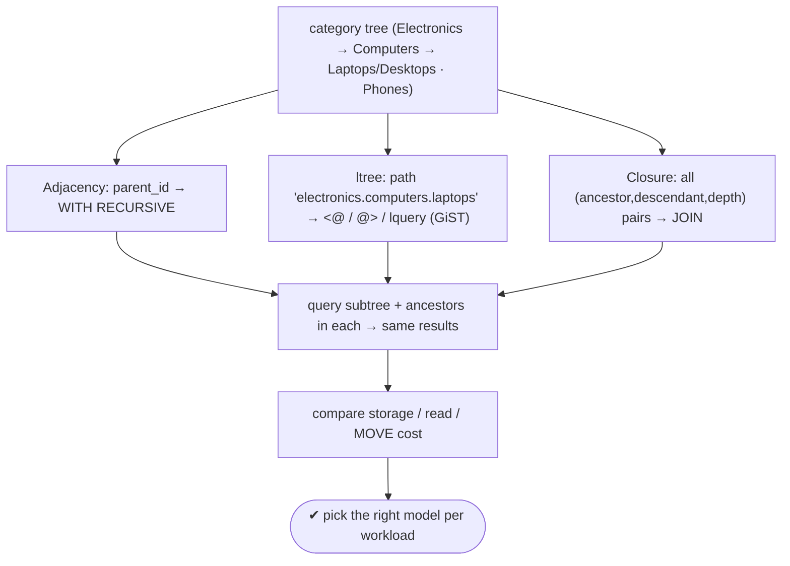
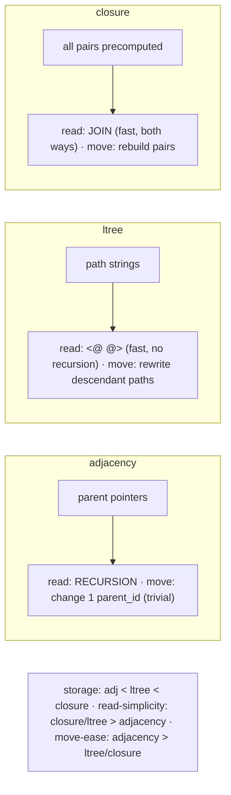

# Lab 85 — Model a Hierarchy Three Ways (Adjacency List, `ltree`, Closure Table); Query Each

> **Track B · Developer · B1 Schema Design & Data Modeling · Lab 7 of 8 (Lab 85/222)**
> Teaching package: concept → diagram → steps → verify → quick-ref → self-test → video script.
> **Depends on:** Lab 79 (constraints), Lab 70 (extensions). **Related:** Lab 91 (recursive CTEs), Lab 101 (GiST).

---

## 0. Lab Card (at a glance)

| Field | Value |
|---|---|
| **Objective** | Model one category tree three ways — adjacency list, `ltree`, closure table — and query subtree and ancestors in each, then compare storage/read/write trade-offs. |
| **Success criterion** | Each model returns the same subtree and ancestor sets; you can state which model to choose for a given workload and how a move works in each. |
| **Scope boundary** | The three hierarchy patterns. Recursive-CTE depth is Lab 91. |
| **Prereqs** | Lab 79; the `ltree` extension |
| **Time** | 40–55 min |
| **Difficulty** | ★★★★☆ |
| **Risk** | Low — scratch tables. |

---

## 1. Learning Objectives

1. **Adjacency list** — `parent_id` + `WITH RECURSIVE`.
2. **`ltree`** — materialized path + `<@`/`@>`/lquery.
3. **Closure table** — all ancestor-descendant pairs + JOINs.
4. **Query each** — subtree and ancestors.
5. **Choose** — storage vs read-simplicity vs write-cost.

---

## 2. Concept Primer — the "why"

Relational tables are flat; trees aren't. Three classic ways to bridge that, each a different trade-off. We'll model the same tree: `Electronics → Computers → {Laptops, Desktops}`, `Electronics → Phones`.

**1. Adjacency list — each row points to its parent.**
```sql
CREATE TABLE cat_adj (id int PRIMARY KEY, name text, parent_id int REFERENCES cat_adj(id));  -- NULL = root
```
- **Pros:** simplest, minimal storage, **moving a subtree is trivial** (change one `parent_id`), self-FK integrity.
- **Cons:** subtree/ancestor queries need **recursion** (`WITH RECURSIVE`); deep trees mean many recursion levels.

**2. `ltree` — a materialized path (contrib extension).** Each row stores its path from root as a dotted label sequence: `electronics.computers.laptops`.
```sql
CREATE TABLE cat_ltree (id int PRIMARY KEY, name text, path ltree);
CREATE INDEX ON cat_ltree USING gist (path);
```
- Operators: `@>` **ancestor-of / contains**, `<@` **descendant-of**, `~` **lquery pattern**.
- **Pros:** fast **recursion-free** subtree/ancestor reads (GiST-indexed), human-readable paths, powerful pattern matching (`*.laptops`).
- **Cons:** **moving a subtree rewrites all descendant paths**; labels are restricted characters; you maintain the path on insert/move.

**3. Closure table — every ancestor-descendant pair precomputed.** A side table holds the transitive closure, including each node's self-pair at depth 0.
```sql
CREATE TABLE cat (id int PRIMARY KEY, name text);
CREATE TABLE cat_closure (ancestor int, descendant int, depth int, PRIMARY KEY (ancestor, descendant));
-- for node X: (X,X,0), (parent,X,1), (grandparent,X,2), … all ancestor→descendant pairs
```
- **Pros:** fast **both-direction** reads via simple **JOINs** (no recursion), stores `depth`, handles arbitrary depth, most flexible.
- **Cons:** **most storage** (roughly nodes × average depth rows), and **complex writes** — inserts add ancestor pairs; a move deletes and rebuilds closure rows.

**The trade-off triangle:**

| | Adjacency | ltree | Closure |
|---|---|---|---|
| Storage | minimal | small | large |
| Subtree read | recursion | `<@` (fast) | JOIN (fast) |
| Ancestor read | recursion | `@>` (fast) | JOIN (fast) |
| Insert leaf | trivial | append path | add pairs |
| **Move subtree** | **trivial** | rewrite descendant paths | rebuild pairs |
| Complexity | simplest | medium | most |

**Choosing:** **adjacency** for simple trees with frequent moves (recursion is fine for moderate depth); **ltree** for read-heavy trees with pattern needs and readable paths (infrequent moves); **closure** when both-direction reads must be fast at arbitrary depth and you can bear the write cost.

---

## 3. Diagrams

### 3.1 Same tree, three models



### 3.2 Read + move contrast



---

## 4. Prerequisites

```bash
sudo -u postgres psql -d shopdb -c "CREATE EXTENSION IF NOT EXISTS ltree;"
```

---

## 5. Step-by-Step

### Step 1 — Model 1: Adjacency list

```bash
sudo -u postgres psql -d shopdb <<'SQL'
DROP TABLE IF EXISTS cat_adj;
CREATE TABLE cat_adj (id int PRIMARY KEY, name text, parent_id int REFERENCES cat_adj(id));
INSERT INTO cat_adj VALUES
 (1,'Electronics',NULL),(2,'Computers',1),(3,'Laptops',2),(4,'Desktops',2),(5,'Phones',1);
SQL
# subtree of Computers (id=2) via recursion:
sudo -u postgres psql -d shopdb <<'SQL'
WITH RECURSIVE subtree AS (
  SELECT id,name,parent_id,1 AS depth FROM cat_adj WHERE id=2
  UNION ALL
  SELECT c.id,c.name,c.parent_id,s.depth+1 FROM cat_adj c JOIN subtree s ON c.parent_id=s.id)
SELECT * FROM subtree;
SQL
# ancestors of Laptops (id=3) via recursion:
sudo -u postgres psql -d shopdb <<'SQL'
WITH RECURSIVE anc AS (
  SELECT id,name,parent_id FROM cat_adj WHERE id=3
  UNION ALL
  SELECT c.id,c.name,c.parent_id FROM cat_adj c JOIN anc a ON c.id=a.parent_id)
SELECT * FROM anc;
SQL
```

### Step 2 — Model 2: ltree (materialized path)

```bash
sudo -u postgres psql -d shopdb <<'SQL'
DROP TABLE IF EXISTS cat_ltree;
CREATE TABLE cat_ltree (id int PRIMARY KEY, name text, path ltree);
INSERT INTO cat_ltree VALUES
 (1,'Electronics','electronics'),
 (2,'Computers','electronics.computers'),
 (3,'Laptops','electronics.computers.laptops'),
 (4,'Desktops','electronics.computers.desktops'),
 (5,'Phones','electronics.phones');
CREATE INDEX ON cat_ltree USING gist (path);
SQL
# subtree of Computers (no recursion):
sudo -u postgres psql -d shopdb -c "SELECT name, path FROM cat_ltree WHERE path <@ 'electronics.computers';"
# ancestors of Laptops:
sudo -u postgres psql -d shopdb -c "SELECT name, path FROM cat_ltree WHERE path @> 'electronics.computers.laptops';"
# pattern (lquery): any 'laptops' anywhere:
sudo -u postgres psql -d shopdb -c "SELECT name FROM cat_ltree WHERE path ~ '*.laptops';"
```

### Step 3 — Model 3: Closure table

```bash
sudo -u postgres psql -d shopdb <<'SQL'
DROP TABLE IF EXISTS cat_closure, cat CASCADE;
CREATE TABLE cat (id int PRIMARY KEY, name text);
INSERT INTO cat VALUES (1,'Electronics'),(2,'Computers'),(3,'Laptops'),(4,'Desktops'),(5,'Phones');
CREATE TABLE cat_closure (ancestor int, descendant int, depth int, PRIMARY KEY (ancestor,descendant));
INSERT INTO cat_closure VALUES
 (1,1,0),(2,2,0),(3,3,0),(4,4,0),(5,5,0),            -- self
 (1,2,1),(1,5,1),(2,3,1),(2,4,1),                     -- parent→child
 (1,3,2),(1,4,2);                                     -- grandparent→grandchild
SQL
# descendants of Computers (id=2) — simple JOIN:
sudo -u postgres psql -d shopdb -c "SELECT c.name, cc.depth FROM cat c JOIN cat_closure cc ON c.id=cc.descendant WHERE cc.ancestor=2 ORDER BY depth;"
# ancestors of Laptops (id=3):
sudo -u postgres psql -d shopdb -c "SELECT c.name, cc.depth FROM cat c JOIN cat_closure cc ON c.id=cc.ancestor WHERE cc.descendant=3 ORDER BY depth;"
```

### Step 4 — Move a subtree in each model (the write-cost contrast)

```bash
# move 'Laptops' under 'Phones' (id 3 → parent 5).
# ADJACENCY: trivial — one update
sudo -u postgres psql -d shopdb -c "UPDATE cat_adj SET parent_id=5 WHERE id=3;"
# LTREE: rewrite the path (and any descendants' paths)
sudo -u postgres psql -d shopdb -c "UPDATE cat_ltree SET path='electronics.phones.laptops' WHERE id=3;"
# CLOSURE: rebuild the pairs for the moved node (delete old ancestor links, add new)
sudo -u postgres psql -d shopdb -c "
DELETE FROM cat_closure WHERE descendant=3 AND ancestor<>3;
INSERT INTO cat_closure VALUES (5,3,1),(1,3,2);"     # now under Phones(5) → Electronics(1)
```

### Step 5 — Confirm all three agree after the move

```bash
sudo -u postgres psql -d shopdb -c "SELECT name FROM cat_ltree WHERE path <@ 'electronics.phones';"                       # ltree
sudo -u postgres psql -d shopdb -c "SELECT c.name FROM cat c JOIN cat_closure cc ON c.id=cc.descendant WHERE cc.ancestor=5;"  # closure
```

---

## 6. Verification Checklist

- [ ] Adjacency: `WITH RECURSIVE` returns subtree and ancestors
- [ ] ltree: `<@` (subtree) and `@>` (ancestors) work; lquery pattern matches
- [ ] Closure: JOINs return subtree and ancestors with depth
- [ ] All three return equivalent results for the same tree
- [ ] A move performed in each (trivial / path-rewrite / pair-rebuild)
- [ ] GiST index on the ltree path
- [ ] Can state which model fits which workload

---

## 7. Troubleshooting

| Symptom | Cause | Fix |
|---|---|---|
| Recursive CTE loops forever | Cycle in data | Ensure it's a tree; use `CYCLE` clause (PG14+) |
| `ltree` type unknown | Extension missing | `CREATE EXTENSION ltree` |
| ltree label error | Illegal characters | Labels: `A-Za-z0-9_` only; sanitize names |
| ltree move left stale descendants | Only moved one row | Update all descendant paths too |
| Closure inconsistent after move | Pairs not rebuilt | Delete old ancestor links + insert new for the whole moved subtree |
| Slow ltree subtree scan | No GiST index | `CREATE INDEX … USING gist (path)` |
| Closure table huge | O(nodes×depth) | Expected; fine for moderate trees |

---

## 8. Quick Reference Card (paste-ready)

```sql
-- ADJACENCY (parent_id): simplest, trivial moves, RECURSION to read
WITH RECURSIVE t AS (SELECT * FROM cat_adj WHERE id=:root
  UNION ALL SELECT c.* FROM cat_adj c JOIN t ON c.parent_id=t.id) SELECT * FROM t;   -- subtree
--   ancestors: join on c.id = t.parent_id

-- LTREE (path): fast reads, no recursion, patterns; moves rewrite paths
CREATE EXTENSION ltree; CREATE INDEX ON t USING gist (path);
WHERE path <@ 'a.b'      -- descendants (subtree)
WHERE path @> 'a.b.c'    -- ancestors
WHERE path ~ '*.laptops' -- lquery pattern

-- CLOSURE (all pairs): fast both-way JOINs, most storage, complex writes
SELECT c.* FROM cat c JOIN cat_closure cc ON c.id=cc.descendant WHERE cc.ancestor=:X;  -- descendants
SELECT c.* FROM cat c JOIN cat_closure cc ON c.id=cc.ancestor   WHERE cc.descendant=:X; -- ancestors

-- choose: adjacency (simple/moves) · ltree (read+patterns) · closure (fast both-way, arbitrary depth)
```

---

## 9. Self-Check

1. Name the three hierarchy models and their core representation.
2. How do you read a subtree in each?
3. What's the storage vs read trade-off across them?
4. Which model makes moving a subtree easiest, and hardest?
5. What are the ltree descendant/ancestor operators?
6. When would you choose each model?

<details>
<summary>Answers</summary>

1. Adjacency list (`parent_id`), ltree (materialized path string), closure table (all ancestor-descendant pairs).
2. Adjacency: `WITH RECURSIVE`; ltree: `path <@ 'ancestor'`; closure: JOIN `WHERE ancestor = X`.
3. Adjacency: minimal storage but needs recursion; ltree: small storage + fast recursion-free reads; closure: large storage but fast simple-JOIN reads both directions.
4. **Easiest: adjacency** (change one `parent_id`); **hardest: closure** (rebuild pairs) / ltree (rewrite descendant paths).
5. `<@` descendant-of (subtree), `@>` ancestor-of, `~` lquery pattern.
6. Adjacency for simple trees/frequent moves; ltree for read-heavy trees with patterns and readable paths; closure for fast both-direction queries at arbitrary depth.
</details>

---

## 10. Video / Teaching Script

| # | On screen | Say (narration) |
|---|---|---|
| 1 | Title: "One tree, three designs" | "Relational tables are flat. Here are the three ways to store a hierarchy — and none is best for everything." |
| 2 | adjacency | "Simplest: each row names its parent. Moving a branch? One update. But reading a whole subtree needs recursion." |
| 3 | ltree | "Store the full path as a string. Now 'descendants of computers' is one operator — no recursion — and you get pattern matching for free." |
| 4 | closure | "Or precompute *every* ancestor-descendant pair. Reads in both directions are plain joins — blazing fast." |
| 5 | move contrast | "The catch is *writes*. Move a subtree: trivial in adjacency, a path rewrite in ltree, a full pair-rebuild in closure." |
| 6 | choose | "So: adjacency when you move a lot, ltree when you read and search a lot, closure when both directions must be fast." |
| 7 | Outro | "Same tree, three trade-offs. That wraps schema design — next, SQL mastery." |

---

## 11. Glossary

- **Adjacency list** — rows with a `parent_id` pointer.
- **`WITH RECURSIVE`** — recursive CTE to walk pointers.
- **`ltree`** — materialized-path type; `<@`/`@>`/`~` operators.
- **lquery** — ltree pattern language (`*.laptops`).
- **Closure table** — stored transitive closure (all ancestor-descendant pairs + depth).
- **Subtree / ancestors** — descendants of / path up from a node.
- **Trade-off triangle** — storage vs read-simplicity vs move-cost.

---
*NETAPORT lab series · PostgreSQL 17 on AlmaLinux 9 · Lab 85/222 · B1 Schema Design & Data Modeling*
