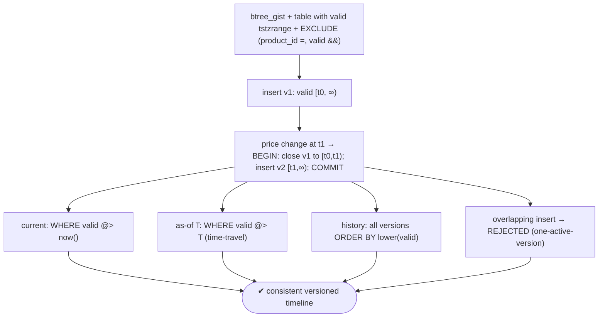
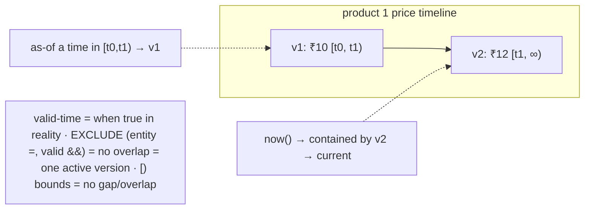

# Lab 86 — Temporal/Versioned Table Design (Valid-Time Ranges with `tstzrange` + GiST)

> **Track B · Developer · B1 Schema Design & Data Modeling · Lab 8 of 8 (Lab 86/222 · B1 complete)**
> Teaching package: concept → diagram → steps → verify → quick-ref → self-test → video script.
> **Depends on:** Lab 82 (exclusion constraints), Lab 81 (deferrable). Closes schema design.

---

## 0. Lab Card (at a glance)

| Field | Value |
|---|---|
| **Objective** | Model valid-time versioned records with `tstzrange`, enforce one active version per entity with a GiST exclusion constraint, and run current + as-of (time-travel) queries. |
| **Success criterion** | Each entity has non-overlapping versions; overlapping inserts are rejected; a change closes the old version and opens a new one; current and historical queries return the right version. |
| **Scope boundary** | Valid-time versioning + one-active-version. Transaction-time/bitemporal noted, not built. |
| **Prereqs** | Lab 82; the `btree_gist` extension |
| **Time** | 30–45 min |
| **Difficulty** | ★★★★☆ |
| **Risk** | Low — scratch table. |

---

## 1. Learning Objectives

1. **Temporal concepts** — valid-time, transaction-time, bitemporal.
2. **Model versions** — a `tstzrange` validity period per row.
3. **One-active-version** — the GiST exclusion constraint.
4. **Record a change** — close old, open new.
5. **Time-travel queries** — current and as-of a past time.

---

## 2. Concept Primer — the "why"

**Temporal tables keep history instead of overwriting it.** When a fact changes, you don't `UPDATE` the row and lose the past — you keep **versions**, each stamped with the period it applies to. Three notions of "time":
- **Valid-time** (application time) — *when a fact is true in the real world* (a product's price is ₹10 from Jan–Mar, ₹12 from Apr). **This lab's focus.**
- **Transaction-time** (system time) — *when the database recorded it* (audit: when we knew it).
- **Bitemporal** — both at once.

**Model valid-time with a range column.** Give each version a `valid tstzrange`, keyed by the entity it describes:
```sql
CREATE TABLE product_prices (
  id         bigint GENERATED ALWAYS AS IDENTITY PRIMARY KEY,
  product_id int NOT NULL,
  price      numeric NOT NULL,
  valid      tstzrange NOT NULL,
  EXCLUDE USING gist (product_id WITH =, valid WITH &&)   -- one active version per product
);
```
A product has several rows over time, each covering a **non-overlapping** interval.

**The one-active-version constraint (the key).** `EXCLUDE USING gist (product_id WITH =, valid WITH &&)` (Lab 82, needs `btree_gist`) forbids two versions of the *same* `product_id` whose `valid` ranges **overlap** — so **at most one version is valid at any instant**. The database guarantees the timeline is consistent; your app can't accidentally create two "current" prices.

**Represent "until further notice" with an unbounded upper bound:** `tstzrange('2026-01-01', NULL)` = `[2026-01-01, ∞)`. The current version is open-ended.

**Recording a change — close old, open new (in one transaction):**
```sql
BEGIN;
  UPDATE product_prices SET valid = tstzrange(lower(valid), '2026-04-01')  -- close v1 at the change time
    WHERE product_id = 1 AND upper_inf(valid);
  INSERT INTO product_prices (product_id, price, valid)                    -- open v2
    VALUES (1, 12.00, tstzrange('2026-04-01', NULL));
COMMIT;
```
With `[)` bounds, closing v1 at `2026-04-01` (exclusive) and opening v2 at `2026-04-01` (inclusive) leaves **no gap and no overlap** — the constraint is satisfied. *(If your ordering transiently overlaps, make the exclusion `DEFERRABLE`, Lab 81.)*

**Time-travel queries — the payoff:**
- **Current version:** `WHERE valid @> now()`.
- **As-of a past time T:** `WHERE valid @> T::timestamptz` — reconstruct what was true then.
- **Full history:** all rows for the entity `ORDER BY lower(valid)`.

*(Transaction-time / system versioning — moving superseded rows to a history table with a `sys_period` — is typically done with triggers or the `temporal_tables` extension; PostgreSQL has no native `SYSTEM VERSIONING` yet. Bitemporal = a valid range **and** a system range.)*

---

## 3. Diagrams

### 3.1 Version + query flow



### 3.2 The timeline



---

## 4. Prerequisites

```bash
sudo -u postgres psql -d shopdb -c "CREATE EXTENSION IF NOT EXISTS btree_gist;"
```

---

## 5. Step-by-Step

### Step 1 — Versioned table with the one-active-version constraint

```bash
sudo -u postgres psql -d shopdb <<'SQL'
DROP TABLE IF EXISTS product_prices;
CREATE TABLE product_prices (
  id         bigint GENERATED ALWAYS AS IDENTITY PRIMARY KEY,
  product_id int NOT NULL,
  price      numeric(10,2) NOT NULL,
  valid      tstzrange NOT NULL,
  EXCLUDE USING gist (product_id WITH =, valid WITH &&)
);
SQL
```

### Step 2 — Insert the first (open-ended) version

```bash
sudo -u postgres psql -d shopdb -c "
INSERT INTO product_prices (product_id, price, valid)
VALUES (1, 10.00, tstzrange('2026-01-01', NULL));"      -- [2026-01-01, ∞)
```

### Step 3 — Record a price change (close old, open new)

```bash
sudo -u postgres psql -d shopdb <<'SQL'
BEGIN;
  UPDATE product_prices
     SET valid = tstzrange(lower(valid), '2026-04-01')       -- close v1 at the change instant
   WHERE product_id = 1 AND upper_inf(valid);
  INSERT INTO product_prices (product_id, price, valid)
   VALUES (1, 12.00, tstzrange('2026-04-01', NULL));         -- open v2
COMMIT;
SQL
sudo -u postgres psql -d shopdb -c "SELECT price, valid FROM product_prices WHERE product_id=1 ORDER BY lower(valid);"
```

### Step 4 — Prove one-active-version (overlap rejected)

```bash
sudo -u postgres psql -d shopdb -c "
INSERT INTO product_prices (product_id, price, valid)
VALUES (1, 15.00, tstzrange('2026-02-01','2026-05-01'));" 2>&1 | tail -1
#   → conflicting key value violates exclusion constraint (overlaps existing versions)
```

### Step 5 — Time-travel queries

```bash
# current price:
sudo -u postgres psql -d shopdb -c "SELECT price FROM product_prices WHERE product_id=1 AND valid @> now();"
# price as of a past date (Feb 15 → v1):
sudo -u postgres psql -d shopdb -c "SELECT price FROM product_prices WHERE product_id=1 AND valid @> '2026-02-15'::timestamptz;"
# price as of Apr 15 → v2:
sudo -u postgres psql -d shopdb -c "SELECT price FROM product_prices WHERE product_id=1 AND valid @> '2026-04-15'::timestamptz;"
```

### Step 6 — Full history + no-gap check

```bash
sudo -u postgres psql -d shopdb -c "
SELECT price, lower(valid) AS from_ts, upper(valid) AS to_ts
FROM product_prices WHERE product_id=1 ORDER BY lower(valid);"
# contiguous (no gap): v1 upper = v2 lower, with [) bounds → seamless timeline
```

---

## 6. Verification Checklist

- [ ] Table has a `valid tstzrange` + GiST exclusion (`product_id =`, `valid &&`)
- [ ] First version open-ended (`[start, ∞)`)
- [ ] A change closed the old version and opened a new one (in a txn)
- [ ] Overlapping insert **rejected** (one-active-version)
- [ ] `valid @> now()` returns the current version
- [ ] `valid @> T` returns the version valid at a past time
- [ ] History contiguous (no gap, no overlap)

---

## 7. Troubleshooting

| Symptom | Cause | Fix |
|---|---|---|
| Overlap on version insert | Old version not closed / bounds overlap | Close old first; use `[)` bounds so endpoints don't overlap |
| Exclusion needs `btree_gist` | Extension missing | `CREATE EXTENSION btree_gist` |
| Gap between versions | Old upper ≠ new lower | Make old upper = new lower (with `[)`, seamless) |
| Current query returns nothing | No version covers `now()` | Ensure the latest version is open-ended (`∞`) |
| Two "current" versions | Exclusion missing/wrong | Add `EXCLUDE (entity =, valid &&)` |
| Transient overlap during a swap | Insert-before-close ordering | Make the exclusion `DEFERRABLE` (Lab 81) |
| Need "when we knew it" too | That's transaction-time | Add a `sys_period` via triggers/`temporal_tables` (bitemporal) |

---

## 8. Quick Reference Card (paste-ready)

```sql
CREATE EXTENSION IF NOT EXISTS btree_gist;
CREATE TABLE product_prices (
  id bigint GENERATED ALWAYS AS IDENTITY PRIMARY KEY,
  product_id int NOT NULL, price numeric NOT NULL,
  valid tstzrange NOT NULL,
  EXCLUDE USING gist (product_id WITH =, valid WITH &&)   -- ONE active version per product
);

-- open-ended current version:  tstzrange('2026-01-01', NULL)   -- [start, ∞)
-- record a change (close old, open new):
BEGIN;
  UPDATE product_prices SET valid = tstzrange(lower(valid), :change) WHERE product_id=:id AND upper_inf(valid);
  INSERT INTO product_prices (product_id, price, valid) VALUES (:id, :new_price, tstzrange(:change, NULL));
COMMIT;

-- time travel:  current → WHERE valid @> now()   ·   as-of T → WHERE valid @> T::timestamptz
-- history: SELECT ... ORDER BY lower(valid) · [) bounds = seamless (no gap/overlap)
-- transaction-time/bitemporal → triggers or temporal_tables extension
```

---

## 9. Self-Check

1. What's the difference between valid-time, transaction-time, and bitemporal?
2. How do you model valid-time versions?
3. What enforces "one active version at a time"?
4. How do you query the current version, and the version valid at a past time?
5. How do you record a change to a versioned value?
6. How do you represent "valid until further notice"?

<details>
<summary>Answers</summary>

1. Valid-time = when a fact is true in reality; transaction-time = when the DB recorded it; bitemporal = both.
2. Each version is a row with a `valid tstzrange`, keyed by the entity, with non-overlapping ranges.
3. `EXCLUDE USING gist (entity_id WITH =, valid WITH &&)` — no overlapping validity ranges per entity.
4. Current: `WHERE valid @> now()`; as-of T: `WHERE valid @> T::timestamptz`.
5. In a transaction: close the current version's range at the change time, then insert a new version starting then (`[)` bounds → no gap/overlap).
6. An **unbounded upper** bound: `tstzrange(start, NULL)` = `[start, ∞)`.
</details>

---

## 10. Video / Teaching Script

| # | On screen | Say (narration) |
|---|---|---|
| 1 | Title: "Data with a memory" | "Most tables forget the past — you update, and yesterday's value is gone. Temporal tables keep every version, each stamped with when it was true." |
| 2 | model + constraint | "Give each row a validity range, and add one constraint: no two versions of the same product can overlap. Now the database guarantees a clean timeline." |
| 3 | change | "A price change doesn't overwrite — it closes the old version and opens a new one. Seamless, no gap, no overlap." |
| 4 | overlap rejected | "Try to slip in an overlapping version? Rejected. There's always exactly one truth at any instant." |
| 5 | time travel | "And here's the magic: ask for the price *now*, or the price *last February*. Same table, different point in time." |
| 6 | history | "The whole history is right there, in order. Perfect for audits and 'what did we charge back then?'" |
| 7 | Outro | "History you can query. That completes schema design — next, SQL mastery." |

---

## 11. Glossary

- **Temporal table** — keeps versions instead of overwriting.
- **Valid-time / transaction-time / bitemporal** — real-world / recorded / both.
- **`tstzrange` validity period** — the interval a version applies.
- **One-active-version** — GiST exclusion on `(entity =, valid &&)`.
- **Unbounded upper** — `[start, ∞)` = "until further notice".
- **As-of query** — `valid @> T` reconstructs a past state.
- **Close/open** — end the old version, start a new one.

---
*NETAPORT lab series · PostgreSQL 17 on AlmaLinux 9 · Lab 86/222 · **B1 Schema Design & Data Modeling complete***
