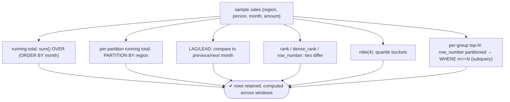

# Lab 87 — Window Functions: Running Totals, `LAG`/`LEAD`, `rank`/`dense_rank`, `ntile`, Per-Group Top-N

> **Track B · Developer · B2 SQL Mastery · Lab 1 of 9 (Lab 87/222)**
> Teaching package: concept → diagram → steps → verify → quick-ref → self-test → video script.
> **Depends on:** B1 (schema design). Opens SQL mastery. **Feeds:** Labs 88–95 (CTEs, grouping sets, LATERAL).

---

## 0. Lab Card (at a glance)

| Field | Value |
|---|---|
| **Objective** | Use window functions for running totals/moving averages, period-over-period with `LAG`/`LEAD`, ranking (`row_number`/`rank`/`dense_rank`/`ntile`), and per-group top-N. |
| **Success criterion** | Each pattern returns correct per-row results without collapsing rows; you can explain the tie behavior and the top-N technique. |
| **Scope boundary** | Window functions. General CTEs are Lab 88; grouping sets Lab 90. |
| **Prereqs** | B1; a sample dataset |
| **Time** | 35–50 min |
| **Difficulty** | ★★★★☆ |
| **Risk** | Low — read-only queries. |

---

## 1. Learning Objectives

1. **The `OVER` clause** — partition, order, frame.
2. **Aggregate windows** — running totals, moving averages.
3. **Ranking** — `row_number`/`rank`/`dense_rank`/`ntile` and ties.
4. **Offset** — `LAG`/`LEAD` for period comparison.
5. **Per-group top-N** — the subquery pattern.

---

## 2. Concept Primer — the "why"

**Window functions compute across related rows *without collapsing them*.** A `GROUP BY` aggregate reduces many rows to one per group; a **window function** keeps every row and adds a value computed over a **window** of related rows. So you can show each sale *and* its running total, or each salesperson *and* their rank — in one query, no self-joins.

**The `OVER` clause defines the window:**
- `OVER ()` — the whole result set.
- `OVER (PARTITION BY region)` — a separate window per partition (like GROUP BY, but rows survive).
- `OVER (ORDER BY month)` — an ordered window (required for running totals, ranking, LAG/LEAD).
- `OVER (PARTITION BY region ORDER BY month)` — per-partition, ordered.
- **Frame** (`ROWS`/`RANGE`/`GROUPS BETWEEN …`) — which rows in the window contribute. With `ORDER BY` and no explicit frame, the default is *unbounded preceding → current row* (cumulative).

**Three families:**

1. **Aggregate windows** — `sum`/`avg`/`count`/`min`/`max` `OVER (…)`:
   - Running total: `sum(amount) OVER (ORDER BY month)`.
   - Moving average: `avg(amount) OVER (ORDER BY month ROWS BETWEEN 6 PRECEDING AND CURRENT ROW)` (7-row window).

2. **Ranking** — the tie behavior is the thing to memorize:
   - `row_number()` → **always unique**: `1,2,3,4` (arbitrary among ties).
   - `rank()` → **gaps** on ties: `1,2,2,4`.
   - `dense_rank()` → **no gaps**: `1,2,2,3`.
   - `ntile(n)` → split rows into `n` roughly equal buckets (quartiles = `ntile(4)`).

3. **Offset/navigation** — read another row's value:
   - `lag(x, 1, default)` → the **previous** row's `x` (period-over-period change).
   - `lead(x, 1, default)` → the **next** row's `x`.
   - `first_value`/`last_value`/`nth_value` → a value at a window position.

**Per-group top-N — the classic pattern.** Number rows within each group, then filter. Window functions **can't appear in `WHERE`** (they run *after* WHERE), so you filter in an outer query/CTE:
```sql
SELECT * FROM (
  SELECT *, row_number() OVER (PARTITION BY region ORDER BY amount DESC) AS rn
  FROM sales
) t WHERE rn <= 2;      -- top 2 per region
```
*(For top-1 per group, `DISTINCT ON` is a shorter alternative — a later B2 lab.)*

**Evaluation order to remember:** `FROM → WHERE → GROUP BY → HAVING → window functions → SELECT → ORDER BY`. That's why window results need a subquery to filter on and why they can see post-aggregation data. Name a reusable window with a `WINDOW` clause: `WINDOW w AS (PARTITION BY region ORDER BY month)`.

---

## 3. Diagrams

### 3.1 Patterns flow



### 3.2 Window model + ranking ties

```mermaid
flowchart LR
    subgraph OVER [OVER (PARTITION BY ... ORDER BY ... FRAME)]
      P["PARTITION resets per group"] --> O["ORDER defines sequence"] --> FR["FRAME picks contributing rows"]
    end
    subgraph TIES [ranking on a tie at 2nd place]
      T1["row_number: 1,2,3,4 (unique)"]
      T2["rank: 1,2,2,4 (gap)"]
      T3["dense_rank: 1,2,2,3 (no gap)"]
    end
    note["window fn ≠ GROUP BY (rows kept) · can't go in WHERE → subquery · default frame w/ ORDER = cumulative"]
```

---

## 4. Prerequisites — sample data

```bash
sudo -u postgres psql -d shopdb <<'SQL'
DROP TABLE IF EXISTS sales;
CREATE TABLE sales (region text, person text, month date, amount numeric);
INSERT INTO sales VALUES
 ('North','Asha','2026-01-01',100),('North','Asha','2026-02-01',150),('North','Asha','2026-03-01',120),
 ('North','Ravi','2026-01-01',200),('North','Ravi','2026-02-01',180),('North','Ravi','2026-03-01',220),
 ('South','Meera','2026-01-01',90),('South','Meera','2026-02-01',130),('South','Meera','2026-03-01',160),
 ('South','Dev','2026-01-01',210),('South','Dev','2026-02-01',210),('South','Dev','2026-03-01',170);
SQL
```

---

## 5. Step-by-Step

### Step 1 — Running total (cumulative)

```bash
sudo -u postgres psql -d shopdb -c "
SELECT month, amount,
       sum(amount) OVER (ORDER BY month) AS running_total
FROM sales WHERE person='Asha' ORDER BY month;"
```

### Step 2 — Per-partition running total + moving average

```bash
sudo -u postgres psql -d shopdb -c "
SELECT region, month, amount,
       sum(amount) OVER (PARTITION BY region ORDER BY month) AS region_running,
       round(avg(amount) OVER (PARTITION BY region ORDER BY month
                               ROWS BETWEEN 1 PRECEDING AND CURRENT ROW),1) AS moving_avg_2
FROM sales ORDER BY region, month;"
```

### Step 3 — LAG/LEAD: month-over-month change

```bash
sudo -u postgres psql -d shopdb -c "
SELECT person, month, amount,
       lag(amount)  OVER (PARTITION BY person ORDER BY month) AS prev_month,
       amount - lag(amount) OVER (PARTITION BY person ORDER BY month) AS mom_change,
       lead(amount) OVER (PARTITION BY person ORDER BY month) AS next_month
FROM sales WHERE person IN ('Ravi','Meera') ORDER BY person, month;"
```

### Step 4 — Ranking: row_number vs rank vs dense_rank

```bash
sudo -u postgres psql -d shopdb -c "
WITH totals AS (SELECT person, sum(amount) AS total FROM sales GROUP BY person)
SELECT person, total,
       row_number() OVER (ORDER BY total DESC) AS row_num,
       rank()       OVER (ORDER BY total DESC) AS rank,
       dense_rank() OVER (ORDER BY total DESC) AS dense_rank
FROM totals ORDER BY total DESC;"
#   compare how each handles any ties
```

### Step 5 — ntile: quartile buckets

```bash
sudo -u postgres psql -d shopdb -c "
SELECT person, month, amount,
       ntile(4) OVER (ORDER BY amount DESC) AS quartile
FROM sales ORDER BY amount DESC;"
```

### Step 6 — Per-group top-N (top 2 per region)

```bash
sudo -u postgres psql -d shopdb -c "
SELECT region, person, total FROM (
  SELECT region, person, sum(amount) AS total,
         row_number() OVER (PARTITION BY region ORDER BY sum(amount) DESC) AS rn
  FROM sales GROUP BY region, person
) t WHERE rn <= 2 ORDER BY region, total DESC;"
#   window function filtered via the outer subquery (can't be in WHERE)
```

---

## 6. Verification Checklist

- [ ] Running total accumulates in order
- [ ] `PARTITION BY` resets the running total per region
- [ ] Moving average uses an explicit frame
- [ ] `LAG`/`LEAD` return previous/next values (nulls at boundaries)
- [ ] `row_number`/`rank`/`dense_rank` differ correctly on ties
- [ ] `ntile(4)` splits into quartiles
- [ ] Per-group top-N works via the outer-subquery filter

---

## 7. Troubleshooting

| Symptom | Cause | Fix |
|---|---|---|
| "window functions are not allowed in WHERE" | Filtering on a window result | Wrap in a subquery/CTE; filter on the alias |
| Running total = grand total on every row | No `ORDER BY` in `OVER` | Add `ORDER BY` (sets the cumulative frame) |
| `last_value` returns the current row | Default frame ends at current row | `ROWS BETWEEN UNBOUNDED PRECEDING AND UNBOUNDED FOLLOWING` |
| Moving average wrong window | Frame not set | Set `ROWS BETWEEN n PRECEDING AND CURRENT ROW` |
| `LAG`/`LEAD` null at edges | No default | Pass a default: `lag(x,1,0)` |
| Ranking not resetting per group | Missing `PARTITION BY` | Add it |
| Slow on big data | Window requires a sort | Index the partition/order columns |

---

## 8. Quick Reference Card (paste-ready)

```sql
-- OVER (PARTITION BY g ORDER BY o [frame]) — rows are KEPT (unlike GROUP BY)
sum(x)  OVER (ORDER BY d)                                   -- running total (cumulative)
avg(x)  OVER (ORDER BY d ROWS BETWEEN 6 PRECEDING AND CURRENT ROW)  -- 7-row moving average
lag(x,1,default)  / lead(x,1,default)  OVER (PARTITION BY g ORDER BY d)  -- prev / next

row_number() OVER (ORDER BY x DESC)   -- 1,2,3,4  (unique)
rank()       OVER (ORDER BY x DESC)   -- 1,2,2,4  (gaps on ties)
dense_rank() OVER (ORDER BY x DESC)   -- 1,2,2,3  (no gaps)
ntile(4)     OVER (ORDER BY x DESC)   -- quartile buckets

-- per-group top-N (window fn can't be in WHERE):
SELECT * FROM (SELECT *, row_number() OVER (PARTITION BY g ORDER BY m DESC) rn FROM t) s WHERE rn <= N;

-- reuse a window: ... OVER w ... WINDOW w AS (PARTITION BY g ORDER BY d)
-- order: FROM→WHERE→GROUP BY→HAVING→WINDOW→SELECT→ORDER BY
```

---

## 9. Self-Check

1. How does a window function differ from a `GROUP BY` aggregate?
2. How do `row_number`, `rank`, and `dense_rank` handle ties?
3. How do you make a running total?
4. What's the difference between `LAG` and `LEAD`?
5. What's the per-group top-N pattern?
6. Why can't you filter on a window function in `WHERE`?

<details>
<summary>Answers</summary>

1. A window function computes over related rows **without collapsing** them — every row is retained and gets its own computed value.
2. `row_number`: always unique (1,2,3,4); `rank`: gaps after ties (1,2,2,4); `dense_rank`: no gaps (1,2,2,3).
3. `sum(x) OVER (ORDER BY d)` — the `ORDER BY` gives a cumulative frame.
4. `LAG` returns a preceding row's value; `LEAD` returns a following row's value.
5. `row_number() OVER (PARTITION BY group ORDER BY metric DESC)` in a subquery, then `WHERE rn <= N` in the outer query.
6. Window functions are evaluated **after** `WHERE`, so you must filter on them in an outer subquery/CTE.
</details>

---

## 10. Video / Teaching Script

| # | On screen | Say (narration) |
|---|---|---|
| 1 | Title: "Calculations that keep your rows" | "GROUP BY collapses rows. Window functions don't — you keep every row *and* get running totals, ranks, comparisons. Once you learn these, half of reporting SQL gets easy." |
| 2 | running total | "sum, but OVER an order — each row shows the total *so far*. Partition it, and each region gets its own running total." |
| 3 | lag/lead | "LAG grabs the previous row — instant month-over-month change. LEAD looks ahead." |
| 4 | ranking | "Three ways to rank, and the tie behavior matters: row_number is always unique, rank leaves gaps, dense_rank doesn't. Pick deliberately." |
| 5 | ntile | "ntile splits your rows into buckets — quartiles, deciles, whatever." |
| 6 | top-N | "And the classic: top two per region. Number within each group, then filter — in a subquery, because window functions can't live in WHERE." |
| 7 | Outro | "Window functions — reporting SQL's superpower. Next: common table expressions and recursion." |

---

## 11. Glossary

- **Window function** — computes over related rows without collapsing them.
- **`OVER` / `PARTITION BY` / `ORDER BY` / frame** — the window definition.
- **Running total / moving average** — cumulative / framed aggregate windows.
- **`row_number` / `rank` / `dense_rank`** — unique / gapped / gapless ranking.
- **`ntile(n)`** — split into n buckets.
- **`LAG` / `LEAD`** — previous / next row's value.
- **Per-group top-N** — partitioned `row_number` filtered in a subquery.

---
*NETAPORT lab series · PostgreSQL 17 on AlmaLinux 9 · Lab 87/222 · B2 SQL Mastery*
