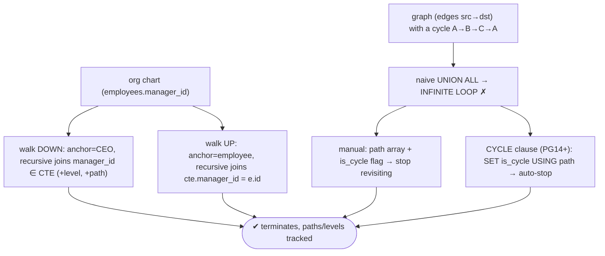
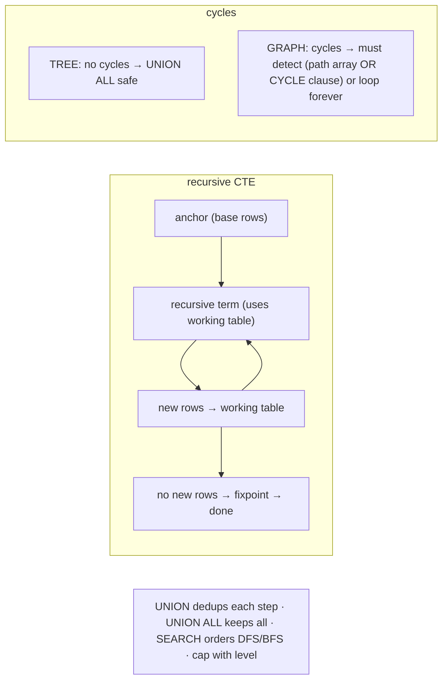

# Lab 88 — Recursive CTE: Walk an Org Chart and a Graph with Cycle Detection

> **Track B · Developer · B2 SQL Mastery · Lab 2 of 9 (Lab 88/222)**
> Teaching package: concept → diagram → steps → verify → quick-ref → self-test → video script.
> **Depends on:** Lab 85 (adjacency lists), Lab 87 (CTEs seen in use).

---

## 0. Lab Card (at a glance)

| Field | Value |
|---|---|
| **Objective** | Write recursive CTEs to walk an org chart (down and up) and traverse a graph that contains a cycle, using both manual and `CYCLE`-clause cycle detection. |
| **Success criterion** | Org-chart traversal returns levels/paths; graph traversal terminates on cyclic data (no infinite loop) via a path array and via the `CYCLE` clause. |
| **Scope boundary** | Recursive CTE mechanics + cycle handling. Hierarchy modeling was Lab 85. |
| **Prereqs** | Lab 85; a graph/org dataset |
| **Time** | 35–50 min |
| **Difficulty** | ★★★★☆ |
| **Risk** | Low — read-only (naive cyclic query capped to avoid hanging). |

---

## 1. Learning Objectives

1. **Recursive CTE structure** — anchor + recursive term + fixpoint.
2. **Org chart** — walk down and up, tracking level/path.
3. **Why graphs loop** — cycles + naive recursion.
4. **Manual cycle detection** — a visited-path array.
5. **The `CYCLE` clause** — automatic detection (PG14+).

---

## 2. Concept Primer — the "why"

**A recursive CTE references itself to iterate over hierarchical or graph data.**
```sql
WITH RECURSIVE cte AS (
  <ANCHOR>            -- base case: the starting rows
  UNION [ALL]
  <RECURSIVE TERM>    -- references cte, producing the next level
)
SELECT * FROM cte;
```
**How it runs:** evaluate the anchor → a *working table*; evaluate the recursive term against the working table → new rows become the next working table; repeat until the recursive term returns **no new rows** (the *fixpoint*). `UNION` removes duplicates each step; `UNION ALL` keeps all (faster, but risks looping on cycles).

**Org chart (a tree — no cycles).**
- **Walk down** (subordinates): anchor = the top manager; recursive term joins employees whose `manager_id` is in the CTE. Carry a `level` and a `path`.
- **Walk up** (chain of command): anchor = an employee; recursive term joins to *their* manager (`cte.manager_id = e.id`).
Because a tree has no cycles, `UNION ALL` is safe; still, tracking `level` lets you cap depth.

**Graphs — the hard part is cycles.** A general graph (edges, not a strict tree) can contain a **cycle**: A→B→C→A. Naive recursion with `UNION ALL` would follow the cycle **forever** — an infinite loop that hangs the query. Two ways to stop it:

1. **Manual cycle detection** — accumulate the **visited path** in an array and refuse to revisit a node:
```sql
WITH RECURSIVE walk AS (
  SELECT :start AS node, ARRAY[:start] AS path, false AS is_cycle
  UNION ALL
  SELECT e.dst, w.path || e.dst, e.dst = ANY(w.path)
  FROM edges e JOIN walk w ON e.src = w.node
  WHERE NOT w.is_cycle                       -- stop extending a branch once it cycles
)
SELECT * FROM walk;
```
The `path` array records where you've been; the `is_cycle` flag turns true when an edge would revisit a node, and `WHERE NOT is_cycle` halts that branch.

2. **The `CYCLE` clause (SQL-standard, PG14+)** — PostgreSQL tracks the path and marks cycles for you:
```sql
WITH RECURSIVE walk AS (
  SELECT src, dst FROM edges WHERE src = :start
  UNION ALL
  SELECT e.src, e.dst FROM edges e JOIN walk w ON e.src = w.dst
) CYCLE dst SET is_cycle USING path
SELECT * FROM walk;
```
`CYCLE <col> SET <mark_col> USING <path_col>` — it stops recursing down a branch when `<col>` repeats, sets `is_cycle` on the closing row, and exposes the `path`. Cleaner than the manual version.

**Also useful (PG14+):** the **`SEARCH`** clause orders output depth-first or breadth-first: `SEARCH DEPTH FIRST BY id SET ordercol`. And cap runaway recursion with `WHERE level < N`.

---

## 3. Diagrams

### 3.1 Traversal flow



### 3.2 Mechanics + cycle handling



---

## 4. Prerequisites — org chart + graph data

```bash
sudo -u postgres psql -d shopdb <<'SQL'
DROP TABLE IF EXISTS employees;
CREATE TABLE employees (id int PRIMARY KEY, name text, manager_id int REFERENCES employees(id));
INSERT INTO employees VALUES
 (1,'CEO',NULL),(2,'VP-Eng',1),(3,'VP-Sales',1),
 (4,'Eng-Mgr',2),(5,'Dev-A',4),(6,'Dev-B',4),(7,'Sales-Rep',3);

DROP TABLE IF EXISTS edges;
CREATE TABLE edges (src int, dst int);
INSERT INTO edges VALUES (1,2),(2,3),(3,1),(3,4),(4,5);   -- 1→2→3→1 is a CYCLE
SQL
```

---

## 5. Step-by-Step

### Step 1 — Walk the org chart DOWN (subordinates, with level + path)

```bash
sudo -u postgres psql -d shopdb <<'SQL'
WITH RECURSIVE org AS (
  SELECT id, name, manager_id, 1 AS level, name::text AS path
  FROM employees WHERE id = 1                         -- anchor: CEO
  UNION ALL
  SELECT e.id, e.name, e.manager_id, o.level+1, o.path || ' > ' || e.name
  FROM employees e JOIN org o ON e.manager_id = o.id  -- recursive: direct reports
)
SELECT level, path FROM org ORDER BY path;
SQL
```

### Step 2 — Walk the org chart UP (chain of command)

```bash
sudo -u postgres psql -d shopdb <<'SQL'
WITH RECURSIVE chain AS (
  SELECT id, name, manager_id FROM employees WHERE id = 5      -- anchor: Dev-A
  UNION ALL
  SELECT e.id, e.name, e.manager_id
  FROM employees e JOIN chain c ON c.manager_id = e.id         -- recursive: this node's manager
)
SELECT name FROM chain;
SQL
```

### Step 3 — Show the danger: naive graph walk would loop (capped to be safe)

```bash
sudo -u postgres psql -d shopdb <<'SQL'
WITH RECURSIVE bad AS (
  SELECT src, dst, 1 AS depth FROM edges WHERE src = 1
  UNION ALL
  SELECT e.src, e.dst, b.depth+1 FROM edges e JOIN bad b ON e.src = b.dst
  WHERE b.depth < 10          -- CAP only so this demo doesn't hang; the cycle 1→2→3→1 repeats
)
SELECT depth, src, dst FROM bad ORDER BY depth;   -- watch 1→2→3→1→2→3 repeat = the cycle problem
SQL
```

### Step 4 — Manual cycle detection with a path array

```bash
sudo -u postgres psql -d shopdb <<'SQL'
WITH RECURSIVE walk AS (
  SELECT 1 AS node, ARRAY[1] AS path, false AS is_cycle
  UNION ALL
  SELECT e.dst, w.path || e.dst, e.dst = ANY(w.path)
  FROM edges e JOIN walk w ON e.src = w.node
  WHERE NOT w.is_cycle                     -- stop a branch once it would revisit
)
SELECT node, path, is_cycle FROM walk;      -- terminates; the row closing 1→2→3→1 is flagged
SQL
```

### Step 5 — The CYCLE clause (PG14+): automatic detection

```bash
sudo -u postgres psql -d shopdb <<'SQL'
WITH RECURSIVE walk AS (
  SELECT src, dst FROM edges WHERE src = 1
  UNION ALL
  SELECT e.src, e.dst FROM edges e JOIN walk w ON e.src = w.dst
) CYCLE dst SET is_cycle USING path
SELECT src, dst, is_cycle, path FROM walk;   -- Postgres tracks path + marks the cycle, then stops
SQL
```

### Step 6 — (PG14+) order the walk depth-first

```bash
sudo -u postgres psql -d shopdb <<'SQL'
WITH RECURSIVE walk AS (
  SELECT src, dst FROM edges WHERE src = 1
  UNION ALL
  SELECT e.src, e.dst FROM edges e JOIN walk w ON e.src = w.dst
) SEARCH DEPTH FIRST BY dst SET ord
  CYCLE dst SET is_cycle USING path
SELECT src, dst FROM walk ORDER BY ord;
SQL
```

---

## 6. Verification Checklist

- [ ] Org chart DOWN returns levels + readable paths
- [ ] Org chart UP returns the management chain
- [ ] Naive cyclic walk visibly repeats the cycle (why detection is needed)
- [ ] Manual path-array detection terminates and flags the cycle
- [ ] `CYCLE` clause detects and stops automatically (PG14+)
- [ ] `SEARCH` clause orders DFS/BFS
- [ ] Join columns understood (down vs up direction)

---

## 7. Troubleshooting

| Symptom | Cause | Fix |
|---|---|---|
| Query hangs / never ends | Cycle + `UNION ALL`, no detection | Path array, or the `CYCLE` clause; cap depth |
| Only the anchor returns | Recursive join condition wrong | Check `ON` direction (down: `e.manager_id=cte.id`) |
| `CYCLE` clause errors | Pre-PG14 | Use the manual path-array method |
| Missing rows with `UNION` | Dedup dropped needed duplicates | Use `UNION ALL` (with cycle handling) |
| Depth explosion | Unbounded recursion | `WHERE level < N` |
| Slow on big graphs | Unindexed join columns | Index `manager_id` / `edges(src)` |
| Path array huge | Very deep graph | Cap depth; limit what you carry |

---

## 8. Quick Reference Card (paste-ready)

```sql
-- structure: WITH RECURSIVE cte AS (<anchor> UNION [ALL] <recursive term>) SELECT ...
-- ORG CHART down (subordinates):
WITH RECURSIVE org AS (
  SELECT id,name,manager_id,1 lvl FROM employees WHERE id=:top
  UNION ALL
  SELECT e.id,e.name,e.manager_id,o.lvl+1 FROM employees e JOIN org o ON e.manager_id=o.id)
SELECT * FROM org;
-- up (chain): recursive term  JOIN chain c ON c.manager_id = e.id

-- GRAPH with cycles — manual detection:
... SELECT e.dst, w.path||e.dst, e.dst=ANY(w.path) FROM edges e JOIN walk w ON e.src=w.node WHERE NOT w.is_cycle
-- GRAPH — CYCLE clause (PG14+):
) CYCLE dst SET is_cycle USING path
-- ordering (PG14+): ) SEARCH DEPTH|BREADTH FIRST BY col SET ord   → ORDER BY ord
-- UNION dedups per step · UNION ALL keeps all (needs cycle handling) · cap with WHERE lvl<N
```

---

## 9. Self-Check

1. What are the parts of a recursive CTE and how does it terminate?
2. How do you walk an org chart down vs up?
3. Why do graphs with cycles break naive recursion?
4. What are the two ways to detect cycles?
5. What's the difference between `UNION` and `UNION ALL` in recursion?
6. What does the `SEARCH` clause do?

<details>
<summary>Answers</summary>

1. An **anchor** (base rows) `UNION [ALL]` a **recursive term** that references the CTE; it iterates, feeding new rows back in, until the recursive term produces **no new rows** (fixpoint).
2. Down: recursive term joins employees whose `manager_id` is in the CTE; up: joins where `cte.manager_id = employee.id`.
3. A cycle (A→B→C→A) is revisited forever → infinite loop.
4. **Manual**: track the visited path in an array and don't revisit; **`CYCLE` clause** (PG14+): `SET is_cycle USING path` auto-detects and stops.
5. `UNION` removes duplicates each iteration; `UNION ALL` keeps all rows (faster, but needs explicit cycle handling).
6. Orders results **depth-first or breadth-first** (PG14+).
</details>

---

## 10. Video / Teaching Script

| # | On screen | Say (narration) |
|---|---|---|
| 1 | Title: "Queries that call themselves" | "A recursive CTE walks a hierarchy or a graph by referencing itself — an anchor to start, a recursive step to go deeper." |
| 2 | org down | "Start at the CEO, follow direct reports level by level, and build a readable path. That's the whole org chart in one query." |
| 3 | org up | "Flip the join and you walk *up* — anyone's chain of command." |
| 4 | the cycle trap | "Now a real graph — with a loop. A naive walk follows that loop forever and hangs. This is the classic trap." |
| 5 | manual detection | "Fix one: carry the path you've visited, and refuse to step somewhere you've already been." |
| 6 | CYCLE clause | "Fix two, cleaner: the CYCLE clause. Postgres tracks the path and stops at the loop for you." |
| 7 | Outro | "Trees and graphs, safely traversed. Next: grouping sets, rollup, and cube." |

---

## 11. Glossary

- **Recursive CTE** — a `WITH RECURSIVE` that references itself.
- **Anchor / recursive term** — base rows / the self-referencing step.
- **Working table / fixpoint** — iteration state / termination (no new rows).
- **Cycle** — a path that returns to a visited node.
- **Path array** — accumulated visited nodes for manual detection.
- **`CYCLE` clause** — automatic cycle detection (PG14+).
- **`SEARCH` clause** — DFS/BFS ordering (PG14+).

---
*NETAPORT lab series · PostgreSQL 17 on AlmaLinux 9 · Lab 88/222 · B2 SQL Mastery*
