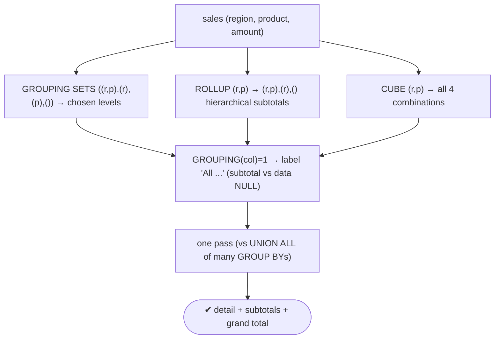
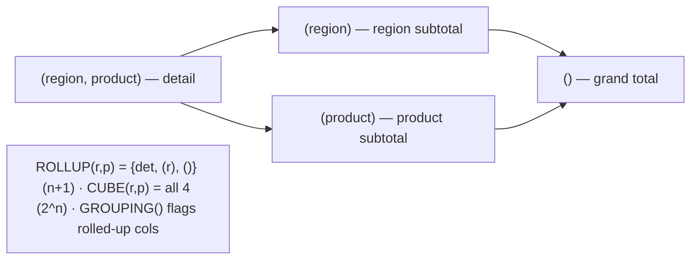

# Lab 89 — `GROUPING SETS`, `ROLLUP`, `CUBE` for Multi-Level Aggregation

> **Track B · Developer · B2 SQL Mastery · Lab 3 of 9 (Lab 89/222)**
> Teaching package: concept → diagram → steps → verify → quick-ref → self-test → video script.
> **Depends on:** Lab 87 (aggregates/windows). **Related:** Lab 94 (reporting queries).

---

## 0. Lab Card (at a glance)

| Field | Value |
|---|---|
| **Objective** | Produce detail + subtotals + grand totals in one query with `GROUPING SETS`, `ROLLUP`, and `CUBE`, and label aggregate rows using `GROUPING()`. |
| **Success criterion** | Each construct returns the correct multi-level rows in a single pass; subtotal/total rows are correctly labelled; you can map ROLLUP/CUBE to their grouping sets. |
| **Scope boundary** | Multi-level GROUP BY. Window functions were Lab 87. |
| **Prereqs** | Lab 87; a sales dataset with two dimensions |
| **Time** | 25–35 min |
| **Difficulty** | ★★★☆☆ |
| **Risk** | Low — read-only. |

---

## 1. Learning Objectives

1. **GROUPING SETS** — arbitrary grouping combinations.
2. **ROLLUP** — hierarchical subtotals.
3. **CUBE** — all combinations (power set).
4. **`GROUPING()`** — flag/label aggregated rows.
5. **Why one pass beats UNION ALL.**

---

## 2. Concept Primer — the "why"

**One query, many aggregation levels.** A plain `GROUP BY region, product` gives detail only. Reports usually also want **subtotals** (per region, per product) and a **grand total**. Doing that with separate `GROUP BY` queries UNION-ed together works but scans the data multiple times and is verbose. These three constructs compute **all the levels in a single pass**.

**`GROUPING SETS` — list the combinations you want.**
```sql
GROUP BY GROUPING SETS ((region, product), (region), (product), ())
```
- `(region, product)` → detail.
- `(region)` → subtotal per region (product is NULL).
- `(product)` → subtotal per product (region is NULL).
- `()` → grand total (both NULL).
It's exactly a `UNION ALL` of those `GROUP BY`s — but one pass, cleaner, and the planner can optimize it.

**`ROLLUP` — hierarchical subtotals (shorthand).**
```sql
ROLLUP (region, product)  ≡  GROUPING SETS ((region, product), (region), ())
```
Rolls up from most detailed to grand total: detail → per-region subtotal → grand total. Produces **n+1** sets. **Order matters** — `ROLLUP(region, product) ≠ ROLLUP(product, region)` (the hierarchy differs). Use for report subtotals where one dimension nests inside another (region ▸ product).

**`CUBE` — every combination (power set).**
```sql
CUBE (region, product)  ≡  GROUPING SETS ((region, product), (region), (product), ())
```
All **2ⁿ** combinations — subtotals in *every* dimension plus the grand total. Use for multi-dimensional/cross-tab analysis. (2ⁿ grows fast — many columns = many rows.)

**`GROUPING()` — tell a subtotal NULL from a data NULL.** In these results, a NULL can mean either "this row aggregates over this column" (a subtotal) **or** an actual NULL value in the data. **`GROUPING(col)` returns 1 when the column is rolled up** in that row, 0 when it's a real grouping value:
```sql
CASE WHEN GROUPING(region) = 1 THEN 'All regions' ELSE region END
```
`GROUPING(a, b)` returns a bitmask across columns — handy for ordering report layouts (`ORDER BY GROUPING(region), region`).

**Payoff:** financial/sales reports with subtotals and grand totals, cross-tabulations, and OLAP-style summaries — computed efficiently in one query.

---

## 3. Diagrams

### 3.1 Constructs flow



### 3.2 Grouping-set lattice



---

## 4. Prerequisites — two-dimension sales data

```bash
sudo -u postgres psql -d shopdb <<'SQL'
DROP TABLE IF EXISTS rep_sales;
CREATE TABLE rep_sales (region text, product text, amount numeric);
INSERT INTO rep_sales VALUES
 ('North','Widget',100),('North','Gadget',150),('North','Widget',120),
 ('South','Widget',90),('South','Gadget',130),('South','Gadget',160),
 ('East','Widget',210),('East','Gadget',70);
SQL
```

---

## 5. Step-by-Step

### Step 1 — GROUPING SETS: choose the levels

```bash
sudo -u postgres psql -d shopdb -c "
SELECT region, product, sum(amount) AS total
FROM rep_sales
GROUP BY GROUPING SETS ((region, product), (region), (product), ())
ORDER BY region NULLS LAST, product NULLS LAST;"
#   detail + per-region + per-product + grand total, in one query
```

### Step 2 — ROLLUP: hierarchical subtotals

```bash
sudo -u postgres psql -d shopdb -c "
SELECT region, product, sum(amount) AS total
FROM rep_sales
GROUP BY ROLLUP (region, product)
ORDER BY region NULLS LAST, product NULLS LAST;"
#   = GROUPING SETS ((region,product),(region),())  → region subtotals + grand total
```

### Step 3 — CUBE: every combination

```bash
sudo -u postgres psql -d shopdb -c "
SELECT region, product, sum(amount) AS total
FROM rep_sales
GROUP BY CUBE (region, product)
ORDER BY region NULLS LAST, product NULLS LAST;"
#   = all 4 grouping sets (adds per-product subtotals vs ROLLUP)
```

### Step 4 — Label rows with GROUPING()

```bash
sudo -u postgres psql -d shopdb -c "
SELECT
  CASE WHEN GROUPING(region)=1  THEN 'All regions'  ELSE region  END AS region,
  CASE WHEN GROUPING(product)=1 THEN 'All products' ELSE product END AS product,
  sum(amount) AS total,
  GROUPING(region, product) AS grp_bitmask
FROM rep_sales
GROUP BY ROLLUP (region, product)
ORDER BY GROUPING(region), region NULLS LAST, GROUPING(product), product NULLS LAST;"
#   distinguishes subtotal NULLs (labelled) from any real NULLs
```

### Step 5 — Prove equivalence to UNION ALL

```bash
sudo -u postgres psql -d shopdb -c "
SELECT region, product, sum(amount) FROM rep_sales GROUP BY region, product
UNION ALL SELECT region, NULL, sum(amount) FROM rep_sales GROUP BY region
UNION ALL SELECT NULL, NULL, sum(amount) FROM rep_sales
ORDER BY 1 NULLS LAST, 2 NULLS LAST;"
#   same result as ROLLUP(region,product) — but three scans instead of one
```

### Step 6 — Filter to specific levels

```bash
sudo -u postgres psql -d shopdb -c "
SELECT region, sum(amount) AS region_total
FROM rep_sales
GROUP BY ROLLUP (region)
HAVING GROUPING(region)=0        -- keep only real region subtotals (drop grand total)
ORDER BY region;"
```

---

## 6. Verification Checklist

- [ ] GROUPING SETS returns detail + chosen subtotals + grand total
- [ ] ROLLUP gives hierarchical (region) subtotals + grand total
- [ ] CUBE adds the per-product subtotals (all combinations)
- [ ] `GROUPING()` labels aggregate rows correctly
- [ ] `GROUPING(a,b)` bitmask understood
- [ ] ROLLUP result matches the UNION ALL equivalent
- [ ] `HAVING GROUPING(...)` filters to a level

---

## 7. Troubleshooting

| Symptom | Cause | Fix |
|---|---|---|
| Can't tell subtotal NULL from data NULL | Both show as NULL | Use `GROUPING(col)` to label/flag |
| ROLLUP levels wrong | Column order | `ROLLUP(a,b) ≠ ROLLUP(b,a)` — order = hierarchy |
| Too many rows | `CUBE` = 2ⁿ sets | Use `ROLLUP`/`GROUPING SETS` for only what you need |
| Subtotals sort oddly | NULLs sort | `ORDER BY GROUPING(col), col NULLS LAST` |
| Want only one level | Mixed levels returned | `HAVING GROUPING(col)=…` |
| "column must appear in GROUP BY" | Column not in any set | Add it to a grouping set (or aggregate it) |
| Slow with high cardinality | Many groups × many sets | Expected; still one pass vs many |

---

## 8. Quick Reference Card (paste-ready)

```sql
-- explicit combinations:
GROUP BY GROUPING SETS ((region, product), (region), (product), ())

-- hierarchical subtotals (n+1 sets; ORDER MATTERS):
GROUP BY ROLLUP (region, product)          -- = ((region,product),(region),())

-- all combinations (2^n sets):
GROUP BY CUBE (region, product)            -- = ((r,p),(r),(p),())

-- label / flag aggregated rows:
CASE WHEN GROUPING(region)=1 THEN 'All regions' ELSE region END
GROUPING(region, product)                  -- bitmask across columns
ORDER BY GROUPING(region), region NULLS LAST
HAVING GROUPING(region)=0                   -- filter to a specific level

-- one pass, cleaner + faster than UNION ALL of separate GROUP BYs
```

---

## 9. Self-Check

1. What does `GROUPING SETS` do?
2. What grouping sets does `ROLLUP(a,b)` expand to?
3. What about `CUBE(a,b)`?
4. What does `GROUPING(col)` return, and why is it needed?
5. How do ROLLUP and CUBE differ in count and purpose?
6. Why use these instead of UNION ALL of `GROUP BY`s?

<details>
<summary>Answers</summary>

1. Computes aggregates for **multiple explicit grouping combinations** in one query.
2. `(a,b), (a), ()` — hierarchical subtotals + grand total (n+1 sets).
3. `(a,b), (a), (b), ()` — all combinations / the power set (2ⁿ sets).
4. `1` if the column is **rolled up** (aggregated) in that row, `0` if it's a real grouping value — it distinguishes subtotal NULLs from data NULLs.
5. ROLLUP: hierarchical, n+1 sets; CUBE: all combinations, 2ⁿ sets.
6. A **single pass** — more efficient and cleaner than multiple scans UNION-ed together.
</details>

---

## 10. Video / Teaching Script

| # | On screen | Say (narration) |
|---|---|---|
| 1 | Title: "Subtotals and grand totals — in one query" | "Every report wants detail, subtotals, and a grand total. Instead of three queries stitched together, do it in one." |
| 2 | GROUPING SETS | "List the combinations you want — by region and product, by region, by product, overall. One pass, all levels." |
| 3 | ROLLUP | "ROLLUP is the shorthand for nested subtotals: each region's total, then the grand total. Order defines the hierarchy." |
| 4 | CUBE | "CUBE gives you *every* combination — subtotals in every direction. Great for cross-tabs, but it grows fast." |
| 5 | GROUPING() | "One trap: those subtotal rows show NULL. Is that 'all regions' or a missing value? GROUPING tells you — and lets you label them cleanly." |
| 6 | one pass | "And it's not just tidy — it's one scan instead of several. Faster than the UNION-ALL version." |
| 7 | Outro | "Multi-level aggregation, one query. Next: LATERAL joins." |

---

## 11. Glossary

- **GROUPING SETS** — explicit list of grouping combinations.
- **ROLLUP** — hierarchical subtotals (n+1 sets, order-sensitive).
- **CUBE** — all combinations / power set (2ⁿ sets).
- **`GROUPING()`** — flags a rolled-up column (subtotal vs data NULL).
- **Subtotal / grand total** — aggregate over some / all dimensions.
- **Grouping-set lattice** — the levels from detail up to the grand total.

---
*NETAPORT lab series · PostgreSQL 17 on AlmaLinux 9 · Lab 89/222 · B2 SQL Mastery*
