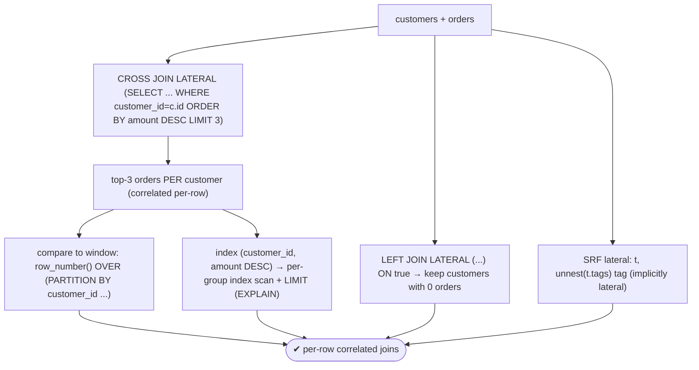
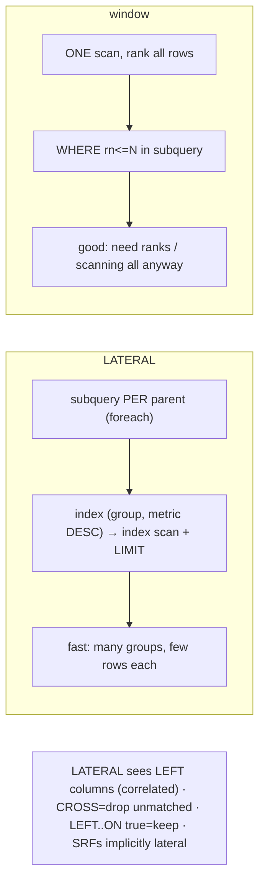

# Lab 90 — `LATERAL` Joins for Per-Row Subqueries and Top-N-Per-Group

> **Track B · Developer · B2 SQL Mastery · Lab 4 of 9 (Lab 90/222)**
> Teaching package: concept → diagram → steps → verify → quick-ref → self-test → video script.
> **Depends on:** Lab 87 (window top-N), Lab 79 (customers/orders). **Related:** Lab 100 (indexes).

---

## 0. Lab Card (at a glance)

| Field | Value |
|---|---|
| **Objective** | Use `LATERAL` so a FROM subquery/function can reference earlier rows — for top-N-per-group and per-row computations — and compare it to the window approach. |
| **Success criterion** | A `CROSS JOIN LATERAL` returns top-N related rows per parent; `LEFT JOIN LATERAL … ON true` keeps unmatched parents; an index makes the per-group top-N an index scan. |
| **Scope boundary** | LATERAL patterns. Window top-N was Lab 87. |
| **Prereqs** | Lab 87; a parent/child dataset |
| **Time** | 30–45 min |
| **Difficulty** | ★★★★☆ |
| **Risk** | Low — read-only. |

---

## 1. Learning Objectives

1. **What LATERAL enables** — correlated FROM subqueries.
2. **Top-N per group** — the `CROSS JOIN LATERAL` pattern.
3. **Outer version** — `LEFT JOIN LATERAL … ON true`.
4. **LATERAL vs window** — when each wins.
5. **Set-returning functions** — implicitly lateral.

---

## 2. Concept Primer — the "why"

**A normal FROM subquery can't see the other tables.** In `FROM a, (SELECT … FROM b) s`, the subquery `s` is evaluated **independently** — it cannot reference `a`'s columns. **`LATERAL`** changes that: a `LATERAL` subquery (or function) may **reference columns from FROM items to its left**, and PostgreSQL runs it **once per left row** with that row's values — a **correlated** join, essentially a `foreach`.

```sql
SELECT c.name, o.order_id, o.amount
FROM customers c
CROSS JOIN LATERAL (
  SELECT order_id, amount FROM orders
  WHERE customer_id = c.id            -- references the LEFT row's c.id (needs LATERAL)
  ORDER BY amount DESC LIMIT 3         -- top 3 for THIS customer
) o;
```

**Top-N per group — the flagship use.** "Top 3 orders per customer," "latest 5 events per device" — LATERAL expresses these directly: for each parent, a subquery that filters to that parent, orders, and `LIMIT`s. Two join flavors:
- **`CROSS JOIN LATERAL`** — drops parents whose subquery returns nothing.
- **`LEFT JOIN LATERAL … ON true`** — keeps every parent even with no matches (like an outer join).

**LATERAL vs the window approach (Lab 87).** Both do top-N-per-group; they differ in execution:
- **Window** (`row_number() OVER (PARTITION BY … ORDER BY …)` then `WHERE rn ≤ N`): **one scan**, sorts/ranks *all* rows, then filters. Best when you're scanning everything anyway, or you also need the rank/other window values.
- **LATERAL**: a small subquery **per parent**. With an index on **`(group_col, metric DESC)`**, each subquery is a cheap **index scan + LIMIT** — so LATERAL is often **faster when there are many groups and you need only a few rows each**. Without a supporting index, it can be slower (a scan per group).
Rule of thumb: **few rows per many groups + a supporting index → LATERAL**; **need ranks or scanning all rows → window**.

**Set-returning functions are implicitly lateral.** `unnest`, `jsonb_array_elements`, `generate_series` in FROM can already reference preceding columns *without* the keyword (since PG9.3):
```sql
SELECT t.id, tag FROM items t, unnest(t.tags) AS tag;   -- implicitly lateral
```
The `LATERAL` keyword is **required for subqueries**, optional for such functions (writing it is fine and explicit).

---

## 3. Diagrams

### 3.1 LATERAL patterns flow



### 3.2 LATERAL vs window for top-N



---

## 4. Prerequisites — customers + orders with data

```bash
sudo -u postgres psql -d shopdb <<'SQL'
DROP TABLE IF EXISTS l_orders, l_customers CASCADE;
CREATE TABLE l_customers (id int PRIMARY KEY, name text);
CREATE TABLE l_orders (order_id int PRIMARY KEY, customer_id int REFERENCES l_customers(id), amount numeric, order_date date);
INSERT INTO l_customers VALUES (1,'Asha'),(2,'Ravi'),(3,'Meera');   -- Meera has NO orders
INSERT INTO l_orders SELECT g, (ARRAY[1,2])[1+(g%2)], (random()*500)::int, date '2026-01-01'+(g%60)
FROM generate_series(1,40) g;
SQL
```

---

## 5. Step-by-Step

### Step 1 — Top-3 orders per customer (CROSS JOIN LATERAL)

```bash
sudo -u postgres psql -d shopdb -c "
SELECT c.name, o.order_id, o.amount
FROM l_customers c
CROSS JOIN LATERAL (
  SELECT order_id, amount FROM l_orders
  WHERE customer_id = c.id          -- correlated: needs LATERAL
  ORDER BY amount DESC LIMIT 3
) o
ORDER BY c.name, o.amount DESC;"
```

### Step 2 — Prove the correlation fails without LATERAL

```bash
sudo -u postgres psql -d shopdb -c "
SELECT c.name FROM l_customers c,
  (SELECT order_id FROM l_orders WHERE customer_id = c.id LIMIT 1) o;" 2>&1 | tail -1
#   → ERROR: invalid reference to FROM-clause entry for table \"c\"  (add LATERAL)
```

### Step 3 — Keep customers with no orders (LEFT JOIN LATERAL … ON true)

```bash
sudo -u postgres psql -d shopdb -c "
SELECT c.name, o.order_id, o.amount
FROM l_customers c
LEFT JOIN LATERAL (
  SELECT order_id, amount FROM l_orders WHERE customer_id = c.id ORDER BY amount DESC LIMIT 3
) o ON true
ORDER BY c.name;"
#   → Meera appears with NULLs (CROSS JOIN LATERAL would have dropped her)
```

### Step 4 — Compare to the window-function version (Lab 87)

```bash
sudo -u postgres psql -d shopdb -c "
SELECT name, order_id, amount FROM (
  SELECT c.name, o.order_id, o.amount,
         row_number() OVER (PARTITION BY o.customer_id ORDER BY o.amount DESC) AS rn
  FROM l_customers c JOIN l_orders o ON o.customer_id=c.id
) t WHERE rn <= 3 ORDER BY name, amount DESC;"
#   same result; window scans+ranks all, LATERAL does per-customer LIMIT
```

### Step 5 — Index makes LATERAL top-N an index scan

```bash
sudo -u postgres psql -d shopdb -c "CREATE INDEX ON l_orders (customer_id, amount DESC);"
sudo -u postgres psql -d shopdb -c "
EXPLAIN (COSTS OFF)
SELECT c.name, o.* FROM l_customers c
CROSS JOIN LATERAL (SELECT * FROM l_orders WHERE customer_id=c.id ORDER BY amount DESC LIMIT 3) o;"
#   → per-customer Index Scan ... Limit (efficient loose top-N)
```

### Step 6 — Set-returning function, implicitly lateral

```bash
sudo -u postgres psql -d shopdb <<'SQL'
DROP TABLE IF EXISTS l_items;
CREATE TABLE l_items (id int, tags text[]);
INSERT INTO l_items VALUES (1, ARRAY['red','sale']), (2, ARRAY['blue','new','sale']);
SELECT i.id, tag FROM l_items i, unnest(i.tags) AS tag ORDER BY i.id, tag;   -- implicitly lateral
SQL
```

---

## 6. Verification Checklist

- [ ] `CROSS JOIN LATERAL` returns top-N per parent
- [ ] Correlation without `LATERAL` errors
- [ ] `LEFT JOIN LATERAL … ON true` keeps parents with no matches
- [ ] Window version returns the same result
- [ ] Index `(customer_id, amount DESC)` → per-group index scan in `EXPLAIN`
- [ ] SRF (`unnest`) references a column without the keyword (implicitly lateral)
- [ ] Can state when to choose LATERAL vs window

---

## 7. Troubleshooting

| Symptom | Cause | Fix |
|---|---|---|
| "invalid reference to FROM-clause entry" | Correlated subquery without `LATERAL` | Add `LATERAL` |
| LATERAL top-N slow | No supporting index | Index `(group_col, order_col DESC)` |
| Parents with no matches dropped | `CROSS JOIN LATERAL` | Use `LEFT JOIN LATERAL … ON true` |
| SRF "needs LATERAL"? | It's implicit for functions | Keyword optional for functions, required for subqueries |
| Wrong ordering in result | Order inside the lateral | `ORDER BY` within the subquery |
| Window slower than expected | Sorts/ranks all rows | Use LATERAL + index for few-per-group |
| Correlation not seeing a column | Column is to the right | Referenced item must be to the **left** of LATERAL |

---

## 8. Quick Reference Card (paste-ready)

```sql
-- LATERAL: FROM subquery/function may reference LEFT rows; runs per left row (correlated)
-- top-N per group:
SELECT p.*, x.* FROM parent p
CROSS JOIN LATERAL (SELECT * FROM child WHERE child.pid = p.id ORDER BY metric DESC LIMIT :N) x;
-- keep parents with no matches:
LEFT JOIN LATERAL (...) x ON true

-- make it fast:  CREATE INDEX ON child (pid, metric DESC);   → per-group Index Scan + Limit

-- set-returning functions are IMPLICITLY lateral (keyword optional):
SELECT t.id, e FROM t, unnest(t.arr) AS e;      -- or jsonb_array_elements(t.doc), generate_series(...)

-- vs WINDOW top-N: row_number() OVER (PARTITION BY g ORDER BY m DESC) then WHERE rn<=N
--   LATERAL: few-per-many-groups + index · WINDOW: need ranks / scanning all rows
```

---

## 9. Self-Check

1. What does `LATERAL` enable that a plain FROM subquery can't?
2. Write the top-N-per-group pattern with LATERAL.
3. How does LATERAL top-N compare to the window approach?
4. How do you keep parent rows that have no lateral matches?
5. Are set-returning functions in FROM lateral?
6. What index makes LATERAL top-N efficient?

<details>
<summary>Answers</summary>

1. It lets a FROM subquery/function **reference columns from preceding FROM items**, running once per left row (correlated).
2. `CROSS JOIN LATERAL (SELECT … FROM child WHERE child.pid = parent.id ORDER BY metric DESC LIMIT N) x`.
3. LATERAL runs a per-parent subquery (index-friendly, fast for few-rows-per-many-groups); the window version scans and ranks all rows (better when you need ranks or are scanning everything anyway).
4. `LEFT JOIN LATERAL (…) ON true`.
5. Yes — **implicitly** lateral; the keyword is optional for functions, required for subqueries.
6. An index on `(group_col, order_col DESC)` — enabling a per-group index scan + `LIMIT`.
</details>

---

## 10. Video / Teaching Script

| # | On screen | Say (narration) |
|---|---|---|
| 1 | Title: "A subquery that sees the row it's joined to" | "Normally a subquery in FROM is blind to the other tables. LATERAL gives it eyes — it runs once per row, seeing that row's values." |
| 2 | top-N | "The killer use: top three orders *per customer*. For each customer, a little query that filters, sorts, and takes three." |
| 3 | without LATERAL | "Leave out the keyword and Postgres refuses — the subquery can't reference the customer. That error means 'you need LATERAL.'" |
| 4 | LEFT … ON true | "CROSS drops customers with no orders. LEFT JOIN LATERAL, ON true, keeps them — with nulls." |
| 5 | index | "And here's why it's fast: with the right index, each customer's top-three is a tiny index scan. Not a full sort of everything." |
| 6 | vs window | "So — LATERAL when you want a few rows from many groups; window functions when you need the ranks or you're reading it all anyway." |
| 7 | Outro | "Correlated joins, unlocked. Next: set operations and DISTINCT ON." |

---

## 11. Glossary

- **LATERAL** — FROM subquery/function may reference preceding items.
- **Correlated join** — runs once per left row (foreach).
- **`CROSS JOIN LATERAL`** — drops unmatched left rows.
- **`LEFT JOIN LATERAL … ON true`** — keeps unmatched left rows.
- **Top-N per group** — per-parent ordered `LIMIT`.
- **Set-returning function** — `unnest`/`jsonb_array_elements` (implicitly lateral).
- **Supporting index** — `(group, metric DESC)` for per-group scans.

---
*NETAPORT lab series · PostgreSQL 17 on AlmaLinux 9 · Lab 90/222 · B2 SQL Mastery*
