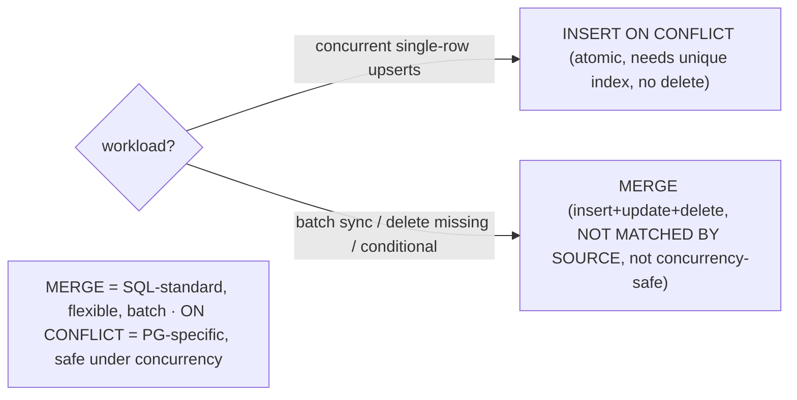

# Lab 91 — `MERGE` (PG15+) for Upsert-With-Delete; Compare to `INSERT ... ON CONFLICT`

> **Track B · Developer · B2 SQL Mastery · Lab 5 of 9 (Lab 91/222)**
> Teaching package: concept → diagram → steps → verify → quick-ref → self-test → video script.
> **Depends on:** Lab 79 (constraints). **Related:** Lab 103 (transactions), Track D (ETL/migration).

---

## 0. Lab Card (at a glance)

| Field | Value |
|---|---|
| **Objective** | Use `MERGE` to insert/update/delete and fully sync a target to a source (PG17 `WHEN NOT MATCHED BY SOURCE`), and compare it to `INSERT ... ON CONFLICT` on capability and concurrency. |
| **Success criterion** | `MERGE` reconciles a target to a source (insert new, update changed, delete missing); `ON CONFLICT` upserts atomically; you can state which to use when. |
| **Scope boundary** | MERGE vs ON CONFLICT. General transactions are Lab 103. |
| **Prereqs** | Lab 79; a target/source dataset |
| **Time** | 30–45 min |
| **Difficulty** | ★★★★☆ |
| **Risk** | Low — scratch tables. |

---

## 1. Learning Objectives

1. **MERGE structure** — matched/not-matched branches.
2. **Upsert-with-delete** — full sync via `NOT MATCHED BY SOURCE` (PG17).
3. **ON CONFLICT** — atomic upsert with `EXCLUDED`.
4. **The concurrency difference** — which is safe.
5. **Choose** — batch sync vs concurrent upsert.

---

## 2. Concept Primer — the "why"

**`MERGE` (PG15+) does insert, update, *and* delete in one statement**, driven by matching a **source** against a **target**:
```sql
MERGE INTO target t
USING source s ON t.id = s.id
WHEN MATCHED AND s.qty = 0 THEN DELETE
WHEN MATCHED               THEN UPDATE SET qty = s.qty, price = s.price
WHEN NOT MATCHED           THEN INSERT (id, qty, price) VALUES (s.id, s.qty, s.price)
WHEN NOT MATCHED BY SOURCE THEN DELETE;      -- PG17: target rows absent from source
```
- **`WHEN MATCHED`** — the source row matched a target row → `UPDATE`/`DELETE`/`DO NOTHING`.
- **`WHEN NOT MATCHED [BY TARGET]`** — source has no target match → `INSERT`.
- **`WHEN NOT MATCHED BY SOURCE`** (**PG17**) — target has no source match → `UPDATE`/`DELETE`. This is what makes a **full sync** possible: delete target rows the source no longer has.
- Clauses are evaluated **in order**; the first matching one wins. Extra `AND <condition>`s refine each branch. (PG17 also added `RETURNING` to MERGE.)

**"Upsert-with-delete" = full reconciliation.** With all four branches, one `MERGE` makes the target **exactly equal** the source: insert the new, update the changed, delete the departed. That's the ETL/sync pattern — apply a fresh snapshot to a dimension table, reconcile inventory, mirror a feed.

**`INSERT ... ON CONFLICT` (PG9.5+) — the atomic upsert.**
```sql
INSERT INTO t (id, val) VALUES (...)
ON CONFLICT (id) DO UPDATE SET val = EXCLUDED.val;   -- or DO NOTHING
```
- Requires a **UNIQUE constraint/index** on the conflict target (`id`).
- `EXCLUDED` is the row that *would* have been inserted.
- **Only insert-or-update** (no delete).

**The critical difference — concurrency.** `INSERT ... ON CONFLICT` is **atomic and concurrency-safe**: it relies on the unique index, so under many concurrent upserts of the same key, one inserts and the rest cleanly update — no lost updates, no spurious errors. **`MERGE` is *not* equivalently safe** for concurrent upserts: two sessions can both see "not matched" and both try to insert → a **unique-violation error** or a race. `MERGE` is designed for **batch/controlled-concurrency** work, not a hot concurrent upsert path.

**The decision:**

| | `INSERT ... ON CONFLICT` | `MERGE` |
|---|---|---|
| Operations | insert / update / (nothing) | insert + update + **delete** |
| Needs unique constraint | **yes** | no (any `ON` condition) |
| Concurrency-safe upsert | **yes (atomic)** | **no** (can race/error) |
| Full sync (delete missing) | no | **yes** (`NOT MATCHED BY SOURCE`, PG17) |
| Standard SQL | no (PG-specific) | yes |
| Best for | **concurrent real-time upsert** | **batch/ETL sync, conditional multi-action** |

**Concurrent real-time upsert → `ON CONFLICT`. Batch reconciliation with deletes → `MERGE`.**

---

## 3. Diagrams

### 3.1 MERGE sync flow

```mermaid
flowchart TD
    A["target ⟵ MERGE ⟵ source, ON match key"] --> B{per row}
    B -->|MATCHED + condition| C["UPDATE or DELETE"]
    B -->|NOT MATCHED (by target)| D["INSERT (new source row)"]
    B -->|NOT MATCHED BY SOURCE (PG17)| E["DELETE (target row gone from source)"]
    C & D & E --> F["target == source (full reconciliation)"]
    F --> G([✔ upsert-with-delete])
    H["ON CONFLICT: upsert only (unique key), ATOMIC, no delete"] -.contrast.-> A
```

### 3.2 Decision model



---

## 4. Prerequisites — target + incoming source

```bash
sudo -u postgres psql -d shopdb <<'SQL'
DROP TABLE IF EXISTS inventory, incoming;
CREATE TABLE inventory (sku int PRIMARY KEY, qty int, price numeric);
INSERT INTO inventory VALUES (1,10,5.00),(2,5,9.00),(3,0,2.00),(4,8,4.00);   -- current state
CREATE TABLE incoming (sku int PRIMARY KEY, qty int, price numeric);
INSERT INTO incoming VALUES (1,12,5.50),(2,0,9.00),(5,20,7.00);              -- new snapshot: 1 changed, 2 zeroed, 5 new; 3&4 gone
SQL
```

---

## 5. Step-by-Step

### Step 1 — MERGE upsert (insert new, update changed)

```bash
sudo -u postgres psql -d shopdb <<'SQL'
MERGE INTO inventory t
USING incoming s ON t.sku = s.sku
WHEN MATCHED     THEN UPDATE SET qty = s.qty, price = s.price
WHEN NOT MATCHED THEN INSERT (sku, qty, price) VALUES (s.sku, s.qty, s.price);
SQL
sudo -u postgres psql -d shopdb -c "SELECT * FROM inventory ORDER BY sku;"   # 1 updated, 5 inserted; 2 updated to 0
```

### Step 2 — Add DELETE branches (zeroed rows + full sync)

```bash
# reset and run a full reconciliation
sudo -u postgres psql -d shopdb <<'SQL'
TRUNCATE inventory;
INSERT INTO inventory VALUES (1,10,5.00),(2,5,9.00),(3,0,2.00),(4,8,4.00);
MERGE INTO inventory t
USING incoming s ON t.sku = s.sku
WHEN MATCHED AND s.qty = 0     THEN DELETE                         -- zeroed source rows removed
WHEN MATCHED                   THEN UPDATE SET qty=s.qty, price=s.price
WHEN NOT MATCHED                THEN INSERT (sku,qty,price) VALUES (s.sku,s.qty,s.price)
WHEN NOT MATCHED BY SOURCE      THEN DELETE;                        -- PG17: target rows not in source (3,4) removed
SQL
sudo -u postgres psql -d shopdb -c "SELECT * FROM inventory ORDER BY sku;"
#   result = source's non-zero rows: sku 1 (updated), 5 (inserted); 2 deleted (zero); 3,4 deleted (not in source)
```

### Step 3 — MERGE ... RETURNING (PG17)

```bash
sudo -u postgres psql -d shopdb <<'SQL'
MERGE INTO inventory t
USING (VALUES (1, 15, 5.75)) AS s(sku,qty,price) ON t.sku = s.sku
WHEN MATCHED THEN UPDATE SET qty=s.qty, price=s.price
WHEN NOT MATCHED THEN INSERT VALUES (s.sku,s.qty,s.price)
RETURNING merge_action(), t.*;      -- PG17: see what each row did
SQL
```

### Step 4 — The ON CONFLICT upsert (atomic)

```bash
sudo -u postgres psql -d shopdb -c "
INSERT INTO inventory (sku, qty, price) VALUES (1, 99, 6.00), (9, 1, 3.00)
ON CONFLICT (sku) DO UPDATE SET qty = EXCLUDED.qty, price = EXCLUDED.price;"
#   sku 1 updated (conflict), sku 9 inserted — one atomic, concurrency-safe statement (requires the PK/unique on sku)
sudo -u postgres psql -d shopdb -c "SELECT * FROM inventory ORDER BY sku;"
```

### Step 5 — Prove ON CONFLICT needs a unique target; MERGE doesn't

```bash
sudo -u postgres psql -d shopdb -c "
CREATE TABLE nokey (id int, v text);
INSERT INTO nokey VALUES (1,'x') ON CONFLICT (id) DO NOTHING;" 2>&1 | tail -1
#   → ERROR: there is no unique or exclusion constraint matching the ON CONFLICT specification
#   (MERGE would work here — it matches on any ON condition, but isn't concurrency-safe)
```

---

## 6. Verification Checklist

- [ ] MERGE upsert inserts new + updates matched
- [ ] `WHEN MATCHED AND …` DELETE branch works
- [ ] `WHEN NOT MATCHED BY SOURCE THEN DELETE` (PG17) removes departed rows
- [ ] Result equals the reconciled source (upsert-with-delete)
- [ ] `MERGE … RETURNING merge_action()` shows per-row actions (PG17)
- [ ] `ON CONFLICT` upserts atomically (needs unique target)
- [ ] Can state the concurrency and capability differences

---

## 7. Troubleshooting

| Symptom | Cause | Fix |
|---|---|---|
| MERGE unique-violation under concurrency | Not atomic like ON CONFLICT | Use `ON CONFLICT` for concurrent upserts; serialize/retry MERGE |
| "no unique constraint matching ON CONFLICT" | Missing unique index | Add a unique constraint on the conflict columns |
| `NOT MATCHED BY SOURCE` unrecognized | Pre-PG17 | Upgrade, or delete separately |
| "cannot affect row a second time" | Duplicate source keys | Dedup the source before MERGE |
| Wrong branch fired | Clause order | First matching `WHEN` wins — order them |
| Need DELETE with ON CONFLICT | Not supported | Use `MERGE` |
| `merge_action()` unknown | Pre-PG17 | RETURNING in MERGE is PG17 |

---

## 8. Quick Reference Card (paste-ready)

```sql
-- MERGE: insert + update + delete + SYNC (batch/ETL; NOT concurrency-safe)
MERGE INTO target t USING source s ON t.k = s.k
WHEN MATCHED AND <cond>    THEN DELETE
WHEN MATCHED               THEN UPDATE SET c = s.c
WHEN NOT MATCHED           THEN INSERT (k,c) VALUES (s.k,s.c)
WHEN NOT MATCHED BY SOURCE THEN DELETE          -- PG17: full sync (delete missing)
RETURNING merge_action(), t.*;                  -- PG17

-- INSERT ON CONFLICT: atomic upsert (needs UNIQUE on target; no delete)
INSERT INTO t (k,c) VALUES (...) ON CONFLICT (k) DO UPDATE SET c = EXCLUDED.c;   -- or DO NOTHING

-- CHOOSE: concurrent real-time upsert → ON CONFLICT (atomic) · batch sync/delete/conditional → MERGE
```

---

## 9. Self-Check

1. What can `MERGE` do that `ON CONFLICT` cannot?
2. What does `INSERT ... ON CONFLICT` require?
3. Which is safe for concurrent upserts, and why?
4. What did PG17 add to `MERGE`?
5. When would you choose each?
6. What is "upsert-with-delete"?

<details>
<summary>Answers</summary>

1. `DELETE` rows, multiple conditional branches, and a **full sync** (delete rows not in the source via `NOT MATCHED BY SOURCE`).
2. A **UNIQUE constraint/index** on the conflict target.
3. `INSERT ... ON CONFLICT` — it's atomic (uses the unique index), so concurrent upserts of the same key cleanly resolve; `MERGE` can race and raise unique violations.
4. `WHEN NOT MATCHED BY SOURCE` (enabling delete-missing/sync) and `RETURNING` (with `merge_action()`).
5. `ON CONFLICT` for concurrent real-time upserts; `MERGE` for batch/ETL sync, deletes, and complex conditional logic.
6. A **full reconciliation**: insert new rows, update changed ones, and delete target rows the source no longer has — one `MERGE` making the target equal the source.
</details>

---

## 10. Video / Teaching Script

| # | On screen | Say (narration) |
|---|---|---|
| 1 | Title: "One statement to reconcile a table" | "MERGE takes a fresh snapshot and makes your table match it — inserting, updating, and deleting in a single pass." |
| 2 | upsert | "Start simple: matched rows update, new rows insert. That's an upsert." |
| 3 | delete + sync | "Now add teeth: delete zeroed rows, and — new in 17 — delete anything the source dropped. The table becomes exactly the source." |
| 4 | RETURNING | "And you can see what happened per row — insert, update, or delete." |
| 5 | ON CONFLICT | "But for a *concurrent* upsert — many writers, same keys — reach for ON CONFLICT instead. It's atomic; MERGE isn't." |
| 6 | choose | "So: ON CONFLICT for the hot upsert path, MERGE for batch reconciliation. Different tools, different jobs." |
| 7 | Outro | "Sync and upsert, sorted. Next: JSON and JSONB." |

---

## 11. Glossary

- **MERGE** — one statement for insert/update/delete driven by a source.
- **`WHEN MATCHED` / `NOT MATCHED` / `NOT MATCHED BY SOURCE`** — the branches (last is PG17).
- **`merge_action()` / RETURNING** — per-row action reporting (PG17).
- **`INSERT ... ON CONFLICT`** — atomic upsert on a unique target.
- **`EXCLUDED`** — the proposed insert row in ON CONFLICT.
- **Upsert-with-delete / sync** — reconcile target to source.
- **Concurrency-safe** — ON CONFLICT's atomic guarantee (MERGE lacks it).

---
*NETAPORT lab series · PostgreSQL 17 on AlmaLinux 9 · Lab 91/222 · B2 SQL Mastery*
