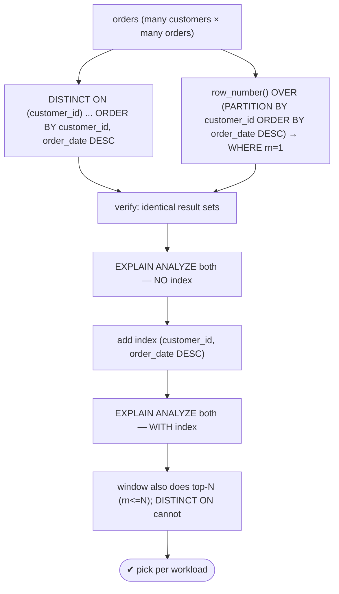
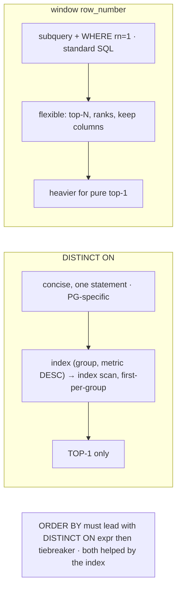

# Lab 92 — `DISTINCT ON` vs Window-Function Dedup; Benchmark Both

> **Track B · Developer · B2 SQL Mastery · Lab 6 of 9 (Lab 92/222)**
> Teaching package: concept → diagram → steps → verify → quick-ref → self-test → video script.
> **Depends on:** Lab 87 (window functions), Lab 90 (LATERAL top-N). **Related:** Lab 100 (indexes).

---

## 0. Lab Card (at a glance)

| Field | Value |
|---|---|
| **Objective** | Solve first-row-per-group two ways — `DISTINCT ON` and `row_number()` — verify identical results, and benchmark both with and without a supporting index. |
| **Success criterion** | Both return the same latest-per-customer rows; `EXPLAIN ANALYZE` shows the plan/time difference; you can state which to use when. |
| **Scope boundary** | Top-1-per-group dedup. Top-N was Labs 87/90. |
| **Prereqs** | Lab 87; a large orders dataset |
| **Time** | 30–40 min |
| **Difficulty** | ★★★☆☆ |
| **Risk** | Low — read-only. |

---

## 1. Learning Objectives

1. **`DISTINCT ON`** — first row per group, with its `ORDER BY` rule.
2. **Window dedup** — `row_number() … WHERE rn = 1`.
3. **Benchmark** — plans and timing, indexed vs not.
4. **Trade-offs** — concise/PG-specific vs flexible/standard.
5. **The index** — `(group, metric DESC)` helps both.

---

## 2. Concept Primer — the "why"

**First-row-per-group is everywhere:** the latest order per customer, the most recent status per device, one representative row per key. Two clean PostgreSQL ways:

**`DISTINCT ON` (PostgreSQL-specific).**
```sql
SELECT DISTINCT ON (customer_id) customer_id, order_id, order_date, amount
FROM orders
ORDER BY customer_id, order_date DESC;   -- must lead with customer_id, then the tiebreaker
```
`DISTINCT ON (expr)` keeps the **first** row for each distinct `expr`, in the query's `ORDER BY` order. **The rule:** the `ORDER BY` must **start with the `DISTINCT ON` expression(s)**, then the column that decides *which* row wins (`order_date DESC` → latest). Miss that, and which row you get is indeterminate. It returns exactly one row per group, in one concise statement. With an index on `(customer_id, order_date DESC)`, PostgreSQL can **index-scan and skip to the first of each group** — very efficient. Downsides: it's **top-1 only** (no top-N) and **non-standard SQL**.

**Window function (`row_number`).**
```sql
SELECT customer_id, order_id, order_date, amount FROM (
  SELECT *, row_number() OVER (PARTITION BY customer_id ORDER BY order_date DESC) AS rn
  FROM orders
) t WHERE rn = 1;
```
`row_number() = 1` is the first per partition. More verbose (window results can't go in `WHERE`, so a subquery filters `rn`), but **standard SQL** and **flexible**: change to `rn <= N` for **top-N**, or keep the rank/other window columns. `DISTINCT ON` can't do any of that.

**Performance — what to expect:**
- **With** an index on `(group, metric DESC)`: `DISTINCT ON` typically does a light index scan picking the first per group; the window version can also use the index for its ordering but still processes/ranks rows. `DISTINCT ON` is usually **faster/lighter for pure top-1**.
- **Without** an index: both must sort, so they're **comparable**.
- The window's overhead is the price of its flexibility.

**Rule of thumb:** **top-1 per group, concise, indexed → `DISTINCT ON`**; **need top-N, ranks, or portability → window `row_number`**. (A third route — `GROUP BY` with `max()` then a join back — is clumsier for fetching the whole winning row; these two are the clean choices.)

---

## 3. Diagrams

### 3.1 Two ways + benchmark flow



### 3.2 Trade-offs



---

## 4. Prerequisites — a large orders dataset

```bash
sudo -u postgres psql -d shopdb <<'SQL'
DROP TABLE IF EXISTS big_orders;
CREATE TABLE big_orders (order_id bigint GENERATED ALWAYS AS IDENTITY PRIMARY KEY,
  customer_id int, order_date timestamptz, amount numeric);
INSERT INTO big_orders (customer_id, order_date, amount)
SELECT (random()*20000)::int,                                   -- ~20k customers
       now() - (random()*365)*interval '1 day',
       (random()*1000)::numeric(10,2)
FROM generate_series(1, 2000000);                              -- 2M orders
ANALYZE big_orders;
SQL
```

---

## 5. Step-by-Step

### Step 1 — DISTINCT ON: latest order per customer

```bash
sudo -u postgres psql -d shopdb -c "
SELECT DISTINCT ON (customer_id) customer_id, order_id, order_date, amount
FROM big_orders
ORDER BY customer_id, order_date DESC
LIMIT 5;"
```

### Step 2 — Window row_number: same result

```bash
sudo -u postgres psql -d shopdb -c "
SELECT customer_id, order_id, order_date, amount FROM (
  SELECT *, row_number() OVER (PARTITION BY customer_id ORDER BY order_date DESC) rn
  FROM big_orders
) t WHERE rn = 1
ORDER BY customer_id LIMIT 5;"
```

### Step 3 — Verify identical result sets

```bash
sudo -u postgres psql -d shopdb -c "
WITH d AS (SELECT DISTINCT ON (customer_id) customer_id, order_id FROM big_orders ORDER BY customer_id, order_date DESC),
     w AS (SELECT customer_id, order_id FROM (SELECT customer_id, order_id, row_number() OVER (PARTITION BY customer_id ORDER BY order_date DESC) rn FROM big_orders) x WHERE rn=1)
SELECT (SELECT count(*) FROM d) AS distinct_on_rows,
       (SELECT count(*) FROM w) AS window_rows,
       (SELECT count(*) FROM (SELECT * FROM d EXCEPT SELECT * FROM w) q) AS differences;"
#   differences should be 0
```

### Step 4 — Benchmark WITHOUT an index

```bash
sudo -u postgres psql -d shopdb -c "
EXPLAIN (ANALYZE, BUFFERS, TIMING OFF)
SELECT DISTINCT ON (customer_id) * FROM big_orders ORDER BY customer_id, order_date DESC;" | tail -5
sudo -u postgres psql -d shopdb -c "
EXPLAIN (ANALYZE, BUFFERS, TIMING OFF)
SELECT * FROM (SELECT *, row_number() OVER (PARTITION BY customer_id ORDER BY order_date DESC) rn FROM big_orders) t WHERE rn=1;" | tail -5
#   both sort ~2M rows → comparable
```

### Step 5 — Add the supporting index, re-benchmark

```bash
sudo -u postgres psql -d shopdb -c "CREATE INDEX bo_cust_date ON big_orders (customer_id, order_date DESC);"
sudo -u postgres psql -d shopdb -c "
EXPLAIN (ANALYZE, TIMING OFF)
SELECT DISTINCT ON (customer_id) * FROM big_orders ORDER BY customer_id, order_date DESC;" | tail -4
#   → Index Scan / Incremental sort — first per group, much lighter
sudo -u postgres psql -d shopdb -c "
EXPLAIN (ANALYZE, TIMING OFF)
SELECT * FROM (SELECT *, row_number() OVER (PARTITION BY customer_id ORDER BY order_date DESC) rn FROM big_orders) t WHERE rn=1;" | tail -5
```

### Step 6 — Window flexibility DISTINCT ON lacks: top-3 per customer

```bash
sudo -u postgres psql -d shopdb -c "
SELECT customer_id, order_id, amount FROM (
  SELECT customer_id, order_id, amount, row_number() OVER (PARTITION BY customer_id ORDER BY amount DESC) rn
  FROM big_orders
) t WHERE rn <= 3 AND customer_id < 3 ORDER BY customer_id, amount DESC;"
#   DISTINCT ON can't express top-N — only top-1
```

---

## 6. Verification Checklist & Results Table

- [ ] `DISTINCT ON` returns one latest row per customer
- [ ] Window `row_number()=1` returns the same set
- [ ] `EXCEPT` confirms 0 differences
- [ ] Benchmarked both without an index (comparable)
- [ ] Index `(customer_id, order_date DESC)` added
- [ ] `DISTINCT ON` uses the index (lighter plan) after indexing
- [ ] Window shown doing top-N (which DISTINCT ON can't)

| Method | plan (no index) | time (no index) | plan (indexed) | time (indexed) |
|---|---|---|---|---|
| DISTINCT ON | | | | |
| window row_number | | | | |

---

## 7. Troubleshooting

| Symptom | Cause | Fix |
|---|---|---|
| `DISTINCT ON` returns the wrong row | `ORDER BY` not leading with the expr + tiebreaker | `ORDER BY <distinct-expr>, <tiebreaker DESC>` |
| `DISTINCT ON` result random | No `ORDER BY` | Always specify `ORDER BY` |
| Can't filter `rn` in `WHERE` | Window runs after `WHERE` | Filter in a subquery/CTE |
| Both slow | No supporting index | Index `(group, order DESC)` |
| Need top-N | `DISTINCT ON` is top-1 only | Use window `rn <= N` (or LATERAL, Lab 90) |
| Portability required | `DISTINCT ON` is PG-specific | Use the window version |
| Non-deterministic ties | Insufficient tiebreakers | Add more `ORDER BY` columns |

---

## 8. Quick Reference Card (paste-ready)

```sql
-- FIRST-ROW-PER-GROUP (top-1):

-- DISTINCT ON (PG-specific, concise, index-friendly):
SELECT DISTINCT ON (customer_id) *
FROM orders ORDER BY customer_id, order_date DESC;      -- ORDER BY: expr FIRST, then tiebreaker

-- window (standard, flexible → top-N by changing to rn<=N):
SELECT * FROM (SELECT *, row_number() OVER (PARTITION BY customer_id ORDER BY order_date DESC) rn FROM orders) t
WHERE rn = 1;

-- index that helps BOTH: CREATE INDEX ON orders (customer_id, order_date DESC);
-- benchmark: EXPLAIN (ANALYZE) ...  · DISTINCT ON usually lighter for pure top-1 with the index
-- choose: top-1 concise → DISTINCT ON · top-N / ranks / portable → window
```

---

## 9. Self-Check

1. What does `DISTINCT ON` do?
2. What's the `ORDER BY` requirement for `DISTINCT ON`?
3. What's the window equivalent for top-1?
4. When does the window approach win?
5. When does `DISTINCT ON` win?
6. What index helps both?

<details>
<summary>Answers</summary>

1. Keeps the **first row per distinct value** of the given expression, according to the query's `ORDER BY`.
2. It must **start with the `DISTINCT ON` expression(s)**, then the tiebreaker column(s) that decide which row wins.
3. `row_number() OVER (PARTITION BY g ORDER BY x DESC)` in a subquery, then `WHERE rn = 1`.
4. When you need **top-N**, ranks/other window values, or **standard-SQL portability**.
5. For a **concise top-1**, especially with a supporting index (index scan, first-per-group) — usually faster/lighter.
6. An index on `(group_col, order_col DESC)`.
</details>

---

## 10. Video / Teaching Script

| # | On screen | Say (narration) |
|---|---|---|
| 1 | Title: "The latest row per group — two ways" | "One row per customer, the newest. Postgres has a slick shortcut and a portable workhorse. Let's race them." |
| 2 | DISTINCT ON | "DISTINCT ON: one line. Keep the first row per customer — just make sure the ORDER BY leads with the customer, then 'newest first.'" |
| 3 | window | "The window version does the same, but needs a subquery to keep row number one. More typing — but it's standard SQL." |
| 4 | verify | "Same rows? Exactly the same. Zero differences." |
| 5 | benchmark | "Now the race. No index — both sort everything, neck and neck. Add the right index, and DISTINCT ON skips straight to the first of each group. Lighter." |
| 6 | flexibility | "But the window has a trick DISTINCT ON can't: change one to N and you've got top-*three* per customer. That flexibility is the trade." |
| 7 | Outro | "Top-1 concise, top-N flexible. Next: JSON and JSONB." |

---

## 11. Glossary

- **`DISTINCT ON`** — first row per distinct expression (PG-specific).
- **First-row-per-group / top-1** — one representative row per key.
- **`row_number() … WHERE rn = 1`** — the standard-SQL equivalent.
- **Tiebreaker** — the `ORDER BY` column deciding the winning row.
- **Supporting index** — `(group, metric DESC)` for a light scan.
- **Top-N** — the window generalization (`rn <= N`).

---
*NETAPORT lab series · PostgreSQL 17 on AlmaLinux 9 · Lab 92/222 · B2 SQL Mastery*
