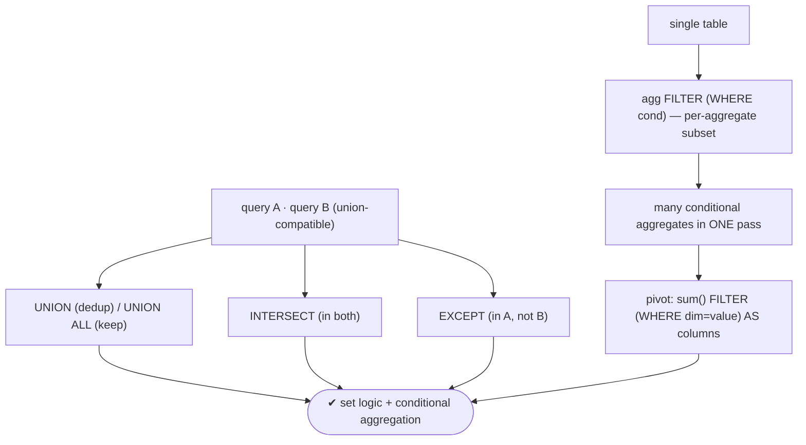
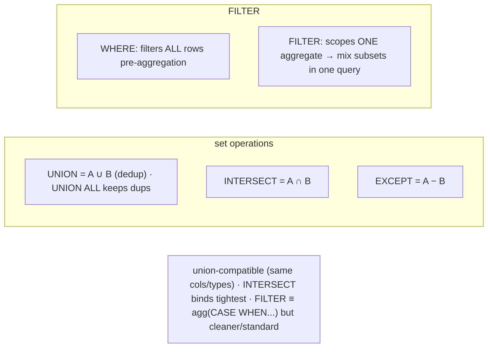

# Lab 93 — Set Operations (`UNION`/`INTERSECT`/`EXCEPT`) and `FILTER` Clauses on Aggregates

> **Track B · Developer · B2 SQL Mastery · Lab 7 of 9 (Lab 93/222)**
> Teaching package: concept → diagram → steps → verify → quick-ref → self-test → video script.
> **Depends on:** Lab 89 (aggregation). **Related:** Lab 94 (reporting), Lab 92 (dedup).

---

## 0. Lab Card (at a glance)

| Field | Value |
|---|---|
| **Objective** | Combine query results with `UNION`/`INTERSECT`/`EXCEPT` (and the `ALL` variants), and use `FILTER` for per-aggregate conditional aggregation and pivots. |
| **Success criterion** | Set ops return correct union/intersection/difference; `FILTER` produces multiple conditional aggregates in one pass and a pivot; you can map `FILTER` to the `CASE` equivalent. |
| **Scope boundary** | Set ops + FILTER. Grouping sets were Lab 89. |
| **Prereqs** | Lab 89; sample datasets |
| **Time** | 25–35 min |
| **Difficulty** | ★★★☆☆ |
| **Risk** | Low — read-only. |

---

## 1. Learning Objectives

1. **UNION / UNION ALL** — combine, dedup or not.
2. **INTERSECT / EXCEPT** — common / difference rows.
3. **Union-compatibility + precedence** — the rules.
4. **`FILTER`** — restrict an aggregate to a subset.
5. **Conditional aggregation + pivots** — in one pass.

---

## 2. Concept Primer — the "why"

**Set operations combine the results of two queries with set semantics.**
- **`UNION`** — all rows from both, **duplicates removed** (set union). **`UNION ALL`** — keeps **all** rows (no dedup) → **faster** (no sort/hash to deduplicate). Prefer `UNION ALL` unless you actually need to remove duplicates.
- **`INTERSECT`** — rows present in **both** queries (intersection).
- **`EXCEPT`** — rows in the **first** query but **not** the second (set difference).
- The `ALL` variants (`INTERSECT ALL`, `EXCEPT ALL`) preserve duplicate multiplicities.

**Rules:** the queries must be **union-compatible** — same **column count** and **compatible types**; column names come from the first query; a trailing `ORDER BY` applies to the **whole** result. **Precedence:** `INTERSECT` binds **tighter** than `UNION`/`EXCEPT` — parenthesize when mixing.

**Typical uses:** `UNION [ALL]` to combine similar data from multiple tables (current + archived orders); `INTERSECT` to find common members (customers who bought **both** X **and** Y); `EXCEPT` for differences (bought X but **not** Y, or reconciling "rows in A missing from B").

**`FILTER` restricts an aggregate to a subset of rows — per aggregate.**
```sql
SELECT
  count(*)                              AS total,
  count(*) FILTER (WHERE status='paid') AS paid,
  sum(amount) FILTER (WHERE region='North') AS north_sales,
  avg(amount) FILTER (WHERE amount > 100)   AS avg_big
FROM orders;
```
Each aggregate sees only the rows matching its own `FILTER (WHERE …)`. This replaces the old idiom `sum(CASE WHEN cond THEN amount END)` / `count(*) FILTER (WHERE c)` ≡ `count(CASE WHEN c THEN 1 END)` — **`FILTER` is clearer, SQL-standard (SQL:2003), and often a touch more efficient.** Crucially, it differs from a `WHERE` on the query: `WHERE` filters **all** rows before aggregation; `FILTER` scopes **one** aggregate, so you can mix differently-filtered aggregates in a single pass.

**Conditional aggregation → pivots.** Multiple `FILTER`ed aggregates turn rows into columns — a manual pivot:
```sql
sum(amount) FILTER (WHERE month='Jan') AS jan,
sum(amount) FILTER (WHERE month='Feb') AS feb, ...
```
`FILTER` also works on **window** aggregates (`sum(x) FILTER (WHERE …) OVER (…)`).

---

## 3. Diagrams

### 3.1 Set ops + FILTER flow



### 3.2 Concepts



---

## 4. Prerequisites — datasets

```bash
sudo -u postgres psql -d shopdb <<'SQL'
DROP TABLE IF EXISTS buyers_a, buyers_b, s_orders;
CREATE TABLE buyers_a (customer text);   -- bought product A
CREATE TABLE buyers_b (customer text);   -- bought product B
INSERT INTO buyers_a VALUES ('Asha'),('Ravi'),('Meera'),('Dev');
INSERT INTO buyers_b VALUES ('Ravi'),('Dev'),('Kiran');

CREATE TABLE s_orders (region text, status text, month text, amount numeric);
INSERT INTO s_orders VALUES
 ('North','paid','Jan',100),('North','pending','Jan',50),('South','paid','Jan',80),
 ('North','paid','Feb',120),('South','paid','Feb',90),('South','pending','Feb',40),
 ('North','paid','Mar',150),('South','paid','Mar',110);
SQL
```

---

## 5. Step-by-Step

### Step 1 — UNION vs UNION ALL

```bash
# all customers who bought A or B, deduped:
sudo -u postgres psql -d shopdb -c "SELECT customer FROM buyers_a UNION SELECT customer FROM buyers_b ORDER BY customer;"
# keep duplicates (Ravi, Dev appear from both):
sudo -u postgres psql -d shopdb -c "SELECT customer FROM buyers_a UNION ALL SELECT customer FROM buyers_b ORDER BY customer;"
```

### Step 2 — INTERSECT: bought BOTH

```bash
sudo -u postgres psql -d shopdb -c "SELECT customer FROM buyers_a INTERSECT SELECT customer FROM buyers_b ORDER BY customer;"
#   → Ravi, Dev
```

### Step 3 — EXCEPT: bought A but NOT B

```bash
sudo -u postgres psql -d shopdb -c "SELECT customer FROM buyers_a EXCEPT SELECT customer FROM buyers_b ORDER BY customer;"
#   → Asha, Meera
```

### Step 4 — FILTER: conditional aggregates in one pass

```bash
sudo -u postgres psql -d shopdb -c "
SELECT
  count(*)                                    AS total_orders,
  count(*) FILTER (WHERE status='paid')       AS paid_orders,
  sum(amount)                                 AS total_amount,
  sum(amount) FILTER (WHERE region='North')   AS north_amount,
  sum(amount) FILTER (WHERE region='South')   AS south_amount,
  round(avg(amount) FILTER (WHERE amount>100),1) AS avg_over_100
FROM s_orders;"
```

### Step 5 — FILTER for a pivot (months as columns)

```bash
sudo -u postgres psql -d shopdb -c "
SELECT region,
  sum(amount) FILTER (WHERE month='Jan') AS jan,
  sum(amount) FILTER (WHERE month='Feb') AS feb,
  sum(amount) FILTER (WHERE month='Mar') AS mar
FROM s_orders GROUP BY region ORDER BY region;"
```

### Step 6 — FILTER equals the CASE idiom (but cleaner)

```bash
sudo -u postgres psql -d shopdb -c "
SELECT
  count(*) FILTER (WHERE status='paid')            AS filter_way,
  count(CASE WHEN status='paid' THEN 1 END)         AS case_way
FROM s_orders;"
#   both columns identical
```

---

## 6. Verification Checklist

- [ ] `UNION` dedups; `UNION ALL` keeps duplicates
- [ ] `INTERSECT` returns members of both sets
- [ ] `EXCEPT` returns first-minus-second
- [ ] Multiple `FILTER`ed aggregates computed in one query
- [ ] `FILTER` pivot renders months as columns
- [ ] `FILTER` matches the `CASE` equivalent
- [ ] Union-compatibility understood (columns/types)

---

## 7. Troubleshooting

| Symptom | Cause | Fix |
|---|---|---|
| "each UNION query must have the same number of columns" | Not union-compatible | Match column count/types (cast if needed) |
| `UNION` slow | Dedup sort/hash | Use `UNION ALL` if duplicates are fine |
| Mixed set ops surprise | `INTERSECT` binds tightest | Parenthesize to control precedence |
| `ORDER BY` in a branch errors | Applies to whole result | Order at the end (or parenthesize with LIMIT) |
| `FILTER` vs `WHERE` confusion | `WHERE` filters all rows | `FILTER` scopes one aggregate |
| `count(col)` misses rows | `count(col)` ignores NULLs | Use `count(*) FILTER (WHERE …)` |
| Unexpected duplicates | `UNION ALL` keeps them | Use `UNION` to dedup |

---

## 8. Quick Reference Card (paste-ready)

```sql
-- SET OPERATIONS (queries must be union-compatible: same #cols + types)
SELECT ... UNION      SELECT ...   -- A ∪ B (dedup)
SELECT ... UNION ALL  SELECT ...   -- keep all (faster, no dedup)
SELECT ... INTERSECT  SELECT ...   -- A ∩ B (in both)
SELECT ... EXCEPT     SELECT ...   -- A − B (in first, not second)
-- INTERSECT binds tightest; ORDER BY applies to the whole result.

-- FILTER: per-aggregate row subset (SQL-standard; ≡ agg(CASE WHEN cond THEN x END))
SELECT count(*) FILTER (WHERE status='paid') AS paid,
       sum(amount) FILTER (WHERE region='North') AS north,
       sum(amount) FILTER (WHERE month='Jan') AS jan   -- pivot: dim→columns
FROM orders [GROUP BY ...];
-- WHERE filters ALL rows pre-aggregation; FILTER scopes ONE aggregate. Works with OVER too.
```

---

## 9. Self-Check

1. What's the difference between `UNION` and `UNION ALL`?
2. What do `INTERSECT` and `EXCEPT` return?
3. What makes two queries union-compatible?
4. What does `FILTER` do on an aggregate?
5. How does `FILTER` compare to the `CASE` idiom?
6. How do you pivot rows into columns with `FILTER`?

<details>
<summary>Answers</summary>

1. `UNION` removes duplicates; `UNION ALL` keeps all rows (faster, no dedup).
2. `INTERSECT`: rows in **both** queries; `EXCEPT`: rows in the **first** but not the second.
3. Same **column count** and **compatible types**.
4. Restricts that aggregate to only the rows matching its `FILTER (WHERE …)` — per aggregate, in one pass.
5. Equivalent to `agg(CASE WHEN cond THEN x END)` but clearer, SQL-standard, and often slightly more efficient.
6. Multiple `agg(...) FILTER (WHERE dimension = value) AS column` expressions, one per target column (usually with `GROUP BY`).
</details>

---

## 10. Video / Teaching Script

| # | On screen | Say (narration) |
|---|---|---|
| 1 | Title: "Set logic and smarter aggregates" | "Two everyday tools: combining query results with set operations, and slicing aggregates with FILTER." |
| 2 | UNION | "UNION stacks two results and removes duplicates. UNION ALL keeps everything — and it's faster, so use it when you don't need the dedup." |
| 3 | INTERSECT/EXCEPT | "INTERSECT finds who's in both lists. EXCEPT finds who's in the first but not the second — perfect for 'bought A but not B.'" |
| 4 | FILTER | "Now FILTER. Instead of a query per condition, one aggregate per subset: total, paid-only, north-only — all in a single pass." |
| 5 | pivot | "And a neat trick: filter by month and you've pivoted rows into columns. A report layout from one query." |
| 6 | vs CASE | "It replaces the old CASE-inside-sum idiom — same result, far cleaner." |
| 7 | Outro | "Set logic and conditional aggregation. Next: JSON and JSONB." |

---

## 11. Glossary

- **UNION / UNION ALL** — combine results, dedup / keep all.
- **INTERSECT / EXCEPT** — rows in both / first-minus-second.
- **Union-compatible** — same column count and compatible types.
- **`FILTER`** — restrict an aggregate to a row subset (per aggregate).
- **Conditional aggregation** — multiple filtered aggregates in one pass.
- **Pivot** — rows to columns via `FILTER`ed aggregates.

---
*NETAPORT lab series · PostgreSQL 17 on AlmaLinux 9 · Lab 93/222 · B2 SQL Mastery*
