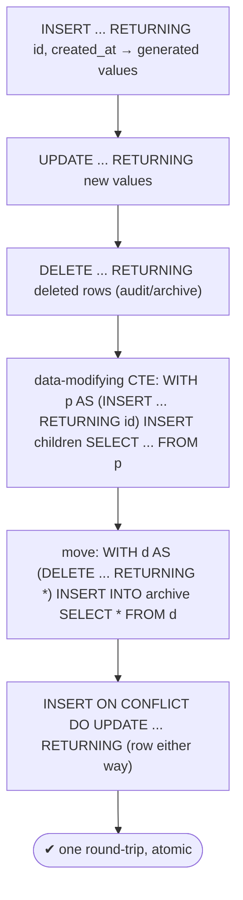
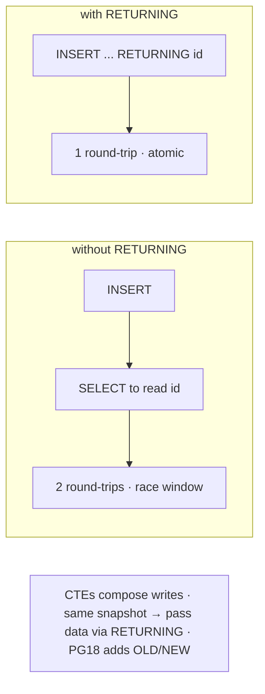

# Lab 94 — `RETURNING` on INSERT/UPDATE/DELETE to Avoid Round-Trips

> **Track B · Developer · B2 SQL Mastery · Lab 8 of 9 (Lab 94/222)**
> Teaching package: concept → diagram → steps → verify → quick-ref → self-test → video script.
> **Depends on:** Lab 80 (identity/generated keys), Lab 91 (MERGE RETURNING). **Related:** Lab 103 (transactions).

---

## 0. Lab Card (at a glance)

| Field | Value |
|---|---|
| **Objective** | Use `RETURNING` to get generated/affected values from writes in one statement, and compose multiple writes with data-modifying CTEs. |
| **Success criterion** | INSERT returns the new id/defaults; UPDATE/DELETE return affected rows; a CTE inserts a parent and its children using the returned id; a move (DELETE→INSERT) runs in one statement. |
| **Scope boundary** | `RETURNING` + data-modifying CTEs. General CTEs were Lab 88. |
| **Prereqs** | Lab 80 |
| **Time** | 20–30 min |
| **Difficulty** | ★★☆☆☆ |
| **Risk** | Low — scratch tables. |

---

## 1. Learning Objectives

1. **Why RETURNING** — one round-trip, no race.
2. **INSERT RETURNING** — generated ids/defaults/computed.
3. **UPDATE/DELETE RETURNING** — affected/deleted rows.
4. **Data-modifying CTEs** — compose writes atomically.
5. **Patterns** — parent+children, move/archive, upsert-returning.

---

## 2. Concept Primer — the "why"

**`RETURNING` returns data from the rows a write touched — in the same statement.** Append it to `INSERT`, `UPDATE`, `DELETE` (and `MERGE`, PG17) and you get back the affected rows without a follow-up `SELECT`. That matters for two reasons:
- **One round-trip, not two.** The classic anti-pattern is INSERT, then SELECT to read the generated id — two network hops. `RETURNING` folds them into one, which adds up under high throughput or latency.
- **Atomic — no race.** Between a separate write and read-back, another transaction could change things (or you'd rely on `lastval()`, which is fragile with triggers/multiple rows). `RETURNING` reads back exactly the rows this statement produced.

**INSERT ... RETURNING — get what the database generated.**
```sql
INSERT INTO users (name) VALUES ('Asha') RETURNING id, created_at;
```
Returns the new IDENTITY `id`, the `DEFAULT now()` `created_at`, generated columns — everything you'd otherwise SELECT for. This is the standard way to obtain a new row's **surrogate key**.

**UPDATE / DELETE ... RETURNING.**
```sql
UPDATE accounts SET balance = balance - 100 WHERE id = 1 RETURNING id, balance;  -- the NEW balance
DELETE FROM sessions WHERE expires < now() RETURNING id, user_id;                 -- what was removed
```
UPDATE returns the **post-update** values; DELETE returns the **deleted** rows (great for logging/archiving what left). *(In PG17, `RETURNING` yields the final/affected values; PG18 adds returning **OLD** and **NEW** values explicitly.)*

**Data-modifying CTEs — compose multiple writes in one statement.** A `WITH` clause can contain `INSERT`/`UPDATE`/`DELETE … RETURNING`, and later parts use that output:
```sql
-- insert a parent, then its children with the generated id:
WITH new_order AS (
  INSERT INTO orders (customer_id) VALUES (1) RETURNING order_id
)
INSERT INTO order_items (order_id, product_id, qty)
SELECT order_id, 5, 2 FROM new_order;

-- move/archive atomically:
WITH done AS (DELETE FROM active_orders WHERE status='done' RETURNING *)
INSERT INTO archived_orders SELECT * FROM done;
```
**Snapshot caveat:** all CTEs see the **same snapshot** — a modifying CTE's effects aren't visible to the *other* CTEs' reads (they see the pre-statement state), so pass data **explicitly via `RETURNING`**, and don't modify the same row twice in one statement.

**Upsert returning:** `INSERT … ON CONFLICT … DO UPDATE … RETURNING *` returns the row whether inserted or updated (use `DO UPDATE`, not `DO NOTHING`, if you always want a row back). And `MERGE … RETURNING merge_action()` (Lab 91) reports per-row actions.

---

## 3. Diagrams

### 3.1 RETURNING patterns flow



### 3.2 With vs without



---

## 4. Prerequisites

```bash
sudo -u postgres psql -d shopdb <<'SQL'
DROP TABLE IF EXISTS rt_items, rt_orders, rt_users, rt_archive CASCADE;
CREATE TABLE rt_users (id bigint GENERATED ALWAYS AS IDENTITY PRIMARY KEY, name text, created_at timestamptz DEFAULT now());
CREATE TABLE rt_orders (order_id bigint GENERATED ALWAYS AS IDENTITY PRIMARY KEY, customer text, status text DEFAULT 'active');
CREATE TABLE rt_items (order_id bigint, product int, qty int);
CREATE TABLE rt_archive (order_id bigint, customer text, status text);
SQL
```

---

## 5. Step-by-Step

### Step 1 — INSERT RETURNING: get generated values

```bash
sudo -u postgres psql -d shopdb -c "
INSERT INTO rt_users (name) VALUES ('Asha') RETURNING id, created_at;"
#   → the new id (IDENTITY) and created_at (DEFAULT now()) — no follow-up SELECT
```

### Step 2 — UPDATE RETURNING: new values

```bash
sudo -u postgres psql -d shopdb -c "
INSERT INTO rt_orders (customer) VALUES ('Ravi');
UPDATE rt_orders SET status='paid' WHERE customer='Ravi' RETURNING order_id, customer, status;"
```

### Step 3 — DELETE RETURNING: see what left

```bash
sudo -u postgres psql -d shopdb -c "
INSERT INTO rt_orders (customer, status) VALUES ('Old','cancelled');
DELETE FROM rt_orders WHERE status='cancelled' RETURNING order_id, customer;"
```

### Step 4 — Data-modifying CTE: parent + children with the new id

```bash
sudo -u postgres psql -d shopdb <<'SQL'
WITH new_order AS (
  INSERT INTO rt_orders (customer) VALUES ('Meera') RETURNING order_id
)
INSERT INTO rt_items (order_id, product, qty)
SELECT order_id, p, 1 FROM new_order, (VALUES (10),(20),(30)) v(p)
RETURNING *;
SQL
#   parent inserted + its id used for children — one atomic statement
```

### Step 5 — Move/archive atomically (DELETE RETURNING → INSERT)

```bash
sudo -u postgres psql -d shopdb <<'SQL'
INSERT INTO rt_orders (customer, status) VALUES ('Kiran','done');
WITH moved AS (
  DELETE FROM rt_orders WHERE status='done' RETURNING order_id, customer, status
)
INSERT INTO rt_archive SELECT order_id, customer, status FROM moved;
SQL
sudo -u postgres psql -d shopdb -c "SELECT * FROM rt_archive;"   # the moved row
```

### Step 6 — Upsert returning the row either way

```bash
sudo -u postgres psql -d shopdb <<'SQL'
CREATE TABLE IF NOT EXISTS rt_kv (k text PRIMARY KEY, v int);
INSERT INTO rt_kv VALUES ('a',1) ON CONFLICT (k) DO UPDATE SET v=EXCLUDED.v RETURNING k, v;   -- inserted
INSERT INTO rt_kv VALUES ('a',9) ON CONFLICT (k) DO UPDATE SET v=EXCLUDED.v RETURNING k, v;   -- updated
SQL
```

---

## 6. Verification Checklist

- [ ] INSERT RETURNING gives the generated id + defaults
- [ ] UPDATE RETURNING gives post-update values
- [ ] DELETE RETURNING gives the deleted rows
- [ ] CTE inserts a parent and children using the returned id
- [ ] Move (DELETE RETURNING → INSERT) archived the row in one statement
- [ ] `ON CONFLICT … DO UPDATE … RETURNING` returns the row on insert and update
- [ ] You can explain the round-trip/atomicity benefit

---

## 7. Troubleshooting

| Symptom | Cause | Fix |
|---|---|---|
| Need the OLD value on UPDATE | RETURNING gives new (PG17) | Capture before, use a trigger, or PG18 OLD/NEW |
| CTE doesn't see another CTE's write | Same snapshot | Pass data via `RETURNING`, not by re-reading |
| "cannot affect row a second time" | Two modifying CTEs touch the same row | Restructure; don't double-modify |
| `DO NOTHING RETURNING` empty | No row acted on for conflicts | Use `DO UPDATE` to always return |
| RETURNING in PL/pgSQL | Need to capture it | `... RETURNING col INTO var` |
| lastval() wrong id | Triggers/multiple rows | Use `INSERT … RETURNING id` |
| Large RETURNING result | Returns all affected rows | Expected; mind the volume |

---

## 8. Quick Reference Card (paste-ready)

```sql
-- get generated values (no follow-up SELECT):
INSERT INTO t (name) VALUES ('x') RETURNING id, created_at;
UPDATE t SET status='paid' WHERE id=:id RETURNING id, status;      -- new values
DELETE FROM t WHERE expired RETURNING *;                            -- deleted rows (audit)

-- data-modifying CTEs (compose writes; pass data via RETURNING):
WITH p AS (INSERT INTO orders (...) VALUES (...) RETURNING order_id)
INSERT INTO items (order_id, ...) SELECT order_id, ... FROM p;

WITH d AS (DELETE FROM active WHERE done RETURNING *)               -- move/archive
INSERT INTO archive SELECT * FROM d;

-- upsert returning the row either way:
INSERT INTO t (...) VALUES (...) ON CONFLICT (k) DO UPDATE SET ... RETURNING *;
-- MERGE ... RETURNING merge_action(), t.*  (PG17) · PG18 adds OLD/NEW
```

---

## 9. Self-Check

1. What does `RETURNING` do, and what does it save?
2. What's the classic use of `INSERT ... RETURNING`?
3. What do UPDATE and DELETE `RETURNING` return?
4. What is a data-modifying CTE, and a common pattern?
5. What's the snapshot caveat with modifying CTEs?
6. What does PG18 add to RETURNING?

<details>
<summary>Answers</summary>

1. Returns data from the rows a write affected, in the same statement — saving a separate SELECT (one round-trip) and avoiding a race (atomic read-back).
2. Getting the **generated id/defaults/computed columns** of a newly inserted row.
3. UPDATE: the **post-update (new)** values; DELETE: the **deleted** rows.
4. A `WITH` containing an `INSERT`/`UPDATE`/`DELETE … RETURNING` whose output feeds a later statement — e.g., insert a parent then its children with the returned id, or move rows (DELETE→INSERT).
5. All CTEs see the **same snapshot**; a modifying CTE's effects aren't visible to other CTEs' reads, so pass data explicitly via `RETURNING` and don't modify a row twice.
6. Explicit **OLD** and **NEW** values in `RETURNING`.
</details>

---

## 10. Video / Teaching Script

| # | On screen | Say (narration) |
|---|---|---|
| 1 | Title: "Get the answer with the write" | "Insert a row, then query for its id? That's two trips and a race. RETURNING hands you the answer in the same statement." |
| 2 | INSERT RETURNING | "Insert, and get the new id and defaults right back. No follow-up select, no lastval guessing." |
| 3 | UPDATE/DELETE | "Update and see the new values. Delete and see exactly what you removed — perfect for an audit log." |
| 4 | CTE parent+children | "Now the powerful part: insert an order, capture its id, and insert its line items — all in one statement." |
| 5 | move | "Or move rows: delete them here, returning what left, and insert them into an archive. Atomic." |
| 6 | upsert | "Even upserts return the row — whether it was inserted or updated." |
| 7 | Outro | "One statement, one round-trip. Next: JSON and JSONB." |

---

## 11. Glossary

- **`RETURNING`** — return affected-row data from a write statement.
- **Round-trip** — a client↔server request; RETURNING saves one.
- **Data-modifying CTE** — `WITH … (INSERT/UPDATE/DELETE … RETURNING)`.
- **Move/archive pattern** — `DELETE … RETURNING` piped into `INSERT`.
- **Upsert returning** — `ON CONFLICT DO UPDATE … RETURNING`.
- **Snapshot caveat** — CTEs share one snapshot; pass data via RETURNING.
- **OLD/NEW** — explicit pre/post values (PG18).

---
*NETAPORT lab series · PostgreSQL 17 on AlmaLinux 9 · Lab 94/222 · B2 SQL Mastery*
