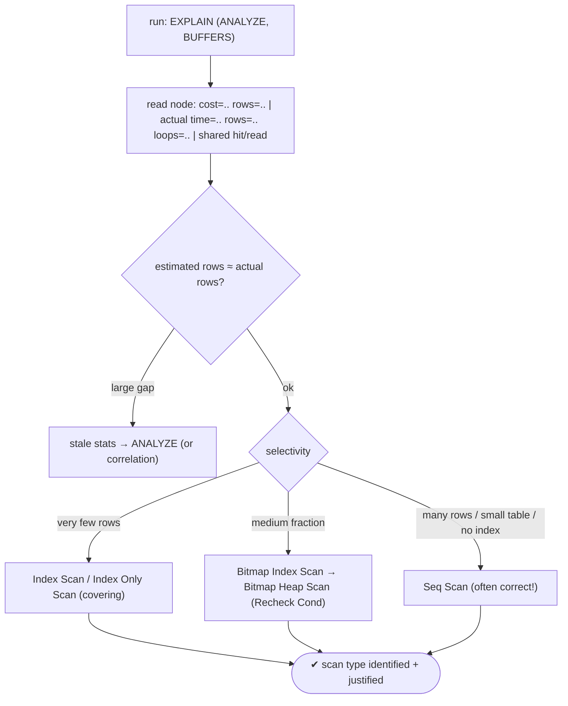
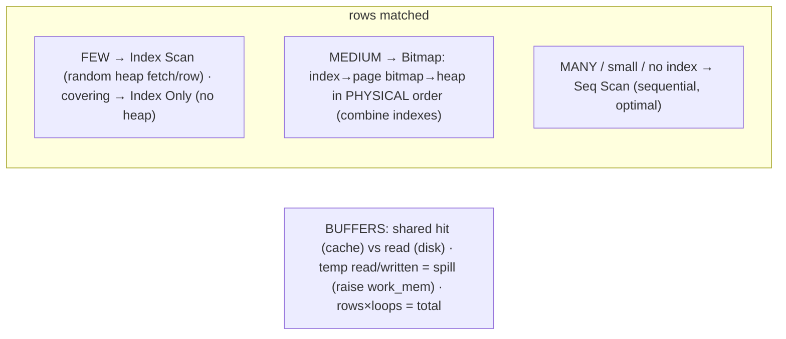

# Lab 95 — Read `EXPLAIN (ANALYZE, BUFFERS)`; Identify Seq Scan vs Index Scan vs Bitmap Heap Scan

> **Track B · Developer · B3 Query Performance & Indexing · Lab 1 of 10 (Lab 95/222)**
> Teaching package: concept → diagram → steps → verify → quick-ref → self-test → video script.
> **Depends on:** Lab 50 (stats), Lab 09 (tuning). Opens the performance track. **Feeds:** Labs 96–104 (indexing).

---

## 0. Lab Card (at a glance)

| Field | Value |
|---|---|
| **Objective** | Read `EXPLAIN (ANALYZE, BUFFERS)` output and identify Seq Scan, Index Scan, Index Only Scan, and Bitmap Heap Scan — and why the planner chose each by selectivity. |
| **Success criterion** | You can point to cost/actual-time/rows/loops/buffers on a node, trigger each scan type by varying selectivity, and explain the choice. |
| **Scope boundary** | Reading plans + scan types. Index creation/types are Labs 96–101. |
| **Prereqs** | Lab 50; a large table |
| **Time** | 35–50 min |
| **Difficulty** | ★★★★☆ |
| **Risk** | Low — read-only queries. |

---

## 1. Learning Objectives

1. **EXPLAIN vs ANALYZE vs BUFFERS** — plan, real stats, I/O.
2. **Read a plan node** — cost, actual time, rows, loops, buffers.
3. **Seq Scan** — when it's chosen (and right).
4. **Index / Index Only Scan** — few rows, covering.
5. **Bitmap Heap Scan** — medium fraction, combined indexes.

---

## 2. Concept Primer — the "why"

**`EXPLAIN` shows the plan; `ANALYZE` proves it.**
- **`EXPLAIN`** prints the plan the planner *chose*, with **estimates** — nothing runs.
- **`EXPLAIN ANALYZE`** actually **runs** the query and shows **actual** times and row counts alongside the estimates.
- **`BUFFERS`** adds I/O: **`shared hit`** (blocks found in cache — fast) vs **`shared read`** (blocks read from disk — slow), plus `temp read/written` (sort/hash spills — a signal to raise `work_mem`).

**Reading a plan node.** The output is a tree; indented children feed their parents. Each node shows:
- `cost=start..total` — estimated cost in arbitrary units (cost to first row .. cost to last row). Relative, not milliseconds.
- `rows` / `width` — estimated rows / average row bytes.
- With ANALYZE: `actual time=start..total` (ms), actual `rows`, and **`loops`** (times the node ran — total rows = rows × loops).
- With BUFFERS: `shared hit/read/…`.

**Estimated vs actual is the first thing to check.** A big gap between estimated `rows` and actual `rows` means the planner **mis-estimated** — usually **stale statistics** (run `ANALYZE`) or correlated columns (extended statistics, a later lab). Bad estimates cause bad plans.

**The three scan types — chosen by selectivity (how many rows match):**

1. **Seq Scan** — reads the **whole table**, row by row. Chosen when there's no useful index, the query returns a **large fraction** of rows (sequential I/O beats many random lookups), or the table is small. **Not inherently bad** — it's *optimal* in those cases. It's only a problem when filtering to a **few** rows of a **large** table with no usable index.

2. **Index Scan** — walk an index to find matches, then **fetch each row from the heap** by pointer. Best for a **small fraction** of rows; the per-row random heap access gets expensive as the count grows. Output is in index order.
   - **Index Only Scan** — a variant when the index contains **all** the columns the query needs (a *covering* index): it skips the heap entirely, reading only the index. Fastest when applicable, but needs the **visibility map** current (i.e., the table well-vacuumed) so tuples are "all-visible."

3. **Bitmap Heap Scan** (paired with a **Bitmap Index Scan**) — a two-phase hybrid for a **medium fraction**:
   - *Bitmap Index Scan*: scan the index, build a **bitmap of matching heap pages** (not individual rows).
   - *Bitmap Heap Scan*: read those pages in **physical order** (near-sequential), rechecking the condition (`Recheck Cond`).
   It avoids the random per-row access of an index scan while reading far less than a full table — and it can **combine multiple indexes** (`BitmapAnd`/`BitmapOr`) for multi-condition queries.

**The mental model:** very few rows → Index (or Index Only) Scan; a medium slice → Bitmap Heap Scan; most rows / small table / no index → Seq Scan. The planner estimates selectivity and picks — and reading the plan tells you whether it estimated well.

---

## 3. Diagrams

### 3.1 Read + identify flow



### 3.2 Scan types by selectivity



---

## 4. Prerequisites — a large table with an index

```bash
sudo -u postgres psql -d shopdb <<'SQL'
DROP TABLE IF EXISTS perf;
CREATE TABLE perf (id bigint GENERATED ALWAYS AS IDENTITY PRIMARY KEY,
  category int, status text, amount numeric);
INSERT INTO perf (category, status, amount)
SELECT (random()*1000)::int, (ARRAY['a','b','c','d'])[1+(random()*3)::int], (random()*500)::numeric(10,2)
FROM generate_series(1, 2000000);
CREATE INDEX perf_category ON perf (category);
ANALYZE perf;
SQL
```

---

## 5. Step-by-Step

### Step 1 — Index Scan (very few rows: PK lookup)

```bash
sudo -u postgres psql -d shopdb -c "EXPLAIN (ANALYZE, BUFFERS) SELECT * FROM perf WHERE id = 12345;"
#   → Index Scan using perf_pkey · 1 row · look at shared hit vs read, actual time
```

### Step 2 — Index Scan on a selective column

```bash
sudo -u postgres psql -d shopdb -c "EXPLAIN (ANALYZE, BUFFERS) SELECT * FROM perf WHERE category = 42;"
#   → Index Scan / Bitmap depending on how many match (~2000 rows / 0.1%)
```

### Step 3 — Bitmap Heap Scan (medium fraction)

```bash
sudo -u postgres psql -d shopdb -c "EXPLAIN (ANALYZE, BUFFERS) SELECT * FROM perf WHERE category BETWEEN 1 AND 100;"
#   → Bitmap Index Scan on perf_category → Bitmap Heap Scan (Recheck Cond) · ~10% of rows
```

### Step 4 — Seq Scan (large fraction / no useful index)

```bash
sudo -u postgres psql -d shopdb -c "EXPLAIN (ANALYZE, BUFFERS) SELECT * FROM perf WHERE amount > 10;"
#   → Seq Scan (no index on amount, and most rows match) — the RIGHT choice here
sudo -u postgres psql -d shopdb -c "EXPLAIN (ANALYZE, BUFFERS) SELECT count(*) FROM perf;"
#   → Seq Scan (must read everything)
```

### Step 5 — Index Only Scan (covering index)

```bash
sudo -u postgres psql -d shopdb -c "CREATE INDEX perf_cat_amt ON perf (category) INCLUDE (amount); VACUUM perf;"
sudo -u postgres psql -d shopdb -c "EXPLAIN (ANALYZE, BUFFERS) SELECT amount FROM perf WHERE category = 42;"
#   → Index Only Scan (all needed columns in the index; heap skipped — needs vacuum for visibility map)
```

### Step 6 — Estimated vs actual, and combining indexes

```bash
# combine two indexes with a bitmap AND:
sudo -u postgres psql -d shopdb -c "CREATE INDEX perf_status ON perf (status);"
sudo -u postgres psql -d shopdb -c "
EXPLAIN (ANALYZE, BUFFERS) SELECT * FROM perf WHERE category BETWEEN 1 AND 50 AND status='a';"
#   → BitmapAnd of perf_category + perf_status → Bitmap Heap Scan
# force a seq scan to compare cost:
sudo -u postgres psql -d shopdb -c "SET enable_indexscan=off; SET enable_bitmapscan=off;
EXPLAIN ANALYZE SELECT * FROM perf WHERE category=42; RESET enable_indexscan; RESET enable_bitmapscan;"
```

---

## 6. Verification Checklist

- [ ] Located cost / actual time / rows / loops / buffers on a node
- [ ] Index Scan identified for a few-row query
- [ ] Bitmap Heap Scan identified for a medium fraction (with `Recheck Cond`)
- [ ] Seq Scan identified for a large fraction / count — and understood as correct
- [ ] Index Only Scan achieved with a covering index (+ vacuum)
- [ ] `BitmapAnd` combined two indexes
- [ ] Checked estimated vs actual rows

---

## 7. Troubleshooting

| Symptom | Cause | Fix |
|---|---|---|
| Seq scan where you expected an index | Many rows / small table / stale stats / unusable index | `ANALYZE`; check selectivity; ensure the index matches the condition (no function/type mismatch) |
| Estimated rows ≠ actual (big gap) | Stale stats or correlation | `ANALYZE`; extended statistics for correlated columns |
| High `shared read` | Cold cache / data > shared_buffers | Warm the cache; tune `shared_buffers` |
| `temp read/written` present | Sort/hash spilled to disk | Raise `work_mem` |
| Bitmap `Recheck` removes many rows | Lossy bitmap (work_mem small) | Raise `work_mem` |
| No Index Only Scan | Not covering / table not vacuumed | Add `INCLUDE` columns; `VACUUM` (visibility map) |
| `loops` high in a nested loop | Many iterations | Multiply rows×loops; consider a different join/index |

---

## 8. Quick Reference Card (paste-ready)

```sql
EXPLAIN (ANALYZE, BUFFERS) <query>;     -- runs it; shows real time + I/O
--   cost=start..total (est units) · actual time=..  rows=..  loops=..  (total = rows×loops)
--   BUFFERS: shared hit (cache) vs read (disk) · temp read/written = spill → raise work_mem
--   FIRST CHECK: estimated rows vs actual rows — big gap ⇒ ANALYZE / correlation

-- scan types by SELECTIVITY:
--   FEW rows      → Index Scan (random heap fetch)  ·  covering → Index Only Scan (no heap; needs vacuum)
--   MEDIUM slice  → Bitmap Index Scan → Bitmap Heap Scan (Recheck Cond; combine via BitmapAnd/Or)
--   MANY / small / no index → Seq Scan (sequential — often correct)

-- experiment: SET enable_seqscan=off | enable_indexscan=off | enable_bitmapscan=off;  (then RESET)
```

---

## 9. Self-Check

1. What do `EXPLAIN`, `ANALYZE`, and `BUFFERS` each add?
2. When is a Seq Scan chosen, and is it necessarily bad?
3. When does the planner use an Index Scan?
4. When does it use a Bitmap Heap Scan?
5. What does an Index Only Scan require?
6. What does a large estimated-vs-actual rows gap indicate?

<details>
<summary>Answers</summary>

1. `EXPLAIN`: the estimated plan; `ANALYZE`: runs it and shows actual times/rows; `BUFFERS`: cache-hit vs disk-read I/O (and temp spills).
2. For a large row fraction, a small table, or no usable index — and it's often **optimal**, not bad; it's only wrong when filtering to a few rows of a large table with no index.
3. For a **small fraction** of rows with an index on the condition (random heap fetch per row).
4. For a **medium fraction** — it builds a bitmap of pages and reads them in physical order (and can combine indexes with BitmapAnd/Or).
5. A **covering** index (all needed columns) and an up-to-date **visibility map** (well-vacuumed table).
6. A planner mis-estimate — usually **stale statistics** (run `ANALYZE`) or correlated columns.
</details>

---

## 10. Video / Teaching Script

| # | On screen | Say (narration) |
|---|---|---|
| 1 | Title: "Reading the plan" | "Every slow query has a plan behind it. EXPLAIN shows the plan; ANALYZE proves it by running it; BUFFERS shows the I/O. Learn to read these and tuning stops being guesswork." |
| 2 | node anatomy | "Each node: an estimated cost, and — with ANALYZE — the real time and row count. First thing I check: does the estimate match reality? If not, your stats are stale." |
| 3 | index scan | "Ask for one row by id — Index Scan. Jump straight to it." |
| 4 | bitmap | "Ask for ten percent — a bitmap scan. It marks the pages, then reads them in order. Less random, less pain." |
| 5 | seq scan | "Ask for *most* rows — a sequential scan. And that's *correct*. Reading everything in order beats a million random lookups. Seq scan isn't the enemy." |
| 6 | index only | "And the fastest: put every needed column in the index, and Postgres never touches the table at all." |
| 7 | Outro | "You can read a plan now. Next: designing the indexes that shape it." |

---

## 11. Glossary

- **EXPLAIN / ANALYZE / BUFFERS** — plan / real run / I/O stats.
- **cost / actual time / rows / loops / width** — node metrics.
- **shared hit / read** — cache blocks / disk blocks.
- **Seq Scan** — full-table read (good for many rows).
- **Index Scan / Index Only Scan** — index lookup / covering (no heap).
- **Bitmap Heap Scan** — page bitmap → physical-order heap read.
- **Selectivity** — fraction of rows matched (drives the choice).

---
*NETAPORT lab series · PostgreSQL 17 on AlmaLinux 9 · Lab 95/222 · B3 Query Performance & Indexing*
