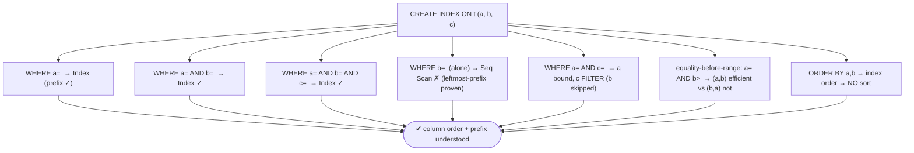
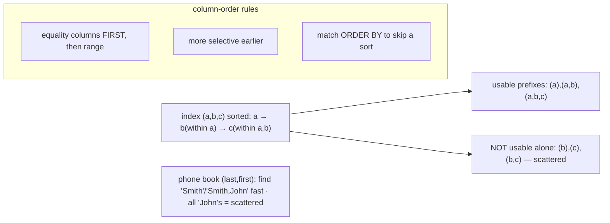

# Lab 96 — B-tree Composite Index Column-Order Lab; Prove the Leftmost-Prefix Rule

> **Track B · Developer · B3 Query Performance & Indexing · Lab 2 of 10 (Lab 96/222)**
> Teaching package: concept → diagram → steps → verify → quick-ref → self-test → video script.
> **Depends on:** Lab 95 (reading EXPLAIN). **Feeds:** Labs 97–101 (partial/covering/GIN/GiST).

---

## 0. Lab Card (at a glance)

| Field | Value |
|---|---|
| **Objective** | Build a composite B-tree index, prove the leftmost-prefix rule with `EXPLAIN`, and apply the equality-before-range column-order rule. |
| **Success criterion** | Prefix queries use the index; a non-leading-column query does not; `(a=X AND b>Y)` favors `(a,b)` over `(b,a)`; an ORDER BY matching the index avoids a sort. |
| **Scope boundary** | Composite B-tree ordering. Partial/covering indexes are Labs 97/99. |
| **Prereqs** | Lab 95; a table |
| **Time** | 30–45 min |
| **Difficulty** | ★★★★☆ |
| **Risk** | Low — read-only. |

---

## 1. Learning Objectives

1. **Composite index sort order** — a, then b, then c.
2. **The leftmost-prefix rule** — which queries it serves.
3. **Prove it** with `EXPLAIN`.
4. **Column-order rule** — equality before range.
5. **ORDER BY** — matching the index to skip a sort.

---

## 2. Concept Primer — the "why"

**A composite index is sorted by its columns in order.** `CREATE INDEX ON t (a, b, c)` sorts entries by **a**, then by **b** *within* equal a, then by **c** *within* equal (a,b). Picture a **phone book sorted by (last_name, first_name)**: entries are ordered by last name, and first names are only ordered *within* a last name.

**The leftmost-prefix rule.** The index can efficiently *seek* only when the query constrains a **contiguous leftmost prefix** of its columns:
- `(a)` ✓, `(a, b)` ✓, `(a, b, c)` ✓ — leading columns present, left to right.
- `(a, c)` — uses **a** as an index bound, then **c** only as a *filter* (b is skipped, so c can't be a bound).
- `(b)` ✗, `(c)` ✗, `(b, c)` ✗ — **not usable efficiently**: without constraining a, the b-values are **scattered** throughout the index (each a-group has its own b-ordering), so there's nowhere to seek.

The phone-book intuition: you can find "Smith" fast, and "Smith, John" fast — but you *cannot* quickly find all "John"s, because Johns are spread under every last name. That's why `(b)` alone can't use `(a,b,c)`.

**Column order is a design decision — equality before range.** When a query mixes equality and range predicates, put **equality columns first**:
- `WHERE a = X AND b > Y` → index **`(a, b)`** is ideal: seek to `a = X`, then **range-scan** `b > Y` within it.
- The reverse index `(b, a)` is worse: a range on `b` first means `a` can't be an efficient bound (a is scattered within each b).
So: **equality columns, then the range column**. Beyond that, favor the more **selective** column earlier, and consider whether the index can also serve the query's `ORDER BY`.

**Index can satisfy ORDER BY.** Because the index is physically ordered, `(a, b)` can produce `ORDER BY a, b` (or `WHERE a = X ORDER BY b`) **without a separate sort** — a big win. It must match the index's column order *and* direction (or a consistent reverse).

**Filter vs bound (the distinction reading plans):** an *index bound* is used to seek/limit the scan range; a *filter* (`Filter:` / `Index Cond` vs a post-scan condition) is applied to rows the scan already returned. Leftmost-prefix decides which columns become bounds.

---

## 3. Diagrams

### 3.1 Prove-the-rule flow



### 3.2 Sort order + usable prefixes



---

## 4. Prerequisites — table + composite index

```bash
sudo -u postgres psql -d shopdb <<'SQL'
DROP TABLE IF EXISTS abc;
CREATE TABLE abc (a int, b int, c int, payload text);
INSERT INTO abc SELECT (random()*100)::int, (random()*100)::int, (random()*100)::int, md5(g::text)
FROM generate_series(1, 1000000) g;
CREATE INDEX abc_abc ON abc (a, b, c);
ANALYZE abc;
SQL
```

---

## 5. Step-by-Step

### Step 1 — Prefix (a) uses the index

```bash
sudo -u postgres psql -d shopdb -c "EXPLAIN (ANALYZE, COSTS OFF) SELECT * FROM abc WHERE a = 42;"
#   → Index Scan / Bitmap using abc_abc — leading column, index usable
```

### Step 2 — Prefixes (a,b) and (a,b,c) use the index

```bash
sudo -u postgres psql -d shopdb -c "EXPLAIN (COSTS OFF) SELECT * FROM abc WHERE a=42 AND b=17;"
sudo -u postgres psql -d shopdb -c "EXPLAIN (COSTS OFF) SELECT * FROM abc WHERE a=42 AND b=17 AND c=5;"
#   both → Index Cond includes a,b(,c) — full prefix as bounds
```

### Step 3 — PROVE leftmost-prefix: (b) alone does NOT use the index

```bash
sudo -u postgres psql -d shopdb -c "EXPLAIN (COSTS OFF) SELECT * FROM abc WHERE b = 17;"
#   → Seq Scan (or Parallel Seq Scan) — b is not the leading column → index can't seek
sudo -u postgres psql -d shopdb -c "EXPLAIN (COSTS OFF) SELECT * FROM abc WHERE b=17 AND c=5;"
#   → Seq Scan — still no leading a
```

### Step 4 — Gap case: (a, c) — a is a bound, c is only a filter

```bash
sudo -u postgres psql -d shopdb -c "EXPLAIN (COSTS OFF) SELECT * FROM abc WHERE a=42 AND c=5;"
#   → Index Cond: (a=42), then Filter: (c=5)  — b skipped, so c can't be a bound
```

### Step 5 — Equality before range

```bash
sudo -u postgres psql -d shopdb <<'SQL'
CREATE INDEX abc_ba ON abc (b, a);            -- wrong order for a=X AND b>Y
EXPLAIN (COSTS OFF) SELECT * FROM abc WHERE a=42 AND b>90;   -- planner prefers (a,b) [abc_abc]
DROP INDEX abc_ba;
SQL
#   (a,b): seek a=42, range-scan b>90.  (b,a): range on b first → a can't be a clean bound.
```

### Step 6 — ORDER BY matches the index → no sort

```bash
sudo -u postgres psql -d shopdb -c "EXPLAIN (COSTS OFF) SELECT * FROM abc WHERE a=42 ORDER BY b, c;"
#   → Index Scan, NO separate Sort node (index already ordered by a,b,c)
sudo -u postgres psql -d shopdb -c "EXPLAIN (COSTS OFF) SELECT * FROM abc WHERE a=42 ORDER BY c;"
#   → a Sort appears (c is not the next ordered column after fixing a,b)
```

---

## 6. Verification Checklist

- [ ] `(a)`, `(a,b)`, `(a,b,c)` prefixes use the index (Index Cond)
- [ ] `(b)` alone → **Seq Scan** (leftmost-prefix proven)
- [ ] `(a,c)` → a as bound, c as Filter (b gap)
- [ ] Equality-before-range: `(a,b)` beats `(b,a)` for `a=X AND b>Y`
- [ ] `ORDER BY a,b` served by the index (no Sort)
- [ ] Understood filter vs bound
- [ ] Can state the column-order rules

---

## 7. Troubleshooting

| Symptom | Cause | Fix |
|---|---|---|
| `(b)` alone won't use the index | Not the leading column | Reorder the index, or add an index on `b` |
| `(a,c)` scans more than expected | b gap → c is a filter | Put together-queried columns adjacent, or accept the filter |
| Range-first index inefficient | Range column before equality | Reorder: equality columns first |
| Extra `Sort` despite an index | ORDER BY doesn't match index order/direction | Align ORDER BY to the index (or index DESC) |
| Too many single-column indexes | Redundant with a composite prefix | A composite covers its prefixes; keep the composite + the leading-only need |
| Index used but slow | Low selectivity (many rows) | Different column order / more selective leading column |
| Planner picks Seq Scan | Cost/selectivity | Compare with `SET enable_seqscan=off` |

---

## 8. Quick Reference Card (paste-ready)

```sql
CREATE INDEX ON t (a, b, c);   -- sorted: a → b(within a) → c(within a,b)

-- USABLE prefixes (efficient bounds):  (a) · (a,b) · (a,b,c)
-- NOT usable alone:                    (b) · (c) · (b,c)   → Seq Scan
-- gap: WHERE a= AND c=  → a is a BOUND, c is a FILTER (b skipped)

-- COLUMN ORDER: equality columns FIRST, then the range column
--   WHERE a=X AND b>Y   → index (a,b)   ✓  (seek a, range b)   NOT (b,a)
--   then: more selective earlier · match ORDER BY to skip a Sort

-- prove with: EXPLAIN (COSTS OFF) SELECT ... ;  (look for Index Cond vs Filter, and Sort nodes)
```

---

## 9. Self-Check

1. How is a composite index `(a,b,c)` sorted?
2. State the leftmost-prefix rule.
3. Why can't `WHERE b=…` (alone) use the `(a,b,c)` index?
4. What's the column-order rule of thumb?
5. Which index is best for `WHERE a=X AND b>Y`?
6. Can a composite index satisfy an `ORDER BY`?

<details>
<summary>Answers</summary>

1. By `a`, then by `b` within equal `a`, then by `c` within equal `(a,b)`.
2. The index efficiently serves queries constraining a **contiguous leftmost prefix**: `(a)`, `(a,b)`, `(a,b,c)` — not `(b)`, `(c)`, or `(b,c)` alone.
3. Without constraining `a`, the `b`-values are **scattered** across every a-group — there's no top-level `b` ordering to seek on (the phone-book "all Johns" problem).
4. **Equality columns first, then the range column** (then more-selective earlier, and match ORDER BY where possible).
5. `(a, b)` — seek `a = X`, then range-scan `b > Y`.
6. Yes — if the `ORDER BY` matches the index's column order and direction, the index provides the order with **no separate sort**.
</details>

---

## 10. Video / Teaching Script

| # | On screen | Say (narration) |
|---|---|---|
| 1 | Title: "Column order is everything" | "A multicolumn index is like a phone book sorted by last name, then first. That ordering decides which queries it can help — and which it can't." |
| 2 | prefixes work | "Search by the leading column, or the leading two, or all three — the index seeks straight to them." |
| 3 | the proof | "But search by the *second* column alone? Sequential scan. Those values are scattered under every leading value — there's nothing to jump to. That's the leftmost-prefix rule." |
| 4 | the gap | "Skip a column in the middle and everything after it becomes a filter, not a seek." |
| 5 | equality before range | "Design rule: equality columns first, range last. 'a equals X and b greater than Y' wants the index a-then-b — seek, then range. Reverse it and you lose the seek." |
| 6 | ORDER BY | "Bonus: if the index order matches your ORDER BY, the sort disappears entirely." |
| 7 | Outro | "Order your index columns on purpose. Next: partial and expression indexes." |

---

## 11. Glossary

- **Composite/multicolumn index** — index on several columns, ordered left to right.
- **Leftmost-prefix rule** — only contiguous leading columns seek efficiently.
- **Bound vs filter** — used to limit the scan range vs applied after.
- **Equality-before-range** — put `=` columns before range columns.
- **Selectivity** — fraction matched; more-selective columns earlier.
- **ORDER BY match** — index order can replace a sort.

---
*NETAPORT lab series · PostgreSQL 17 on AlmaLinux 9 · Lab 96/222 · B3 Query Performance & Indexing*
