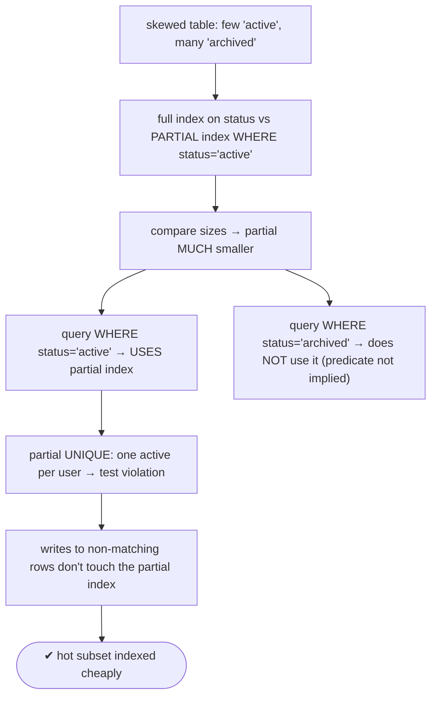

# Lab 97 — Partial Indexes for a Hot Subset (e.g. `WHERE status='active'`)

> **Track B · Developer · B3 Query Performance & Indexing · Lab 3 of 10 (Lab 97/222)**
> Teaching package: concept → diagram → steps → verify → quick-ref → self-test → video script.
> **Depends on:** Lab 95 (EXPLAIN), Lab 96 (composite indexes). **Related:** Lab 98 (expression indexes).

---

## 0. Lab Card (at a glance)

| Field | Value |
|---|---|
| **Objective** | Build a partial index over a hot subset, compare its size to a full index, prove when the planner uses it, and enforce subset uniqueness with a partial UNIQUE index. |
| **Success criterion** | The partial index is far smaller; queries on the subset use it while queries outside it don't; a partial UNIQUE index enforces "one active per group." |
| **Scope boundary** | Partial indexes. Expression indexes are Lab 98; covering Lab 99. |
| **Prereqs** | Lab 95; a skewed table |
| **Time** | 25–35 min |
| **Difficulty** | ★★★☆☆ |
| **Risk** | Low — read-only + scratch tables. |

---

## 1. Learning Objectives

1. **What a partial index is** — indexed rows via a predicate.
2. **The hot-subset win** — size, maintenance, write cost.
3. **When the planner uses it** — predicate implication.
4. **Partial UNIQUE** — subset uniqueness.
5. **Choosing** partial vs full.

---

## 2. Concept Primer — the "why"

**A partial index covers only the rows matching a `WHERE` predicate.**
```sql
CREATE INDEX orders_active ON orders (customer_id) WHERE status = 'active';
```
It indexes **only** the `active` rows. When a table is **skewed** — say 95% of orders are `completed`/`archived` and queries almost always target the small `active`/`pending` set — a partial index gives you:
- **A much smaller index** — only the hot rows → less disk, faster scans.
- **Less maintenance** — rows *outside* the predicate aren't in the index at all, so writing them **doesn't touch it** (cheaper inserts/updates for the inactive majority).
- **Focus** — the index serves exactly the queries that matter.

**The planner uses it only when the query's `WHERE` implies the predicate.** For `orders_active WHERE status='active'` to apply, the query must be *provably* restricted to active rows — e.g. `WHERE status='active' AND customer_id=…`. A query for `status='completed'` **can't** use it (different subset), and a query with no status filter can't either. Extra conditions beyond the predicate become filters after the partial scan.

**Other common predicates:**
- `WHERE col IS NOT NULL` — index only non-NULL rows (skip a sparse column's NULLs).
- `WHERE amount > 1000` — index only the high-value rows queries care about.
- Any **immutable** condition (the predicate must use immutable functions, like an expression index).

**Partial UNIQUE index — subset uniqueness (a killer pattern).** Enforce a uniqueness rule on only *some* rows:
```sql
-- unique email only among non-deleted users (soft delete can reuse an email):
CREATE UNIQUE INDEX users_email_active ON users (email) WHERE deleted_at IS NULL;
-- "one active subscription per user":
CREATE UNIQUE INDEX one_active_sub ON subs (user_id) WHERE status = 'active';
```
This expresses constraints a plain `UNIQUE` can't: exactly one active row per group, uniqueness that ignores soft-deleted rows, etc.

**Partial vs full — the decision.** If queries hit **all** subsets fairly evenly, a full index is right. If they **concentrate on a hot subset** (or you need subset uniqueness), a partial index is smaller, cheaper, and just as fast for those queries.

---

## 3. Diagrams

### 3.1 Build + prove flow



### 3.2 Partial index model

```mermaid
flowchart LR
    TABLE["table (skewed)"] -->|only rows matching predicate| PIDX["partial index (small, hot subset)"]
    Q1["query implies predicate → uses it"] --> PIDX
    Q2["query on other subset → can't use it"] -.x.-> PIDX
    subgraph USES [wins]
      U1["smaller index (disk/scan)"]
      U2["cheaper writes for non-matching rows"]
      U3["partial UNIQUE = subset uniqueness"]
    end
    note["predicate must be IMMUTABLE · planner must PROVE query ⊆ predicate"]
```

---

## 4. Prerequisites — a skewed table

```bash
sudo -u postgres psql -d shopdb <<'SQL'
DROP TABLE IF EXISTS jobs;
CREATE TABLE jobs (id bigint GENERATED ALWAYS AS IDENTITY PRIMARY KEY, user_id int, status text, created_at timestamptz DEFAULT now());
-- 98% archived, 2% active:
INSERT INTO jobs (user_id, status)
SELECT (random()*100000)::int, CASE WHEN random() < 0.02 THEN 'active' ELSE 'archived' END
FROM generate_series(1, 2000000);
ANALYZE jobs;
SQL
```

---

## 5. Step-by-Step

### Step 1 — Full index vs partial index; compare sizes

```bash
sudo -u postgres psql -d shopdb <<'SQL'
CREATE INDEX jobs_status_full   ON jobs (status);                        -- indexes ALL 2M rows
CREATE INDEX jobs_active_partial ON jobs (user_id) WHERE status='active'; -- indexes only ~40k active rows
SQL
sudo -u postgres psql -d shopdb -c "
SELECT relname, pg_size_pretty(pg_relation_size(relname)) AS size
FROM (VALUES ('jobs_status_full'),('jobs_active_partial')) t(relname);"
#   → partial index is a fraction of the full index's size
```

### Step 2 — Query on the hot subset uses the partial index

```bash
sudo -u postgres psql -d shopdb -c "
EXPLAIN (ANALYZE, COSTS OFF) SELECT * FROM jobs WHERE status='active' AND user_id=12345;"
#   → Index Scan using jobs_active_partial
```

### Step 3 — Query on a different subset does NOT use it

```bash
sudo -u postgres psql -d shopdb -c "
EXPLAIN (COSTS OFF) SELECT * FROM jobs WHERE status='archived' AND user_id=12345;"
#   → uses jobs_status_full (or seq scan) — NOT the partial index (predicate not implied)
```

### Step 4 — Query without the status filter can't use it

```bash
sudo -u postgres psql -d shopdb -c "
EXPLAIN (COSTS OFF) SELECT * FROM jobs WHERE user_id=12345;"
#   → can't use the partial index — the planner can't prove status='active'
```

### Step 5 — Partial UNIQUE: one active job per user

```bash
sudo -u postgres psql -d shopdb <<'SQL'
DROP TABLE IF EXISTS subs;
CREATE TABLE subs (id bigint GENERATED ALWAYS AS IDENTITY PRIMARY KEY, user_id int, status text);
CREATE UNIQUE INDEX one_active_sub ON subs (user_id) WHERE status='active';
INSERT INTO subs (user_id, status) VALUES (1,'active'), (1,'cancelled'), (1,'cancelled');  -- OK: many cancelled
SQL
sudo -u postgres psql -d shopdb -c "INSERT INTO subs (user_id, status) VALUES (1,'active');" 2>&1 | tail -1
#   → duplicate key violates unique constraint (a user can't have TWO active subs)
```

### Step 6 — Non-matching writes don't touch the partial index

```bash
# inserting archived rows never updates jobs_active_partial (only 'active' rows are indexed) — cheaper writes
sudo -u postgres psql -d shopdb -c "INSERT INTO jobs (user_id, status) SELECT g, 'archived' FROM generate_series(1,100000) g;"
#   partial index size unchanged (archived rows aren't in it):
sudo -u postgres psql -d shopdb -c "SELECT pg_size_pretty(pg_relation_size('jobs_active_partial')) AS partial_size;"
```

---

## 6. Verification Checklist

- [ ] Partial index far smaller than the full index
- [ ] Query on `status='active'` uses the partial index
- [ ] Query on another subset does **not** use it
- [ ] Query without the status filter can't use it
- [ ] Partial UNIQUE enforces "one active per user"
- [ ] Archived inserts don't grow the partial index
- [ ] Can decide partial vs full

---

## 7. Troubleshooting

| Symptom | Cause | Fix |
|---|---|---|
| Partial index not used | Query `WHERE` doesn't imply the predicate | Filter on the same condition; planner must prove it |
| Query on other subset unindexed | Partial covers only its subset | Add another (partial/full) index if needed |
| Partial UNIQUE not enforcing | Predicate excludes the rows | Check the predicate matches the intended subset |
| Index still large | Predicate not selective | Tighten the predicate |
| "functions in index predicate must be marked IMMUTABLE" | Volatile predicate | Use immutable expressions only |
| Extra conditions slow | Applied as filters after the scan | Add columns to the index or refine |
| Unsure partial vs full | Access pattern | Concentrated hot subset → partial; even access → full |

---

## 8. Quick Reference Card (paste-ready)

```sql
-- partial index: only rows matching the (immutable) predicate
CREATE INDEX orders_active ON orders (customer_id) WHERE status = 'active';
--   smaller · cheaper writes for non-matching rows · used only when query WHERE IMPLIES the predicate

-- other predicates: WHERE col IS NOT NULL · WHERE amount > 1000

-- partial UNIQUE (subset uniqueness):
CREATE UNIQUE INDEX ON users (email) WHERE deleted_at IS NULL;      -- unique among non-deleted
CREATE UNIQUE INDEX ON subs (user_id) WHERE status='active';        -- one active per user

-- verify: EXPLAIN (COSTS OFF) SELECT ... WHERE status='active' ...;  (Index Scan using the partial)
-- size:   pg_relation_size('partial_index_name')
-- choose: hot subset / subset-uniqueness → partial · even access → full
```

---

## 9. Self-Check

1. What is a partial index?
2. What are its main benefits?
3. When does the planner use a partial index?
4. Will a query on a different subset use it?
5. What does a partial UNIQUE index enable?
6. What must be true of the predicate?

<details>
<summary>Answers</summary>

1. An index built over only the rows matching a `WHERE` predicate.
2. Smaller index (less storage/scan), cheaper writes for non-matching rows (they aren't indexed), and focus on the hot subset.
3. When the query's `WHERE` **implies** (provably restricts to) the index's predicate.
4. **No** — the predicate isn't implied, so it doesn't apply.
5. Uniqueness on a subset — e.g. "one active per user," or unique among non-soft-deleted rows.
6. It must use **immutable** functions/expressions.
</details>

---

## 10. Video / Teaching Script

| # | On screen | Say (narration) |
|---|---|---|
| 1 | Title: "Index only what matters" | "Most rows are cold — archived, done, deleted. Your queries want the hot few. So index only those." |
| 2 | sizes | "Full index: every row. Partial index, WHERE status is active: just the two percent. A fraction of the size." |
| 3 | uses it | "Query the active set, and Postgres reaches for the tiny partial index. Fast." |
| 4 | doesn't | "Query the archived set, and it won't touch the partial index — different rows. That's the rule: your filter must match the predicate." |
| 5 | partial unique | "The real power move: unique on a subset. One active subscription per user — try a second, and it's rejected. A constraint plain UNIQUE can't express." |
| 6 | write cost | "And inserting cold rows never touches the partial index. Cheaper writes, for free." |
| 7 | Outro | "Small, sharp, cheap. Next: expression indexes." |

---

## 11. Glossary

- **Partial index** — index over rows matching a predicate.
- **Predicate** — the `WHERE` defining the indexed subset (immutable).
- **Hot subset** — the small set of rows queries target.
- **Predicate implication** — the planner proving a query ⊆ the predicate.
- **Partial UNIQUE index** — subset uniqueness.
- **Soft delete** — marking rows deleted; partial index ignores them.

---
*NETAPORT lab series · PostgreSQL 17 on AlmaLinux 9 · Lab 97/222 · B3 Query Performance & Indexing*
