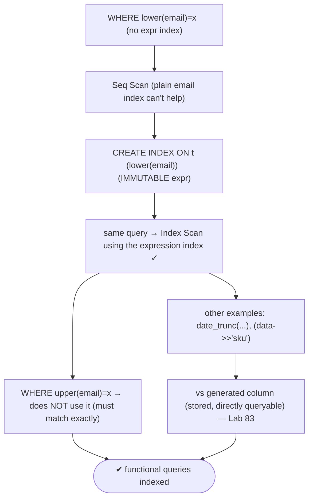
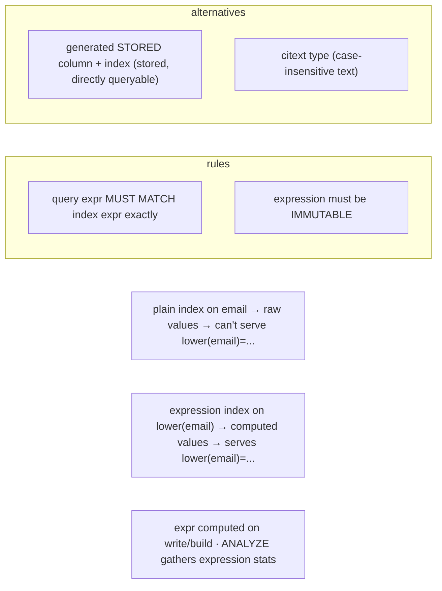

# Lab 98 — Expression Index (e.g. `lower(email)`); Make a Query Use It

> **Track B · Developer · B3 Query Performance & Indexing · Lab 4 of 10 (Lab 98/222)**
> Teaching package: concept → diagram → steps → verify → quick-ref → self-test → video script.
> **Depends on:** Lab 95 (EXPLAIN), Lab 83 (generated columns). **Related:** Lab 97 (partial), Lab 116 (jsonb).

---

## 0. Lab Card (at a glance)

| Field | Value |
|---|---|
| **Objective** | Build an expression (functional) index on `lower(email)`, prove a case-insensitive query uses it, confirm the exact-match requirement, and compare to a generated column. |
| **Success criterion** | `WHERE lower(email)=…` switches from Seq Scan to Index Scan; a non-matching expression doesn't use it; you can weigh expression index vs generated column. |
| **Scope boundary** | Expression indexes. Generated columns were Lab 83; partial Lab 97. |
| **Prereqs** | Lab 95; a table with text data |
| **Time** | 25–35 min |
| **Difficulty** | ★★★☆☆ |
| **Risk** | Low — read-only + scratch tables. |

---

## 1. Learning Objectives

1. **What an expression index is** — index on a function.
2. **Why regular indexes fail** for functional predicates.
3. **The exact-match rule** — query expr = index expr.
4. **Immutability** — the requirement.
5. **Expression index vs generated column** — the trade-off.

---

## 2. Concept Primer — the "why"

**An expression index stores the result of a function, not the raw column.**
```sql
CREATE INDEX users_email_ci ON users (lower(email));
```
It indexes the computed `lower(email)` values. This exists because **a query filtering on a function of a column can't use a plain column index.** A regular index on `email` stores raw values like `Asha@CO`; the query `WHERE lower(email) = 'asha@co'` needs *lowercased* values to seek on, which that index doesn't have — so it falls back to a **Seq Scan**. The expression index stores exactly the lowercased values, so the query can seek.

**Common expression indexes:**
- **Case-insensitive:** `lower(email)`, `upper(name)`.
- **Date bucketing:** `date_trunc('day', created_at)`, `extract(year FROM d)`.
- **Computed:** `(price * quantity)`, `(a + b)`.
- **JSON extraction:** `((data->>'sku'))` (index a scalar pulled from `jsonb`).
- **Concatenation:** `(first || ' ' || last)`.

**The exact-match rule (the thing to get right).** The planner uses an expression index **only when the query's expression matches the index's expression** — same function, same arguments. `lower(email)` index serves `WHERE lower(email) = …`, but **not** `WHERE email = …` (raw) and **not** `WHERE upper(email) = …` (different function). Write the query with the identical expression.

**Immutability is required.** The indexed expression must be **`IMMUTABLE`** — same inputs always yield the same output — because the index stores precomputed results. `lower()`, arithmetic, `date_trunc` on a plain timestamp, `->>'key'` are immutable. **`now()`, `random()`, or anything depending on session/timezone settings is not** — e.g. casting a `timestamptz` to text is *not* immutable (it depends on the session time zone), so it can't be indexed directly.

**Cost & stats.** The expression is computed at index build and on each insert/update of the underlying columns — a small write overhead (fine for read-heavy tables). `ANALYZE` collects **statistics on the expression** for expression indexes, improving planner estimates for expression queries.

**Expression index vs generated column (Lab 83).** Two ways to make `lower(email)` queryable:
- **Expression index** — no extra column; the value is computed for the index only. Lighter (no table bloat), but you must always *write the expression* in queries.
- **Generated STORED column** (`email_ci text GENERATED ALWAYS AS (lower(email)) STORED`) + a normal index — the value is a real, directly-queryable column (`WHERE email_ci = …`), at the cost of extra table storage.
Both work; the expression index is lighter for pure lookups, the generated column is nicer when you also *select* the value. *(A third option: the `citext` case-insensitive text type, replacing `lower()` everywhere.)*

---

## 3. Diagrams

### 3.1 Make-it-use-the-index flow



### 3.2 Why + trade-off



---

## 4. Prerequisites — table with mixed-case emails

```bash
sudo -u postgres psql -d shopdb <<'SQL'
DROP TABLE IF EXISTS accts;
CREATE TABLE accts (id bigint GENERATED ALWAYS AS IDENTITY PRIMARY KEY, email text, created_at timestamptz DEFAULT now());
INSERT INTO accts (email)
SELECT (CASE WHEN random()<0.5 THEN 'User' ELSE 'user' END) || g || '@Example.COM'
FROM generate_series(1, 1000000) g;
CREATE INDEX accts_email_raw ON accts (email);   -- a PLAIN index on email
ANALYZE accts;
SQL
```

---

## 5. Step-by-Step

### Step 1 — Case-insensitive query WITHOUT an expression index → Seq Scan

```bash
sudo -u postgres psql -d shopdb -c "
EXPLAIN (ANALYZE, COSTS OFF) SELECT * FROM accts WHERE lower(email) = 'user500@example.com';"
#   → Seq Scan — the plain email index (raw values) can't serve lower(email)
```

### Step 2 — Create the expression index

```bash
sudo -u postgres psql -d shopdb -c "CREATE INDEX accts_email_ci ON accts (lower(email)); ANALYZE accts;"
```

### Step 3 — Same query now uses it → Index Scan

```bash
sudo -u postgres psql -d shopdb -c "
EXPLAIN (ANALYZE, COSTS OFF) SELECT * FROM accts WHERE lower(email) = 'user500@example.com';"
#   → Index Scan using accts_email_ci
```

### Step 4 — Prove the exact-match requirement

```bash
# raw email (exact case) uses the PLAIN index, not the expression index:
sudo -u postgres psql -d shopdb -c "EXPLAIN (COSTS OFF) SELECT * FROM accts WHERE email = 'user500@Example.COM';"
# a DIFFERENT expression does NOT use the lower() index:
sudo -u postgres psql -d shopdb -c "EXPLAIN (COSTS OFF) SELECT * FROM accts WHERE upper(email) = 'USER500@EXAMPLE.COM';"
#   → Seq Scan (upper ≠ lower — no matching expression index)
```

### Step 5 — Another expression index: date bucketing

```bash
sudo -u postgres psql -d shopdb -c "
CREATE INDEX accts_created_day ON accts (date_trunc('day', created_at));
EXPLAIN (COSTS OFF) SELECT count(*) FROM accts WHERE date_trunc('day', created_at) = date_trunc('day', now());"
#   → uses the expression index (query expr matches index expr)
```

### Step 6 — Confirm the immutability requirement

```bash
sudo -u postgres psql -d shopdb -c "
CREATE INDEX bad_idx ON accts ((created_at::text));" 2>&1 | tail -1
#   → ERROR: functions in index expression must be marked IMMUTABLE  (timestamptz→text depends on timezone)
```

---

## 6. Verification Checklist

- [ ] `WHERE lower(email)=…` was a Seq Scan before the expression index
- [ ] Expression index created on `lower(email)`
- [ ] Same query becomes an Index Scan after
- [ ] Raw `email=…` uses the plain index (not the expression one)
- [ ] `upper(email)=…` does **not** use the `lower()` index
- [ ] A `date_trunc` expression index works when the query matches
- [ ] Non-immutable expression rejected

---

## 7. Troubleshooting

| Symptom | Cause | Fix |
|---|---|---|
| Expression index not used | Query expr ≠ index expr | Use the identical function/expression |
| "must be marked IMMUTABLE" | Volatile/stable expression (e.g. `timestamptz::text`) | Use immutable formulations; or store/generate differently |
| Slow writes after adding | Expression computed per write | Acceptable for read-heavy; or use a generated column |
| Poor estimates for expr query | Missing expression stats | `ANALYZE` (gathers expression statistics) |
| Case-insensitive everywhere | Many `lower()` indexes | Consider the `citext` type |
| Want to `SELECT` the value | Expression not a column | Use a generated STORED column (Lab 83) |
| Composite expression needed | Multiple functions | `CREATE INDEX ON t (lower(a), lower(b))` |

---

## 8. Quick Reference Card (paste-ready)

```sql
-- expression (functional) index — stores computed values (expression must be IMMUTABLE)
CREATE INDEX ON t (lower(email));                 -- serves WHERE lower(email) = ...
CREATE INDEX ON t (date_trunc('day', created_at));
CREATE INDEX ON t ((data->>'sku'));               -- jsonb scalar
CREATE INDEX ON t (lower(a), lower(b));            -- composite expression

-- RULE: query expression must MATCH the index expression EXACTLY
--   WHERE lower(email)=x  ✓   ·   WHERE email=x  ✗ (plain index)   ·   WHERE upper(email)=x  ✗
-- non-immutable (e.g. timestamptz::text) is rejected · ANALYZE gathers expression stats

-- alternatives: generated STORED column + index (stored, directly queryable) · citext type
```

---

## 9. Self-Check

1. What is an expression index?
2. Why can't a plain column index serve `WHERE lower(email)=…`?
3. What's the exact-match requirement?
4. Does `WHERE upper(email)=…` use a `lower(email)` index?
5. What must be true of the indexed expression?
6. Expression index vs generated column — the trade-off?

<details>
<summary>Answers</summary>

1. An index built on a **function/expression** of one or more columns, storing the computed values.
2. The plain index holds **raw** values, not the lowercased ones the query seeks on — so it can't be used.
3. The query's expression must **match the index's expression exactly** (same function and arguments).
4. **No** — `upper` ≠ `lower`; expressions must match.
5. It must be **IMMUTABLE** (same inputs → same output; no volatile/session-dependent functions).
6. Expression index: no extra column, computed on write (lighter); generated STORED column: a real, directly-queryable column at the cost of table storage.
</details>

---

## 10. Video / Teaching Script

| # | On screen | Say (narration) |
|---|---|---|
| 1 | Title: "Index the computation, not the column" | "Case-insensitive email lookup? A normal index on email won't help — it stores the original case. You need to index the *lowercased* value." |
| 2 | seq scan | "Here's the query with lower — sequential scan. The plain index is useless for it." |
| 3 | create + use | "Add an index on lower of email, and the exact same query becomes an index scan. Instant." |
| 4 | exact match | "But it's picky: query with *upper* instead, and it won't use the lower index. The expression has to match, character for character." |
| 5 | immutable | "One rule: the expression must be immutable. Try to index a timestamp cast to text and Postgres refuses — that depends on your time zone." |
| 6 | vs generated | "If you also want to *select* that value, a generated column stores it. Expression index if you just look it up; generated column if you read it back." |
| 7 | Outro | "Functional queries, indexed. Next: covering indexes and index-only scans." |

---

## 11. Glossary

- **Expression / functional index** — index on a function of columns.
- **Exact-match rule** — query expression must equal the index expression.
- **Immutable** — reproducible expression (required to index).
- **Case-insensitive search** — `lower()`/`upper()` expression index.
- **Generated column** — stored computed column (queryable directly).
- **citext** — a case-insensitive text type (alternative).
- **Expression statistics** — stats `ANALYZE` gathers on indexed expressions.

---
*NETAPORT lab series · PostgreSQL 17 on AlmaLinux 9 · Lab 98/222 · B3 Query Performance & Indexing*
