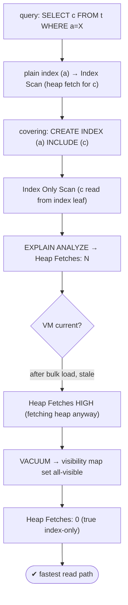

# Lab 99 — Covering Index with `INCLUDE`; Achieve an Index-Only Scan (Check `Heap Fetches`)

> **Track B · Developer · B3 Query Performance & Indexing · Lab 5 of 10 (Lab 99/222)**
> Teaching package: concept → diagram → steps → verify → quick-ref → self-test → video script.
> **Depends on:** Lab 95 (scan types), Lab 96 (composite), Lab 05 (visibility/vacuum). **Related:** Lab 59 (autovacuum).

---

## 0. Lab Card (at a glance)

| Field | Value |
|---|---|
| **Objective** | Build a covering index with `INCLUDE`, achieve a true index-only scan, and use `Heap Fetches` + the visibility map to prove the heap is skipped. |
| **Success criterion** | A covering index turns an Index Scan into an Index Only Scan; `Heap Fetches` is high right after load and drops to 0 after `VACUUM`. |
| **Scope boundary** | Covering/index-only scans + visibility map. Composite ordering was Lab 96. |
| **Prereqs** | Lab 95; a table; ability to VACUUM |
| **Time** | 30–40 min |
| **Difficulty** | ★★★★☆ |
| **Risk** | Low — read-only + a VACUUM. |

---

## 1. Learning Objectives

1. **Index-only scan** — answer from the index alone.
2. **Covering index / `INCLUDE`** — key vs payload columns.
3. **`INCLUDE` vs key** — why not just widen the key.
4. **Heap fetches + visibility map** — why the heap is still visited.
5. **VACUUM** — getting `Heap Fetches: 0`.

---

## 2. Concept Primer — the "why"

**An index-only scan reads only the index — the fastest read path.** If an index contains **every column a query needs**, PostgreSQL can answer the query from the index and **never visit the heap** — no random per-row table fetches. A **covering index** is one that covers a query this way.

**`INCLUDE` adds payload columns without enlarging the key (PG11+).**
```sql
CREATE INDEX orders_cust ON orders (customer_id) INCLUDE (amount, status);
```
- **Key columns** `(customer_id)` — searchable and sortable (used for `WHERE`/`ORDER BY`).
- **Included columns** `(amount, status)` — stored in the index **leaf pages** but **not** part of the key (not searchable/sortable). They're there so `SELECT amount, status … WHERE customer_id=X` can read them from the index — no heap fetch.

**Why `INCLUDE` instead of adding those columns to the key?**
- Included columns **don't affect the B-tree ordering/structure**, so the **key stays small** → faster comparisons and a tighter tree, while still covering extra columns.
- Some column types can be **stored but not used as a key** — `INCLUDE` allows them.
Rule of thumb: **search/sort columns in the key; output-only columns in `INCLUDE`.**

**Heap fetches & the visibility map — the crucial subtlety.** Even with a covering index, an index entry doesn't record whether its row is **visible** to your transaction (MVCC visibility lives in the heap). So the scan consults the **visibility map (VM)** — a bitmap marking heap pages **all-visible** (every tuple on the page visible to everyone). If the relevant page is all-visible → the scan **skips the heap**. If it's **not** (recently modified, not yet vacuumed) → the scan **must fetch the heap tuple** to check visibility. That's a **heap fetch**.

`EXPLAIN (ANALYZE)` reports it on an Index Only Scan: **`Heap Fetches: N`**.
- **`Heap Fetches: 0`** → a true index-only scan, no heap access — fastest.
- **High** → the VM is **stale** (table not vacuumed), so it's fetching the heap anyway, negating most of the benefit.

**`VACUUM` sets the visibility map.** After a bulk load or heavy updates, the VM is stale and heap fetches are high; run `VACUUM` (or let autovacuum, Lab 59) to mark pages all-visible, and the same scan drops to `Heap Fetches: 0`. **A covering index only pays off on a well-vacuumed table.**

**Support:** **B-tree** supports index-only scans fully; GiST/SP-GiST partially; **GIN does not**.

---

## 3. Diagrams

### 3.1 Achieve index-only flow



### 3.2 Covering index + visibility

```mermaid
flowchart LR
    subgraph IDX [index (a) INCLUDE (c)]
      K["KEY: a (searchable/sortable)"] --> P["INCLUDE: c (payload in leaf, output only)"]
    end
    subgraph VIS [visibility check]
      V1["page all-visible (VM) → skip heap ✓"]
      V2["page not all-visible → HEAP FETCH"]
      V3["VACUUM sets the VM → Heap Fetches 0"]
    end
    note["key small = fast · B-tree supports index-only · GIN does not · covering pays off only when vacuumed"]
```

---

## 4. Prerequisites — table + data

```bash
sudo -u postgres psql -d shopdb <<'SQL'
DROP TABLE IF EXISTS cov;
CREATE TABLE cov (id bigint GENERATED ALWAYS AS IDENTITY PRIMARY KEY, a int, c numeric, d text);
INSERT INTO cov (a, c, d) SELECT (random()*10000)::int, (random()*1000)::numeric(10,2), md5(g::text)
FROM generate_series(1, 2000000) g;
CREATE INDEX cov_a ON cov (a);            -- plain index (key only)
ANALYZE cov;
SQL
```

---

## 5. Step-by-Step

### Step 1 — Plain index → Index Scan (heap fetch for `c`)

```bash
sudo -u postgres psql -d shopdb -c "
EXPLAIN (ANALYZE, BUFFERS, COSTS OFF) SELECT c FROM cov WHERE a = 42;"
#   → Index Scan using cov_a (must fetch each row's c from the heap)
```

### Step 2 — Covering index with INCLUDE

```bash
sudo -u postgres psql -d shopdb -c "CREATE INDEX cov_a_incl ON cov (a) INCLUDE (c); ANALYZE cov;"
```

### Step 3 — Now an Index Only Scan — but check Heap Fetches

```bash
sudo -u postgres psql -d shopdb -c "
EXPLAIN (ANALYZE, BUFFERS, COSTS OFF) SELECT c FROM cov WHERE a = 42;"
#   → Index Only Scan using cov_a_incl · look for 'Heap Fetches: N'  (likely > 0 — VM not fully set)
```

### Step 4 — Make heap fetches high (fresh writes), then observe

```bash
sudo -u postgres psql -d shopdb -c "UPDATE cov SET c = c + 1 WHERE a = 42;"   # dirties those pages → VM cleared
sudo -u postgres psql -d shopdb -c "
EXPLAIN (ANALYZE, COSTS OFF) SELECT c FROM cov WHERE a = 42;" | grep -i "heap fetches"
#   → Heap Fetches: >0  (pages not all-visible after the update)
```

### Step 5 — VACUUM → Heap Fetches: 0

```bash
sudo -u postgres psql -d shopdb -c "VACUUM cov;"     # updates the visibility map
sudo -u postgres psql -d shopdb -c "
EXPLAIN (ANALYZE, BUFFERS, COSTS OFF) SELECT c FROM cov WHERE a = 42;" | grep -iE "heap fetches|index only|buffers"
#   → Heap Fetches: 0  (true index-only scan; fewer buffers than the plain Index Scan)
```

### Step 6 — INCLUDE vs widening the key (both cover; key stays small)

```bash
sudo -u postgres psql -d shopdb <<'SQL'
CREATE INDEX cov_a_c_key ON cov (a, c);        -- c in the KEY: also covers, but bigger key & c is sortable
-- both serve SELECT c WHERE a=X as index-only; prefer INCLUDE when c is output-only (smaller key):
EXPLAIN (COSTS OFF) SELECT c FROM cov WHERE a=42;
DROP INDEX cov_a_c_key;
SQL
```

---

## 6. Verification Checklist

- [ ] Plain index → Index Scan (heap access for `c`)
- [ ] Covering `INCLUDE` index → Index Only Scan
- [ ] `Heap Fetches` observed and understood
- [ ] Fresh writes raised `Heap Fetches` (VM cleared)
- [ ] `VACUUM` brought `Heap Fetches` to 0
- [ ] Index-only scan uses fewer buffers than the plain scan
- [ ] Understood `INCLUDE` (payload) vs key columns

---

## 7. Troubleshooting

| Symptom | Cause | Fix |
|---|---|---|
| Not an index-only scan | Query needs a column not in the index | Add it to the key or `INCLUDE` |
| `Heap Fetches` high | Visibility map stale | `VACUUM`; ensure autovacuum keeps up (Lab 59) |
| Index-only but slow | Heap fetches from stale VM | Vacuum the table |
| Filtering on an INCLUDE column | Included columns aren't searchable | Put search columns in the **key** |
| GIN won't do index-only | GIN unsupported | Use B-tree for index-only |
| Very wide INCLUDE | Large leaf pages | Include only what queries output |
| Heap fetches return after updates | VM cleared for changed pages | Re-vacuum |

---

## 8. Quick Reference Card (paste-ready)

```sql
-- covering index: key columns (search/sort) + INCLUDE payload (output only)
CREATE INDEX ON t (a) INCLUDE (c, d);          -- serves SELECT c,d WHERE a=X as INDEX-ONLY

-- verify:
EXPLAIN (ANALYZE, BUFFERS) SELECT c FROM t WHERE a = 42;
--   look for: "Index Only Scan" and "Heap Fetches: N"
--     Heap Fetches: 0  → true index-only (fastest)
--     Heap Fetches: >0 → visibility map stale → VACUUM t;

-- INCLUDE vs key: key columns searchable/sortable (bigger tree) · INCLUDE = leaf payload, small key
-- B-tree supports index-only · GiST/SP-GiST partial · GIN does NOT
-- covering pays off only on a WELL-VACUUMED table (VM all-visible)
```

---

## 9. Self-Check

1. What is an index-only scan?
2. What does `INCLUDE` do?
3. Why use `INCLUDE` instead of widening the key?
4. What are heap fetches, and why do they occur?
5. How do you get `Heap Fetches: 0`?
6. Which index types support index-only scans?

<details>
<summary>Answers</summary>

1. A scan that answers the query from the **index alone**, never fetching from the heap — the fastest read path.
2. Adds **non-key payload columns** to the index leaves so the index covers a query, without making them part of the searchable key.
3. Included columns don't affect ordering, keeping the **key small** (faster searches/tighter tree) while still covering output columns; they can also be non-key-able types.
4. Because index entries don't record MVCC visibility, the scan checks the **visibility map**; for heap pages not marked all-visible it must **fetch the heap tuple** to verify visibility.
5. **`VACUUM`** the table so the visibility map marks the relevant pages all-visible.
6. **B-tree** fully; GiST/SP-GiST partially; **GIN not at all**.
</details>

---

## 10. Video / Teaching Script

| # | On screen | Say (narration) |
|---|---|---|
| 1 | Title: "Never touch the table" | "The fastest read is one that never reads the table at all — just the index. That's an index-only scan, and INCLUDE is how you get there." |
| 2 | plain scan | "Select a column the index doesn't carry, and Postgres jumps back to the table for every row. Slow." |
| 3 | INCLUDE | "Add that column with INCLUDE — payload in the index leaves, not the searchable key. Now the index has everything the query needs." |
| 4 | heap fetches | "But watch this number: Heap Fetches. Even index-only scans check visibility — and right after writes, that number's high. It's sneaking back to the table." |
| 5 | vacuum | "Vacuum the table, and the visibility map lights up. Now — Heap Fetches: zero. *That's* a true index-only scan." |
| 6 | key vs include | "One rule: search columns in the key, output-only columns in INCLUDE. Keeps the key lean." |
| 7 | Outro | "The heap, skipped. Next: GIN indexes for JSONB and full-text." |

---

## 11. Glossary

- **Index-only scan** — query answered from the index, no heap access.
- **Covering index** — one containing all columns a query needs.
- **`INCLUDE`** — non-key payload columns in index leaves.
- **Key vs payload** — searchable/sortable vs output-only.
- **Visibility map** — bitmap of all-visible heap pages.
- **Heap fetch** — a heap visit to check visibility (want 0).
- **VACUUM** — updates the visibility map.

---
*NETAPORT lab series · PostgreSQL 17 on AlmaLinux 9 · Lab 99/222 · B3 Query Performance & Indexing*
